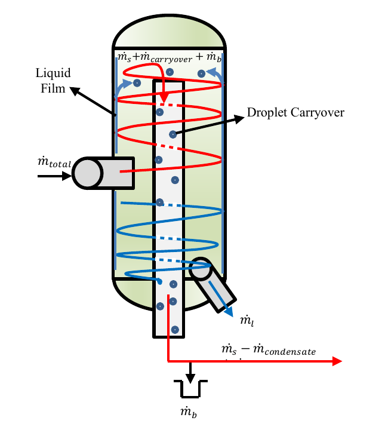
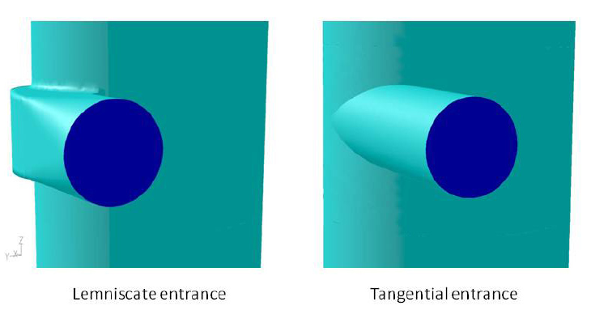
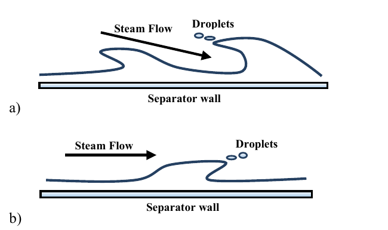

# Part 1 — Introduction and literature review

<!-- Drafting note: model development is the main contribution, with startup and absorber development enabling the later wall experiments. Internal evidence links below are source notes for revision. -->

## 1. Introduction

### 1.1. Engineering problem

Geothermal steam–water separators remove liquid from the two-phase fluid produced by geothermal wells so that dry, clean steam can enter the turbine. Liquid carried with the steam can cause erosion and transport dissolved minerals that form deposits. Separator design therefore requires assessment of separation efficiency and internal pressure drop, together with selection of the operating pressure. [Zarrouk and Purnanto (2015)](https://doi.org/10.1016/j.geothermics.2014.05.009) review these design and operating requirements.

Computational fluid dynamics (CFD) provides a means of examining flow inside a separator and the effects of changes to its design or operating conditions. To support design decisions, the model must represent liquid transport and collection, and its numerical behaviour must be assessed. Comparison with field measurements is then needed to determine whether the predicted separation efficiency and pressure drop represent the physical separator.

This study develops an existing Fluent model of a vertical bottom-outlet cyclone separator with a spiral inlet. High continuity residuals and unresolved mass imbalances limited further development of the model. The work therefore focused on numerical liquid removal and staged startup to establish a flow field from which additional wall–liquid behaviour could be studied.

<!-- Evidence: [Study scope](../../scope.md); [absorber-development context](../../experiments/phase-07-1a-absorber-convergence/CONTEXT.md). -->

### 1.2. Problem in the inherited model

The simplified geometry represents the upper separation region and omits the lower brine-discharge path. Liquid can accumulate within the computational domain or leave through the steam outlet. A numerical liquid-removal treatment is therefore needed to represent collection in this geometry. Liquid accumulation, removal and carryover must be distinguished when assessing the calculated flow. Liquid concentrated near a wall may indicate redistribution within the vessel without demonstrating discharge.

<!-- Evidence: [Model boundary](../../model.md). -->

A virtual collector, termed an absorber, was introduced to remove liquid numerically from a defined region. Staged startup allowed the liquid field to develop under reduced inlet loading before full feed was applied. Together, these treatments provided a starting state for studies of wall roughness and Eulerian Wall Film (EWF). The development sequence is described in Section 3; the detailed absorber account concerns the final contact-based treatment.

<!-- Evidence: [Verified early absorber](../../experiments/phase-07-1a-absorber-convergence/baseline-v2-virtual-liquid-outlet/results.md); [selected case history](../../experiments/phase-07-2a-wall-liquid-routing/stage-02-combined-ewf-roughness/case-history-N45606.md). -->

Liquid removal and startup are examined together because they enabled further model development. Their effectiveness is assessed from residuals, liquid inventory, removal rates and mass balance. These checks also identify the limitations that remain when interpreting the subsequent wall-treatment calculations.

### 1.3. Research aim and questions

The aim of this research is to develop and assess an existing Fluent CFD model of a geothermal steam–water separator. The purpose is to improve understanding of internal steam and liquid transport and establish a basis for predicting separation efficiency and pressure drop.

The study focuses on liquid-removal, startup and wall-interaction treatments. Their effects are evaluated to determine how far the model can support performance assessment and what further evidence is needed for comparison with field measurements.

The aim is pursued through three research questions:

1. How can numerical liquid removal and staged startup establish a developed flow field for further separator-model studies?
2. How do wall roughness and wall-film modelling affect predicted liquid transport, retained inventory and liquid carryover at the steam outlet?
3. What numerical and liquid-accounting evidence supports these predictions, and what further evidence is required for field comparison and separator-performance assessment?

### 1.4. Scope and contribution

The study primarily uses the simplified separator geometry with an added numerical collector. It examines startup from reduced feed, continuation at full feed, and the effects of wall roughness and wall-film modelling. The wall-treatment comparisons start from the same developed flow field. Further calculations examine earlier introduction of the wall treatment during startup and subsequent film development. Full-geometry calculations provide context, but their different outlet boundaries prevent direct combination of their mass balances with those of the simplified model.

<!-- Evidence: [Study overview](../../index.md); [selected case history](../../experiments/phase-07-2a-wall-liquid-routing/stage-02-combined-ewf-roughness/case-history-N45606.md). -->

The main contribution is a method for developing and extending the separator calculation through numerical liquid removal and staged startup. The development sequence supplied a common starting state for later comparisons, although it did not isolate the contribution of each change. Earlier absorbers are discussed as part of the startup history; the final contact absorber receives the detailed implementation account.

The results support assessment of model development and predicted liquid behaviour. Mesh convergence, complete liquid accounting and comparison with field measurements remain necessary before separation efficiency and pressure-drop predictions can be validated. Selection of an optimum separation pressure or separator location is outside the scope of the calculations presented here.

Additional coarse-mesh reconstruction calculations are described in Appendix A.2. Their numerical and accounting limitations require further assessment before they can support performance conclusions.

## 2. Literature review

### 2.1. How a geothermal steam–water separator works

A geothermal separator receives a two-phase flow of steam and mineral-bearing liquid, or brine. Its task is to direct steam into the steam line while collecting and discharging the liquid through a separate path. The selected operating pressure affects the steam available from the geothermal fluid, while the vessel and inlet determine how the two phases move within the separator. Horizontal separators mainly use gravity to collect liquid. Vertical cyclone separators use rotation to move liquid towards the vessel wall before it drains. ([Zarrouk & Purnanto, 2015](https://doi.org/10.1016/j.geothermics.2014.05.009))

In a vertical bottom-outlet cyclone (BOC), a tangential or spiral inlet turns the incoming flow around the vessel. Liquid moves towards the outer wall and lower collection region, while the central region becomes dominated by steam. An internal pipe collects steam and carries it out through the bottom of the vessel; the collected brine leaves through its own outlet. The term *bottom outlet* refers to this steam-pipe arrangement. The spiral inlet guides the transition from incoming flow to rotation. ([Zarrouk & Purnanto, 2015](https://doi.org/10.1016/j.geothermics.2014.05.009))

This operation has three linked requirements: move liquid away from the steam, retain it in a collection route, and discharge it. Reaching the wall is only one part of the process. A liquid film may drain, remain within the vessel, or supply droplets that return to the steam. Figure 1 places these routes within the vessel and shows downstream liquid collection. The simplified geometry used in this study omits the physical lower brine-discharge route, making its numerical replacement a material modelling choice.

*Figure 1. Conceptual steam and liquid routes in a vertical BOC separator. Mass-flow symbols follow the source schematic: $\dot m_{\mathrm{total}}$ is inlet steam–water flow, $\dot m_s$ is separated steam, and $\dot m_l$ is discharged brine. In this schematic, $\dot m_b$ denotes brine that accompanies the steam and settles into the downstream drain; $\dot m_{\mathrm{carryover}}$ denotes additional entrained carryover that may pass the drain. The symbol $\dot m_{\mathrm{condensate}}$ denotes downstream steam condensation. The diagram illustrates routes rather than a complete measured mass balance. Source: [Rizaldy et al. (2016)](https://www.researchgate.net/publication/310818568_LIQUID_CARRYOVER_IN_GEOTHERMAL_STEAM-WATER_SEPARATORS), original fig. 5.*

<!-- Evidence: [Model boundary](../../model.md). Figure source: [primary carryover paper](../../../CFD_wiki/raw/053_Rizaldy_Final.pdf), PDF page 3, original fig. 5; symbol interpretation checked against PDF pages 3–4. [Full-page source preview](../figures/literature-candidates/wall-film/rizaldy-2016-pdf-page-03.png). The inserted panel was rendered directly from the local PDF; its labels and arrows are unchanged. -->

### 2.2. Internal flow physics and performance measures

The rotating flow produces a radial pressure distribution, with lower pressure near the centre and higher pressure towards the wall. For approximately circular motion, the inward acceleration needed to follow the flow scales with $u_\theta^2/r$, where $u_\theta$ is tangential velocity and $r$ is distance from the axis. Steam and liquid respond differently to the pressure field and interphase drag because of their different densities. This provides the basis for outward liquid transport and a steam-rich core. Pointon et al. (2009) connect the higher tangential velocities in their scrolled-entry calculation to improved droplet separation. ([Pointon et al., 2009](https://publications.mygeoenergynow.org/grc/1028587.pdf))

Droplet size changes the balance between inertia and drag. Fine droplets can remain closely coupled to the steam and reach its outlet, while larger droplets are more readily directed towards collection surfaces. The incoming flow may already contain a film and dispersed droplets, and steam shear can produce further droplets inside the vessel. Pointon et al. (2009) identify the uncertain inlet size distribution and this continuing droplet generation as modelling difficulties. Thus, an inlet mass-flow rate alone does not specify the liquid population on which a separation prediction depends. ([Pointon et al., 2009](https://publications.mygeoenergynow.org/grc/1028587.pdf))

Increasing velocity also has competing effects. Stronger rotation can assist outward transport, while greater steam shear can promote liquid entrainment. The field trials reviewed by Zarrouk and Purnanto (2015) show a breakdown region in which outlet steam wetness rises sharply with inlet velocity (Figure 2). The reported threshold differs between separator sizes and datasets. These observations give a reason to examine loading, geometry and wall-liquid behaviour together, rather than assume that greater swirl always improves performance. ([Zarrouk & Purnanto, 2015](https://doi.org/10.1016/j.geothermics.2014.05.009))

*Figure 2. Empirical outlet wetness and steam quality versus inlet steam velocity. The left axis gives wetness; the right gives the corresponding steam quality and runs in the opposite direction. The datasets concern different separator sizes and show different regions of rapid wetness increase. They do not establish a breakdown threshold for the present geometry. Source: [Zarrouk and Purnanto (2015)](https://doi.org/10.1016/j.geothermics.2014.05.009), original fig. 12, using data from Bangma (1960) and Lazalde-Crabtree (1984).*

<!-- Figure source: [primary design review](<../../../CFD_wiki/raw/Zarrouk and Purnanto 2014.pdf>), PDF page 12 / printed page 247; [full-page source preview](../figures/literature-candidates/design-overview/zarrouk-purnanto-2015-page-12.png). The published axes, curves, points and legend are unchanged. -->

The resulting flow must be connected to a defined performance measure. For a stream containing steam and liquid water, outlet steam quality can be written as

$$
x_{\mathrm{out}}=
\frac{\dot m_{v,\mathrm{out}}}
{\dot m_{v,\mathrm{out}}+\dot m_{l,\mathrm{out}}},
$$

where the two terms are the outward vapour and liquid mass-flow rates through the steam outlet. A liquid-capture fraction instead relates collected liquid to inlet liquid. These quantities use different denominators: at the same capture fraction, a feed with more brine relative to steam can produce a wetter steam outlet. Published separator-efficiency definitions must therefore be read alongside their equations and sampling boundaries. Purnanto et al. (2013) calculated outlet quality from the steam and water leaving the outlet, while Zarrouk and Purnanto (2015) also discuss liquid-removal and tracer-based measures. ([Purnanto et al., 2013](https://www.researchgate.net/publication/269519626_CFD_MODELLING_OF_TWO-PHASE_FLOW_INSIDE_GEOTHERMAL_STEAM-WATER_SEPARATORS); [Zarrouk & Purnanto, 2015](https://doi.org/10.1016/j.geothermics.2014.05.009))

Steam purity concerns contaminants carried with the steam. Field estimates of brine carryover may use its chemical signature, such as sodium, but downstream condensation, washing and incomplete capture by drain pots affect the sampled quantity. Rizaldy et al. (2016) discuss these measurement limits. A field comparison therefore requires compatible locations and definitions, as well as matching operating conditions. ([Rizaldy et al., 2016](https://www.researchgate.net/publication/310818568_LIQUID_CARRYOVER_IN_GEOTHERMAL_STEAM-WATER_SEPARATORS))

Pressure selection and pressure drop address different design decisions. Separation pressure sets the thermodynamic state of the supplied steam and brine. For a given fluid enthalpy, changing that pressure changes the flashed steam fraction and the steam conditions available to the turbine. Zarrouk and Purnanto (2015) therefore treat optimum pressure as a plant-level decision that also considers scaling and losses in the collection system. The fixed-property, no-flashing flow calculation used by Purnanto et al. (2013) instead examines motion at prescribed phase conditions. That distinction is relevant to the present study: developing an internal-flow model does not itself determine optimum operating pressure. ([Zarrouk & Purnanto, 2015](https://doi.org/10.1016/j.geothermics.2014.05.009); [Purnanto et al., 2013](https://www.researchgate.net/publication/269519626_CFD_MODELLING_OF_TWO-PHASE_FLOW_INSIDE_GEOTHERMAL_STEAM-WATER_SEPARATORS))

Internal pressure drop describes the difference between defined inlet and outlet pressures. Pointon et al. (2009) identify the enlargement at vessel entry and contraction into the steam pipe as important hydraulic-loss locations. The low-pressure core is a spatial flow feature; it does not by itself specify the inlet-to-outlet drop. An assessment must state the sampling locations, averaging method and pressure measure. Likewise, a reduction in liquid outlet flow needs a liquid account: collection, storage and transfer to a film can all change that output. ([Pointon et al., 2009](https://publications.mygeoenergynow.org/grc/1028587.pdf))

### 2.3. Established design methods and geothermal CFD

Geothermal cyclone design developed through field experience and empirical methods, including those of Bangma and Lazalde-Crabtree. Zarrouk and Purnanto (2015) review this development and the links between pressure selection, vessel sizing and performance. These methods supply engineering reference points. CFD adds information about local velocity, pressure and liquid trajectories that an overall sizing relation cannot resolve. Its value depends on how the model assumptions and comparison evidence are assessed. ([Zarrouk & Purnanto, 2015](https://doi.org/10.1016/j.geothermics.2014.05.009))

Pointon et al. (2009) used Fluent to examine large geothermal separators and compare scrolled and tangential entries. Their calculations gave stronger tangential motion and better droplet separation for the scrolled entry, with efficiency estimates close to a proprietary empirical design calculation. Figure 3 connects the two inlet configurations to their calculated tangential-velocity distributions. Droplets were tracked with the Discrete Phase Model (DPM). Those contacting specified collection surfaces were assumed to adhere and were removed. The comparison supports the tested design trend, while collection remains an idealised part of the model. Agreement with a design relation does not independently establish every liquid-transfer mechanism. ([Pointon et al., 2009](https://publications.mygeoenergynow.org/grc/1028587.pdf))

*(a) Inlet configurations.*

*(b) Calculated tangential-velocity distributions.*

*Figure 3. (a) Scrolled (lemniscate) and tangential entry geometries; (b) their calculated tangential-velocity distributions. The scrolled configuration is on the left in both panels. Reported mean tangential velocities are 34.1 and 32.5 m/s, respectively. These fields illustrate the comparison under the earlier study's conditions; they do not demonstrate film discharge or mass closure in the present model. Source: [Pointon et al. (2009)](https://publications.mygeoenergynow.org/grc/1028587.pdf), original figs. 5 and 7.*

<!-- Figure source: [primary Pointon paper](../../../CFD_wiki/raw/1028587.pdf), PDF pages 5–6 / printed pages 946–947; [geometry source page](../figures/literature-candidates/pointon/page-5.png); [velocity source page](../figures/literature-candidates/pointon/page-6.png). Both published panels, the velocity legend and mean annotations are unchanged. The report adds the (a)/(b) labels outside the images. -->

Purnanto et al. (2013) compared three BOC configurations, with circular tangential, rectangular tangential and rectangular spiral inlets, using the renormalisation-group (RNG) k–ε turbulence model and an isothermal, incompressible setup without flashing. Vessel proportions also differed, so the comparison did not isolate inlet shape. The spiral configuration gave smoother entry and a more uniform first rotation. Outlet quality was calculated using particle tracking. Some trajectories remained incomplete after the tracking limit was increased; treating them as separated gave closer empirical agreement, but the authors recognised that this treatment was not rigorous. Their flow-modelling basis therefore retains a material limit on performance interpretation. ([Purnanto et al., 2013](https://www.researchgate.net/publication/269519626_CFD_MODELLING_OF_TWO-PHASE_FLOW_INSIDE_GEOTHERMAL_STEAM-WATER_SEPARATORS))

The two studies also show how modelling choices reflect the intended calculation. Pointon et al. (2009) used Reynolds-averaged flow equations with RNG k–ε and a swirl modification, favouring its lower computational requirements over a Reynolds-stress model. They did not report a detailed turbulence-model comparison. Their steady separation studies and unsteady structural-loading studies served different purposes. Purnanto et al. (2013) also used RNG k–ε. This shared choice supplies context for an inherited model, but its use in earlier studies does not establish numerical accuracy or physical validity for every separator calculation. ([Pointon et al., 2009](https://publications.mygeoenergynow.org/grc/1028587.pdf); [Purnanto et al., 2013](https://www.researchgate.net/publication/269519626_CFD_MODELLING_OF_TWO-PHASE_FLOW_INSIDE_GEOTHERMAL_STEAM-WATER_SEPARATORS))

Table 1 compares the treatment of liquid across the selected studies. Their results cannot be pooled into a single efficiency comparison because the domains, representations and assessment methods differ.

*Table 1. Contributions and limitations of selected studies relevant to liquid transport and collection.*

| Study | Main contribution | Liquid treatment | Implication for this study |
| --- | --- | --- | --- |
| Pointon et al. (2009) | Large-separator CFD and entry comparison | Tracked droplets; prescribed wall collection | Collection assumptions form part of the performance prediction |
| Purnanto et al. (2013) | Geothermal geometry and internal-flow comparison | Multiphase flow; DPM outlet-quality estimate | Changed vessel proportions and unfinished trajectories limit interpretation |
| Rizaldy et al. (2016) | Geothermal film-carryover analysis and field context | Film-entrainment correlations and chemical sampling | Wall deposition need not imply permanent collection |
| Skoog (2020) | Three-field annular-flow modelling | Separate steam, film and droplets with exchange terms | Distinct liquid stores require explicit transfers; reactor conditions limit direct reuse |

### 2.4. Wall–liquid transport and carryover

Liquid reaching a wall can form a film whose motion depends on gravity, pressure forces and shear at the wall and steam–film interface. Deposition adds liquid to the film; drainage removes it from a collection boundary; entrainment returns liquid to the steam as droplets. These processes can compete, so improved wall deposition need not produce an equal improvement in discharged liquid or outlet steam quality.

Rizaldy et al. (2016) examine this problem directly for geothermal separators. They discuss film-surface instability and droplet formation under steam shear, and use Wairakei operating data in a correlation-based entrainment analysis. Figure 4 illustrates two entrainment mechanisms discussed in their paper: undercut and roll-wave entrainment. Their model predicts sensitivity to liquid loading, film thickness and inlet velocity. They also identify limits in the field sampling used to infer carryover. This supports investigation of film transport as a possible contributor to separator behaviour, while the predicted entrainment rates and measurement interpretation retain their stated assumptions. ([Rizaldy et al., 2016](https://www.researchgate.net/publication/310818568_LIQUID_CARRYOVER_IN_GEOTHERMAL_STEAM-WATER_SEPARATORS))

*Figure 4. Conceptual droplet entrainment from a wall film: (a) undercut entrainment and (b) roll-wave entrainment. The source associates the panels with lower and higher film Reynolds numbers, respectively. Film Reynolds number compares inertial and viscous effects using liquid velocity and film thickness. The sketches illustrate how liquid may return to the steam after wall deposition; they are not observations from the present calculation. Source: [Rizaldy et al. (2016)](https://www.researchgate.net/publication/310818568_LIQUID_CARRYOVER_IN_GEOTHERMAL_STEAM-WATER_SEPARATORS), original fig. 9, whose caption credits Ishii and Grolmes (1975).*

<!-- Figure source: [primary carryover paper](../../../CFD_wiki/raw/053_Rizaldy_Final.pdf), PDF page 5; [full-page source preview and original attribution](../figures/literature-candidates/wall-film/rizaldy-2016-pdf-page-05.png). The two published mechanism panels and labels are unchanged. -->

Wall roughness provides a different modelling intervention. Fluent represents roughness through modifications to the near-wall velocity relation used to calculate wall shear and related turbulent quantities. Its response depends on the roughness parameters and near-wall treatment. This gives a reason to test whether changed wall momentum transfer affects the calculated liquid distribution, but it does not prescribe the direction of a carryover change. A roughness treatment also does not supply a separate film mass balance or discharge route. ([Ansys, Inc., 2025f](https://ansyshelp.ansys.com/public/Views/Secured/corp/v252/en/flu_th/x1-5720008.164.html))

The roughness and film studies therefore address distinct questions. Roughness tests sensitivity to wall momentum treatment. Film modelling tests an additional liquid store and its transport. Outlet flow, retained mass and collected liquid must be examined together to interpret either response.

### 2.5. Representing liquid and its collection

The Mixture model represents phases within the volume mesh through mixture equations and secondary-phase volume fractions. With algebraic slip enabled, relative phase velocity is modelled using a local-equilibrium approximation over short spatial scales. This offers a lower-cost representation of bulk steam–water motion, but its assumptions still require assessment for the intended flow. A secondary-phase volume fraction is not, by itself, a resolved film thickness or a droplet-size distribution. ([Ansys, Inc., 2025b](https://ansyshelp.ansys.com/public/Views/Secured/corp/v252/en/flu_th/flu_th_sec_drift_oview.html))

DPM tracking follows droplets through a supplied continuous flow field. It can relate size-dependent trajectories to prescribed wall or outlet outcomes, as in the studies in Table 1. Its interpretation depends on the droplet population, the flow field and whether trajectories reach a defined fate. Treating a wall impact as collection is an assumption about subsequent liquid behaviour.

EWF adds a surface-based representation of a thin liquid film. It solves film transport on the wall surface, avoiding the need to mesh through the film thickness, while retaining the assumptions of a thin-film treatment. Skoog (2020) used it in a cylindrical approximation of a boiling-water-reactor channel, with separate steam and droplet fields, DPM deposition and correlation-based entrainment. The thesis compared calculated mass-flow behaviour with empirical evidence. It demonstrates a way to organise distinct liquid fields and their exchanges; the geometry, operating conditions and correlations need separate justification for a geothermal cyclone. ([Skoog, 2020](https://www.diva-portal.org/smash/get/diva2:1452100/FULLTEXT02.pdf); [Ansys, Inc., 2025c](https://ansyshelp.ansys.com/public/views/secured/corp/v252/en/flu_ug/flu_ug_models_wallfilm.html))

Adding representations also adds accounting requirements. Bulk-to-film transfer removes liquid from one store and adds it to another; it is internal transfer within a combined liquid account. Prescribed droplet feed must not duplicate liquid already supplied through another representation. In the truncated geometry, the absorber instead removes liquid from the modelled domain. Fluent permits mass and associated transport sources in cell zones, but the selected source law and its effect on the solution remain model choices to be assessed. Section 3 describes the final contact treatment. ([Ansys, Inc., 2025a](https://ansyshelp.ansys.com/public/Views/Secured/corp/v252/en/flu_ug/flu_ug_bcs_sec_cell_zones.html))

<!-- Evidence: [Audited model basis](../../model.md); [liquid-accounting guardrails and application of Skoog](../../technical/skoog-application-guardrails.md); [absorber-development context](../../experiments/phase-07-1a-absorber-convergence/CONTEXT.md). -->

### 2.6. Numerical startup, convergence and validation

A steady calculation starts from an estimated flow field and iterates towards a solution. Its numerical startup is distinct from a simulated physical startup transient. Iteration count and pseudo-time describe the solution process; a steady inventory history cannot be converted into a physical storage rate by treating iterations as elapsed seconds. The field must be assessed through both equation behaviour and the quantities of engineering interest. The National Aeronautics and Space Administration (NASA) recommends monitoring residuals and the convergence of relevant outputs. ([NASA, 2021a](https://www.grc.nasa.gov/www/wind/valid/tutorial/iterconv.html))

The order of model development can also matter. Fluent's EWF guidance allows the flow field to be solved first, where needed, before the film is initialised and solved. This supports examining staged activation, while leaving the appropriate sequence dependent on the case. It does not establish a particular reduced-feed fraction or ramp as a general separator requirement. In this study, reduced loading and a checked increase to full feed are assessed as a numerical development method. The recorded sequence supplies the evidence for that choice. ([Ansys, Inc., 2025e](https://ansyshelp.ansys.com/public/views/secured/corp/v252/en/flu_ug/flu_ug_ewf_sec_overview.html))

Implementation checks, iterative convergence, conservation and numerical accuracy answer different questions. Correct source assignment checks whether the intended treatment was applied. Residual and output histories assess iterative behaviour. A complete mass account checks consistency between incoming liquid, outgoing liquid, removal and storage. Mesh and applicable time-step studies assess sensitivity of the computed solution. Comparing roughness or absorber strength changes the model definition; it cannot replace a resolution study of one fixed model. ([NASA, 2021c](https://www.grc.nasa.gov/www/wind/valid/tutorial/verassess.html))

Physical validation then requires comparison with observations suitable for the intended prediction, including their uncertainty. A plausible contour, agreement with an empirical trend or a small residual supplies only part of that evidence. For the present model, both the liquid-collection assumption and the predicted outlet quantities must be considered in a field comparison. ([NASA, 2021b](https://www.grc.nasa.gov/www/wind/valid/tutorial/valassess.html))

<!-- Evidence: [Verification and validation limits](../../vnv.md). -->

### 2.7. Remaining model uncertainties and research direction

The literature establishes the importance of rotating flow, liquid collection and wall-film behaviour, and provides methods for examining them. It also shows that calculated separation depends on assumptions about droplet feed, wall collection and liquid exchange. The problem addressed here is how to develop the inherited simplified model so that these effects can be investigated and its outputs assessed.

Three linked uncertainties define that work. First, liquid must be removed from a geometry without a resolved brine-discharge path while its influence on the flow and mass account is assessed. Second, a startup method must establish a developed full-feed field from which further treatments can be compared. Third, changes in wall treatment must be interpreted through the destinations of liquid, rather than outlet flow alone.

These uncertainties lead to the research questions in Section 1.3. The absorber and staged startup address collection and flow-field development. The roughness and EWF calculations examine wall sensitivity and film transport. Residuals, inventories, source application and liquid balances provide the checks needed to assess those developments and define the remaining requirements for performance prediction.
