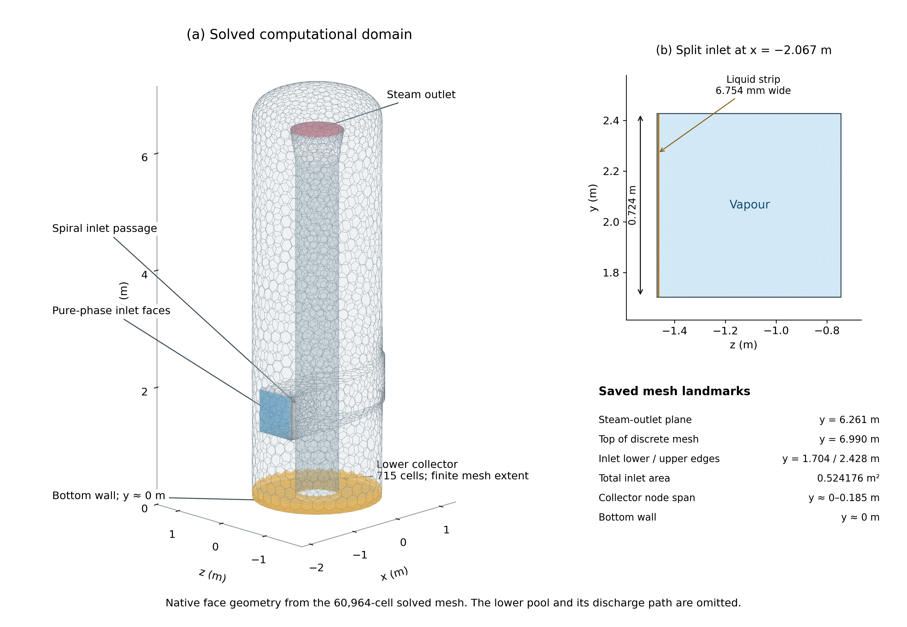
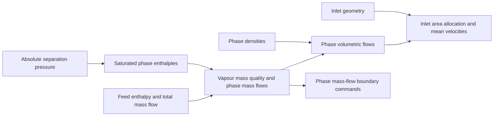

# Part 2 — Model and methods

*Working draft. This section defines the model and procedures through the frozen-bulk film-development investigation. Remaining evidence gaps are identified where they affect reproducibility. Later wall-film parameter investigations are outside the selected report evidence.*

## 3. Model and methods

### 3.1. Computational domain and modelling scope

The computational domain represented the upper separation region of a vertical bottom-outlet cyclone separator with a spiral inlet. It included the inlet passage, vessel walls and steam outlet. The lower brine pool and its discharge path were omitted. The bottom of the domain remained a wall, so liquid could be stored in the model or leave through the steam outlet unless an additional collection treatment was active.

A numerical collector was defined in the lower fluid region to represent liquid collection at a brine-pool surface. This treatment allowed liquid to leave the simplified model without introducing a steam outlet at its base. It did not resolve the pool surface, pool depth or downstream discharge. Calculations with the collector disabled examined transport within the same truncated domain.

The study assessed the model's numerical development and its predicted liquid routes. It used a steady bulk-flow formulation, with a separate evolving wall-film model where enabled. Numerical startup therefore described the development of the solution through iterations; it did not represent the physical startup time of the separator.

*Methods Figure M1 (provisional number). Computational domain and pure-phase inlet partition reconstructed from the selected 60,964-cell saved mesh. The collector contains 715 cells and extends to approximately $y=0.185$ m, although its selection used cell centroids $y\leq0.10$ m. The bottom remains a wall; the omitted pool and discharge are not represented. Face colours identify boundaries and the source region, not solution fields. The full-feed parent, combined contact endpoint and shortened-startup endpoint share identical node coordinates and face connectivity.*

Coordinates use the saved mesh system, with vertical $y$ and the bottom at approximately $y=0$. The inlet plane was $x=-2.067$ m, with lower and upper edges at $y=1.704$ and 2.428 m. The steam-outlet plane was $y=6.261$ m, while the top of the discrete mesh was $y=6.990$ m. The complete mesh extended over $x=-2.067$–1.065 m and $z=-1.470$–1.065 m, including the inlet passage. These are measured saved-mesh landmarks, not nominal CAD dimensions. Appendix A.1 retains exact coordinate bounds and the paired-case identity checks.

<!-- Evidence: [Model scope](../../model.md); [collector and wall-zone specification](../../experiments/phase-07-2a-wall-liquid-routing/stage-02-combined-ewf-roughness/ewf-absorber/setup.md). -->

### 3.2. Physical model and assumptions

#### 3.2.1. Bulk steam–liquid flow

The calculations used Ansys Fluent 2025 R2 with a pressure-based solver and absolute velocity formulation. Steam was the primary phase and liquid water was the secondary phase. Fluent's Mixture model solved mixture continuity and momentum, secondary-phase volume fraction and algebraic relative velocity. For vapour and liquid fractions $\alpha_V$ and $\alpha_L$,

$$
\alpha_V+\alpha_L=1,\qquad
\rho_m=\alpha_V\rho_V+\alpha_L\rho_L,\qquad
\boldsymbol u_m=\frac{\alpha_V\rho_V\boldsymbol u_V+\alpha_L\rho_L\boldsymbol u_L}{\rho_m}.
$$

Here, $\boldsymbol u_m$ is the mass-averaged mixture velocity. The phase drift velocity is $\boldsymbol u_{\mathrm{dr},i}=\boldsymbol u_i-\boldsymbol u_m$, and slip is $\boldsymbol u_L-\boldsymbol u_V$. Mixture continuity and momentum describe the shared bulk flow; the secondary-phase transport equation and algebraic slip relation describe liquid distribution and relative motion. RNG $k$–$\varepsilon$ supplies the turbulent stresses. The energy equation was not solved. ([Ansys, Inc., 2025b, §§14.4.3–4 and 14.4.6–7](https://ansyshelp.ansys.com/public/Views/Secured/corp/v252/en/flu_th/flu_th_sec_multiphase_mixture.html))

The three saved states identified in Appendix A.1 used the Manninen algebraic-slip formulation, Schiller–Naumann drag and a constant secondary-phase diameter of **10 µm**. Virtual mass, lift and wall lubrication were disabled, with no additional interphase turbulent-dispersion or turbulence-interaction model. Bulk surface tension and cavitation were disabled, and no bulk interphase mass-transfer model was assigned. EWF phase accretion, where active, was a separate transfer at the wall. These settings were recovered from the hash-matched saved cases, rather than inferred from the diagnostic particle distribution.

The algebraic relation assumes that relative motion approaches local equilibrium over a short spatial length scale. Retaining the inherited formulation allowed collection and wall treatments to be compared within one bulk model. It did not establish the accuracy of that approximation for the segregated liquid near the vessel wall. The 10 µm parameter controls continuum-phase slip; it is not a resolved droplet population or a wall-film thickness. Individual diagnostic droplets and the surface film were represented separately where enabled. ([Ansys, Inc., 2025b, §14.4.6](https://ansyshelp.ansys.com/public/Views/Secured/corp/v252/en/flu_th/flu_th_sec_drift_theory_relvel.html))

RNG $k$–$\varepsilon$ supplied the turbulence closure, with its differential-viscosity and swirl-dominated-flow options enabled in the verified throughput-controlled absorber model. Standard wall functions supplied the near-wall treatment. This closure was retained in the wall-treatment comparisons. Gravity acted in the negative $y$ direction at 9.81 m/s². Density and viscosity were fixed at the values in Table 2. The energy equation was disabled, so flashing, condensation and temperature-dependent properties were outside the model.

*Table 2. Fixed material properties verified for the throughput-controlled absorber model.*

| Phase | Density (kg/m³) | Dynamic viscosity (Pa·s) |
| --- | ---: | ---: |
| Vapour | 5.79743 | $1.52062\times10^{-5}$ |
| Liquid water | 881.211 | $1.45544\times10^{-4}$ |

<!-- Evidence: [Saved/reopened model and material settings](../../experiments/phase-07-1a-absorber-convergence/baseline-v2-virtual-liquid-outlet/build-manifest.json). -->

#### 3.2.2. Wall roughness and wall-film representation

Wall roughness and Eulerian Wall Film (EWF) represented different parts of the wall interaction. Roughness changed the wall-function treatment through equivalent sand-grain height $k_s$ and roughness constant $C_s$. The tested values were sensitivity inputs; they were not measurements of the separator surface. ([Ansys, Inc., 2025f](https://ansyshelp.ansys.com/public/Views/Secured/corp/v252/en/flu_th/x1-5720008.164.html))

In Fluent 2025 R2, the default rough-wall formulation for RNG $k$–$\varepsilon$ with standard wall functions uses a virtual wall shift. The saved rough-wall flag was consistent with this treatment, but the effective role of an additional Colebrook flag remains unverified (Appendix A.10). The virtual-wall formulation removes the older restriction between roughness height and wall-adjacent cell distance. It does not establish adequate wall resolution or the suitability of an equilibrium wall function for the rotating flow. Actual wall-resolution evidence must therefore be assessed separately. ([Ansys, Inc., 2025f, §4.18.5](https://ansyshelp.ansys.com/public/Views/Secured/corp/v252/en/flu_th/x1-5720008.164.html))

EWF added surface equations for film mass and momentum on selected walls. Phase accretion transferred liquid from the bulk phase into the film. Film transport and edge outflow were then recorded separately from bulk-liquid transport. Coupling between the film equations and momentum feedback to the bulk flow were distinct settings. ([Ansys, Inc., 2025c](https://ansyshelp.ansys.com/public/views/secured/corp/v252/en/flu_ug/flu_ug_models_wallfilm.html); [2025e](https://ansyshelp.ansys.com/public/views/secured/corp/v252/en/flu_ug/flu_ug_ewf_sec_overview.html))

The reported EWF cases solved film mass and momentum with gravity, external-flow shear and wall-viscous resistance. Film pressure-gradient, spreading and surface-tension terms were disabled. Phase accretion was enabled, while film energy, phase change, DPM collection/splash, stripping, edge-separation and EWF–VOF transition models were disabled. Bulk-flow momentum feedback was off. Native outflow at the lower edge of the active film wall remained a drainage route; this was distinct from the disabled droplet edge-separation model. ([Ansys, Inc., 2025c, §§30.3–4](https://ansyshelp.ansys.com/public/Views/Secured/corp/v252/en/flu_ug/flu_ug_ewf_sec_options.html))

The initial accretion-enabled film screen used coupled film equations. Later film-development tests included an alternative implicit numerical algorithm, identified separately from the physical model in Appendix A.9. The model/control matrix in Table 4 identifies the selected case changes; Appendix A.9 records the switches, algorithm variants and numerical bounds.

One-way particle tracking, where used, was a separate diagnostic on a prescribed carrier field. It retained the full Eulerian liquid feed. Particle weights therefore did not represent additional physical liquid entering the separator and were excluded from the feed balance.

### 3.3. Boundary conditions and liquid collection

#### 3.3.1. Enthalpy and the inlet phase mass flows

The reference feed was based on the 1600 kJ/kg condition reported by Purnanto et al. (2013). The total mass flow was 197.61 kg/s at a separation pressure of 11.2 bar absolute, or 1.120 MPa. Their saturated-liquid and saturated-vapour enthalpies at that pressure were 784.66 and 2781.46 kJ/kg, respectively. ([Purnanto et al., 2013, Table 1](https://www.researchgate.net/publication/269519626_CFD_MODELLING_OF_TWO-PHASE_FLOW_INSIDE_GEOTHERMAL_STEAM-WATER_SEPARATORS))

For a saturated steam–water feed in equilibrium, the specific enthalpy is the mass-weighted phase enthalpy:

$$
h=(1-x_V)h_{L,\mathrm{sat}}+x_Vh_{V,\mathrm{sat}},\qquad
x_V=\frac{h-h_{L,\mathrm{sat}}}{h_{V,\mathrm{sat}}-h_{L,\mathrm{sat}}},
$$

where $x_V$ is vapour mass quality and saturation properties refer to absolute pressure. The relation applies within the two-phase enthalpy interval. This example uses the paper's enthalpies; other operating conditions require a consistent property basis such as IAPWS-IF97. ([IAPWS, 2012](https://iapws.org/technical-guidance/release/IF97-Rev)) The phase flows are

$$
\dot m_V=x_V\dot m_{\mathrm{tot}},\qquad
\dot m_L=(1-x_V)\dot m_{\mathrm{tot}}.
$$

The calculation gives $x_V=0.408323$. The historical boundary commands retained the published rounded values, **80.69 kg/s vapour and 116.92 kg/s liquid**; these define the reproduced case. Appendix A.7 gives the worked calculation.

Enthalpy determined the phase allocation before the CFD calculation. The energy equation was disabled, so Fluent did not use this enthalpy to calculate flashing or update the phase split inside the separator. Reduced-feed startup multiplied both phase commands by the same factor and retained their mass ratio.

#### 3.3.2. Volumetric flow, inlet split and velocity

Mass quality and volume fraction describe different quantities. The original split-area design used densities of 881.77 kg/m³ for liquid and 5.73 kg/m³ for vapour. For the 0.724 m by 0.724 m inlet, $A=0.524176$ m², a common normal velocity gave

$$
Q_i=\frac{\dot m_i}{\rho_i},\qquad
U=\frac{Q_L+Q_V}{A},\qquad A_i=\frac{Q_i}{U}.
$$

Vapour supplied about 40.83% of the mass and 99.07% of the reference volumetric flow. The design therefore assigned approximately 0.933% of inlet area to a 6.754 mm liquid strip beside the vessel wall (Methods Figure M1), with calculated $U=27.1180$ m/s. This pure-phase placement was an idealised input. Under the same common-velocity assumption, a uniform mixed inlet would instead have

$$
\alpha_{L,\mathrm{uniform}}
=\frac{\dot m_L/\rho_L}
{\dot m_L/\rho_L+\dot m_V/\rho_V}
=0.009328.
$$

The liquid mass fraction was therefore not a liquid-volume-fraction boundary value. Later calculations retained the split geometry and prescribed mass flows using Table 2's material values. Mean normal phase velocities followed

$$
U_{i,n}=\frac{\dot m_i}{\rho_i A_i}.
$$

At full feed these were approximately 27.134 m/s for liquid and 26.803 m/s for vapour, with combined volumetric-flow speed 26.806 m/s. Appendix A.7 retains both property bases, areas and arithmetic. Reconstruction commands are specified separately in Appendix A.2.

<!-- Evidence: [Original area derivation and phase-property basis](../../experiments/phase-02-parity-reset-and-pre-v2-qualification/purnanto-08c-inlet-loading-sensitivity/inlet-regimes-interpretation.md); [supplied inlet areas](../../../PyAnsys/output/phase9-mesh-convergence/20261007/mesh-input-audit.json); [saved full-feed commands](../../../PyAnsys/output/phase71a_r0_control_run4/checkpoint-plus1000-batched-readback.json). -->

#### 3.3.3. Fluent boundary implementation

The main absorber and wall-treatment calculations used two mass-flow inlet zones. At `liquidinlet`, phase-2 liquid received the required mass-flow command and phase-1 vapour received zero. At `steaminlet`, phase-1 vapour received its command and phase-2 liquid received zero. Flow direction was normal to the boundary. The startup commands were 25% of the full-feed values (Table 3).

*Table 3. Boundary conditions for the main startup and wall-treatment lineage.*

| Boundary | Condition | Full feed | Reduced feed |
| --- | --- | ---: | ---: |
| Liquid inlet | Liquid mass-flow inlet | 116.9200 kg/s | 29.2300 kg/s |
| Vapour inlet | Vapour mass-flow inlet | 80.6900 kg/s | 20.1725 kg/s |
| Steam outlet | Prescribed gauge pressure | 1.120 MPa | Same pressure specification |
| Vessel and bottom walls | Stationary, no-slip | Smooth or specified roughness | As defined for the startup case |

Operating pressure was 0 Pa, so the specified outlet gauge pressure also represented 1.120 MPa absolute in this model. The inlet condition prescribed phase mass flow; inlet pressure was obtained as part of the solution. Appendix A.6 distinguishes the stored inlet pressure entry from a pressure sampled for pressure-loss assessment.

Turbulence was specified using **Intensity and Hydraulic Diameter**. The recorded intensity was 2.11%. For a rectangular passage of width $W$ and height $H$,

$$
D_h=\frac{4A}{P_w}=\frac{2WH}{W+H},
$$

where $P_w$ is the perimeter used for this geometric calculation. Applying the expression to each inlet strip gives approximately 0.01338 m for liquid and 0.72061 m for vapour, matching the full-feed control inputs. This choice treated the strips as separate rectangular passages for the turbulence length scale. Other inlet comparisons used different diameter choices, which must remain identified with their cases.

The steam outlet was a pressure boundary. Its full-feed control specified normal, vapour-only backflow, with 2.11% turbulence intensity and 0.875936 m hydraulic diameter. Physical walls were stationary and no-slip. Their roughness and film assignments are specified separately from the bulk boundary type in Appendix A.8.

The mixed-inlet and split-inlet Coupled reconstructions changed phase placement on the same physical inlet faces. Appendix A.2 gives the area-distributed commands and retained turbulence diameters. Their speed series scaled throughput at fixed phase ratio; an enthalpy sweep would change that ratio.

<!-- Evidence: [Executed inlet schedule](../../experiments/phase-07-1a-absorber-convergence/roughness-family/r0-smooth-control/provenance.md); [full-feed control readback](../../../PyAnsys/output/phase71a_r0_control_run4/checkpoint-plus1000-batched-readback.json); [reconstruction boundary audit](../../experiments/phase-08-storyline-reconstruction/stage-01-60k-storyline/baseline-lineage-audit.md). -->

#### 3.3.4. Contact-based absorber

The final contact absorber removed bulk liquid from 715 lower fluid cells selected by centroid position, $y\leq0.10$ m. The collector boundary followed the selected cell faces, whose node extent reached $y\simeq0.185$ m; it was not an exact plane at 0.10 m. It represented collection at the omitted pool by removing liquid without a direct vapour mass sink. The early startup used an earlier throughput-controlled absorber; Appendix A distinguishes that law from the contact treatment used later.

For non-negative liquid fraction, the contact source was

$$
S_L=-\frac{\rho_L\alpha_L}{\tau},\qquad
\tau=10^{-5}\ \mathrm{s}.
$$

Here, $S_L$ is the volumetric liquid mass source in kg/(m³·s), and $\tau$ is the prescribed depletion time. Removal depended on liquid present in each collector cell, without an inlet-throughput cap. The compiled function used the non-negative part of $\alpha_L$ for source evaluation without overwriting the solved fraction. For constant density, the evaluated removal magnitude was

$$
\dot m_{\mathrm{removed,eval}}
=-\int_{V_c}S_L\,\mathrm dV
=\frac{M_c}{\tau},\qquad
M_c=\int_{V_c}\rho_L\alpha_L\,\mathrm dV.
$$

Associated transport terms removed momentum with the signed liquid velocity and removed the corresponding transported turbulence quantities:

$$
\boldsymbol S_{\mathrm{mom}}=S_L\boldsymbol u_L,\qquad
S_k=S_Lk,\qquad S_\varepsilon=S_L\varepsilon.
$$

These terms were included to remove the transported quantities associated with the extracted liquid. A mass source does not automatically supply the required momentum and other transport sources in Fluent. ([Ansys, Inc., 2025a](https://ansyshelp.ansys.com/public/Views/Secured/corp/v252/en/flu_ug/flu_ug_bcs_sec_cell_zones.html))

The mass and momentum functions supplied local source derivatives for implicit treatment. Appendix A.3 gives the exact assignments, derivative approximations and independent applied-source reports. The depletion time controls source strength; it is separate from the film timestep and was assessed through the removal-time screen in Appendix A.4.

The volumetric source acted only on bulk liquid. Film left through native edge outflow at the lower edge of the active EWF wall; the lower wall segment was outside EWF. Diagnostic droplets used native escape at collector-entry faces and lower walls. Bulk removal, collector film drainage and particle escape therefore remained separate collection routes.

### 3.4. Mesh and spatial discretisation

The solved mesh contained 60,964 cells (4596 hexahedral; 56,368 polyhedral), 226,982 nodes and 328,287 faces. The three saved states in Appendix A.10 had identical coordinates and connectivity, including the 715-cell collector. Figure A3 documents the wall-following structure. Resolution, alignment and discretisation affect numerical diffusion; visible topology alone does not establish accuracy. ([Ansys, Inc., 2025g, §7.1.3](https://ansyshelp.ansys.com/public/Views/Secured/corp/v252/en/flu_ug/flu_ug_GridTypes.html))

The full-feed control used Green–Gauss node-based gradients, PRESTO! pressure, second-order upwind momentum and $\varepsilon$, first-order upwind $k$, and QUICK volume fraction. Spatial schemes were recorded per case because the numerical packages differed between the main development and reconstruction calculations. Appendix A.6 retains the verified control settings. The historical tetrahedral comparison is defined separately in Section 3.6 and Appendix A.2.

Saved endpoint data provided actual native wall-resolution fields. On the main `wall` zone, `SV_WALL_YPLUS` had area-weighted means of approximately $3.43\times10^4$, $2.04\times10^4$ and $2.01\times10^4$ for the full-feed parent/control, combined contact endpoint and shortened-startup endpoint, respectively. The separate `SV_WALL_YPLUS_UTAU` field had lower, but still high, means of $2.93\times10^4$, $1.90\times10^4$ and $1.88\times10^4$. These are distinct stored shared-flow fields, not the reference setting of 300. Appendix A.10 gives their per-state ranges, area weighting and paired-data identity.

The high values make near-wall resolution a measured limitation to assess with the wall-function assumptions and a matched refinement study. They do not, by themselves, show that the wall function is invalid. The native nearest-wall distance in cells adjacent to the main wall had an area-weighted mean of 13.009 mm; it was not a meshing first-layer thickness. Orthogonal quality, skewness, exact layer count and first-layer height remain unverified. No completed matched mesh-refinement assessment is reported.

<!-- Evidence: [Raw mesh input audit](../../../PyAnsys/output/phase9-mesh-convergence/20261007/mesh-input-audit.json); [native section views](../../meetings/Poster/poster-sections/mesh-and-volume-fraction-comparison.md); [partitioned control setup](../../experiments/phase-07-1a-absorber-convergence/roughness-family/r0-smooth-control/setup.md). -->

### 3.5. Numerical solution procedure

The historical startup used Hybrid Initialisation with ten passes and no patched pool. The smooth-wall, EWF-off model used the throughput-controlled absorber. After loading the prepared pair, both inlets were explicitly set to Table 3's 25% feed values before solving.

An intended ramp was delayed by a command-writing failure, leaving an actual reduced-feed hold to iteration 1580. The corrected procedure then increased both inlet commands over 2000 updates. If $r$ denotes completed ramp updates, the loading factor was

$$
f(r)=0.25+0.75\frac{r}{2000},\qquad
\dot m_L(r)=116.92f(r),\qquad
\dot m_V(r)=80.69f(r).
$$

Each ten-update block held one feed command: $r=0$ for the first block, then $r=10,20,\ldots,1990$, followed by full feed at $r=2000$. Commands were written and read back before solving. Here, 25% feed means one quarter of full flow, rather than the paper's 25% flow reduction.

At full feed, SIMPLE changed to Coupled with Global Time Step. After warm-up, a separate 1000-update control supplied the saved parent at iteration 5586. Appendix A.5 gives native coordinates and reporting windows.

Here, a **developed parent** is a saved full-feed solution selected for further experiments after examining residual, inventory, outlet and source histories. The full-feed parent/control supplied reproducible common fields; its unresolved convergence and balances remained limits on the later screens.

Coupled solves pressure and momentum corrections together, while the selected Mixture volume fraction remained separately solved. Coupled with Volume Fractions is unavailable with Mixture slip. ([Ansys, Inc., 2025h, §37.3.1](https://ansyshelp.ansys.com/public/Views/Secured/corp/v252/en/flu_ug/flu_ug_sec_uns_solve_pvel_1.html); [2025i, §27.8.1](https://ansyshelp.ansys.com/public/Views/Secured/corp/v252/en/flu_ug/flu_ug_sec_multiphase_solution.html))

Coupling and pseudo-time changed together, so their response belongs to a numerical package. Neither pseudo-time nor steady iteration count represented physical elapsed time.

The shortened startup reused iteration-1580 bulk fields without reinitialisation, introducing contact collection, the 0.5 mm rough-wall treatment, Coupled flow and a film initialised dry once. It held 25% feed for 500 updates, used the same 2000-update ramp, then held full feed for 1000. Table 4 and Appendix A.9 give film controls.

Later frozen-bulk arms disabled flow, turbulence, volume-fraction and relative-motion advancement while retaining film transport and edge drainage. An alternative implicit beta algorithm did not expose the original $h/u/v$ inner residuals; these updates were not tolerance passes. Matched-time facet fields and film accounting supplied a separate local screen (Appendix A.9).

Fluent's steady EWF procedure assumes a converged carrier field that remains unchanged and receives negligible film feedback. Here, bulk freezing was a numerical development procedure; bulk convergence had not been established. The film therefore evolved under prescribed forcing. Restoring the bulk equations and checking the intended combined model remained necessary for a stationary separator claim. ([Ansys, Inc., 2025j, §17.4.3](https://ansyshelp.ansys.com/public/Views/Secured/corp/v252/en/flu_th/flu_th_ewf_sec_sol_alg.html))

Assignments were checked after data loading and save/reopen. Appendices A.5–A.10 give paired parents and controls, including raw residual/global-step entries whose active mapping remains unverified.

### 3.6. Comparison design

The investigation combined exploratory model development with later comparisons from shared saved fields. Early inlet, droplet, wall-film and liquid-removal studies examined which assumptions and treatments required further work. Some were unmatched diagnostics or incomplete runs, and some early inlet variants arose during setup correction. They are therefore not treated as one fully controlled parameter sweep. The Results overview groups these investigations by their question and contribution to the study; Appendix A.11 retains their case identities and evidence limits.

Later comparisons addressed startup, wall transport and the numerical basis for interpreting liquid routes. Common-parent screens changed specified wall inputs while retaining the same saved bulk fields and the other recorded controls. Startup and combined continuations assessed procedures in which several settings changed together. Table 4 defines these principal comparisons. A numerical failure or an incomplete calculation was retained as evidence about the tested conditions, without implying that the physical mechanism could not operate.

<!-- Evidence: [Early exploratory inlet work](../../experiments/phase-01-purnanto-baseline-and-inlet-exploration/interpretation.md), [droplet-study limits](../../experiments/phase-03-dpm-carryover-and-coupling/interpretation.md), [initial film investigation](../../experiments/phase-04-ewf-wall-film-mechanisms/interpretation.md) and [simplified-geometry collection studies](../../experiments/phase-07a-simplified-purnanto-liquid-removal/interpretation.md). -->

*Table 4. Model and control changes for the principal reported comparisons. All used the 60,964-cell domain; a retained setting refers to the recorded parent, not a software default.*

| Calculation | Parent and bulk procedure | Collection and wall model | Film numerical procedure | Comparison scope |
| --- | --- | --- | --- | --- |
| Original startup and full-feed control | Hybrid →25% hold →ramp →Coupled control at iteration 5586 | Throughput-controlled absorber; smooth walls; EWF off | — | Executed startup package |
| Wall-roughness screen | Independent full-feed-parent children; 3000 updates | Throughput-controlled absorber; EWF off; vary $k_s$ and $C_s$ | — | Wall-input sensitivity; final 500 updates |
| Film-disabled continuation and accretion-enabled film case | Independent smooth-wall children of the full-feed parent | EWF off versus accretion on; throughput-controlled absorber; feedback off | Original coupled film algorithm; fixed 10 µs | Film package; matched iterations 8087–8586 |
| Combined contact continuation | Original accretion-enabled fields, iterations 13586 →45606; bulk active | Contact $\tau=10$ µs; 0.5 mm rough-wall treatment; lower film-edge drainage | Original algorithm; 1 µs, then adaptive | Combined change and development |
| Shortened startup | Iteration-1580 fields →500 hold +2000 ramp +1000 full feed | Contact collection and 0.5 mm roughness; dry film activated once; feedback off | Original coupled algorithm; fixed 1 µs | Recipe at matched loading progress |
| Frozen-bulk film development | Shortened-startup endpoint at iteration 5080; bulk held; selected restarts | Shortened-startup physics retained | Alternative implicit beta; local step checks, then adaptive | Film under prescribed forcing |

Roughness heights ranged from 0 to 8 mm at $C_s=0.5$, with $C_s=0.75$ and 1.0 also tested at 0.5 and 2 mm. The 0.5 mm rough-wall treatment used $C_s=0.5$. Appendix A.5 gives protocols/windows; Appendix A.9 gives exact film algorithms, subiterations, bounds and adaptive controls.

Film-step checks restarted identical saved fields and compared equal accepted film time. Longer frozen-bulk calculations held carrier quantities as inputs.

The absorber-off mixed-inlet and split-inlet Coupled reconstructions changed phase placement at the same mesh, feed and numerical package. Each speed case used fresh Hybrid Initialisation and 10,000 updates; Appendix A.2 gives windows. Mesh-resolution assessment remains incomplete.

The historical tetrahedral-mesh reference and mixed-inlet SIMPLE reconstruction used corresponding mesh/contour sections at iteration 10,000 but differed in mesh, inlet representation and preparation. The mixed-inlet SIMPLE and Coupled reconstructions changed coupling, pseudo-time and the $k$ scheme together. Neither comparison isolated a single cause. Appendix A.2 defines these provisional comparisons; Sections 4.9 and 5.6 give observations and possible explanations.

### 3.7. Data reduction and numerical assessment

Each reported value retained its case, active equations and observation window. Endpoint values, window means and residual minima were identified separately. The fixed run horizons bounded the observations; reaching a horizon was not a convergence criterion. Table 5 defines the assessment procedures, and Table 6 defines the principal quantities.

*Table 5. Procedures used to assess implementation and numerical credibility.*

| Assessment | Procedure |
| --- | --- |
| Implementation | Check model and source assignments, units and saved/reopened settings; compare evaluated removal with native applied-source reports |
| Stability and iterative convergence | Examine solver events, residuals and late inventory/outlet/source trends; apply recorded inner-film criteria only where available |
| Conservation | Reconcile signed boundary fluxes, applied sources and relevant transfer/storage terms, counting each once |
| Local film-step screen | Compare identical-parent fields at equal accepted film time against Appendix A.9's field/ledger/Courant criteria |
| Stationary-film screen | Check three consecutive 1000-update windows and spatial persistence; restore bulk for full-model assessment (Appendix A.9) |
| Spatial resolution | A completed matched mesh-refinement assessment remains outstanding |
| Physical validation | Matched field measurements and uncertainty assessment remain outstanding |

Native residual scaling and restart normalisation were checked before comparison. Residuals were examined with quantities of interest; they were not percentage mass imbalances. ([NASA, 2021a](https://www.grc.nasa.gov/www/wind/valid/tutorial/iterconv.html))

*Table 6. Quantities used in the model assessment.*

| Quantity | Definition and use |
| --- | --- |
| Bulk and collector liquid mass | $\int\rho_L\alpha_L\,\mathrm dV$ over the stated volume, kg; identifies storage and collector occupancy |
| Steam-outlet phase flows | Outward vapour and bulk-liquid rates, kg/s; identifies the represented outlet routes |
| Applied absorber removal | Native integrated phase-2 source, kg/s; checked separately from evaluated $M_c/\tau$ |
| Boundary-plus-source remainder | Signed boundary fluxes plus applied sources, kg/s; partial if relevant film transfers/storage are omitted |
| Film mass and accretion | Native film inventory, kg, and bulk-to-film transfer rate, kg/s |
| Film drainage and storage | Edge outflow and inventory change over accepted film time; distinguishes discharge from continued filling |
| Pressure difference | Future performance measure: sampling surfaces and averaging remain undefined; no qualified pressure-loss result is reported |

Fluent boundary fluxes were positive into the domain. Outward bulk-liquid flow through the steam outlet was therefore reported as $-\dot m_{2,\mathrm{steamoutlet}}$. For an EWF-off case with no other liquid transfers, the signed liquid remainder was

$$
R_L=\sum_b\dot m_{L,b}+\dot m_{L,\mathrm{source,applied}},
$$

The sum included all liquid boundaries; the applied source retained its negative removal sign. Native mixture and phase-summed accounts were assessed separately. Evaluated and applied removal described the same source and were counted once.

With updating bulk equations, accretion leaves bulk and enters film, cancelling only in compatible combined accounts. Boundary-plus-absorber remainders that omit it remain partial diagnostics.

For the accretion-fed film, $A_i$ was the accretion rate during accepted increment $\Delta t_i$, $\Delta D_f$ cumulative film outflow and $\Delta M_f$ inventory change. The film-only remainder was

$$
E_f=\Delta M_f+\Delta D_f-\sum_i A_i\Delta t_i,\qquad
e_f=100\frac{|E_f|}{\left|\sum_i A_i\Delta t_i\right|}.
$$

Lower-edge drainage was distinguished from other edge outflow. Appendix A.9 gives integration and rate definitions; extra active film inputs/losses would require extra terms.

With bulk frozen, accretion was prescribed film input without advancing reciprocal bulk loss/replenishment. Constant bulk inventory/outlet rates were imposed, and film-ledger agreement could not establish coupled conservation or bulk stationarity. Steady-iteration inventory change did not supply a physical bulk-storage rate.

Wall screens used final-500 arithmetic means; the 500 ms film arm used its final 10 ms with interval-overlap weighting (Appendices A.5 and A.9). The bulk-liquid outlet ratio was $100(-\dot m_{L,\mathrm{steamoutlet}})/\dot m_{L,\mathrm{in,realised}}$, describing routing rather than qualified efficiency. Retained liquid was storage; diagnostic particle weights were excluded from throughput.

Local step selection required mass-distribution difference $\leq1\%$, velocity/thickness differences $\leq2\%$, ledger error $\leq0.1\%$ and recovery bounds; the mid-development check added drainage difference $\leq1\%$ of reference accretion. Appendix A.9 defines norms and parents. A local pass did not establish global timestep independence or validation.

Appendices A and B provide the settings, parent identities, source assignments and extraction records needed to trace these procedures. Appendix A.11 maps the descriptive case names to archived identifiers. Remaining numerical-resolution and physical-validation limits accompany the reported findings and their interpretation.
