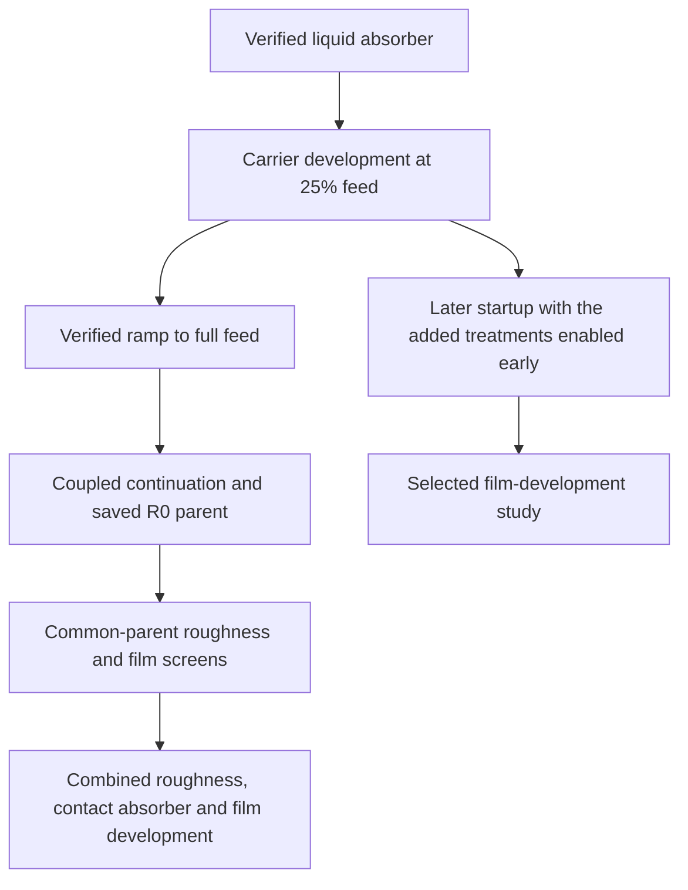

# Part 2 — Model and methods

*Working draft. The methods centre on the absorber and startup sequence, then define the wall experiments made from the developed parent.*

## 3. Model and methods

### 3.1. Study design and development sequence

The study followed a development sequence: establish a liquid-removal treatment, develop the carrier at reduced feed, increase the load, and use the saved full-feed state for additional wall experiments. The main history runs from the prepared v2 absorber case to N45606. Its early stages provide the basis for the report's central contribution. The later roughness and EWF studies assess the behaviour of the model built from that basis.

The early sequence is development history rather than a set of isolated causal experiments. Its value is assessed from the recorded residuals, inventories, source application and preserved parent. The roughness and film screens then use declared common-parent comparisons (Table 1). ([Selected case history](../../experiments/phase-07-2a-wall-liquid-routing/stage-02-combined-ewf-roughness/case-history-N45606.md); [R0 provenance](../../experiments/phase-07-1a-absorber-convergence/roughness-family/r0-smooth-control/provenance.md))

*Table 1. Main study stages and the evidence each can provide.*

| Stage | Selected cases or endpoints | Purpose | Comparison boundary |
| --- | --- | --- | --- |
| Absorber and historical startup | Prepared v2; low-feed N1580; developed R0 N5586 | Establish a removal treatment and develop a usable carrier parent | Sequential loading and solver changes; causal contributions are not isolated |
| Roughness and wall-film screens | R0–R11; E0 and E2.7 | Assess wall-treatment response from a common parent | Same developed N5586 fields; throughput-controlled absorber |
| Combined development | Original-field contact restart to N17586; selected continuation to N45606 | Extend the model with roughness, contact removal and film transport | Absorber, roughness and film controls change together at the restart |
| Revised startup | Saved low-feed fields to N5080 | Test a startup with the added treatments enabled before loading | A combined recipe, with a different absorber from the historical ramp |
| Subsequent film development | Selected N25815 history; 500 ms reference arm | Examine film formation, transport and storage | Bulk equations frozen after N5080 |

### 3.2. Geometry, carrier and feed

The selected simplified mesh contains 60,964 fluid cells. The spiral-inlet model has separate liquid and steam inlet zones, a steam pressure outlet, and a closed lower boundary. It does not resolve the lower brine-discharge path of a complete separator. The absorber occupies a lower cell zone selected by $y\leq0.10$ m, containing 715 cells in the verified v2 build. Liquid removal through this zone is a numerical source, not a pressure-outlet boundary. ([Verified v2 build](../../experiments/phase-07-1a-absorber-convergence/baseline-v2-virtual-liquid-outlet/results.md))

The carrier uses a steady, pressure-based, two-phase Mixture formulation with RNG k–ε turbulence modelling. Phase 1 is vapour and phase 2 is bulk liquid. The reference basis includes gravity, fixed material properties, and no energy solution or phase change. The selected case records determine the exact inherited settings. The split inlet is an idealised phase placement, rather than a measured upstream flow regime. ([Project model](../../model.md))

*Table 2. Recorded inlet commands for the historical startup. The reduced-feed condition is 25% of the full-feed commands.*

| Loading state | Liquid command (kg/s) | Vapour command (kg/s) | Use |
| --- | ---: | ---: | --- |
| Reduced-feed hold | 29.2300 | 20.1725 | Early carrier development |
| Full feed | 116.9200 | 80.6900 | Developed parent and subsequent wall studies |

Reduced feed means lower inlet throughput on the same inlet areas and with the same materials. The report uses the verified mass-flow commands to define this condition. It does not assign an inlet velocity taken from another branch.

[METHOD DETAIL TO COMPLETE: add verified vessel and inlet dimensions, a labelled geometry view, mesh topology and quality, and the exact material and wall-treatment readbacks for the selected cases. Appendix A identifies the owning records.]

### 3.3. Absorber implementation

#### 3.3.1. Purpose, location and modelling assumption

The absorber supplied a liquid-removal route in the truncated separator. The physical bottom remained a wall, so this route was implemented as a source inside the lower fluid cells. The existing centroid selection, $y\leq0.10$ m, produced the 715-cell collector. Its interface followed the selected cell faces and was stepped rather than fitted to an exact horizontal plane. Liquid capture therefore referred to entry into this numerical region. ([Verified v2 build](../../experiments/phase-07-1a-absorber-convergence/baseline-v2-virtual-liquid-outlet/results.md); [contact-region geometry](../../experiments/phase-07-2a-wall-liquid-routing/stage-02-combined-ewf-roughness/ewf-absorber/setup.md))

The model treated collected liquid as removed from the calculation. It did not convert that mass to vapour or resolve the lower brine-discharge process. No direct vapour mass sink was applied. Vapour could still respond through pressure, slip and the shared momentum and turbulence equations. The absorber was thus an idealised numerical boundary treatment whose influence on the retained separator had to be assessed.

Two absorber laws were used at different stages. The early startup used a throughput-controlled named-expression treatment. The later combined restart and revised startup used a compiled local contact treatment. The later implementation must be distinguished from the source active during the early low-continuity hold.

#### 3.3.2. Throughput-controlled law and local liquid weighting

The original v2 treatment replaced a uniform, lower-inventory-driven sink. It distributed a prescribed liquid-removal command according to the liquid present in each collector cell. Define the available liquid volume as

$$
V_{L,c}=\int_{V_c}\alpha_L\,\mathrm dV
       \approx\sum_{i\in c}\alpha_{L,i}\Delta V_i.
$$

Here, $V_c$ is the collector region, $\Delta V_i$ is a cell volume, and $\alpha_{L,i}$ is its liquid volume fraction. The prescribed command was the magnitude of the native liquid-inlet flow. The volumetric source was

$$
S_{L,i}=-\dot m_{\mathrm{command}}
\frac{\alpha_{L,i}}{\max(V_{L,c},V_{\min})},
\qquad V_{\min}=10^{-6}\ \mathrm{m^3}.
$$

The negative sign denotes mass removal. $S_{L,i}$ has units of kg/(m³·s); multiplying it by $\Delta V_i$ gives the cell's removal rate in kg/s. A liquid-free cell receives zero direct liquid sink. Above the volume floor, a cell's share of the total removal is proportional to $\alpha_{L,i}\Delta V_i$. The implementation therefore accounts for cell volume as well as liquid fraction. It does not allocate equal removal to every collector cell. ([Source specification](../../experiments/phase-07-1a-absorber-convergence/baseline-v2-virtual-liquid-outlet/deffered.md); [implemented expressions](../../../PyAnsys/scripts/setup/build_p71a_baseline_v2_virtual_outlet.py))

Integrating the law gives its total evaluated removal:

$$
\dot m_{\mathrm{removed,eval}}
=-\int_{V_c}S_L\,\mathrm dV
=\dot m_{\mathrm{command}}
 \frac{V_{L,c}}{\max(V_{L,c},V_{\min})}.
$$

This expression defines two behaviours. If $V_{L,c}\geq V_{\min}$, evaluated removal equals the command by construction. If the collector is starved, removal falls in proportion to $V_{L,c}/V_{\min}$ and tends to zero as the collector becomes dry. The floor prevents division by zero. It is not a target pool volume, a convergence criterion or a guarantee that depletion will be numerically stable.

Above the floor, the full command is distributed even when the collector contains little liquid. For fixed density, the implied source depletion time is $M_c/\dot m_{\mathrm{command}}$, where $M_c$ is collector liquid mass. A small inventory can therefore imply rapid local depletion. This is a characteristic of the prescribed source coefficient, not an elapsed physical time measured by the steady carrier solver. Appendix A.4 gives the full-feed example.

#### 3.3.3. Matching the removed mass to momentum and turbulence

Removing mass changes the transport budgets associated with that fluid. Fluent requires the corresponding source terms to be supplied; it does not add them automatically for a user mass source. ([Ansys, 2025a, §8.2.7](https://ansyshelp.ansys.com/public/Views/Secured/corp/v252/en/flu_ug/flu_ug_bcs_sec_cell_zones.html))

The original treatment used

$$
\boldsymbol S_m=S_L\boldsymbol u_L,\qquad
S_k=S_Lk,\qquad S_\epsilon=S_L\epsilon.
$$

Mass removal was attached to phase 2. The three momentum components and shared $k$ and $\epsilon$ terms were attached to the Mixture equations. Momentum-source units were N/m³; the turbulence-source units were kg/(m·s³) and kg/(m·s⁴). The same liquid-removal rate was therefore used to define the associated transport removal. This specified how the numerical collector acted on the shared fields; it did not validate a physical turbulence model for a brine outlet.

The velocity in the momentum term was the liquid-phase velocity, $\boldsymbol u_L$. The Mixture velocity can differ because the phases can slip. Using the Mixture velocity would associate the removed liquid mass with a different momentum. Each component also retained its sign: if liquid velocity was negative in one direction, removing that signed momentum could require a positive source component in that direction. Replacing the velocity with its magnitude would change the treatment.

The named expressions and source attachments were read back after saving and reopening the prepared case. Appendix A.3 provides their exact identities and phase assignments. This verification checked what Fluent would apply; a completed source setup did not itself establish a converged flow.

#### 3.3.4. Local contact law and supplied source derivatives

The corrected contact treatment used a local depletion law,

$$
S_L=-\rho_L\alpha_L/\tau,\qquad
\dot m_{\mathrm{removed,eval}}=M_c/\tau,
\qquad \tau=10^{-5}\ \mathrm s
$$

for the selected fixed-density branch. Removal depended on local liquid rather than an inlet-throughput command. Finite $\tau$ approximated rapid capture, while allowing a small collector inventory under continuing inflow. It did not impose literal zero liquid fraction.

The compiled mass function evaluated the source from liquid density and the non-negative part of liquid fraction. It supplied $-\rho_L/\tau$ in the source-derivative array. Momentum functions returned $S_Lu_{L,j}$ and supplied derivative $S_L$ for each Mixture velocity component, using the approximation that slip and the other source factors were held fixed during that update. The saved contact case retained the shared turbulence-expression hooks. ([Corrected C implementation](../../../PyAnsys/src/pyansys_fluent/contact_absorber.c); [prepared contact source readback](../../../PyAnsys/output/phase72a-lineage-N45606/20261005/raw/history-recovery/PyAnsys/output/phase72a-contact-absorber-e27-restart/20261003T032636Z/prepared-reopen.json))

The derivative tells the solver how the source changes with the solved variable during an equation update. Fluent can use it to linearise the source and strengthen the equation matrix when that improves stability. This can help the solution of a strong sink, but does not guarantee convergence. The supplied local derivatives also do not demonstrate an exact Jacobian for the complete coupled model. ([Ansys, 2025b, §2.3.45](https://ansyshelp.ansys.com/public/Views/Secured/corp/v252/en/flu_udf/flu_udf_ModelSpecificDEFINE.html))

The early named-expression treatment had one-iteration profile updates. Its saved record does not establish the same user-controlled derivative treatment as the later compiled functions. The report therefore does not attribute the original low-feed improvement to the later contact linearisation.

#### 3.3.5. Removal strength, startup and numerical controls

Reducing $\tau$ increases the contact removal coefficient. This drives the collector towards a smaller liquid inventory, but also makes changes in liquid fraction produce larger changes in removal. The appropriate strength must therefore be assessed with source variability, residuals, inventories and the surrounding film response. A near-dry collector alone is insufficient.

The corrected contact screens compared 100, 10 and 1 µs removal times from the same N13586 parent over 100 updates. They retained liquid-velocity momentum removal, a verified 1 µs film step and volume-fraction relaxation of 0.1. The 10 µs removal-time branch was then selected for a longer screen. Earlier prototypes using Mixture velocity were excluded from accepted implementation evidence. Appendix A.4 retains the short-screen values and their limits. ([Contact-screen evidence](../../experiments/phase-07-2a-wall-liquid-routing/stage-02-combined-ewf-roughness/results.md#all-liquid-contact-absorber-trial))

Three controls had different roles. $\tau$ defined the absorber law. Volume-fraction relaxation controlled the numerical update of the carrier fraction. The EWF step controlled film time advancement. The selected $\tau=10$ µs was not the same parameter as the 1 µs film step, and neither defined physical carrier time in the steady calculation. A smaller relaxation or film step could improve numerical behaviour while leaving the removal-model assumption unresolved.

For the original startup, reduced feed lowered the prescribed command while the liquid field developed. This, together with the verified source treatment and subsequent ramp, supplied the useful development path described in Section 3.4. Its benefit is assessed from the actual history, without assigning the improvement to an untested stability mechanism.

#### 3.3.6. Removal of the separate liquid representations

The bulk source acted on Eulerian phase-2 liquid only. Once EWF and droplets were present, their collection required their own routes. In the selected contact treatment, the film domain ended at its lower edge so film could leave by native edge outflow. Droplets used native escape at the collector-entry faces. These rates and destinations had to be recorded separately from the integrated bulk sink. ([Field-specific collector specification](../../experiments/phase-07-2a-wall-liquid-routing/stage-02-combined-ewf-roughness/ewf-absorber/setup.md))

Liquid entering the film was an internal transfer, whereas collector removal and boundary discharge were exits from their defined model accounts. Counting accretion as removal as well as counting the later film outflow would double-count that liquid. Section 3.7 defines the checks used to separate source operation, numerical behaviour and complete accounting.

### 3.4. Historical startup and developed parent

The prepared v2 field used fresh Hybrid Initialisation, smooth walls and EWF off. The first loading driver calculated a ramp but did not write the changing inlet values to Fluent. The actual boundaries remained at 25% feed. This unintended hold was retained as field-development history because it preceded the useful low-feed state; it is not presented as an originally planned controlled hold.

The selected native history places the end of that hold at N1580. From the saved fields, the corrected runner advanced exactly 2000 further updates to N3580. It wrote and read back both inlet boundaries before each 10-update block, increasing them to the full-feed commands. The inlet report cache lagged the boundary writes, so the report's first increase did not define the true ramp start. The independent student ramp is a separate branch and is excluded from this history. ([R0 provenance](../../experiments/phase-07-1a-absorber-convergence/roughness-family/r0-smooth-control/provenance.md); [recovered lineage and boundary markers](../../experiments/phase-07-2a-wall-liquid-routing/stage-02-combined-ewf-roughness/case-history-N45606.md))

At full feed, pressure–velocity coupling changed from SIMPLE to Coupled and the steady pseudo-time method changed to Global Time Step. A warm-up continuation was followed by a separate 1000-update control, ending at N5586. The later wall screens used this saved endpoint. Only the terminal control is used for R0 control statistics; the preceding hold, ramp and warm-up remain preparation evidence. Pseudo-time and native steady iteration are numerical coordinates, not physical carrier-flow time. ([R0 settings](../../experiments/phase-07-1a-absorber-convergence/roughness-family/r0-smooth-control/setup.md); [control-window definition](../../experiments/phase-07-1a-absorber-convergence/roughness-family/r0-smooth-control/control-window.md))

### 3.5. Added wall treatment and combined continuation

The roughness family started each child from N5586 with EWF off, then advanced 3000 updates. The height screen covered smooth walls to 8 mm at $C_s=0.5$; further points changed $C_s$ at 0.5 and 2 mm. These are sensitivity settings, not measurements of the vessel surface. Means use N8087–N8586. ([R-family settings and results](../../experiments/phase-07-2a-wall-liquid-routing/roughness-family/results.md))

The E0/E2.7 screen retained smooth walls and the same developed parent. E0 had EWF off. E2.7 enabled phase accretion and coupled film equations, with wall Flow Momentum Coupling off. Its fixed film step was 10 µs, with a 0.3 m exploratory thickness bound. The comparison assesses this package as a whole. ([E0/E2.7 comparison](../../observations/07-wall-liquid-interaction.md))

The selected N45606 lineage continued E2.7 to N13586 before introducing 0.5 mm roughness at $C_s=0.5$, the corrected contact absorber, collector film-edge drainage, and a 1 µs film step. The original E2.7 solution fields were retained at this restart. A later local replay retained the scientific controls, followed by an adaptive-film continuation from N33586. The recorded accepted steps and native film clock determine elapsed film time. Transfers and changes in residual normalisation are retained in the history, so a scaled residual drop at a transfer is not assigned to the film-step change alone. ([Complete selected lineage](../../experiments/phase-07-2a-wall-liquid-routing/stage-02-combined-ewf-roughness/case-history-N45606.md))

### 3.6. Revised startup and subsequent film development

The revised startup reused the exact N1580 low-feed bulk fields. It enabled Coupled flow, dry EWF with accretion, 0.5 mm roughness at $C_s=0.5$, and the corrected contact absorber before the inlet ramp. It held 25% feed for 500 updates, ramped both inlet commands over 2000 updates, and held full feed for 1000 updates. The fixed film step was 1 µs. The comparison therefore tests a combined startup recipe rather than early film activation alone. ([Revised-startup setup](../../experiments/phase-07-2a-wall-liquid-routing/stage-03-shortened-reconstruction/early-ewf-startup/setup.md))

After N5080, the selected continuation temporarily froze the bulk equations to examine film development. Local film-step checks started from identical saved fields and compared equal elapsed film time. The longer reference arm extended film time to 500 ms. The frozen carrier is a prescribed input during these calculations; its fixed inventory and outlet values are not evidence of fully coupled stationarity. ([Selected film protocol](../../experiments/phase-07-2a-wall-liquid-routing/stage-03-shortened-reconstruction/early-ewf-startup/film-development/results.md); [500 ms campaign](../../experiments/phase-07-2a-wall-liquid-routing/stage-03-shortened-reconstruction/early-ewf-startup/inlet-speed-500ms/results.md))

### 3.7. Reported quantities and numerical assessment

#### 3.7.1. What each numerical check establishes

The absorber was assessed through separate questions about implementation, stability, convergence, conservation and accuracy. Table 3 states their meaning in this report. Evidence for one question does not answer the others.

*Table 3. Distinct checks used to assess the absorber and the resulting calculation. Stability refers to observed behaviour over the stated horizon; no general mathematical stability proof is claimed.*

| Check | Question and required evidence | Meaning for the selected results |
| --- | --- | --- |
| Implementation verification | Are the law, units, phase assignments and associated sources applied as intended? Check source readback, save/reopen and native applied-source reports | The implemented removal treatment was checked; command agreement is an application check |
| Numerical stability | Does the calculation remain finite, with controlled fields and source behaviour over the examined window? Check fatal events, oscillations, limiting and inventory excursions | R0 completed the tested continuation; warnings and oscillations remained |
| Iterative convergence | Have the active equations and relevant outputs settled to the declared tolerances? Check residuals together with inventories, removal and outlet quantities | A lower continuity level and finite run did not establish a complete convergence pass |
| Mass conservation | Do signed inlet, outlet, source and relevant transfer/storage terms reconcile? Check each field and the combined model | The full-feed R0 account retained a material liquid deficit |
| Numerical accuracy | How close is the computed answer to the adequately resolved solution of the stated model? Assess mesh, source-resolution and applicable step sensitivity | A completed mesh-convergence result is not available |
| Physical validation | Does the model reproduce relevant observations under matched conditions and known uncertainty? | The artificial collector and separator predictions remain unvalidated |

Residuals and monitored outputs can settle at different rates. Both must be examined for iterative convergence. This is consistent with [NASA's iterative-convergence guidance (2021a)](https://www.grc.nasa.gov/www/wind/valid/tutorial/iterconv.html). In this study, a residual minimum is reported as a minimum over its actual window. It is not treated as proof that every equation converged.

Residual scaling is also distinct from a balance percentage. A scaled residual has the form $r=R_{\mathrm{native}}/N_{\mathrm{scale}}$, using the solver's recorded normalisation. It is not the fraction of inlet mass that is missing. Changes in $N_{\mathrm{scale}}$ can change the plotted value without the same change in the unscaled residual. The N45606 history records a transfer-related change in velocity normalisation, so the report retains that qualification. ([Normalisation check](../../experiments/phase-07-2a-wall-liquid-routing/stage-02-combined-ewf-roughness/case-history-N45606.md#carrier-residuals))

#### 3.7.2. Flux, source and inventory definitions

Fluent's reported boundary flux is positive into the domain. The main wall comparisons express outward bulk-liquid steam-outlet flow as $-\dot m_{2,\mathrm{steamoutlet}}$. Inventory values are labelled as endpoints or window means. A signed source-inclusive balance counts each applied source once:

$$
R_L=\dot m_{L,\mathrm{in}}+\dot m_{L,\mathrm{out,signed}}+
\int_{V_c}S_L\,\mathrm dV,
$$

for the EWF-off parent with pure-phase inlets and no other liquid transfers. Film-enabled calculations require the relevant transfer and drainage terms in addition. The native mixture balance is evaluated separately from the sum of phase balances.

*Table 4. Main quantities used to assess model development.*

| Quantity | Definition and unit | Role in the assessment |
| --- | --- | --- |
| Scaled continuity | Native residual with its recorded normalisation | Equation behaviour during development; not a mass-balance percentage |
| Bulk-liquid inventory | Native phase-2 domain mass, kg | Development and stationarity of the carrier |
| Applied absorber source | Integrated phase-2 mass source, kg/s | Actual numerical removal, checked against the prescribed law |
| Source-inclusive remainder | Signed boundaries plus applied sources, kg/s | Accounting check; source terms counted once |
| Bulk-liquid outlet flow | Outward phase-2 flow through `steamoutlet`, kg/s | One represented liquid route |
| Film inventory and accretion | Native film mass, kg, and bulk-to-film rate, kg/s | Formation and transfer into the wall film |
| Film drainage | Cumulative outflow increment / actual film-time increment, kg/s | Outflow from the represented film |
| Film storage and ledger | Inventory increment and integrated accretion minus drainage | Distinguishes continued filling from stationary transport |

The residual minimum during the low-feed hold is reported separately from the full-feed control. Ramp comparisons use matched loading progress, with a common continuity normalisation. The R-family and E0/E2.7 wall-screen means use N8087–N8586. Later film rates use the recorded accepted film time; the 500 ms reference arm uses a final 10 ms window with interval-overlap weighting.

A bulk-inventory slope per steady iteration cannot be used as physical storage in kg/s. A film-only ledger also cannot establish closure of the combined separator. Residuals, active-equation state, inventory, boundary fluxes, applied sources and solver events are assessed together.

### 3.8. Evidence and reproducibility

The selected Project records identify parents, model flags, report definitions and preserved case/data endpoints. The N45606 history provides recovered native report and residual records; the early hold and ramp remain distinct from later controls. Appendix B links the source records and states the limits of this draft's checks.

The mesh input audit is preparation evidence. No completed mesh-convergence result is used here. The separate reconstruction series is recorded briefly in Appendix A for later reassessment; it does not supply the main results of this draft.
