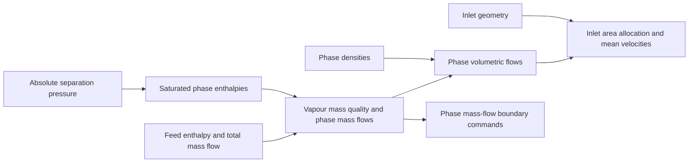
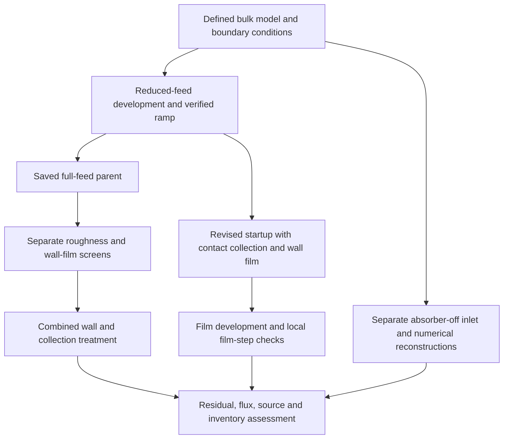

# Part 2 — Model and methods

*Working draft. This section defines the computational model and the procedures used to assess it. Marked spaces identify the remaining model and method details to verify.*

## 3. Model and methods

### 3.1. Computational domain and modelling scope

The computational domain represented the upper separation region of a vertical bottom-outlet cyclone separator with a spiral inlet. It included the inlet passage, vessel walls and steam outlet. The lower brine pool and its discharge path were omitted. The bottom of the domain remained a wall, so liquid could be stored in the model or leave through the steam outlet unless an additional collection treatment was active.

A numerical collector was defined in the lower fluid region to represent liquid collection at a brine-pool surface. This treatment allowed liquid to leave the simplified model without introducing a steam outlet at its base. It did not resolve the pool surface, pool depth or downstream discharge. Calculations with the collector disabled examined transport within the same truncated domain.

The study assessed the model's numerical development and its predicted liquid routes. It used a steady bulk-flow formulation, with a separate evolving wall-film model where enabled. Numerical startup therefore described the development of the solution through iterations; it did not represent the physical startup time of the separator.

[GEOMETRY DETAIL TO COMPLETE: insert a labelled view of the actual computational domain, showing the spiral passage, phase inlet faces, steam outlet, bottom wall and collector. Add verified vessel and inlet dimensions, the coordinate origin and the location of the truncation.]

<!-- Evidence: [Model scope](../../model.md); [collector and wall-zone specification](../../experiments/phase-07-2a-wall-liquid-routing/stage-02-combined-ewf-roughness/ewf-absorber/setup.md). -->

### 3.2. Physical model and assumptions

#### 3.2.1. Bulk steam–liquid flow

The calculations used Ansys Fluent 2025 R2 with a pressure-based solver and absolute velocity formulation. Steam was the primary phase and liquid water was the secondary phase. Fluent's Mixture model solved mixture continuity and momentum, secondary-phase volume fraction and algebraic relative velocity. For vapour and liquid fractions $\alpha_V$ and $\alpha_L$,

$$
\alpha_V+\alpha_L=1,\qquad
\rho_m=\alpha_V\rho_V+\alpha_L\rho_L.
$$

The Mixture formulation represents bulk phase transport with a local-equilibrium approximation for slip between the phases. It was retained from the inherited separator model so that collection and wall treatments could be assessed within the same bulk formulation. It does not resolve individual droplets or the thickness of a thin wall film in the volume mesh. ([Ansys, Inc., 2025b](https://ansyshelp.ansys.com/public/Views/Secured/corp/v252/en/flu_th/flu_th_sec_drift_oview.html))

RNG $k$–$\varepsilon$ supplied the turbulence closure, with its differential-viscosity and swirl-dominated-flow options enabled in the verified v2 model. Standard wall functions supplied the near-wall treatment. This closure was retained in the wall-treatment comparisons. Gravity acted in the negative $y$ direction at 9.81 m/s². Density and viscosity were fixed at the values in Table 2. The energy equation was disabled, so flashing, condensation and temperature-dependent properties were outside the model.

*Table 2. Fixed material properties verified for the v2 absorber model.*

| Phase | Density (kg/m³) | Dynamic viscosity (Pa·s) |
| --- | ---: | ---: |
| Vapour | 5.79743 | $1.52062\times10^{-5}$ |
| Liquid water | 881.211 | $1.45544\times10^{-4}$ |

[MODEL DETAIL TO COMPLETE: carry the selected cases' interphase drag law, representative phase diameter and other active slip-model settings into Appendix A. State any changes between case families explicitly.]

<!-- Evidence: [Saved/reopened model and material settings](../../experiments/phase-07-1a-absorber-convergence/baseline-v2-virtual-liquid-outlet/build-manifest.json). -->

#### 3.2.2. Wall roughness and wall-film representation

Wall roughness and Eulerian Wall Film (EWF) represented different parts of the wall interaction. Roughness changed the wall-function treatment through equivalent sand-grain height $k_s$ and roughness constant $C_s$. The tested values were sensitivity inputs; they were not measurements of the separator surface. ([Ansys, Inc., 2025f](https://ansyshelp.ansys.com/public/Views/Secured/corp/v252/en/flu_th/x1-5720008.164.html))

EWF added surface equations for film mass and momentum on selected walls. Phase accretion transferred liquid from the bulk phase into the film. Film transport and edge outflow were then recorded separately from bulk-liquid transport. Coupling between the film equations and momentum feedback to the bulk flow were distinct settings. ([Ansys, Inc., 2025c](https://ansyshelp.ansys.com/public/views/secured/corp/v252/en/flu_ug/flu_ug_models_wallfilm.html); [2025e](https://ansyshelp.ansys.com/public/views/secured/corp/v252/en/flu_ug/flu_ug_ewf_sec_overview.html))

The initial EWF screen enabled phase accretion and coupled film equations with bulk-flow momentum feedback disabled. Later configurations combined EWF, roughness and the contact collector. Appendix A identifies the configurations, controls and parent records.

[WALL-MODEL DETAIL TO ADD: describe the final selected pressure, spreading and surface-tension forces; momentum feedback; droplet collection/splash; stripping; and edge-separation settings. Use the selected Stage 4 configuration and state which mechanisms were active in each reported comparison.]

One-way particle tracking, where used, was a separate diagnostic on a prescribed carrier field. It retained the full Eulerian liquid feed. Particle weights therefore did not represent additional physical liquid entering the separator and were excluded from the feed balance.

### 3.3. Boundary conditions and liquid collection

#### 3.3.1. Enthalpy and the inlet phase mass flows

The reference feed was based on the 1600 kJ/kg condition reported by Purnanto et al. (2013). The total mass flow was 197.61 kg/s at a separation pressure of 11.2 bar absolute, or 1.120 MPa. Their saturated-liquid and saturated-vapour enthalpies at that pressure were 784.66 and 2781.46 kJ/kg, respectively. ([Purnanto et al., 2013, Table 1](https://www.researchgate.net/publication/269519626_CFD_MODELLING_OF_TWO-PHASE_FLOW_INSIDE_GEOTHERMAL_STEAM-WATER_SEPARATORS))

For a saturated steam–water feed in equilibrium, the specific enthalpy is the mass-weighted phase enthalpy:

$$
h=(1-x_V)h_{L,\mathrm{sat}}+x_Vh_{V,\mathrm{sat}},\qquad
x_V=\frac{h-h_{L,\mathrm{sat}}}{h_{V,\mathrm{sat}}-h_{L,\mathrm{sat}}},
$$

where $x_V$ is vapour mass quality, and the saturation properties are evaluated at the declared absolute pressure. This expression applies within the two-phase interval, $h_{L,\mathrm{sat}}\leq h\leq h_{V,\mathrm{sat}}$. A consistent water-property formulation is needed when calculating a different operating condition. The International Association for the Properties of Water and Steam (IAPWS) provides the industrial formulation IF97 for this purpose. The numerical example here uses the published enthalpy values. ([IAPWS, 2012](https://iapws.org/technical-guidance/release/IF97-Rev))

Substitution gives

$$
x_V=\frac{1600-784.66}{2781.46-784.66}=0.408323.
$$

The phase mass flows follow from

$$
\dot m_V=x_V\dot m_{\mathrm{tot}},\qquad
\dot m_L=(1-x_V)\dot m_{\mathrm{tot}}.
$$

For $\dot m_{\mathrm{tot}}=197.61$ kg/s, these give 80.6888 kg/s vapour and 116.9212 kg/s liquid. The historical boundary commands used the published rounded values, **80.69 kg/s vapour and 116.92 kg/s liquid**. These commands, rather than unrounded recalculations, define the reproduced case.

Enthalpy determined the phase allocation before the CFD calculation. The energy equation was disabled, so Fluent did not use this enthalpy to calculate flashing or update the phase split inside the separator. Reduced-feed startup multiplied both phase commands by the same factor and retained their mass ratio.

#### 3.3.2. Volumetric flow, inlet split and velocity

Mass quality and volume fraction describe different quantities. For the original area calculation, the reference phase densities were 881.77 kg/m³ for liquid and 5.73 kg/m³ for vapour. The phase volumetric flows were

$$
Q_L=\frac{\dot m_L}{\rho_L},\qquad
Q_V=\frac{\dot m_V}{\rho_V}.
$$

Using the rounded phase commands gives $Q_L=0.132597$ m³/s and $Q_V=14.082024$ m³/s. Thus, vapour carried approximately 40.83% of the mass but 99.07% of the volumetric flow under these reference properties.

The inlet cross-section used for the split design was 0.724 m by 0.724 m, with total area $A=0.524176$ m². For a common normal velocity $U$, the required areas satisfy

$$
U=\frac{Q_L+Q_V}{A},\qquad
A_L=\frac{Q_L}{U},\qquad A_V=\frac{Q_V}{U}.
$$

This calculation gives $U=27.1180$ m/s, $A_L=0.0048896$ m² and $A_V=0.5192864$ m². With the full 0.724 m inlet height, the corresponding widths are 0.006754 m for liquid and 0.717246 m for vapour. Liquid was assigned to the outer strip adjacent to the vessel wall. The split location therefore followed volumetric flow, with approximately 0.933% of the inlet area assigned to liquid. Its phase placement was an idealised model input.

For a uniformly mixed inlet with a common phase-normal velocity, the corresponding liquid volume fraction would be

$$
\alpha_{L,\mathrm{uniform}}
=\frac{\dot m_L/\rho_L}
{\dot m_L/\rho_L+\dot m_V/\rho_V}
=0.009328.
$$

This conversion explains why the liquid mass fraction cannot be entered directly as a liquid volume fraction. It also states the common-velocity assumption behind the original area design.

The later Fluent calculations retained the split geometry but used the material values in Table 2 and phase mass-flow boundaries. The supplied mesh's inlet areas were approximately 0.00488992 and 0.51928608 m². With those areas and the saved densities, the calculated mean normal phase velocities at full feed were 27.1336 m/s for liquid and 26.8026 m/s for vapour:

$$
U_{i,n}=\frac{\dot m_i}{\rho_i A_i}.
$$

Their combined volumetric-flow speed was approximately 26.8057 m/s. These are calculations from the saved inputs; both faces were not prescribed the original 27.1180 m/s. Appendix A.7 retains the inputs and arithmetic for the area design and later mass-flow implementation. The coarse reconstruction's nominal speed and slightly adjusted feed commands are specified separately in Appendix A.2.

<!-- Evidence: [Original area derivation and phase-property basis](../../experiments/phase-02-parity-reset-and-pre-v2-qualification/purnanto-08c-inlet-loading-sensitivity/inlet-regimes-interpretation.md); [supplied inlet areas](../../../PyAnsys/output/phase9-mesh-convergence/20261007/mesh-input-audit.json); [saved full-feed commands](../../../PyAnsys/output/phase71a_r0_control_run4/checkpoint-plus1000-batched-readback.json). -->

#### 3.3.3. Fluent boundary implementation

The main absorber and wall-treatment calculations used two mass-flow inlet zones. At `liquidinlet`, phase-2 liquid received the required mass-flow command and phase-1 vapour received zero. At `steaminlet`, phase-1 vapour received its command and phase-2 liquid received zero. Flow direction was normal to the boundary. The startup commands were 25% of the full-feed values (Table 3).

*Table 3. Boundary conditions for the main startup and wall-treatment lineage.*

| Boundary | Condition | Full feed | Reduced feed |
| --- | --- | ---: | ---: |
| Liquid inlet | Liquid mass-flow inlet | 116.9200 kg/s | 29.2300 kg/s |
| Vapour inlet | Vapour mass-flow inlet | 80.6900 kg/s | 20.1725 kg/s |
| Steam outlet | Prescribed gauge pressure | 1.120 MPa | Same pressure specification |
| Vessel and bottom walls | Stationary, no-slip | Smooth or specified roughness | As defined for the startup case |

Operating pressure was 0 Pa, so the specified outlet gauge pressure also represented 1.120 MPa absolute in this model. The inlet condition prescribed phase mass flow; inlet pressure was obtained as part of the solution. Appendix A.6 distinguishes the stored inlet pressure entry from a pressure sampled for pressure-loss assessment.

Turbulence was specified using **Intensity and Hydraulic Diameter**. The recorded intensity was 2.11%. For a rectangular passage of width $W$ and height $H$,

$$
D_h=\frac{4A}{P_w}=\frac{2WH}{W+H},
$$

where $P_w$ is the perimeter used for this geometric calculation. Applying the expression to each inlet strip gives approximately 0.01338 m for liquid and 0.72061 m for vapour, matching the full-feed control inputs. This choice treated the strips as separate rectangular passages for the turbulence length scale. Other inlet comparisons used different diameter choices, which must remain identified with their cases.

The steam outlet was a pressure boundary. Its full-feed control specified normal, vapour-only backflow, with 2.11% turbulence intensity and 0.875936 m hydraulic diameter. Physical walls were stationary and no-slip. Their roughness and film assignments are specified separately from the bulk boundary type in Appendix A.8.

For mixed-inlet F1, both physical inlet faces carried both phases, with each phase's total flow distributed by face area:

$$
\dot m_{i,b}=\dot m_i\frac{A_b}{A_L+A_V}.
$$

Split-inlet F2 used pure-phase commands on the same faces. F1 retained two physical inlet faces and their individual turbulence diameters, despite carrying the same phase mixture on each. Their total phase feeds and other comparison settings are retained in Appendix A.2. The speed series scaled throughput at fixed phase ratio; it was distinct from an enthalpy sweep, which changes the thermodynamic phase ratio.

[BOUNDARY DETAIL TO COMPLETE: check the boundary readbacks for the other selected case families and state any departures from this control.]

<!-- Evidence: [Executed inlet schedule](../../experiments/phase-07-1a-absorber-convergence/roughness-family/r0-smooth-control/provenance.md); [full-feed control readback](../../../PyAnsys/output/phase71a_r0_control_run4/checkpoint-plus1000-batched-readback.json); [reconstruction boundary audit](../../experiments/phase-08-storyline-reconstruction/stage-01-60k-storyline/baseline-lineage-audit.md). -->

#### 3.3.4. Contact-based absorber

The final contact absorber removed bulk liquid from 715 lower fluid cells selected by centroid position, $y\leq0.10$ m. The collector boundary followed the selected cell faces. It mimicked collection at a brine-pool surface by removing liquid without a direct vapour mass sink. The early startup used an earlier throughput-controlled absorber; Appendix A distinguishes that law from the contact treatment used later.

For non-negative liquid fraction, the contact source was

$$
S_L=-\frac{\rho_L\alpha_L}{\tau},\qquad
\tau=10^{-5}\ \mathrm{s}.
$$

Here, $S_L$ is the volumetric liquid mass source in kg/(m³·s), and $\tau$ is the prescribed depletion time. Removal depended on liquid present in each collector cell, without an inlet-throughput cap. The compiled function used the non-negative part of $\alpha_L$ for source evaluation without overwriting the solved fraction. For constant density, the evaluated removal magnitude was

$$
\dot m_{\mathrm{removed,eval}}
=-\int_{V_c}S_L\,\mathrm dV
=\frac{M_c}{\tau},\qquad
M_c=\int_{V_c}\rho_L\alpha_L\,\mathrm dV.
$$

Associated transport terms removed momentum with the signed liquid velocity and removed the corresponding transported turbulence quantities:

$$
\boldsymbol S_{\mathrm{mom}}=S_L\boldsymbol u_L,\qquad
S_k=S_Lk,\qquad S_\varepsilon=S_L\varepsilon.
$$

These terms were included to remove the transported quantities associated with the extracted liquid. A mass source does not automatically supply the required momentum and other transport sources in Fluent. ([Ansys, Inc., 2025a](https://ansyshelp.ansys.com/public/Views/Secured/corp/v252/en/flu_ug/flu_ug_bcs_sec_cell_zones.html))

The mass and momentum functions supplied local source derivatives for implicit treatment. Appendix A.3 gives the exact assignments, derivative approximations and independent applied-source reports. The depletion time controls source strength; it is separate from the film timestep and was assessed through the removal-time screen in Appendix A.4.

The volumetric source acted only on bulk liquid. Film left through native edge outflow at the lower edge of the active EWF wall; the lower wall segment was outside EWF. Diagnostic droplets used native escape at collector-entry faces and lower walls. Bulk removal, collector film drainage and particle escape therefore remained separate collection routes.

### 3.4. Mesh and spatial discretisation

The main development calculations used the supplied 60,964-cell mesh. Its hexahedral and polyhedral cells included layers following the vessel and inlet walls. The collector partition retained 715 lower cells. The inlet section below shows the placement of resolution near the walls.

*Provisional methods figure. Native inlet-centre section of the supplied mesh. Final numbering will be assigned with the complete report figure set.*

Wall-following layers placed cells across the wall-normal gradients relevant to liquid transport and wall functions. Fluent's guidance identifies cell resolution, alignment and discretisation as factors in numerical diffusion. These provide a basis for the mesh choice; the rotating flow still requires a numerical-resolution assessment. ([Ansys, Inc., 2025g, §7.1.3](https://ansyshelp.ansys.com/public/Views/Secured/corp/v252/en/flu_ug/flu_ug_GridTypes.html))

The full-feed control used Green–Gauss node-based gradients, PRESTO! pressure, second-order upwind momentum and $\varepsilon$, first-order upwind $k$, and QUICK volume fraction. Spatial schemes were recorded per case because the numerical packages differed between the main development and reconstruction calculations. Appendix A.6 retains the verified control settings. The historical tetrahedral comparison is defined separately in Section 3.6 and Appendix A.2.

[MESH DETAIL TO COMPLETE: verify the selected solved meshes' scale, quality, first-layer height, layer count and wall $y^+$. Add the completed matched mesh-study protocol when available. The raw input audit alone does not establish the quality or accuracy of a solved case.]

<!-- Evidence: [Raw mesh input audit](../../../PyAnsys/output/phase9-mesh-convergence/20261007/mesh-input-audit.json); [native section views](../../meetings/Poster/poster-sections/mesh-and-volume-fraction-comparison.md); [partitioned control setup](../../experiments/phase-07-1a-absorber-convergence/roughness-family/r0-smooth-control/setup.md). -->

### 3.5. Numerical solution procedure

The historical startup used Hybrid Initialisation with ten passes and no patched liquid pool. The smooth-wall, EWF-off model was first developed at 25% feed with the earlier v2 absorber. After reading the prepared pair, both inlet commands were set to the reduced-feed values in Table 3 before solving. The prepared artifact's inherited inlet values did not define this startup condition.

An intended ramp was delayed by a command-writing failure, leaving an actual reduced-feed hold to N1580. The corrected procedure then increased both inlet commands over 2000 updates. If $r$ denotes completed ramp updates, the loading factor was

$$
f(r)=0.25+0.75\frac{r}{2000},\qquad
\dot m_L(r)=116.92f(r),\qquad
\dot m_V(r)=80.69f(r).
$$

The first ten-update block used $r=0$. Boundary values were then written and read back for $r=10,20,\ldots,1990$, with the full-feed commands written at $r=2000$. Each block held its prescribed feed constant. This rule defined the discrete ramp rather than a continuously changing inlet within an iteration. A startup at 25% feed is distinct from the reference paper's case with total flow decreased by 25%, which retains 75% of full flow.

At full feed, the continuation changed SIMPLE to Coupled and enabled Global Time Step. A warm-up was followed by a separate 1000-update control. This final control supplied the common parent for the wall-treatment screens. Appendix A.5 retains the actual iteration coordinates, loading schedule and reporting windows.

SIMPLE updates momentum and pressure correction sequentially; the pressure-based Coupled method solves their corrections together. Fluent's steady-solution guidance provides a basis for testing Coupled as a continuation method, with fewer iterations potentially offset by greater work per iteration. The selected Mixture configuration retained a separately solved volume fraction. Coupled with Volume Fractions is unavailable when Mixture slip is enabled. ([Ansys, Inc., 2025h, §37.3.1](https://ansyshelp.ansys.com/public/Views/Secured/corp/v252/en/flu_ug/flu_ug_sec_uns_solve_pvel_1.html); [2025i, §27.8.1](https://ansyshelp.ansys.com/public/Views/Secured/corp/v252/en/flu_ug/flu_ug_sec_multiphase_solution.html))

Coupling and pseudo-time changed together in the historical continuation. The procedure therefore assessed a numerical package. Source application, mass balance and monitored outputs were examined independently of the solver choice. Pseudo-time and steady iteration count were not interpreted as physical elapsed time.

The revised startup introduced dry EWF with accretion, specified roughness, the contact absorber and Coupled flow before the ramp. It reused the saved reduced-feed bulk fields without Hybrid reinitialisation, then held 25% feed for 500 updates, ramped for 2000 with the same command rule, and held full feed for 1000. The film alone was initialised dry at activation. It used a fixed 1 µs step and ten subiterations. Film equations were coupled, while bulk-flow momentum feedback was disabled.

Subsequent film calculations recorded accepted film steps and the native film clock. Frozen-bulk arms disabled the bulk flow, turbulence, volume-fraction and relative-motion equations while retaining film transport and native edge drainage. Thus, the film evolved on the prescribed carrier field. Source and model assignments were checked after loading starting data and after save/reopen. Appendices A.5 and A.8 identify the procedure and paired starting states; Appendix A.6 records the full-feed control.

[NUMERICAL DETAIL TO COMPLETE: extend the verified control table in Appendix A.6 to the other selected cases, including residual settings, remaining pseudo-time controls and film limits. Report any control changes within a continuation.]

### 3.6. Comparison design

The comparisons addressed startup, wall transport and the numerical basis for interpreting liquid routes. Common-parent screens changed specified wall inputs while retaining the same saved bulk fields and the other recorded controls. Startup and combined continuations assessed procedures in which several settings changed together. The main study structure was:

The roughness screen started each R-family case from the same full-feed parent with EWF disabled. It tested heights from smooth walls to 8 mm at $C_s=0.5$, with additional constant changes at 0.5 and 2 mm. Each child advanced 3000 updates. The E0/E2.7 comparison used the same developed parent and smooth walls, comparing EWF off with the accretion-enabled film package. The later combined continuation retained the E2.7 fields while adding roughness, contact collection and revised film controls. Appendix A.5 specifies the separate protocols and averaging windows.

The revised startup reused the same reduced-feed fields as the historical path. Its combined settings tested an alternative startup recipe. Film-step checks restarted from identical saved fields and compared equal elapsed film time. Longer frozen-bulk calculations examined film development under fixed carrier conditions; bulk quantities were fixed inputs during these arms.

The provisional reconstruction series addressed inlet and numerical choices with the absorber disabled. F1 and F2 used the same coarse mesh, total feed and Coupled package, changing mixed phase placement over both inlet faces to split pure-phase placement. Each speed case used fresh Hybrid Initialisation, a 10,000-update horizon and the final reporting window specified in Appendix A.2. These comparisons have no completed mesh-resolution assessment.

Historical 08b and F0 were compared through native mesh views and saved liquid contours at N10,000. Corresponding sections and common contour ranges were used. Their inlet representation and preparation also differed, so this historical contrast could not isolate mesh effects. F0/F1 likewise changed coupling, pseudo-time and the $k$ scheme together. Appendix A.2 defines these provisional comparisons; their observations and possible explanations appear in Sections 4.9 and 5.6.

### 3.7. Data reduction and numerical assessment

Each reported value retained its case, active equations and observation window. Endpoint values, window means and residual minima were identified separately. The fixed run horizons bounded the available observations; reaching a horizon was not a convergence criterion. Table 4 defines the assessment procedures, and Table 5 defines the principal quantities.

*Table 4. Procedures used to assess implementation and numerical credibility.*

| Assessment | Procedure |
| --- | --- |
| Implementation | Check model and source assignments, units and saved/reopened settings; compare evaluated removal with native applied-source reports |
| Stability and iterative convergence | Examine solver events and residual histories together with late-window trends in inventory, outlet flow and removal |
| Conservation | Reconcile signed boundary fluxes, applied sources and relevant transfer/storage terms, counting each once |
| Numerical resolution | Compare film-step changes at equal accepted elapsed time; a completed matched mesh-refinement assessment remains outstanding |
| Physical validation | Requires matched operating conditions and measurements of carryover, discharged liquid and pressure loss; this remains an outstanding assessment |

Residuals retained their native scaling. A residual magnitude or minimum was not treated as a percentage mass imbalance, and restart-related normalisation changes were checked before comparing histories. Residuals and quantities of interest were examined together, consistent with [NASA's iterative-convergence guidance (2021a)](https://www.grc.nasa.gov/www/wind/valid/tutorial/iterconv.html).

*Table 5. Quantities used in the model assessment.*

| Quantity | Definition and use |
| --- | --- |
| Bulk and collector liquid mass | $\int\rho_L\alpha_L\,\mathrm dV$ over the stated volume, kg; identifies storage and collector occupancy |
| Steam-outlet phase flows | Outward vapour and bulk-liquid rates, kg/s; identifies the represented outlet routes |
| Applied absorber removal | Native integrated phase-2 source, kg/s; checked separately from evaluated $M_c/\tau$ |
| Source-inclusive remainder | Signed boundary fluxes plus applied sources, kg/s; checks the stated mass account |
| Film mass and accretion | Native film inventory, kg, and bulk-to-film transfer rate, kg/s |
| Film drainage and storage | Edge outflow and inventory change over accepted film time; distinguishes discharge from continued filling |
| Pressure difference | Pressure measure, averaging method and sampling surfaces must be specified; static pressure difference and total-pressure loss retain separate definitions |

Fluent boundary fluxes were positive into the domain. Outward bulk-liquid flow through the steam outlet was therefore reported as $-\dot m_{2,\mathrm{steamoutlet}}$. For an EWF-off case with no other liquid transfers, the signed liquid remainder was

$$
R_L=\sum_b\dot m_{L,b}+\dot m_{L,\mathrm{source,applied}},
$$

where the boundary sum included all liquid inflows and outflows with their native signs, and the integrated applied source retained its native negative sign for removal. The native mixture account was evaluated separately from the sum of the phase accounts. Evaluated and applied removal were alternative descriptions of the same source and were not added together.

For EWF-enabled cases, bulk-to-film accretion was an internal transfer in the combined liquid account. Film collection at the lower edge was distinguished from outflow at other edges. Film storage and drainage rates used the accepted film-time increment, with the ledger comparing inventory change against integrated film sources and outflows. A bulk-inventory change per steady iteration could not supply a physical storage rate in kg/s.

Wall-screen averages used the final 500 updates of each 3000-update child. Later film averages used the native clock; the 500 ms reference arm used its final 10 ms with interval-overlap weighting. Appendix A.5 retains all reporting windows. Carryover ratios used the realised liquid feed and identified the active liquid representations. Retained liquid was treated as storage, and diagnostic particle weights were excluded from physical throughput.

[ANALYSIS DETAIL TO COMPLETE: define the selected pressure sampling surfaces and averaging, and add the final numerical acceptance criteria for any qualified performance comparison. Keep fixed-horizon exploratory findings labelled by their actual scope.]

Appendices A and B provide the settings, parent identities, source assignments and extraction records needed to trace these procedures. New mesh, inlet or wall calculations will be added when their completed procedures and reporting definitions are selected.
