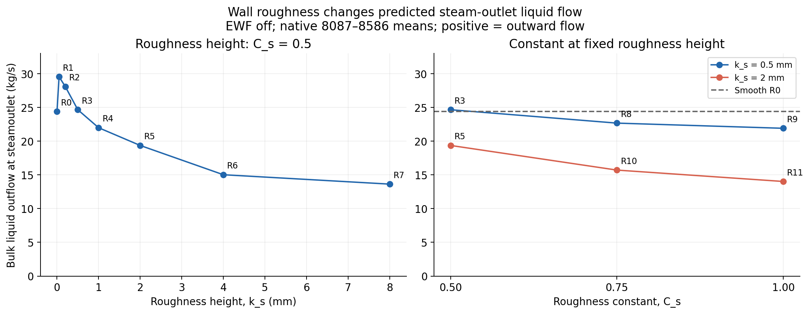
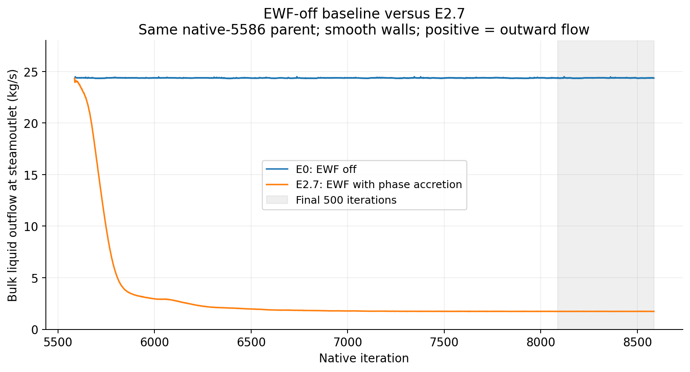

# Part 3 — Results

*Working draft. The early startup and absorber history lead the results. Figures are existing project outputs; no new simulation or scientific figure was produced for this revision.*

## 4. Results

### 4.1. Low-feed startup establishes the first useful development state

The early startup produced a low-continuity state with nearly stationary bulk-liquid inventory before full loading. With the v2 absorber active and both inlets at 25% feed, scaled continuity reached $3.2056\times10^{-4}$ at N1556. During the final 500 updates of the hold, bulk inventory changed from 31.451 to 31.357 kg. The end-of-hold steam-outlet liquid flow was 0.0684 kg/s outward. These results identify a useful developed field from which to increase the inlet load.

*Figure 1. Early history leading to the developed parent. A: end of the 25% feed hold and start of the verified 2000-update ramp at N1580. B: full feed and change to Coupled with Global Time Step at N3580. C: wall-film activation from the developed R0 state at N5586. The axis is native steady iteration, not physical carrier-flow time. The inlet panel omits the inherited N1 report-cache value; the raw record retains it. Source: [selected N45606 history](../../experiments/phase-07-2a-wall-liquid-routing/stage-02-combined-ewf-roughness/case-history-N45606.md).*

The hold was unintended: the first driver calculated changing inlet targets but did not apply them to Fluent. The actual low-feed fields were retained, and the corrected ramp then wrote and checked the inlet boundaries before every solve block. This distinction matters because the low-continuity state belongs to the actual reduced-feed calculation, not to the ramp that the first driver had intended to execute.

*Table 4. Early numerical development on the selected lineage. Residual extrema and endpoint inventories are labelled separately; the rows are different loading stages, not isolated comparisons.*

| Stage | Scaled continuity observation | Bulk-liquid endpoint (kg) | Endpoint outward liquid flow (kg/s) |
| --- | --- | ---: | ---: |
| 25% feed hold to N1580 | Minimum $3.2056\times10^{-4}$ at N1556 | 31.3571 | 0.0684 |
| Ramp to full feed at N3580 | Ramp maximum $1.1166\times10^{-2}$ | 182.5178 | 8.9952 |
| Developed control to N5586 | Minimum $2.0735\times10^{-3}$ at N4770; endpoint $2.7841\times10^{-3}$ | 295.8536 | 24.3344 |

The absorber and startup sequence addressed the main practical barrier in model development: obtaining a sustained carrier calculation with controlled liquid development. The liquid-weighted mass sink and its momentum and turbulence terms supplied a verified numerical removal treatment. Reduced inlet loading gave the carrier a less abrupt development path. The history supports this combined explanation, while the separate effects of feed reduction, absorber implementation and later solver controls remain unisolated. The recorded continuity and inventory values are checked against the [recovered carrier residuals](../../../PyAnsys/output/phase72a-lineage-N45606/20261005/carrier-residuals.csv) and [selected native histories](../../../PyAnsys/output/phase72a-lineage-N45606/20261005/selected-lineage-histories.csv).

### 4.2. The full-feed continuation supplies the parent for further experiments

The corrected ramp reached the recorded full feed, followed by Coupled flow with Global Time Step. Continuity rose during loading, then fell to about $2\times10^{-3}$ in the developed control. Bulk inventory approached 296 kg, and the preserved N5586 state became the common parent for the wall experiments. This was the project's main turning point: the startup and absorber development supplied a usable field from which additional model behaviour could be compared.

The Phase 7.1A handoff selected this state on its combined continuity, inventory and source-inclusive balance behaviour. Native source application also remained reliable: at N5586, the liquid command and applied removal magnitude were both 116.92 kg/s, with command error of about $4.3\times10^{-14}$ kg/s. The continuation completed without a fatal solver event. These observations support the use of the endpoint for further development. ([Phase 7.1A selection basis](../../experiments/phase-07-1a-absorber-convergence/CONTEXT.md); [R0 continuation](../../experiments/phase-07-1a-absorber-convergence/roughness-family/r0-smooth-control/results.md); [baseline handoff](../../experiments/phase-07-2a-wall-liquid-routing/baseline-control-handoff.md))

A material balance error remained at full feed. The absorber removed the commanded liquid inlet rate while another 24.3344 kg/s of bulk liquid left through the steam outlet. Counting the source once gives the endpoint remainders in Table 5.

*Table 5. Source-inclusive R0 balance at N5586, calculated from the aligned native report-history values. Flux is positive into the domain; applied removal is negative. Each source is counted once.*

| Budget | Signed boundary-plus-source remainder (kg/s) | Remainder / relevant feed (%) |
| --- | ---: | ---: |
| Bulk liquid | −24.3344 | −20.8129 |
| Vapour | +0.4391 | +0.5441 |
| Native mixture | −23.8923 | −12.0906 |

The native mixture and phase-summed outlet reports differ by about 0.0031 kg/s; that discrepancy is retained rather than forced to close. The balance calculation assumes pure-phase inlets, a closed lower wall and no other mass transfer in the EWF-off parent. The low-feed residual and inventory histories alone do not establish an early source-inclusive balance. The complete quantitative full-feed check uses the [native run4 histories](../../../PyAnsys/output/phase71a_r0_control_run4/report-histories-batched.json), with the model boundary and accounting interpretation described in the [R0 audit](../../experiments/phase-07b-full-geometry-liquid-removal/convergence-investigation/shuhei-audit.md).

Persistent outlet reverse flow, turbulence limiting and oscillatory residuals also remained. The development advance was therefore a common, sustained parent with improved numerical behaviour. It did not complete mass closure or physical validation. This remaining limit motivated the next experiments on liquid routing.

### 4.3. The developed parent enables a roughness sensitivity study

The common N5586 state allowed roughness to be changed while retaining the same starting fields, absorber and EWF-off model. The height screen gave a non-monotonic outlet response. At $C_s=0.5$, small increases in roughness raised bulk-liquid outlet flow above the smooth-wall value; larger tested heights lowered it. Mean outward flow changed from 24.3715 kg/s for R0 to 13.6253 kg/s for R7 at 8 mm, a 44.09% reduction over N8087–N8586.

*Figure 2. Roughness height and constant versus outward bulk-liquid steam-outlet flow. All cases start from the same developed N5586 parent with EWF off. Means use N8087–N8586. Lines connect tested settings and are not fitted response models. Source: [roughness comparison](../../observations/07-wall-liquid-interaction.md).*

The lower outlet flow coincided with large inventory losses in the rougher cases. R7 lost about 187 kg from the common initial bulk inventory of 295.85 kg. Increasing $C_s$ also lowered the recorded outlet magnitude at the tested fixed heights, with inventory losses and oscillatory cases retained in the source record. These results show that wall treatment affects the represented liquid state. Inventory depletion and open source-inclusive balances prevent interpreting the lower outlet alone as improved separation. ([R-family results](../../experiments/phase-07-2a-wall-liquid-routing/roughness-family/results.md))

### 4.4. Film accretion produces a large change in liquid routing

The smooth-wall E0/E2.7 screen extended the model from the same developed parent. With the accretion-enabled film package, mean bulk-liquid outlet flow fell from 24.369 to 1.735 kg/s, a 92.88% reduction over N8087–N8586. Bulk-liquid inventory also fell from about 296 kg to about 63 kg while film formed.

*Figure 3. E0 and E2.7 outward bulk-liquid steam-outlet flow, native N5586–N8586. All saved points are shown without smoothing; shading marks N8087–N8586. Both cases retain smooth walls and the common collector-equipped parent. Source: [E0/E2.7 comparison](../../observations/07-wall-liquid-interaction.md).*

This response shows why wall-film transport became a major direction after the carrier startup had improved. The added representation changed both the inventory and the bulk-liquid outlet. The tested package included phase accretion and coupled film equations, with film-to-flow momentum feedback off. Its incomplete bulk/film/source/drain account and developing inventories limit the inference about physical removal. The result supports further study of wall-film behaviour from the established parent.

### 4.5. The combined lineage extends the model built from that parent

The selected history to N45606 connects the early startup to the later added complexity. E2.7 was first continued from its original fields. The restart at N13586 then added 0.5 mm roughness, the corrected contact absorber and a smaller film step. Subsequent replay and adaptive continuation preserved that field lineage (Figure 4).

*Figure 4. Selected N1–N45606 liquid history. A: corrected inlet ramp; B: full feed and Coupled continuation; C: film accretion; D: unchanged-model transfer and continuation; E: roughness, corrected contact absorber and smaller film step; F: unchanged-control local replay; G: adaptive film stepping. The outlet trace uses Fluent's negative outward sign. The horizontal axis is native iteration, not one constant physical timestep. Source: [complete case history](../../experiments/phase-07-2a-wall-liquid-routing/stage-02-combined-ewf-roughness/case-history-N45606.md).*

*Table 6. Selected endpoints on the combined field lineage. Outlet values are individual endpoints, not wall-screen means.*

| Model state | Bulk liquid (kg) | Film (kg) | Bulk + film (kg) | Outward bulk-liquid outlet (kg/s) |
| --- | ---: | ---: | ---: | ---: |
| Developed R0, N5586 | 295.8536 | 0 | 295.8536 | 24.3344 |
| Accretion-enabled E2.7, N8586 | 63.0234 | 3.1112 | 66.1346 | 1.7365 |
| Corrected contact restart, N17586 | 62.9581 | 5.9150 | 68.8732 | 3.6794 |
| Selected adaptive endpoint, N45606 | 62.8970 | 6.3600 | 69.2570 | 3.6724 |

At N45606, the native film clock reached 0.120769 s. The complete corrected-restart record showed film mass rising from 5.8425 to 6.3600 kg. Over that interval, integrated accretion was 3.3498 kg and drainage was 2.8324 kg, with a film-only ledger error of 0.00637%. In the final 1000 adaptive updates, drainage remained about 9.98% below accretion. The model therefore represented both drainage and continued film storage.

Film-solver quality remained uneven. Only 24.46% of the original 10 µs film updates met all recorded final inner-residual tolerances. The corrected 1 µs restart improved that fraction to 95.17%, but later replay still contained substantial failure bursts. The final 233 adaptive updates lacked film-subiteration records. These limits qualify the smooth mass histories and prevent a developed steady-film claim. Because several controls changed at the contact restart, the endpoint differences cannot isolate the effect of roughness or absorber replacement. ([Film ledger, residual checks and lineage limits](../../experiments/phase-07-2a-wall-liquid-routing/stage-02-combined-ewf-roughness/case-history-N45606.md))

### 4.6. A revised startup carries the added treatments through a gentler ramp

The later startup study returned to the same saved low-feed bulk fields. It enabled Coupled flow, dry EWF, roughness and the corrected contact treatment before loading. This tested whether the development approach could be adapted to the more complex model. The comparison used matched ramp progress and independently checked inlet commands.

*Figure 5. Historical and revised startup during the 2000-update ramp and following 1000-update full-feed hold. The shaded region is the hold. Continuity uses a common normalisation; other residual normalisations differ. The earlier activation hold is outside this ramp comparison. Source: [revised-startup results](../../experiments/phase-07-2a-wall-liquid-routing/stage-03-shortened-reconstruction/early-ewf-startup/results.md).*

*Table 7. Peak values during the matched inlet ramp. Reductions are relative to the historical ramp.*

| Measure | Historical startup | Revised startup | Reduction (%) |
| --- | ---: | ---: | ---: |
| Scaled continuity | 0.011166 | 0.0033336 | 70.15 |
| Bulk plus film inventory (kg) | 182.518 | 53.9715 | 70.43 |
| Outward bulk-liquid steam-outlet flow (kg/s) | 8.99517 | 2.17887 | 75.78 |

The revised recipe lowered the ramp excursions, but its complete history included a separate low-feed activation spike with peak continuity 0.10593. The result concerns the ramp, not elimination of all startup disturbance. Since the settings changed together, the reduction cannot be assigned to early film activation alone.

At N5080, bulk liquid was 61.0549 kg and film mass was 0.1645 kg. Bulk inventory still rose by 2.2644 kg during the final 500 updates. All 2000 ramp updates met the recorded inner-film tolerance, but 15 later updates failed during the full-feed hold. The recipe supplied a preserved startup endpoint with lower ramp peaks; whole-run convergence and developed-film reproduction remained open. ([Complete startup evidence](../../experiments/phase-07-2a-wall-liquid-routing/stage-03-shortened-reconstruction/early-ewf-startup/results.md))

### 4.7. Subsequent film development shows transport with continued storage

The selected frozen-bulk continuation advanced film time from 3.5 ms at N5080 to 265.18 ms at N25815. Film mass grew from 0.1645 to 6.6883 kg. Bulk mass remained fixed at 61.0549 kg because its equations were frozen, so combined bulk-plus-film inventory rose from 61.2194 to 67.7432 kg.

*Figure 6. Selected field history through N25815. A: combined model activation; B: ramp start; C: full feed; D: frozen bulk; E–G: selected step checks and recovery restarts. Native iteration is not physical carrier-flow time. The outlet panel retains Fluent's negative outward sign. Its flat trace after D follows from prescribed bulk fields. Rejected continuations are excluded. Source: [film-development result](../../experiments/phase-07-2a-wall-liquid-routing/stage-03-shortened-reconstruction/early-ewf-startup/film-development/results.md).*

The latest complete window in the N25815 record reported accretion of 81.121 kg/s, drainage of 68.177 kg/s and storage of 12.954 kg/s. Drainage was 15.96% below accretion, so the film was still filling. Saved wall views showed its spatial development: the film spread and thickened over the lower and middle wall, with a thinner upper region (Figure 7).

*Figure 7. Saved wall-film thickness at approximately 5.90, 75.66 and 265.18 ms, with the same camera and 0–0.30 mm colour scale. Source: [selected spatial film comparison](../../experiments/phase-07-2a-wall-liquid-routing/stage-03-shortened-reconstruction/early-ewf-startup/film-development/results.md).*

A local matched-time check from identical N13390 fields accepted 20 µs against a 2.5 µs reference over a further 2.5 ms of film time. The reported film-mass distribution difference was 0.00285%, with a 0.0474% film-ledger error. This supports that step for the checked state and interval. The alternative implicit solver did not expose inner residuals, leaving inner-solve adequacy as a separate limit. ([Matched-step assessment](../../experiments/phase-07-2a-wall-liquid-routing/stage-03-shortened-reconstruction/early-ewf-startup/film-development/results.md))

The later reference-speed arm reached 500 ms under frozen bulk fields, recording 9.5444 kg of film. In its final 10 ms, accretion was 81.1214 kg/s, drainage 69.5998 kg/s and storage 11.5280 kg/s. The drainage deficit remained 14.20%. This extended the observed film development without establishing stationary film. The lower-speed arm was incomplete and the higher-speed arm pending in the selected record; no completed three-speed comparison is reported. ([500 ms campaign result](../../experiments/phase-07-2a-wall-liquid-routing/stage-03-shortened-reconstruction/early-ewf-startup/inlet-speed-500ms/results.md))

### 4.8. Further coupling remains a numerical development task

The selected Stage 4 probe added film forces, film–DPM interactions, splash, edge separation, stripping and wall momentum feedback together from a preserved parent. The initial probe and its conservative recovery stopped with floating-point exceptions. They supplied no usable physical-mechanism comparison. The failure belongs to the combined tested configuration, and cannot identify one mechanism as the cause. The selected feedback-OFF retry requires its own completed, verified window before inclusion. ([Stage 4 failure record](../../experiments/phase-07-2a-wall-liquid-routing/stage-04-ewf-wall-parameters/realism-continuation/results.md))

### 4.9. Separate reconstruction results remain provisional

The F0–F4 series attempted to reconstruct numerical, inlet, droplet and film changes on a common coarse mesh, with the absorber disabled. Its numerical and accounting limits make it unsuitable as the main evidence for this draft. The detailed comparisons are deferred pending stronger evidence, including a proposed repeat on a substantially finer mesh. That repeat must test sensitivity while also addressing balance and tracking limits; mesh refinement alone is not assumed to resolve them. The [owning reconstruction records](../../experiments/phase-08-storyline-reconstruction/stage-01-60k-storyline/results.md) preserve the work for later reassessment.
