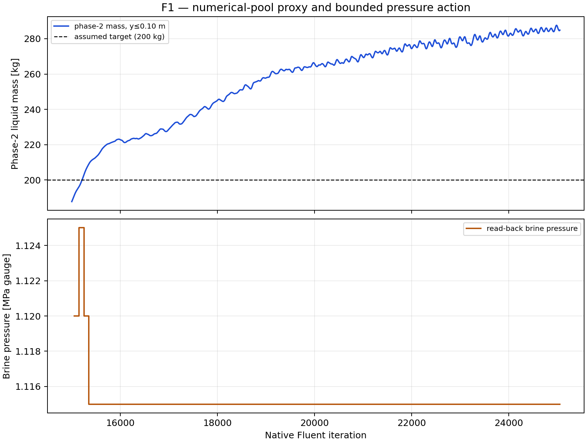
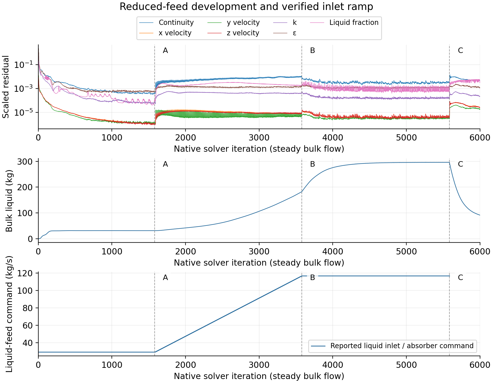
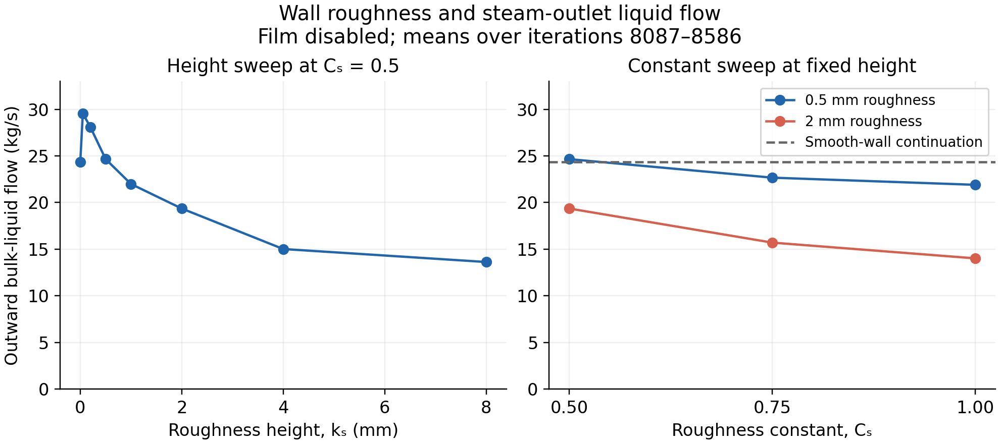
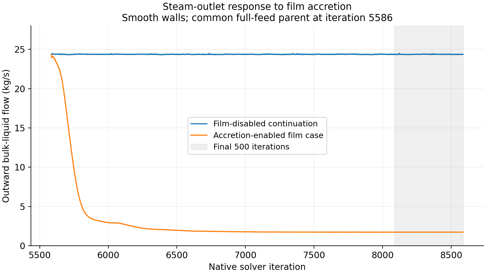
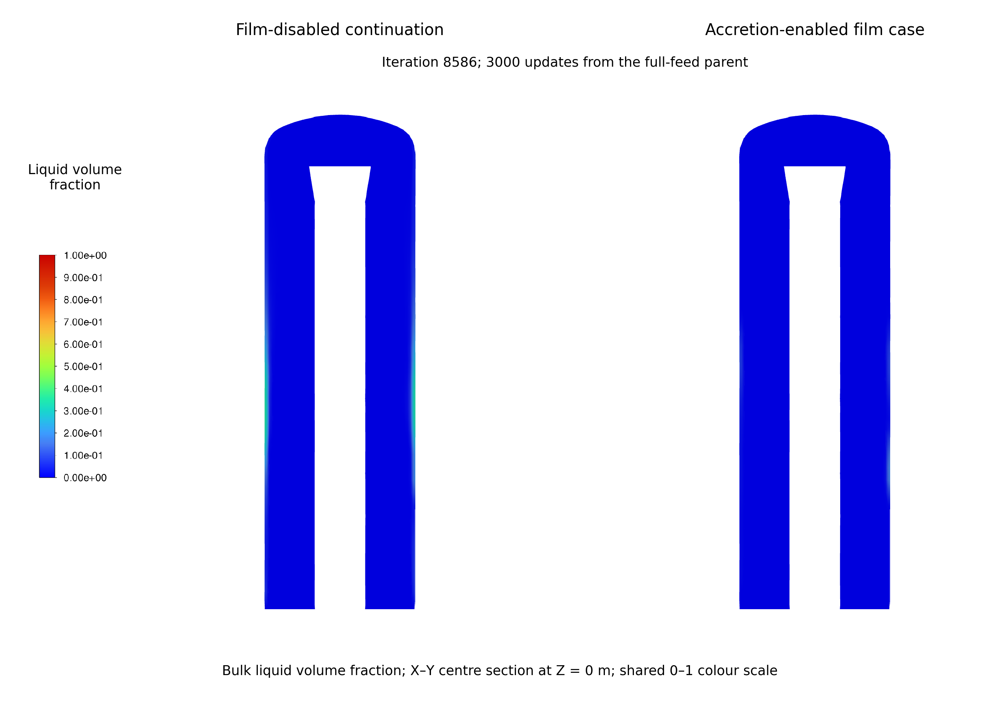
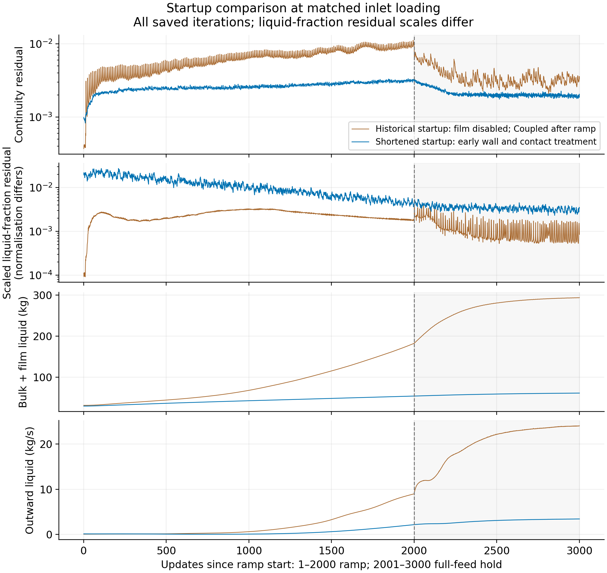
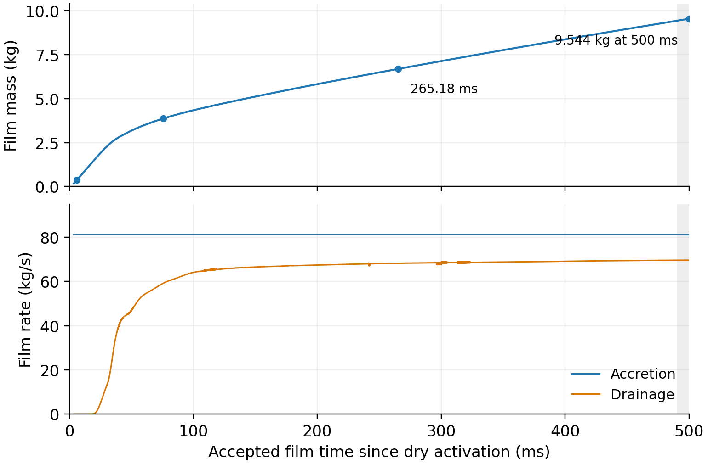
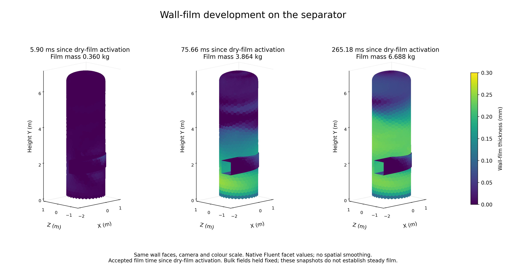

# Part 3 — Results

<!-- Revision scope, 9 October 2026: the experiment-family overview adds the author's earlier development and scope decisions. The selected wall results remain through the shortened-startup and frozen-bulk film-development investigations; the later wall-parameter investigation is deferred at the author's request. Section 4.9 retains the existing provisional reconstruction evidence. Internal evidence links are revision notes; final pagination and the numbering of the provisional Methods figures remain to be checked. -->

## 4. Results

The investigation developed through successive questions about inlet representation, liquid transport, collection and numerical solution. Table 7 groups the author's calculations by the question they addressed and the decision they supported. It includes useful development results, numerical failures and unresolved comparisons. Appendix A.11 records the case groups, executed intervals and evidence; planned but unrun cases and repeated checkpoints are excluded from completed-case counts.

*Table 7. Experiment families and their contribution to model development. Counts refer to the named comparisons, not the whole project. The early full-geometry work precedes the simplified collector studies; the separate co-worker investigations are outside this account.*

| Investigation family | Range investigated | Finding and consequence |
| --- | --- | --- |
| Inlet and carrier basis | Mixed and split phase placement, inlet area, loading and initial liquid distribution | A repeatable split-inlet basis emerged; the overall liquid balance remained open. |
| Droplet transport | Size and loading, deterministic/stochastic tracking, eddy lifetime and two-way feedback | Reported fates depended on assumptions; incomplete tracks limited performance interpretation. |
| Early film mechanisms | Five main deposition, splash, edge-separation, stripping and combined configurations | Finite films and mechanism signals were observed; missing transfers and open carrier balances prevented a performance ranking. |
| Full-geometry drainage and control | Four outlet formulations, transient pressure/startup tests and lower-liquid feedback | Drainage and control remained unqualified; the immediate scope returned to simplified liquid removal. |
| Simplified liquid removal | Pressure, resistance, prescribed/adaptive withdrawal and phase-selective sources | Conventional treatments retained routing or inventory problems; the lower-region liquid source was retained for redesign. |
| Absorber and startup | Source laws, reduced feed, checked loading and numerical continuation | A common developed parent became available, with material balance limits. |
| Wall roughness | Twelve cases: 0–8 mm height and selected roughness-constant changes | Outlet response was non-monotonic; inventory loss limited the interpretation of lower carryover. |
| Film solution and development | Accretion, momentum feedback, film controls, contact collection and startup; film advanced to 500 ms | Revised settings enabled film development and separate drainage accounting; film stationarity and the coupled separator state remained unqualified. |
| Separate reconstruction | Mixed/split inlets, numerical packages and mesh preparation | Saved states differed; accounting, comparison and resolution limits kept these results provisional. |

The earlier drainage studies explain the change in modelling scope. Sixteen steady outlet-condition cases were attempted across four formulations; six reached 500 iterations and ten ended with floating-point exceptions. The completed cases still had large liquid-balance errors (Appendix Figure A4). A subsequent 10,000-update pressure-feedback trial did not establish a controlled lower-liquid mass near the assumed target (Figure 5). These findings supported the return to a truncated geometry with a separate numerical collector. The earlier lower-cell-zone sink reduced accumulation relative to its reference but did not establish a stationary inventory (Appendix Figure A5), leading to further source-law and startup development.

*Figure 5. Lower-region liquid mass and bounded brine-pressure action during the 10,000-update pressure-control trial and its 50-update smoke check. Liquid mass in the region y ≤ 0.10 m rose from 187.79 to 284.83 kg, while pressure remained at its lower bound of 1.115 MPa gauge for 98 of 100 control endpoints. The dashed 200 kg target is a numerical assumption, not a measured plant level. The horizontal axis is native iteration. Residual histories were unavailable; this result limits the tested feedback model and does not establish that physical level control is impossible.*

<!-- Evidence: [early inlet development](../../experiments/phase-01-purnanto-baseline-and-inlet-exploration/interpretation.md), [DPM comparisons](../../experiments/phase-03-dpm-carryover-and-coupling/interpretation.md), [five early EWF configurations](../../observations/04-010v2-ewf-mechanism-comparison.md), [original outlet screen](../../experiments/phase-05-full-geometry-v2/full-geometry-02e-mixture-outlet-characterization/stage-01/results.md), [targeted outlet screen](../../experiments/phase-05-full-geometry-v2/full-geometry-02e-mixture-outlet-characterization/stage-02/results.md), [long pool-control result and figure](../../experiments/phase-06-full-geometry-with-brine-pool/stage-06-long-horizon-surrogate-hypothesis/results.md), [scope decision](../../experiments/phase-06-full-geometry-with-brine-pool/conclusion.md) and [simplified collection interpretation](../../experiments/phase-07a-simplified-purnanto-liquid-removal/interpretation.md). Appendix A.11 supplies the remaining family records and separates executed cases from incomplete or unrun plans. -->

Sections 4.1–4.8 present the selected startup and wall-treatment path on the 60,964-cell mesh, with full-feed commands of 116.92 kg/s liquid and 80.69 kg/s vapour. The initial roughness and film comparisons share the full-feed parent at iteration 5586. Steam-outlet liquid flow is a positive outward magnitude unless a signed balance is stated. Native iteration is distinct from accepted film time; neither implies physical elapsed time for the steady bulk flow.

### 4.1. Reduced-feed development and inlet ramp

At 25% feed with the throughput-controlled absorber active, the bulk-liquid inventory approached a nearly constant value before inlet loading increased (Figure 6). Scaled continuity reached a minimum of $3.2056\times10^{-4}$ at iteration 1556. Over the final 500 updates of the hold, iterations 1080–1580, inventory decreased from 31.4518 to 31.3571 kg, a change of 0.30%. Outward bulk-liquid flow through the steam outlet was 0.0684 kg/s at iteration 1580.

The reduced-feed hold continued because the intended inlet changes had not been applied to Fluent. The corrected procedure then wrote and checked both inlet commands during the 2000-update ramp. Full feed was reached at iteration 3580. Continuity and liquid inventory increased during loading: the ramp's maximum continuity was $1.1166\times10^{-2}$, and its endpoint bulk inventory was 182.5178 kg (Table 8).

*Figure 6. Early numerical development with the throughput-controlled absorber. The panels show scaled carrier residuals, bulk-liquid inventory and reported liquid-inlet loading. A marks the end of the 25% feed hold and start of the corrected ramp at iteration 1580. B marks full feed and the change to Coupled with Global Time Step at iteration 3580. C marks later EWF activation from the full-feed parent at iteration 5586. The horizontal axis is native iteration. The inherited iteration 1 inlet-report cache value is omitted from the inlet panel.*

*Table 8. Successive stages of carrier development. Residual minima, the ramp maximum and endpoint values are identified separately. These stages differ in inlet loading and numerical controls.*

| Development step | Scaled continuity observation | Endpoint bulk liquid (kg) | Endpoint outward steam-outlet liquid (kg/s) |
| --- | --- | ---: | ---: |
| 25% feed hold to iteration 1580 | Minimum $3.2056\times10^{-4}$ at iteration 1556 | 31.3571 | 0.0684 |
| Ramp to full feed at iteration 3580 | Ramp maximum $1.1166\times10^{-2}$ | 182.5178 | 8.9952 |
| Full-feed control to iteration 5586 | Minimum $2.0735\times10^{-3}$ at iteration 4770; endpoint $2.7841\times10^{-3}$ | 295.8536 | 24.3344 |

The low-feed calculation therefore supplied the saved fields used for the verified ramp. Its small late inventory change and low continuity residual did not establish a source-inclusive mass balance; aligned inlet, outlet and applied-source evidence was checked separately for the full-feed parent.

<!-- Evidence: [selected case history](../../experiments/phase-07-2a-wall-liquid-routing/stage-02-combined-ewf-roughness/case-history-N45606.md), [carrier residuals](../../../PyAnsys/output/phase72a-lineage-N45606/20261005/carrier-residuals.csv) and [liquid histories](../../../PyAnsys/output/phase72a-lineage-N45606/20261005/selected-lineage-histories.csv). -->

### 4.2. Full-feed control and mass balance

After the change to Coupled with Global Time Step, continuity fell from its ramp peak and bulk inventory approached 296 kg. The preserved smooth-wall, film-disabled full-feed control at iteration 5586 supplied the initial fields for the roughness and wall-film comparisons. The continuation completed without a fatal solver event, although residual oscillations, outlet reverse flow and turbulence-limiting messages remained.

At iteration 5586, the commanded liquid removal and native applied removal magnitude were both 116.92 kg/s. Their reported difference was approximately $4.3\times10^{-14}$ kg/s. This confirmed source application at the endpoint. The liquid budget nevertheless remained open: the absorber removed the liquid inlet rate while a further 24.3344 kg/s left through the steam outlet.

*Table 9. Source-inclusive mass-balance remainders at iteration 5586. Boundary fluxes are positive into the domain and the applied absorber source is negative. Each source is counted once. Percentages use the liquid, vapour and total feeds of 116.92, 80.69 and 197.61 kg/s, respectively.*

| Budget | Signed boundary-plus-source remainder (kg/s) | Remainder / relevant feed (%) |
| --- | ---: | ---: |
| Bulk liquid | −24.3344 | −20.8129 |
| Vapour | +0.4391 | +0.5441 |
| Native mixture | −23.8923 | −12.0906 |

The native mixture outlet and summed phase outlets differed by 0.0031 kg/s. This difference was retained in the separate accounts. The calculation used pure-phase inlets, a closed lower wall and the EWF-off parent, with no other mass transfer included. Correct absorber application thus coexisted with a material liquid-balance error. The full-feed parent provided a common development state for subsequent comparisons, with that error retained as a limit on its use.

<!-- Evidence: [full-feed control continuation](../../experiments/phase-07-1a-absorber-convergence/roughness-family/r0-smooth-control/results.md), [baseline handoff](../../experiments/phase-07-2a-wall-liquid-routing/baseline-control-handoff.md), [aligned native full-feed control histories](../../../PyAnsys/output/phase71a_r0_control_run4/report-histories-batched.json) and [full-feed control accounting audit](../../experiments/phase-07b-full-geometry-liquid-removal/convergence-investigation/shuhei-audit.md). -->

### 4.3. Roughness response from the common parent

Twelve roughness cases each completed 3000 updates from the same full-feed parent. They covered heights of 0–8 mm at $C_s=0.5$, with $C_s=0.75$ and 1.0 also tested at 0.5 and 2 mm. The steam-outlet liquid response was non-monotonic (Figure 7). At $C_s=0.5$, increasing $k_s$ from zero to 0.05 mm raised mean outward liquid flow from 24.3715 to 29.5412 kg/s, an increase of 21.21%. Larger tested heights lowered the flow. The 8 mm rough-wall case gave 13.6253 kg/s, 44.09% below the smooth-wall continuation. These means use the same final-500 window, iterations 8087–8586.

*Figure 7. Outward bulk-liquid steam-outlet flow in the EWF-off roughness screen. Left: height sweep at $C_s=0.5$. Right: constant changes at $k_s=0.5$ and 2 mm. All cases start from the same full-feed fields at iteration 5586; plotted values are means over iterations 8087–8586. The dashed line is the smooth-wall continuation. Lines connect tested settings and do not represent fitted response models.*

Outlet standard deviations over that window were 0.0219 kg/s for the smooth-wall continuation and 0.0331 kg/s for the 8 mm rough-wall case. These describe variation between saved iterations, rather than uncertainty in physical performance. The 8 mm rough-wall case's endpoint bulk inventory was 108.744 kg, a loss of 187.109 kg from the common starting value of 295.854 kg. Thus, its lower outlet flow occurred in a substantially depleted liquid state.

Increasing $C_s$ lowered mean outlet flow at both tested fixed heights. However, the 1 mm rough-wall case at $C_s=0.5$ and the 0.5 mm rough-wall case at $C_s=1.0$ had oscillatory outlet histories, and source-inclusive balances remained open across the screen. The results establish sensitivity to the prescribed wall treatment; they do not establish that the lower outlet rates correspond to improved separation or drainage.

<!-- Evidence: [roughness-screen results and sample standard deviations](../../experiments/phase-07-2a-wall-liquid-routing/roughness-family/results.md#matched-tail-comparison) and [comparison figure and provenance](../../observations/07-wall-liquid-interaction.md). The source's later statement identifying the lowest outlet conflicts with its table; the table values are used here. -->

### 4.4. Accretion-enabled wall-film response

Early accreting-film trials encountered rapid film growth and numerical failure. Changes to the thickness limit, film subiterations and timestep did not prevent failure in the tested configurations. A subsequent common-parent configuration retained phase accretion and coupled film equations, disabled film-to-flow momentum feedback, and completed 3000 updates. This supplied the accretion-enabled case used below. The unsuccessful numerical variants remain in Appendix A.11; they do not demonstrate that the physical feedback mechanism is absent.

The accretion-enabled EWF package reduced mean bulk-liquid steam-outlet flow from 24.369 kg/s in the film-disabled continuation to 1.735 kg/s in the accretion-enabled film case, a reduction of 92.88% over iterations 8087–8586 (Figure 8). Both cases began from the developed full-feed fields saved at iteration 5586 and retained smooth walls and the throughput-controlled absorber. The accretion-enabled case included phase accretion and coupled film equations, with film-to-flow momentum feedback disabled.

*Figure 8. Outward bulk-liquid steam-outlet flow for the film-disabled continuation and accretion-enabled film case over iterations 5586–8586. All 3001 saved points are shown without smoothing; shading identifies the final 500 updates. The film-disabled continuation has EWF off. The accretion-enabled case uses phase accretion, coupled film equations and a fixed 10 µs film step, with bulk-flow momentum feedback off.*

Bulk-liquid inventory fell from 295.8536 kg at the parent to 63.0234 kg at the accretion-enabled endpoint. Film held 3.1112 kg, giving a combined retained inventory of 66.1346 kg (Table 10). The fall in bulk inventory therefore greatly exceeded the mass stored in the film. The lower outlet flow accompanied changes in both liquid representations, while the combined bulk, film, absorber and drainage account remained incomplete. The comparison reports the response to the enabled film package; it does not isolate one film setting or yield a qualified separation efficiency.

The matched bulk-liquid sections provide a spatial check on this response (Figure 9). Both sections were mostly at low liquid volume fraction. A narrow wall-adjacent region of higher fraction was less visible in the accretion-enabled case on the common scale. These cuts show a change in the resolved bulk-liquid field; they cannot account for the whole-volume inventory or identify film thickness.

*Figure 9. Bulk-liquid volume fraction at iteration 8586 for the film-disabled continuation and accretion-enabled film case, each after 3000 updates from the same fields at iteration 5586. The native X–Y centre sections use Z = 0 m, the same orthographic camera and a fixed 0–1 scale. The film-disabled continuation has EWF off; the accretion-enabled case has phase accretion and coupled film equations on, with bulk-flow momentum feedback off. The panels show bulk liquid, not wall-film thickness or drainage. Their different inventories and open mass accounts remain limits on interpretation.*

<!-- Evidence: [film-disabled and accretion-enabled comparison](../../observations/07-wall-liquid-interaction.md), [wall-film-screen results and native sections](../../experiments/phase-07-2a-wall-liquid-routing/ewf-family/results.md#native-phase-2-volume-fraction-contours--2026-09-23), [paired contour provenance](../figures/bulk-comparison-described-film-treatment.provenance.json) and [selected endpoint histories](../../../PyAnsys/output/phase72a-lineage-N45606/20261005/selected-lineage-histories.csv). The film-disabled continuation's mean is from its separate comparison run and is not substituted for the roughness screen's smooth-wall mean. -->

### 4.5. Contact collection and combined model development

The final contact absorber was assessed through short removal-time screens and a separate combined continuation. After 100 updates from the same iteration 13586 parent, reducing the prescribed depletion time from 10 to 1 µs lowered collector inventory from 0.496 to 0.159 g. Evaluated endpoint removal increased from 49.59 to 158.81 kg/s, with greater source variability at 1 µs. These were developing endpoint values. The full three-value comparison and subsequent bounded 10 µs screen are retained in Appendix A.4.

The combined continuation returned to the original accretion-enabled film fields saved at iteration 13586 and introduced 0.5 mm roughness, the contact absorber at a 10 µs depletion time, and a 1 µs film step. The selected history continued through replay and adaptive film stepping to iteration 45606. Appendix A.9 retains the full history and its restart branches. Because these controls changed together, differences from the original accretion-enabled film state cannot be assigned to roughness, absorber replacement or film stepping individually.

*Table 10. Selected endpoints on the combined field history. Outlet values are individual endpoints, rather than final-window means.*

| Model state | Bulk liquid (kg) | Film (kg) | Bulk + film (kg) | Outward bulk-liquid steam-outlet flow (kg/s) |
| --- | ---: | ---: | ---: | ---: |
| Full-feed parent, iteration 5586 | 295.8536 | 0 | 295.8536 | 24.3344 |
| Accretion-enabled film case, iteration 8586 | 63.0234 | 3.1112 | 66.1346 | 1.7365 |
| Corrected contact continuation, iteration 17586 | 62.9581 | 5.9150 | 68.8732 | 3.6794 |
| Selected adaptive endpoint, iteration 45606 | 62.8970 | 6.3600 | 69.2570 | 3.6724 |

Bulk inventory remained close to 63 kg between iterations 17586 and 45606, while film mass increased. At iteration 45606, the native film clock was 120.769 ms. Over the corrected-restart interval iterations 13586–45606, integrated accretion was 3.3498 kg, drainage was 2.8324 kg, and film inventory increased by 0.5176 kg. The film-only ledger error was 0.00637% of integrated accretion.

During the final 1000 adaptive updates, mean accretion, drainage and storage were 82.1518, 73.9558 and 8.2017 kg/s, respectively. Drainage remained 9.98% below accretion. This record therefore contains drainage alongside continued film filling. Repeated inner-film residual failures and the missing final 233 subiteration records limit the interpretation of the smooth inventory histories; their extent is reported in Section 4.8.

<!-- Evidence: [contact-strength screens](../../experiments/phase-07-2a-wall-liquid-routing/stage-02-combined-ewf-roughness/results.md#all-liquid-contact-absorber-trial), [complete selected case history](../../experiments/phase-07-2a-wall-liquid-routing/stage-02-combined-ewf-roughness/case-history-N45606.md) and [corrected film ledger](../../../PyAnsys/output/phase72a-lineage-N45606/20261005/corrected-film-development-summary.json). The short strength-screen branch is distinct from the original-field continuation retained in Appendix A.9. -->

### 4.6. Shortened startup with early wall-film activation

The shortened startup reused the same saved reduced-feed bulk fields as the historical path. Coupled flow, dry EWF with accretion, 0.5 mm roughness and contact collection were introduced before loading. The 500-update activation hold was followed by a verified 2000-update ramp and a 1000-update full-feed hold.

At matched ramp progress, the shortened recipe had lower peaks in continuity, combined liquid inventory and bulk-liquid outlet flow (Figure 10; Table 11). Peak continuity fell by 70.15%, while the inventory and outlet peaks fell by 70.43% and 75.78%, respectively. Continuity had the same residual normalisation in the two calculations. The other residual normalisations differed, so their scaled magnitudes were not treated as direct measures of relative improvement.

*Figure 10. Historical and shortened startup over the 2000-update inlet ramp and following 1000-update full-feed hold. The horizontal axis aligns loading progress: historical iterations 1581–4580 and shortened iterations 2081–5080. Shading marks the full-feed hold. The earlier activation hold is outside this comparison. The historical case remains EWF off throughout this interval; the shortened-startup case has the combined wall and contact treatment active.*

*Table 11. Peak values during the matched inlet ramp. Reductions are relative to the historical ramp. The combined settings assess a startup recipe rather than an isolated activation-timing change.*

| Measure | Historical startup | Shortened startup | Reduction (%) |
| --- | ---: | ---: | ---: |
| Scaled continuity | 0.011166 | 0.0033336 | 70.15 |
| Bulk + film inventory (kg) | 182.518 | 53.9715 | 70.43 |
| Outward bulk-liquid steam-outlet flow (kg/s) | 8.99517 | 2.17887 | 75.78 |

The preceding low-feed activation hold contained a continuity peak of 0.10593, larger than the historical ramp peak. Lower ramp excursions therefore did not mean that all startup disturbance was avoided. At the shortened-startup endpoint iteration 5080, bulk liquid was 61.0549 kg and film was 0.1645 kg. Bulk inventory still increased by 2.2644 kg over the final 500 updates.

The contact source was applied as evaluated, but the final hold still had an incomplete liquid account (Table 12). Mean liquid inflow plus signed steam-outlet flow and the applied contact source gave +50.6048 kg/s before EWF transfer was included. Mean accretion was 80.7365 kg/s, nearly all of which remained in the film at this early stage. The quoted boundary/contact remainder excludes that transfer and is not a whole-separator imbalance. It cannot be compared directly with the film-disabled full-feed control remainder in Table 9. Bulk storage also had no physical rate because the carrier equations used steady pseudo-time.

*Table 12. Shortened-startup liquid-account terms over the final 500 full-feed updates, iterations 4581–5080. Bulk equations remained active. Boundary flux and the applied source retain their native signs; film input, edge outflow and storage are positive magnitudes. Film rates use the same 0.5 ms interval of accepted film time. These terms do not form a completed combined separator ledger.*

| Quantity | Reported rate (kg/s) |
| --- | ---: |
| Signed liquid-inlet flow | +116.9200 |
| Signed steam-outlet liquid flow | −3.3012 |
| Native applied contact source | −63.0140 |
| Boundary plus contact source, before EWF transfer | +50.6048 |
| Film input by accretion | 80.7365 |
| Total film edge outflow | 0.000227 |
| Film storage, $\Delta M_f/\Delta t_f$ | 80.7364 |

All 2000 ramp updates met the recorded inner-film tolerance. However, 15 updates at iterations 5025–5076 failed during the full-feed hold, representing 15% of its final 100 updates. Each reached the ten-subiteration limit. The largest final thickness and two momentum residuals were 1315.134, 9150.082 and 59.84849, respectively, against a tolerance of $10^{-5}$. These were large residual failures. The saved and reopened endpoint supplied finite fields for film development; bulk stationarity and complete-run convergence remained unqualified.

<!-- Evidence: [shortened-startup results](../../experiments/phase-07-2a-wall-liquid-routing/stage-03-shortened-reconstruction/early-ewf-startup/results.md), [audited metrics, native source checks and normalisation](../../../PyAnsys/output/phase72a-stage3-early-ewf-server1/20261005/analysis-summary.json) and [native final histories for Table 12](../../../PyAnsys/output/phase72a-stage3-early-ewf-server1/20261005/final-histories.json). -->

### 4.7. Film development under frozen bulk fields

After iteration 5080, the selected film continuation advanced the native film clock from 3.5 to 265.184 ms. Film mass increased from 0.1645 to 6.6883 kg. The reference-speed continuation then reached 500 ms with 9.5444 kg of film (Figure 11). Bulk inventory remained at 61.0549 kg and outward bulk-liquid outlet flow at 3.4300 kg/s because the bulk equations were frozen. The resulting increase in combined inventory came from additional film storage.

*Figure 11. Selected reference-speed film development under frozen bulk fields, from 3.5 to 500 ms since dry-film activation. The panels show native film inventory and accretion and drainage rates against accepted film time. All selected records are shown without smoothing. Markers identify the three snapshots in Figure 12 and the 500 ms endpoint; shading marks the final 10 ms reporting window. Accretion is prescribed input from the held bulk field. The selected restart path is used; rejected sibling histories are excluded. Detailed recovery chronology is retained in Appendix A.9.*

During frozen-bulk development, accretion supplied the film while the carrier liquid field was held fixed. There was no newly solved reciprocal bulk depletion. The film ledger therefore assessed this prescribed-flow surface calculation alone. Adding its growing mass to the fixed bulk inventory described stored fields, not conservation of a fully advancing separator model.

The saved wall-film fields showed increasing coverage and thickness over the lower and middle vessel wall, while the upper region remained thinner (Figure 12). Between the 75.66 and 265.18 ms snapshots, film mass rose from 3.864 to 6.688 kg and the wall area with film thickness of at least 0.10 mm increased from 40.34% to 61.98%. Maximum facet thickness increased from 0.253 to 0.291 mm. The growth therefore involved a wider region of appreciable film, as well as an increase in the local maximum.

*Figure 12. Wall-film thickness at accepted film times of 5.90, 75.66 and 265.18 ms since dry-film activation, saved at iterations 5190, 13390 and 25815, respectively. All panels use the same orthographic camera and linear 0–0.30 mm colour scale. The views are rendered from native Fluent wall geometry and facet fields without spatial interpolation. Bulk fields were held fixed; these snapshots show film development at different times.*

At the nominal reference speed of 26.81 m/s, accretion continued to exceed drainage at both selected reporting times (Table 13). In the final 10 ms of the 500 ms arm, film storage was 11.528 kg/s and the drainage deficit was 14.20%. Extending film time thus retained a positive filling rate. The selected history had not met the film-development stationarity screen of drainage deficit and absolute storage/accretion at or below 1% over three consecutive 1000-update windows.

*Table 13. Film inventory and late-window rates under frozen bulk fields. Inventory is the endpoint value. Rates at 265.184 ms use the latest complete 1000-update window; rates at 500 ms use the final 10 ms with interval-overlap weighting. Storage is calculated from film-inventory change over accepted film time; small ledger remainders are retained.*

| Film time (ms) | Film mass (kg) | Mean accretion (kg/s) | Mean drainage (kg/s) | Mean storage (kg/s) | Drainage deficit (%) |
| ---: | ---: | ---: | ---: | ---: | ---: |
| 265.184 | 6.6883 | 81.121 | 68.177 | 12.954 | 15.96 |
| 500.000 | 9.5444 | 81.121 | 69.600 | 11.528 | 14.20 |

Only the reference-speed arm had a verified 500 ms endpoint in the selected campaign record. The 20.11 m/s arm was incomplete at 135.451 ms and the 32.14 m/s arm was pending. A completed three-speed comparison is therefore not reported. Constant bulk quantities during these film runs are prescribed-field diagnostics, rather than evidence of a newly converged bulk solution.

<!-- Evidence: [selected film-development results, spatial metrics and reporting windows](../../experiments/phase-07-2a-wall-liquid-routing/stage-03-shortened-reconstruction/early-ewf-startup/film-development/results.md), [500 ms campaign results](../../experiments/phase-07-2a-wall-liquid-routing/stage-03-shortened-reconstruction/early-ewf-startup/inlet-speed-500ms/results.md), [selected reference-speed CSV](../../../PyAnsys/output/phase72a-stage3-speed-sensitivity-server1/20261006/selected-film-history-reference.csv) and [Figure 11 provenance](../figures/results-film-development-reference500ms-provenance.json). -->

### 4.8. Numerical assessment of the selected development path

Implementation checks confirmed the intended bulk source application. In the shortened startup, independently evaluated contact removal agreed with the negative native applied source at all 3500 solved updates. The source check excluded the inherited, unsolved parent cache row. These results establish application of the specified numerical removal law; the full-feed control balance error in Table 9 remains a separate conservation result.

Film accounting and inner-solve behaviour also gave different assessments. The corrected contact history had a film-only ledger error of 0.00637%, but its final inner residuals did not meet the recorded tolerance at every update (Table 14). The local replay contained repeated large residual bursts. Records were unavailable for the final 233 adaptive updates, so those updates were not counted as tolerance passes.

*Table 14. Inner-film residual checks over the available combined-history records. A pass requires the final film-thickness and both film-momentum residuals to be at or below $10^{-5}$. Percentages use only the available updates in each segment; they are not steady-state criteria.*

| Segment | Available film updates | Updates meeting all final tolerances | Reported pass fraction (%) |
| --- | ---: | ---: | ---: |
| Original accretion-enabled film case, fixed 10 µs | 8000 | 1957 | 24.46 |
| Corrected contact restart, fixed 1 µs | 4000 | 3807 | 95.17 |
| Selected local replay, fixed 1 µs | 16,000 | 14,717 | 91.98 |
| Adaptive continuation with subiteration records | 11,787 | 10,526 | 89.30 |

A local film-step comparison restarted from identical fields saved at iteration 13390 at 75.662 ms and advanced each arm by 2.5 ms of accepted film time. Bulk fields were held fixed and the alternative implicit film algorithm was used in all arms. The 20 µs candidate met the declared local screen against the 2.5 µs reference, whereas the 25 µs candidate exceeded the 0.1% ledger limit (Table 15). Both candidates closely matched the reference fields. Appendix A.9 defines the algorithms, normalisations, finite-field restrictions and recovery limits used in this screen.

*Table 15. Local film-step assessment from the same fields saved at iteration 13390 to 78.162 ms. Field differences are relative to the 2.5 µs reference. Ledger errors use integrated film input. Thresholds were declared for this local screen; they are not universal CFD acceptance limits.*

| Assessment quantity | Local limit | 20 µs candidate | 25 µs candidate |
| --- | ---: | ---: | ---: |
| Mass-distribution L1 difference (%) | ≤1 | 0.00285 | 0.00757 |
| Film-mass-weighted velocity difference (%) | ≤2 | 0.00207 | 0.00343 |
| Difference in maximum thickness (%) | ≤2 | 0.000115 | 0.000150 |
| Drainage difference / accretion (%) | ≤1 | 0.00283 | 0.00364 |
| Candidate film-ledger error (%) | ≤0.1 | 0.04743 | 0.13391 |
| Reference film-ledger error (%) | ≤0.1 | 0.00958 | 0.00958 |
| Peak film Courant number | ≤1 recovery bound | 0.96675 | 0.63710 |
| Local screen | All field, ledger and recovery checks met | Pass | Fail: ledger |

The mass L1 measure summed absolute per-face mass differences and divided by total reference film mass. The reference inventory grew from 3.8635 to 3.9176 kg, so most of that mass was present at restart. The small percentage therefore did not quantify relative error in the newly accumulated mass. The comparison demonstrated local agreement with a conservative reference over 2.5 ms; it did not establish timestep independence for later developed film or the 500 ms endpoint.

The alternative implicit film solver did not expose inner residuals in these later tests. Its updates therefore have no recorded tolerance-pass assessment. The selected evidence contains implementation checks, a local film-step comparison and continuing film storage, but no completed matched mesh-convergence assessment or comparison against field measurements. Qualified separation-efficiency and pressure-loss predictions are not reported.

<!-- Evidence: [combined-history residual checks](../../experiments/phase-07-2a-wall-liquid-routing/stage-02-combined-ewf-roughness/case-history-N45606.md#ewf-residuals), [shortened-startup source audit](../../experiments/phase-07-2a-wall-liquid-routing/stage-03-shortened-reconstruction/early-ewf-startup/results.md#film-evidence-and-numerical-limits), [matched-time film-step assessment](../../experiments/phase-07-2a-wall-liquid-routing/stage-03-shortened-reconstruction/early-ewf-startup/film-development/results.md), [local screen criteria](../../experiments/phase-07-2a-wall-liquid-routing/stage-03-shortened-reconstruction/early-ewf-startup/film-development/setup.md), [20 µs comparison JSON](../../../PyAnsys/output/phase72a-stage3-film-development-server1/20261005/mid-film-sensitivity-20us.json) and [25 µs comparison JSON](../../../PyAnsys/output/phase72a-stage3-film-development-server1/20261005/mid-film-sensitivity-25us.json). -->

### 4.9. Separate reconstruction results remain provisional

The absorber-off reconstruction calculations provide a separate comparison of inlet placement and numerical settings. Table 16 retains the existing observations for the three inlet/solver reconstruction cases at nominal 26.81 m/s. All three used 60,964 cells and the same total feed. The mixed-inlet SIMPLE and mixed-inlet Coupled reconstructions changed the numerical package. The mixed-inlet and split-inlet Coupled reconstructions changed phase placement while retaining that package. Their procedures are defined in Section 3.6 and Appendix A.2.

*Table 16. Provisional reference-speed reconstruction results with no absorber. Inventory is the endpoint at iteration 10,000; outlet/feed is the reported mean over iterations 9500–10,000. Ratios describe outward Eulerian liquid flow relative to supplied liquid, rather than qualified separation efficiency.*

| Case | Inlet and numerical package | Bulk-liquid inventory (kg) | Outward steam-outlet liquid / liquid feed (%) |
| --- | --- | ---: | ---: |
| Mixed-inlet SIMPLE reconstruction | Mixed; SIMPLE, pseudo-time off, second-order $k$ | 6576.7 | 360.424 |
| Mixed-inlet Coupled reconstruction | Mixed; Coupled/Global Time Step, first-order $k$ | 1262.6 | 99.671 |
| Split-inlet Coupled reconstruction | Split; Coupled/Global Time Step, first-order $k$ | 1734.5 | 99.404 |

The mixed-inlet SIMPLE reconstruction reported outlet liquid well above the supplied liquid rate, together with a mean absolute mixture boundary gap of 153.14% of total feed over the final window. The mixed-inlet and split-inlet Coupled reconstructions retained different inventories, while both outlet ratios were close to 100%. The numerical-package comparison does not isolate pressure–velocity coupling from pseudo-time and discretisation changes.

At iteration 10,000, the saved mixed-inlet SIMPLE reconstruction centre cut showed a broad liquid-rich wall region, whereas the historical tetrahedral-mesh reference cut was mostly at low liquid fraction with thinner wall enrichment. These views used a common 0–1 contour range, but the mesh, inlet representation and preparation differed. No aligned inventory and balance comparison for the historical reference is presented here. The contours therefore document different saved liquid states without establishing a mesh effect or greater physical accuracy. Detailed droplet-coupling and wall-film reconstruction comparisons remain outside the selected results.

<!-- Evidence: [mixed-inlet numerical-package results](../../experiments/phase-08-storyline-reconstruction/stage-01-60k-storyline/f0-simple/results.md), [split-inlet Coupled reconstruction results](../../experiments/phase-08-storyline-reconstruction/stage-01-60k-storyline/f2-split-inlet/results.md) and [saved native mesh and liquid views](../../meetings/Poster/poster-sections/mesh-and-volume-fraction-comparison.md). Reassess these provisional values when the revised SIMPLE and mesh comparisons are complete; no new reconstruction or mesh qualification is claimed in this revision. -->
