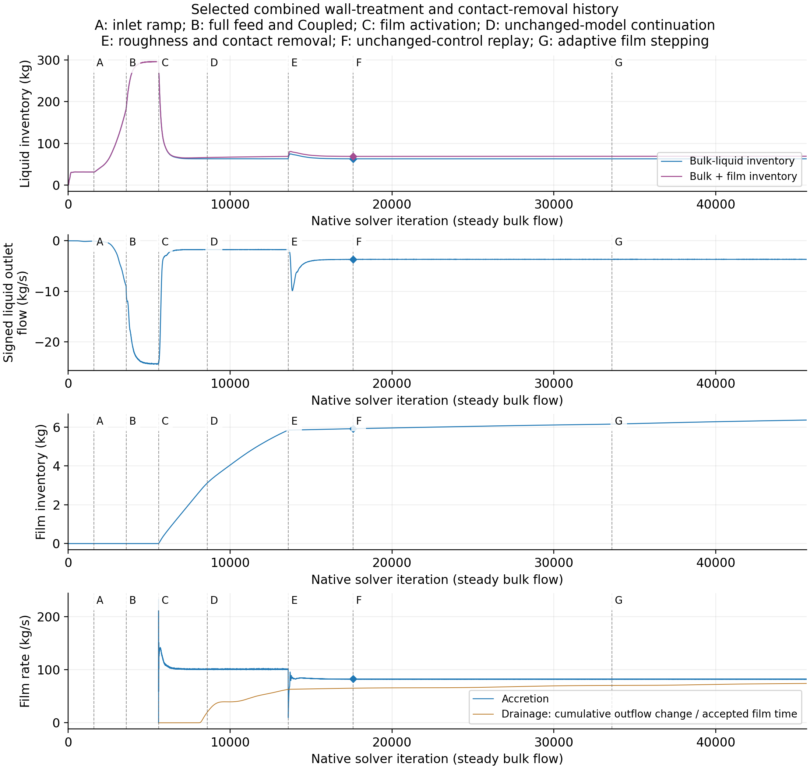
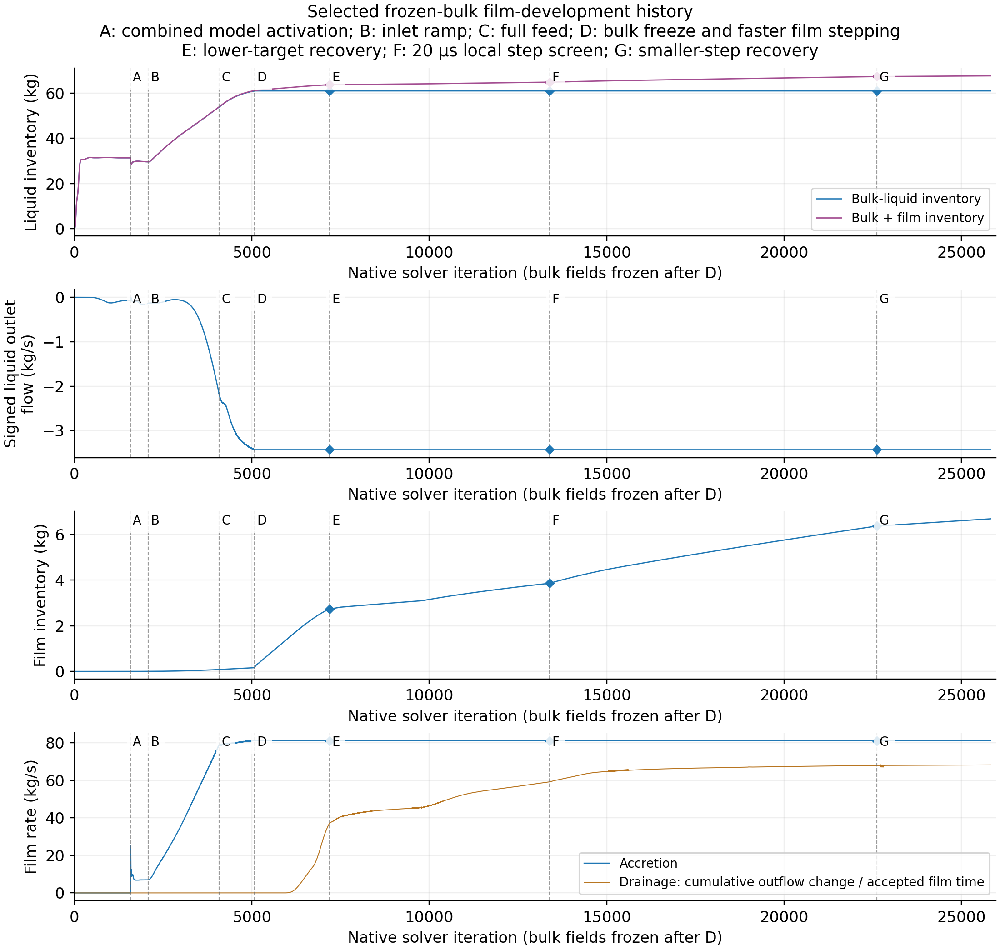
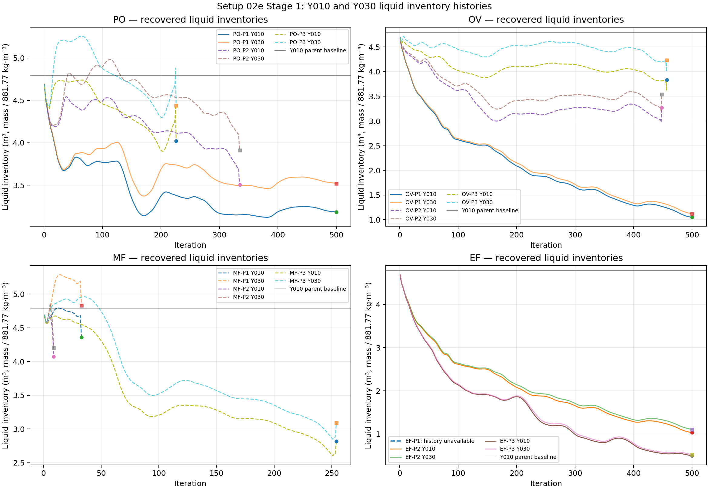
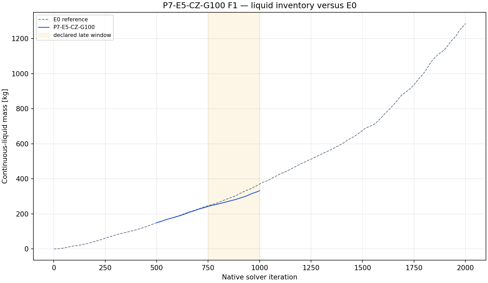

# References and appendices

*Working draft. The supplied report template specifies APA 7. Author–date links in the Markdown body are working citations for that style.*

## References

Ansys, Inc. (2025a). *Cell zone conditions* (§8.2.7, Defining mass, momentum, energy, and other sources). In *Ansys Fluent user's guide* (Release 2025 R2). [Version-matched source](https://ansyshelp.ansys.com/public/Views/Secured/corp/v252/en/flu_ug/flu_ug_bcs_sec_cell_zones.html).

Ansys, Inc. (2025b). *Mixture model theory* (§14.4, particularly the overview and relative-velocity formulation). In *Ansys Fluent theory guide* (Release 2025 R2). [Model overview](https://ansyshelp.ansys.com/public/Views/Secured/corp/v252/en/flu_th/flu_th_sec_drift_oview.html). [Algebraic slip formulation](https://ansyshelp.ansys.com/public/Views/Secured/corp/v252/en/flu_th/flu_th_sec_drift_theory_relvel.html).

Ansys, Inc. (2025c). *Modeling Eulerian wall films* (Chapter 30, particularly §§30.3–4). In *Ansys Fluent user's guide* (Release 2025 R2). [Chapter](https://ansyshelp.ansys.com/public/views/secured/corp/v252/en/flu_ug/flu_ug_models_wallfilm.html). [Model options](https://ansyshelp.ansys.com/public/Views/Secured/corp/v252/en/flu_ug/flu_ug_ewf_sec_options.html). [Solution controls](https://ansyshelp.ansys.com/public/Views/Secured/corp/v252/en/flu_ug/flu_ug_ewf_sec_eqns.html).

Ansys, Inc. (2025d). *Model-specific DEFINE macros* (§2.3.45, DEFINE_SOURCE). In *Ansys Fluent customization manual* (Release 2025 R2). [Version-matched source](https://ansyshelp.ansys.com/public/Views/Secured/corp/v252/en/flu_udf/flu_udf_ModelSpecificDEFINE.html).

Ansys, Inc. (2025e). *Overview of using the Eulerian wall film model* (§30.2). In *Ansys Fluent user's guide* (Release 2025 R2). [Version-matched source](https://ansyshelp.ansys.com/public/views/secured/corp/v252/en/flu_ug/flu_ug_ewf_sec_overview.html).

Ansys, Inc. (2025f). *Wall roughness effects in turbulent wall-bounded flows* (§4.18.5). In *Ansys Fluent theory guide* (Release 2025 R2). [Version-matched source](https://ansyshelp.ansys.com/public/Views/Secured/corp/v252/en/flu_th/x1-5720008.164.html).

Ansys, Inc. (2025g). *Mesh topologies* (§7.1, particularly §7.1.3.3, Numerical diffusion). In *Ansys Fluent user's guide* (Release 2025 R2). [Version-matched source](https://ansyshelp.ansys.com/public/Views/Secured/corp/v252/en/flu_ug/flu_ug_GridTypes.html).

Ansys, Inc. (2025h). *Pressure-based solver settings* (§37.3, particularly §37.3.1, Choosing the pressure–velocity coupling method). In *Ansys Fluent user's guide* (Release 2025 R2). [Version-matched source](https://ansyshelp.ansys.com/public/Views/Secured/corp/v252/en/flu_ug/flu_ug_sec_uns_solve_pvel_1.html).

Ansys, Inc. (2025i). *Solution strategies for multiphase modeling* (§27.8, particularly §§27.8.1.2–1.3 and 27.8.1.7). In *Ansys Fluent user's guide* (Release 2025 R2). [Version-matched source](https://ansyshelp.ansys.com/public/Views/Secured/corp/v252/en/flu_ug/flu_ug_sec_multiphase_solution.html).

Ansys, Inc. (2025j). *Numerical schemes and solution algorithm for Eulerian wall films* (§17.4). In *Ansys Fluent theory guide* (Release 2025 R2). [Temporal schemes](https://ansyshelp.ansys.com/public/Views/Secured/corp/v252/en/flu_th/flu_th_ewf_sec_time_diff.html). [Spatial schemes](https://ansyshelp.ansys.com/public/Views/Secured/corp/v252/en/flu_th/flu_th_ewf_sec_space_diff.html). [Steady and transient solution algorithm](https://ansyshelp.ansys.com/public/Views/Secured/corp/v252/en/flu_th/flu_th_ewf_sec_sol_alg.html). [Coupled film solution](https://ansyshelp.ansys.com/public/Views/Secured/corp/v252/en/flu_th/flu_th_ewf_sec_time_coupl.html).

International Association for the Properties of Water and Steam. (2012). *Revised release on the IAPWS industrial formulation 1997 for the thermodynamic properties of water and steam* (R7-97[2012]). [Official release](https://iapws.org/technical-guidance/release/IF97-Rev).

National Aeronautics and Space Administration. (2021a, February 10). *Examining iterative convergence*. NPARC Alliance CFD verification and validation tutorial. [Source page](https://www.grc.nasa.gov/www/wind/valid/tutorial/iterconv.html).

National Aeronautics and Space Administration. (2021b, February 10). *Validation assessment*. NPARC Alliance CFD verification and validation tutorial. [Source page](https://www.grc.nasa.gov/www/wind/valid/tutorial/valassess.html).

National Aeronautics and Space Administration. (2021c, February 10). *Verification assessment*. NPARC Alliance CFD verification and validation tutorial. [Source page](https://www.grc.nasa.gov/www/wind/valid/tutorial/verassess.html).

Pointon, A. R., Mills, T. D., Seil, G. J., & Zhang, Q. (2009). Computational fluid dynamic techniques for validating geothermal separator sizing. *GRC Transactions, 33*, 943–948. [Publisher-hosted paper](https://publications.mygeoenergynow.org/grc/1028587.pdf). [Local primary copy consulted](../../../CFD_wiki/raw/1028587.pdf).

Purnanto, M. H., Zarrouk, S. J., & Cater, J. E. (2013). CFD modelling of two-phase flow inside geothermal steam–water separators. *IPENZ Transactions, 40*, 1–10. [Publisher identifier](https://search.informit.org/doi/10.3316/informit.366967552564856). [Primary paper copy consulted](https://www.researchgate.net/publication/269519626_CFD_MODELLING_OF_TWO-PHASE_FLOW_INSIDE_GEOTHERMAL_STEAM-WATER_SEPARATORS).

Rizaldy, Zarrouk, S. J., & Morris, C. (2016, November 23–25). Liquid carryover in geothermal steam–water separators. In *Proceedings of the 38th New Zealand Geothermal Workshop*, Auckland, New Zealand. [Author-hosted paper](https://www.researchgate.net/publication/310818568_LIQUID_CARRYOVER_IN_GEOTHERMAL_STEAM-WATER_SEPARATORS). [Local primary copy consulted](../../../CFD_wiki/raw/053_Rizaldy_Final.pdf).

Skoog, E. (2020). *CFD annular flow modelling based on a three-field approach* [Master's thesis, Luleå University of Technology]. [University-hosted thesis](https://www.diva-portal.org/smash/get/diva2:1452100/FULLTEXT02.pdf). [Local primary copy consulted](../../../CFD_wiki/raw/FULLTEXT02.pdf).

Zarrouk, S. J., & Purnanto, M. H. (2015). Geothermal steam–water separators: Design overview. *Geothermics, 53*, 236–254. [DOI](https://doi.org/10.1016/j.geothermics.2014.05.009). [Local primary copy consulted](<../../../CFD_wiki/raw/Zarrouk and Purnanto 2014.pdf>).

The design-overview year follows the DOI's volume-publication metadata, January 2015. Its retained local filename, PDF header and wiki label use 2014. That difference is bibliographic and does not change the study's technical content.

## Appendix A. Method detail and reproducibility

### A.1. Verified model inputs and remaining evidence

*Table A1. Model facts and evidence routes for the central startup and absorber contribution. A missing entry must not be inferred from another branch or from a software default.*

| Setting group | Draft basis | Remaining detail / owning record |
| --- | --- | --- |
| Geometry and mesh | Exact selected saved mesh: 60,964 cells, 226,982 nodes and 328,287 faces; identical geometry/connectivity in the full-feed parent, combined contact endpoint and shortened-startup endpoint; 715 collector cells selected by centroid $y\leq0.10$ m | Methods Figure M1 and Appendix A.10 give native boundaries, dimensions and source-region extent. The separate 342,609-cell inspection and later input meshes retain their own identities |
| Wall resolution and quality | Native shared-flow `SV_WALL_YPLUS`, `SV_WALL_YPLUS_UTAU` and adjacent-cell `SV_WALL_DIST` recovered from three hash-matched data pairs | Appendix A.10 gives per-wall area-weighted statistics. Exact meshing layer count/first-layer height and solver-side orthogonal quality/skewness remain unverified; no completed matched refinement study |
| Feed | Enthalpy and phase-flow derivation in Section 3.3.1 and Appendix A.7; hold: 29.23/20.1725 kg/s liquid/vapour; full feed: 116.92/80.69 kg/s | Retain actual boundary readbacks beside the discrete ramp rule; [startup provenance](../../experiments/phase-07-1a-absorber-convergence/roughness-family/r0-smooth-control/provenance.md) |
| Materials and walls | Verified density and viscosity values for the throughput-controlled absorber model in Section 3.2; smooth-wall parent | Retain full-precision [material settings](../../experiments/phase-07-1a-absorber-convergence/baseline-v2-virtual-liquid-outlet/build-manifest.json) and the selected cases' wall-treatment readbacks |
| Phase interaction | Manninen algebraic slip; Schiller–Naumann drag; constant phase-2 diameter $10^{-5}$ m (10 µm). Virtual mass, lift, wall lubrication, turbulent dispersion and turbulence interaction off; bulk surface tension/cavitation off; no bulk interphase mass-transfer model | Recovered from the hash-matched full-feed parent/control at iteration 5586, combined contact endpoint at iteration 45606 and shortened-startup endpoint at iteration 5080. See [saved-case model and geometry metadata](../figures/model-domain-metadata.json). EWF phase accretion is a separate wall transfer |
| Boundary settings | Pure-phase mass-flow inlets and steam pressure outlet for the main lineage; verified full-feed control in Appendix A.6 | Check the other selected cases for any changes to pressure, turbulence inputs, hydraulic diameters or backflow settings |
| Historical startup | Actual 25% hold to iteration 1580; verified 2000-update ramp to iteration 3580; Coupled/Global Time Step continuation to iteration 5586 | Keep intended and executed schedules distinct; [selected native history](../../experiments/phase-07-2a-wall-liquid-routing/stage-02-combined-ewf-roughness/case-history-N45606.md) |
| Full-feed control | Terminal control separated from hold, ramp and warm-up; selected settings in Appendix A.6 | Retain complete readbacks from the [full-feed control setup](../../experiments/phase-07-1a-absorber-convergence/roughness-family/r0-smooth-control/setup.md); use the [declared control window](../../experiments/phase-07-1a-absorber-convergence/roughness-family/r0-smooth-control/control-window.md) |
| Final contact absorber | $S_L=-\rho_L\alpha_L/\tau$; $\tau=10^{-5}$ s; liquid-velocity momentum removal; `libcontactv2` | Derivative and hook identities are given in Appendix A.3, with the [contact-treatment setup](../../experiments/phase-07-2a-wall-liquid-routing/stage-02-combined-ewf-roughness/ewf-absorber/setup.md) |
| Roughness screen | Common full-feed-parent fields at iteration 5586; EWF off; 3000 updates; final-500 means | Retain height, constant, inventory and oscillation evidence from the [roughness-screen results](../../experiments/phase-07-2a-wall-liquid-routing/roughness-family/results.md) |
| Film-disabled/accretion-enabled comparison | Smooth walls; EWF off/on package; accretion on in the film case; film equations coupled; wall momentum feedback off; fixed 10 µs film step | Exact mechanisms and numerical readbacks in Appendix A.9; [accretion-enabled film build/reopen receipt](../../../PyAnsys/output/phase72a_ewf_student_e27_build_20260923T071523Z/probe-receipt.json) |
| Combined lineage | Original accretion-enabled film fields; later roughness, contact absorber and smaller film step; selected replay and adaptive continuation | Keep branches, accepted film steps and normalisation changes from the [combined contact history](../../experiments/phase-07-2a-wall-liquid-routing/stage-02-combined-ewf-roughness/case-history-N45606.md) |
| Shortened startup | Same iteration 1580 fields; 500 updates at 25%; 2000-update ramp; 1000-update full-feed hold; 1 µs film step | [Shortened-startup protocol and parent identity](../../experiments/phase-07-2a-wall-liquid-routing/stage-03-shortened-reconstruction/early-ewf-startup/setup.md) |
| Film development | Bulk frozen after iteration 5080; alternative implicit beta algorithm; accepted film steps and native clock; original inner residuals unavailable | Algorithms, exact local criteria and selected recoveries in Appendix A.9; [film-development evidence](../../experiments/phase-07-2a-wall-liquid-routing/stage-03-shortened-reconstruction/early-ewf-startup/film-development/results.md) |
| Remaining bulk numerical controls | Full-feed-control and shortened-startup discretisation and relaxation are recorded; raw residual tuples and pseudo-time entries are preserved; fixed horizons are not residual stopping criteria | Appendix A.10 distinguishes stored entries from applied controls. Effective global-step selection and the positional mapping of bulk residual-stop tuples remain unverified; do not substitute guessed defaults |

### A.2. Provisional reconstruction comparisons

The separate reconstruction series covered numerical packages, mixed and split inlets, one-way droplet diagnostics and a provisional film treatment. It used the common 60,964-cell simplified mesh with the absorber disabled. Section 3.6 defines the comparison design; Section 4.9 reports provisional observations; Section 5.6 considers possible explanations. The historical tetrahedral-mesh reference used 7,601,261 cells and split feed, while the mixed-inlet SIMPLE reconstruction used the supplied mesh and mixed feed. The contrast does not isolate mesh effects. Saved fields at iteration 10,000 were compared at corresponding section locations with common liquid-volume-fraction ranges. ([Mixed-inlet SIMPLE settings and limits](../../experiments/phase-08-storyline-reconstruction/stage-01-60k-storyline/f0-simple/results.md); [native comparison views](../../meetings/Poster/poster-sections/mesh-and-volume-fraction-comparison.md))

| Historical tetrahedral-mesh reference | Supplied 60,964-cell mesh |
| --- | --- |
|  |  |

*Supplementary mesh views. Native inlet-centre cuts at a common field of view document the two structures. Their appearance does not establish solution accuracy.*

The mixed-inlet and split-inlet Coupled reconstructions shared the coarse mesh, materials, total phase feed, outlet, smooth walls and EWF-off carrier. The mixed-feed case distributed both phases over the two physical inlet faces by area; the split-feed case assigned liquid to the outer strip and vapour to the steam face. Both used Coupled, Global Time Step and first-order $k$. The mixed-inlet SIMPLE reconstruction used pseudo-time off and second-order $k$. Comparing the two mixed-inlet cases therefore changed a numerical package. ([Mixed-inlet SIMPLE definition](../../experiments/phase-08-storyline-reconstruction/stage-01-60k-storyline/f0-simple/setup.md); [mixed/split-inlet audit](../../experiments/phase-08-storyline-reconstruction/stage-01-60k-storyline/baseline-lineage-audit.md))

For phase $i$ on mixed-inlet face $b$, $\dot m_{i,b}=\dot m_i A_b/(A_L+A_V)$. Both faces therefore carried the same phase mixture, while retaining their separate turbulence hydraulic diameters. The split-inlet reconstruction placed liquid only on `liquidinlet` and vapour only on `steaminlet`. The speed series scaled both phase commands at fixed ratio, rather than changing feed enthalpy.

Each reconstruction speed used fresh Hybrid Initialisation and a 10,000-update horizon, with iterations 9,500–10,000 as the reporting window. Nominal speeds were 20.11, 23.46, 26.81, 29.48 and 32.14 m/s. At 26.81 m/s, the commands were 116.93872650 kg/s liquid and 80.70292372 kg/s vapour. These are distinct from the historical startup values in Table 3. The nominal speed used combined inlet area, rather than the velocity on each split phase face. No completed resolution study is reported for the mixed-inlet and split-inlet Coupled reconstructions.

Detailed droplet and provisional-film reconstruction comparisons and performance conclusions remain deferred. The new SIMPLE comparison and mesh work must be assessed before strengthening their claims. The native inlet mesh close-up is retained in Appendix A.10; the main domain overview retains its provisional figure label until final main-text numbering.

The [reconstruction results](../../experiments/phase-08-storyline-reconstruction/stage-01-60k-storyline/results.md) and [report contract](../../experiments/phase-08-storyline-reconstruction/stage-01-60k-storyline/report-contract.md) retain the methods, values and source routes. The [fine-mist distribution specification](../../experiments/phase-03-dpm-carryover-and-coupling/purnanto-09cV3-fine-mist-psd/setup.md) remains an assumed design input. No detailed reconstruction table or figure is used to support the present conclusions.

### A.3. Final contact source assignments and independent reporting

*Table A2. Exact source assignments for the final contact absorber at a 10 µs depletion time. The sources act only in the collector zone.*

| Equation and assignment | Final contact source | Source unit |
| --- | --- | --- |
| Phase-2 mass | `contact_mass_10us::libcontactv2` | kg/(m³·s) |
| Mixture x momentum | `contact_x_10us::libcontactv2` | N/m³ |
| Mixture y momentum | `contact_y_10us::libcontactv2` | N/m³ |
| Mixture z momentum | `contact_z_10us::libcontactv2` | N/m³ |
| Shared turbulent kinetic energy | `P71V2SinkK = P71V2Sink*k`, with the contact mass expression | kg/(m·s³) |
| Shared dissipation rate | `P71V2SinkEpsilon = P71V2Sink*epsilon`, with the contact mass expression | kg/(m·s⁴) |
| Direct phase-1 mass | Disabled | — |
| Contact sources outside the collector | No contact hooks added | — |

The collector retained the case name `p71a-v2-virtual-outlet`. `P71V2Alpha` read phase-2 fraction. `P72ContactRho` was obtained from the selected liquid material, and `P72ContactTau` held the selected depletion time. The named `P71V2Sink` expression evaluated the contact law, $-\rho_L\alpha_L/\tau$, for removal reporting and the retained turbulence hooks. The `P71V2` prefixes were retained identifiers; the active law was the final contact law. The mass and momentum attachments used the compiled functions in Table A2. ([Configuration code](../../../PyAnsys/scripts/setup/run_phase72a_contact_absorber.py); [saved/reopened source state](../../../PyAnsys/output/phase72a-lineage-N45606/20261005/raw/history-recovery/PyAnsys/output/phase72a-contact-absorber-e27-restart/20261003T032636Z/prepared-reopen.json))

For positive liquid fraction, the supplied mass derivative corresponded to $\partial S_L/\partial\alpha_L=-\rho_L/\tau$. Momentum functions supplied $\partial(S_Lu_{L,j})/\partial u_{m,j}\approx S_L$, holding slip and the other source factors fixed. The [C implementation](../../../PyAnsys/src/pyansys_fluent/contact_absorber.c) wrote these coefficients at the equation index passed to the callback. It did not treat that number as a portable symbolic equation identifier.

The C mass evaluation used the non-negative part of liquid fraction. The named reporting expression represented the same law for non-negative fraction. Agreement of that expression with $M_c/\tau$ was an identity of the law, not independent evidence that Fluent applied the source correctly. The native applied-source report was therefore needed as a separate application check.

Two report reductions described different quantities:

1. **Evaluated removal:** `P72ContactRemoval = -VolumeInt(P71V2Sink, collector)`, recorded by `p72-contact-removal`. This integrated the volumetric expression and reported a positive removal magnitude.
2. **Native applied source:** the retained `v2-applied-absorber` report used a Volume Sum of `phase-2-user-mass-source` over the collector. This reported the signed native source in the source account.

The [contact monitor configuration](../../../PyAnsys/scripts/setup/run_phase72a_contact_absorber.py) and [native monitor definition](../../../PyAnsys/scripts/setup/run_p71a_v2_inlet_loading.py) preserve these reductions. Adding evaluated removal and native applied removal to one balance would count the same source twice. Boundary-only fluxes were also kept separate from flux-report nets that already included user sources.

### A.4. Final contact source strength and its observed limits

The contact law exposed its strength through $\tau$. For a fixed collector liquid mass, a smaller $\tau$ increased evaluated removal $M_c/\tau$. Under continuing delivery, a finite inventory could remain. Literal zero liquid fraction was not the condition imposed by this law, and its depletion time was not a measured carrier residence time or physical carrier timestep.

*Table A3. Contact-strength screens from the same original parent at iteration 13586, each after 100 updates at iteration 13686. These are short developing endpoints; they are not stationary throughputs or mesh-convergence results.*

| Removal time $\tau$ (µs) | Collector liquid mass (g) | Collector maximum liquid fraction (%) | Evaluated endpoint bulk removal (kg/s) |
| ---: | ---: | ---: | ---: |
| 100 | 2.780 | 0.05010 | 27.80 |
| 10 | 0.496 | 0.01978 | 49.59 |
| 1 | 0.159 | 0.01302 | 158.81 |

These screens retained the final liquid-velocity momentum treatment, a verified 1 µs film step, a nonbinding diagnostic thickness bound and volume-fraction relaxation of 0.1. The 1 µs removal-time branch reduced collector inventory further but increased source variability. The 10 µs branch was selected for a further 1000 updates as a working compromise; this was not an optimum or a demonstrated limit independent of $\tau$.

The longer screen reached iteration 14686 with final-200 continuity mean 0.001911 and evaluated removal ranging from 51.729 to 82.691 kg/s. Bulk inventory still drifted and phase-fraction residuals remained above $10^{-3}$. This short-screen branch was distinct from the later original-field restart leading to iteration 45606. The local law and its bounded short response were useful development evidence; steady collector throughput and full separator qualification remained open. ([Contact-screen values and limits](../../experiments/phase-07-2a-wall-liquid-routing/stage-02-combined-ewf-roughness/results.md#all-liquid-contact-absorber-trial))

### A.5. Startup, comparison protocols and reporting windows

The historical startup and initial wall screens used the throughput-controlled absorber, rather than the final contact law. Its local volumetric source was

$$
S_{L,\mathrm{throughput}}
=-\frac{\dot m_{L,\mathrm{in}}\alpha_L}
{\max\left(\int_{V_c}\alpha_L\,\mathrm dV,\,10^{-6}\ \mathrm{m^3}\right)}.
$$

Here, $\dot m_{L,\mathrm{in}}$ was the absolute native phase-2 mass flow at the liquid inlet. This law distributed inlet-dependent removal through the collector according to local liquid fraction, with a floor on the normalisation volume. The associated momentum terms used liquid velocity; the shared $k$ and $\varepsilon$ sources used the same mass source. No direct vapour mass source was assigned. These definitions distinguish the early startup model from the local depletion law in Section 3.3.4. ([Verified throughput-controlled source definitions and assignments](../../experiments/phase-07-1a-absorber-convergence/baseline-v2-virtual-liquid-outlet/build-manifest.json))

*Table A4. Executed procedures and reporting windows. Iteration coordinates identify the saved lineage; they are not physical elapsed time.*

| Comparison or calculation | Preparation and changes | Horizon and reporting rule |
| --- | --- | --- |
| Historical reduced-feed startup | Hybrid Initialisation, ten passes; smooth walls, EWF off, no patched pool; throughput-controlled absorber; 25% inlet commands | Actual hold to iteration 1580 after a delayed ramp command; retain the hold's full history and identify minima and endpoint inventories separately |
| Historical inlet ramp | Start from iteration 1580; ramp both commands to full feed with boundary readback every ten updates | 2000 updates to iteration 3580; compare ramp progress separately from the preceding hold |
| Full-feed control | SIMPLE changed to Coupled with Global Time Step; all other recorded settings retained | First continuation retained as warm-up; second 1000-update control uses native iterations 4586–5586. The expected ledger coordinates, 4580–5580, differ by six restart-boundary rows |
| Wall-roughness screen | Each child starts from the same full-feed-parent fields at iteration 5586; EWF off; vary $k_s$ and $C_s$ with the other recorded controls fixed | 3000 updates per child; report means over iterations 8087–8586 and retain full histories for stability and inventory assessment |
| Film-disabled/accretion-enabled screen | Same developed parent and smooth walls; EWF off versus accretion on, coupled film equations and bulk-flow momentum feedback off; 10 µs film step in the accretion-enabled case | Report iterations 8087–8586; interpret the enabled film settings as a package |
| Combined wall and contact continuation | Start from original accretion-enabled film fields at iteration 13586; add $k_s=0.5$ mm, $C_s=0.5$, final contact removal, collector film drainage and a 1 µs film step | Retain the corrected restart and selected continuation through iteration 45606; use actual accepted film times and record any subsequent control or residual-normalisation changes |
| Shortened startup | Reuse bulk fields saved at iteration 1580; activate Coupled flow, dry EWF with accretion, 0.5 mm roughness at $C_s=0.5$ and contact collection | 500 updates at 25% feed, 2000-update ramp, then 1000 at full feed to iteration 5080; fixed 1 µs film step; compare against matched loading progress |
| Local film-step checks | Restart from identical saved fields with prescribed bulk flow; change the film step | Compare equal accepted film elapsed time and retain inner-film solve behaviour |
| Longer film development | Freeze bulk equations after the shortened startup and advance the film using the selected continuation | Use the native film clock; the reference arm extends to 500 ms, with final-10-ms averages weighted by interval overlap |

The [startup provenance](../../experiments/phase-07-1a-absorber-convergence/roughness-family/r0-smooth-control/provenance.md), [terminal control definition](../../experiments/phase-07-1a-absorber-convergence/roughness-family/r0-smooth-control/control-window.md), [selected combined history](../../experiments/phase-07-2a-wall-liquid-routing/stage-02-combined-ewf-roughness/case-history-N45606.md), [shortened-startup setup](../../experiments/phase-07-2a-wall-liquid-routing/stage-03-shortened-reconstruction/early-ewf-startup/setup.md) and [film-development record](../../experiments/phase-07-2a-wall-liquid-routing/stage-03-shortened-reconstruction/early-ewf-startup/film-development/results.md) retain parent identities and execution details. Reconstruction protocols are specified separately in Appendix A.2.

### A.6. Verified full-feed control settings

*Table A5. Boundary and numerical settings from the saved full-feed-control readback. These values identify that control; other case families require their own settings.*

| Setting | Verified value |
| --- | --- |
| Phase feed | Liquid 116.92 kg/s at the liquid strip; vapour 80.69 kg/s at the steam face; the other phase command on each face was zero |
| Operating and outlet pressure | Operating pressure 0 Pa; steam-outlet gauge pressure 1,120,000 Pa |
| Inlet turbulence | Intensity 2.11%; hydraulic diameter 0.01338 m for liquid and 0.72061 m for vapour |
| Outlet backflow | Normal to boundary; total-pressure backflow specification; liquid fraction zero; intensity 2.11%; hydraulic diameter 0.875936 m |
| Physical walls | Stationary, no-slip; smooth in the control, with $k_s=0$ and $C_s=0.5$ |
| Gradients and pressure | Green–Gauss node-based; PRESTO! |
| Momentum and turbulence | Second-order upwind momentum and $\varepsilon$; first-order upwind $k$ |
| Volume fraction | QUICK |
| Pressure–velocity and pseudo-time | Coupled with separately solved volume fraction; Global Time Step |
| Explicit pressure and momentum relaxation | 0.5 for each |
| Global-step explicit relaxation | $k$ and $\varepsilon$: 0.75; volume fraction: 0.5; relative motion: 0.1; density, body force and turbulent viscosity: 1.0 |
| Active bulk equations | Flow, relative motion, turbulence and volume fraction |

The mass-flow inlets also retained a stored supersonic/initial gauge-pressure entry of 1,140,000 Pa. The inlet condition was specified by mass flow; this stored entry was not used as a measured inlet pressure or to calculate separator pressure loss. Pressure sampling for a performance comparison remains to be defined.

The terminal readback also records per-equation pseudo-time scale factors of 1.0 for $k$, $\varepsilon$ and volume fraction, with implicit relaxation factors 0.8, 0.8 and 0.5, respectively. Turbulent viscosity was limited to a viscosity ratio of $10^5$; the minimum volume fraction for matrix solution was $10^{-8}$. These are numerical controls, not achieved accuracy or convergence criteria.

The [terminal checkpoint readback](../../../PyAnsys/output/phase71a_r0_control_run4/checkpoint-plus1000-batched-readback.json) contains the boundary, method and control values. Its [completion receipt](../../../PyAnsys/output/phase71a_r0_control_run4/authoritative-completion-receipt.json) identifies the saved pair and the two intended solver changes. Contact and shortened-startup cases reduced explicit volume-fraction relaxation to 0.1; the [shortened-startup saved/reopened state](../../../PyAnsys/output/phase72a-stage3-early-ewf-server1/20261005/prepared-reopen.json) retained the listed bulk schemes, pressure/momentum relaxation and other global-step relaxation factors. Later film algorithm and step changes are specified in Appendix A.9. Appendix A.10 preserves raw bulk residual and global-step settings whose active/positional interpretation remains unverified.

### A.7. Worked inlet calculation and property bases

The thermodynamic example in Section 3.3.1 uses Purnanto et al. (2013), Table 1: $h=1600$ kJ/kg, $\dot m_{\mathrm{tot}}=197.61$ kg/s and pressure 11.2 bar absolute, with $h_{L,\mathrm{sat}}=784.66$ and $h_{V,\mathrm{sat}}=2781.46$ kJ/kg. Substitution gives

$$
x_V=\frac{1600-784.66}{2781.46-784.66}=0.408323,
\quad \dot m_V=80.6888\ \mathrm{kg/s},
\quad \dot m_L=116.9212\ \mathrm{kg/s}.
$$

The published rounded values 80.69/116.92 kg/s were retained as historical boundary commands. The later saved material properties were separate inputs; they were not replaced by the paper's densities when recreating a continuation.

*Table A6. Input calculation for the reference inlet design and the later full-feed mass-flow implementation. Velocities and uniform fractions in this table are calculated from the stated inputs.*

| Quantity | Original split-area design | Later mass-flow calculation |
| --- | ---: | ---: |
| Liquid / vapour commands (kg/s) | 116.92 / 80.69 | 116.92 / 80.69 |
| Liquid density (kg/m³) | 881.77 | 881.2108764648438 |
| Vapour density (kg/m³) | 5.73 | 5.797433853149414 |
| Liquid volumetric flow (m³/s) | 0.13259694 | 0.13268107 |
| Vapour volumetric flow (m³/s) | 14.08202443 | 13.91822693 |
| Combined inlet area (m²) | 0.524176 | 0.524176 |
| Liquid area (m²) | 0.0048896224, calculated | 0.0048899165, supplied input audit |
| Vapour area (m²) | 0.5192863776, calculated | 0.5192860835, supplied input audit |
| Liquid strip width at 0.724 m height (m) | 0.0067536221 | 0.0067540283 |
| Vapour strip width at 0.724 m height (m) | 0.7172463779 | 0.7172459717 |
| Combined volumetric-flow speed (m/s) | 27.11803167 | 26.80570648 |
| Liquid mean normal velocity (m/s) | 27.11803167 | 27.13360599 |
| Vapour mean normal velocity (m/s) | 27.11803167 | 26.80261878 |
| Liquid fraction under a uniform common-velocity assumption | 0.00932821 | 0.00944288 |

The calculations use $Q_i=\dot m_i/\rho_i$, $U_{\mathrm{vol}}=(Q_L+Q_V)/A$, and $U_{i,n}=Q_i/A_i$. The original design selected $A_i=Q_i/U_{\mathrm{vol}}$, which made the phase velocities equal. The later column retained the supplied face split and changed the density basis; its phase velocities consequently differed. The areas agree with the [raw input audit](../../../PyAnsys/output/phase9-mesh-convergence/20261007/mesh-input-audit.json), the [native reconstruction audit](../../experiments/phase-08-storyline-reconstruction/stage-01-60k-storyline/baseline-lineage-audit.md) and the exact solved-case polygons in [Appendix A.10](#a10-saved-mesh-and-wall-resolution-evidence). The pending quality assessment remains distinct from verified geometric scale. These derived velocities are not native field measurements.

For the original reference design, forcing both pure-phase faces to 26.81 m/s on the 0.524176 m² area would supply approximately 195.37 kg/s with the paper's densities. The historical mass-flow route instead fixed 197.61 kg/s. The later material values and fixed face split supply a combined volumetric-flow speed close to 26.81 m/s at those mass commands. The [original derivation](../../experiments/phase-02-parity-reset-and-pre-v2-qualification/purnanto-08c-inlet-loading-sensitivity/inlet-regimes-interpretation.md), [material readback](../../experiments/phase-07-1a-absorber-convergence/baseline-v2-virtual-liquid-outlet/build-manifest.json) and [terminal feed readback](../../../PyAnsys/output/phase71a_r0_control_run4/checkpoint-plus1000-batched-readback.json) identify the separate inputs.

For a reconstruction speed $U$, the reconstruction series used its own reference commands and scaled both phase rates by $U/U_{\mathrm{ref}}$, retaining the phase ratio. The actual reference commands are given in Appendix A.2. They must be carried into a reconstruction rather than recalculated from an assumed common speed on the pure-phase faces.

### A.8. Mesh-zone assignments and paired starting states

*Table A7. Region and model assignments needed to recreate the selected wall and contact treatments. Names refer to the partitioned 60,964-cell cases.*

| Region or setting | Recorded assignment |
| --- | --- |
| Bulk fluid zones | `separator-purnanto`: 60,249 cells; `p71a-v2-virtual-outlet`: 715 cells |
| Collector selection | Existing lower cell-centroid selection, $y\leq0.10$ m; separating faces follow the cells rather than an exact horizontal plane |
| Phase mass source | Phase-2 only in the collector; assignments and associated mixture transport terms in Appendix A.3 |
| Roughness treatment | `separator-purnanto:1`, `separator-purnanto:1:001`, `wall`, and `wall:004`; the `bottom` wall retained smooth treatment |
| Contact-branch EWF | Active on `wall`; lower `wall:004` remains outside EWF, allowing native outflow at the lower active-film edge |
| Diagnostic particle collector entry | `interior--separator-purnanto:007` and `interior--separator-purnanto:010`, configured as zero-resistance porous jumps with escape |
| Diagnostic particle lower walls | Escape at `bottom`, `wall:004`, and `separator-purnanto:1:001` |
| Shortened-startup film controls | Fixed 1 µs step; ten subiterations; coupled film equations; phase accretion on; bulk-flow momentum feedback off |
| Shortened-startup numerical film bounds | Adaptive stepping off; recorded Courant input 0.05 and thickness bound 1 m. The bound was a numerical safeguard, not a physical film thickness or an acceptance criterion |
| Frozen-bulk film development | Bulk flow, turbulence, volume fraction and relative motion disabled; film transport and its native drainage retained |

The [roughness assignment code](../../../PyAnsys/scripts/setup/run_phase72a_family_r_native.py), [contact configuration](../../../PyAnsys/scripts/setup/run_phase72a_contact_absorber.py), [shortened-startup saved/reopened state](../../../PyAnsys/output/phase72a-stage3-early-ewf-server1/20261005/prepared-reopen.json) and [film-development implementation](../../../PyAnsys/scripts/setup/continue_phase72a_stage3_film_development.py) retain the assignments and controls. Earlier shared-budget film sinks and later wall-film parameter treatments are separate configurations; their settings must remain attached to their reported cases.

*Table A8. Paired input states for the principal comparison routes. Parent records retain the full filenames, paths and hashes.*

| Route | Starting state and field treatment | Owning record |
| --- | --- | --- |
| Historical low-feed startup | Prepared throughput-controlled absorber case/data pair after Hybrid Initialisation; write 29.23 kg/s liquid and 20.1725 kg/s vapour after reading the pair. The build's inherited liquid command was 111.22015 kg/s, so loading the artifact alone did not apply the study's reduced feed | [Verified prepared absorber model](../../experiments/phase-07-1a-absorber-convergence/baseline-v2-virtual-liquid-outlet/results.md) |
| Common-parent roughness and EWF screens | Saved full-feed-parent/control case/data pair at iteration 5586; retain its developed bulk fields for each child rather than starting from the previous screen endpoint | [Declared full-feed parent and window](../../experiments/phase-07-1a-absorber-convergence/roughness-family/r0-smooth-control/control-window.md) |
| Original-field contact continuation | Original accretion-enabled film solution at iteration 13586; apply the contact settings template while retaining existing bulk and film fields | [Selected combined history](../../experiments/phase-07-2a-wall-liquid-routing/stage-02-combined-ewf-roughness/case-history-N45606.md) |
| Shortened startup | Historical iteration-1580 bulk data with the selected 0.5 mm rough-wall and contact treatments; initialise the newly activated film dry without resetting the bulk arrays | [Parent identity and preparation](../../experiments/phase-07-2a-wall-liquid-routing/stage-03-shortened-reconstruction/early-ewf-startup/setup.md) |
| Frozen-bulk film development | Selected startup pair at iteration 5080 and its saved film clock; preserve both bulk and film fields before disabling bulk equations | [Film-development record](../../experiments/phase-07-2a-wall-liquid-routing/stage-03-shortened-reconstruction/early-ewf-startup/film-development/results.md) |

The historical startup checkpoint at iteration 1580 supplied the shortened-startup parent. Its case hash was `232e72ff86c657b2d90bff56f6e9cb84336e30905e365fa89d7c699ef653bf57` and its data hash was `ff64317d4e6e77661d7faf13d26d4c04ac3d5db2ea78eed461762a3b3531c187`. Prepared bulk arrays were checked against that saved state. A fresh Hybrid Initialisation would not reproduce this comparison's initial field.

Reproducing a saved-field continuation requires the paired case/data inputs identified above; a run description and endpoint iteration number alone do not specify its starting fields. Remaining geometry, solved-mesh/wall-resolution and bulk numerical-control facts are identified in Appendix A.1. The reported scope ends at frozen-bulk film development; later wall-film parameter configurations are not required to reproduce these results.

### A.9. Film mechanisms, algorithms and assessment criteria

#### A.9.1. Active film model

*Table A9. Physical model switches recovered from the accretion-enabled film build/reopen receipt and the shortened-startup prepared/reopened state. These settings distinguish the represented film routes from proposed mechanisms.*

| Setting | Recorded state in the reported EWF configurations |
| --- | --- |
| Film material | `water-liquid-at-psep`, the same fixed liquid material as the bulk secondary phase |
| Film equations | Film mass and momentum active; energy and scalar equations disabled |
| Film momentum terms | Gravity, external-flow shear, wall viscosity and momentum advection active; pressure-gradient, spreading and surface-tension forces disabled |
| Bulk-to-film interaction | Phase accretion active (`secondary-phase-mode=1`); stored concentration 0.001 and velocity 10 m/s. Bulk phase-change mass transfer and EWF–VOF transition disabled |
| Momentum feedback | Film wall `enable_flow_momentum_coupling=false`; carrier flow affects film, with no film momentum feedback to the bulk |
| DPM/film interaction | Collection, splashing and DPM pressure contribution disabled. One-way particle escape remained a separate diagnostic route |
| Film entrainment models | Stripping, droplet edge separation and sharp-edge treatment disabled |
| Drainage topology for contact/shortened startup | Active film on `wall`; lower `wall:004` outside EWF; native outflow at the lower active-film edge. This is distinct from the disabled droplet edge-separation model |
| Stored discretisation identifiers | `time-scheme=2`, `mass-scheme=0`, `mom-scheme=0`; identifiers retained from the actual readbacks rather than converted from assumed defaults |
| Original implicit solver | `implicit-scheme-new?=false`; EWF Coupled Solution on; original $h/u/v$ subiteration output retained |
| Later alternative implicit solver | `implicit-scheme-new?=true`; the beta numerical route exposed by Fluent 252 `eulerian_wallfilm.implicit_options.new_implicit_scheme`. Original inner-residual output unavailable in the tested batches |

The exact switches are supplied by the [accretion-enabled film build receipt](../../../PyAnsys/output/phase72a_ewf_student_e27_build_20260923T071523Z/probe-receipt.json) and [shortened-startup state](../../../PyAnsys/output/phase72a-stage3-early-ewf-server1/20261005/prepared-reopen.json). Fluent distinguishes film equation coupling, bulk momentum feedback and phase accretion; each has a separate numerical or physical role. Its [model-options guidance](https://ansyshelp.ansys.com/public/Views/Secured/corp/v252/en/flu_ug/flu_ug_ewf_sec_options.html) describes the selectable force and interaction terms. The native discretisation identifiers preserve the selected controls; their scheme-order labels have not been inferred from the integer values.

#### A.9.2. Numerical variants and selected restarts

*Table A10. Film numerical procedures attached to the reported field histories. The thickness limit is a numerical bound; it is not a predicted thickness or a physical acceptance criterion.*

| Procedure | Controls and field treatment |
| --- | --- |
| Accretion-enabled film screen and continuation | Original implicit algorithm; coupled film equations; fixed 10 µs; ten subiterations; stop $10^{-5}$; adaptive stepping off; stored Courant input 0.05; 0.3 m thickness bound |
| Contact history from original iteration-13586 fields | Original bulk and film fields retained; contact collection and 0.5 mm rough-wall treatment added; fixed 1 µs, ten subiterations and 1 m bound; explicit volume-fraction relaxation 0.1. At iteration 33586, adaptive film target 0.05, growth 1.2 and reduction 2 replaced the fixed step |
| Shortened startup to iteration 5080 | Historical bulk arrays at iteration 1580 retained; new film initialised dry once; original algorithm, coupled film equations, fixed 1 µs, ten subiterations, stop $10^{-5}$ and 1 m bound |
| Original-solver repair probes | Independent restarts from iteration-5080 fields; allow 30 subiterations, test a half step and a sequential-film alternative; retain the reported probe results separately from selected later fields |
| Alternative implicit local checks | Identical bulk/film fields at iteration 5080; bulk frozen; `implicit-scheme-new?=true`; 30-subiteration input retained; compare a 0.5 µs reference against larger fixed steps at +0.5 ms accepted film time |
| First selected adaptive development | Continue the selected 50 µs matched-time endpoint at iteration 5090; bulk frozen; adaptive development. The continuation to iteration 8190 was rejected; restart the preserved passing fields at iteration 7190 with 5 µs for 100 updates, then target 0.2, growth 1.15 and reduction 2 |
| Mid-development matched-time check | Identical saved fields at iteration 13390 and 75.6616 ms; 2.5 µs ×1000 reference, 25 µs ×100 and 20 µs ×125 candidates; each adds 2.5 ms and uses the same frozen carrier fields |
| Mid-development adaptive continuation | Retain the passing 20 µs endpoint; target 0.5, growth 1.15 and reduction 2. Reject the continuation to iteration 23615 when its Courant guard fails; resume preserved fields at iteration 22615 with 5 µs for 100 updates, then target 0.2, growth 1.15 and reduction 2 |
| Reference development to 500 ms | Continue the selected recovery from iteration 22615, preserving the same carrier fields; accepted native steps define elapsed time. The final increment was shortened to reach exactly 500 ms; its input was 5.595263 µs. No bulk restoration or stationary-film qualification is reported |

In fixed-step mode, the stored Courant input did not select or cap the step. In adaptive mode, accepted steps and the saved native clock were checked independently; the stored `timestep-max` did not demonstrate a ceiling. Rejected sibling continuations did not contribute to the selected film clock or inventory history. These case-specific observations are recorded in the [film-development result](../../experiments/phase-07-2a-wall-liquid-routing/stage-03-shortened-reconstruction/early-ewf-startup/film-development/results.md), [executed manifest](../../../PyAnsys/output/phase72a-stage3-film-development-server1/20261005/run-manifest.json) and [continuation implementation](../../../PyAnsys/scripts/setup/continue_phase72a_stage3_film_development.py). The beta algorithm was a numerical variant, not an additional film mechanism.

*Figure A1. Full selected contact lineage retained for reproducibility. Native iterations locate loading changes, EWF activation, contact/roughness changes, transfers and adaptive stepping. They do not supply a physical carrier-time axis. The accepted film clock and the inner-solve limits are assessed separately.*

*Figure A2. Selected shortened-startup and film-development lineage through iteration 25815, retained to show field preservation and recoveries. The flat bulk inventory and outlet traces after the bulk freeze are imposed by the held carrier fields. Rejected siblings are excluded. Main Figure 11 presents film inventory and rates against accepted film time through 500 ms.*

#### A.9.3. Metric definitions and decision scope

Each matched-time comparison used the same wall facets and checked centroid correspondence before evaluating the norms. Let $r$ denote the reference and $c$ the candidate; $m_j$, $\boldsymbol u_j$ and $h_j$ are native film mass, velocity and thickness on facet $j$. With nonzero reference denominators, the recorded differences were

$$
e_M=100\frac{\sum_j|m_j^c-m_j^r|}{\sum_jm_j^r},\qquad
e_u=100\frac{\sum_jm_j^r\|\boldsymbol u_j^c-\boldsymbol u_j^r\|}
{\sum_jm_j^r\|\boldsymbol u_j^r\|},
$$

$$
e_h=100\frac{|h_{\max}^c-h_{\max}^r|}{h_{\max}^r},\qquad
e_D=100\frac{|\overline D^c-\overline D^r|}{|\overline A^r|}.
$$

Thus $e_h$ compares the two maxima, not the maximum local difference or a thickness-field norm. The velocity norm uses reference film mass as the weight. $\overline D$ and $\overline A$ are drainage and accretion rates over the same accepted-time interval. Their values and the per-facet field metadata are retained in the [mid-development reference/candidate records](../../../PyAnsys/output/phase72a-stage3-film-development-server1/20261005/run-manifest.json) and [comparison implementation](../../../PyAnsys/scripts/setup/continue_phase72a_stage3_film_development.py).

For $I_A=\sum_iA_i\Delta t_i$, the film ledger was $E_f=\Delta M_f+\Delta D_f-I_A$ and $e_f=100|E_f|/|I_A|$. The accretion integral used each recorded rate with its accepted native film-time increment. Window-average accretion, drainage and storage were $I_A/\Delta t$, $\Delta D_f/\Delta t$ and $\Delta M_f/\Delta t$. The signed drainage deficit was $100(I_A-\Delta D_f)/|I_A|$; the storage ratio was $100\Delta M_f/|I_A|$. Accretion was an external prescribed input to this film-only ledger during frozen-bulk development, although it is an internal liquid transfer when both compatible bulk and film accounts are solved and combined.

*Table A11. Existing case-specific criteria used for numerical decisions. A local screen is not a statement of universal CFD accuracy.*

| Decision | Recorded criterion | Scope and missing qualification |
| --- | --- | --- |
| Original film inner tolerance | Final recorded $h$, $u$ and $v$ residuals each $\leq10^{-5}$ per update | Count only updates with complete subiteration records; unavailable beta-algorithm residuals are not passes |
| Original-solver step increase | At least 99% of updates meet the inner tolerance; no final inner residual $>1$; $e_f\leq0.1\%$ | Numerical eligibility for a further step trial, not film stationarity |
| Local matched-time field screen | $e_M\leq1\%$, $e_u\leq2\%$, $e_h\leq2\%$; both film ledgers $\leq0.1\%$; finite fields with nonnegative thickness and recovery bounds respected | Same parent, physical model and accepted elapsed film time; valid only for the tested state and interval |
| Additional mid-development screen | $e_D\leq1\%$ of reference accretion | Applied to iteration 13390, +2.5 ms; reference and candidate use the same frozen forcing |
| Recovery bounds | Peak film Courant $\leq1$; maximum thickness $\leq3$ mm; film mass $\leq12.3$ kg; film-ledger error $\leq1\%$; no nonfinite fields | Bounds for preserving and recovering the numerical branch. The stricter local ledger limit remains 0.1% |
| Provisional stationary-film screen | Three consecutive 1000-update windows: absolute drainage deficit and storage/accretion $\leq1\%$, film-ledger error $\leq0.1\%$ and finite nonnegative film fields | During frozen bulk, a passing rate screen would remain provisional; no such final qualification is reported |
| Full-model stationary-film assessment | Restore all bulk equations; repeat a developed-film step check; sustain the rate/ledger criteria and spatial persistence over three full-model windows | Adjacent facet-field changes use $e_M\leq1\%$, $e_u\leq2\%$, $e_h\leq2\%$. This assessment remains incomplete |

These criteria were documented in the [executed film-development setup](../../experiments/phase-07-2a-wall-liquid-routing/stage-03-shortened-reconstruction/early-ewf-startup/film-development/setup.md). They separate tolerance evidence, local agreement, recovery limits and intended final qualification. Checks from the iteration-5080 parent and iteration-13390 fields do not establish timestep independence for all later film states.

Uniform iteration-window means were arithmetic means over the stated native updates. Reported reconstruction mean absolute boundary gaps used $100\,\overline{|R_{\mathrm{boundary}}|}/\dot m_{\mathrm{tot,in}}$, with the phase-summed or native mixture definition identified. The 500 ms film rates used the common 490–500 ms interval: partial accepted increments were weighted by their overlap with that interval. Bulk-liquid outlet ratios used realised liquid feed, and diagnostic particle weights remained outside physical throughput. A small film-ledger error, verified source attachment or exact evaluated/applied-source agreement did not establish whole-separator closure.

### A.10. Saved mesh and wall-resolution evidence

The geometry and model metadata were extracted from the selected saved case files without modifying their inputs or contacting a Fluent session. Node coordinates, face-node counts and face connectivity were identical in the full-feed parent/control at iteration 5586, combined contact endpoint at iteration 45606 and shortened-startup endpoint at iteration 5080. Native wall-view vertices independently matched those coordinates at their stored float32 precision. The [metadata](../figures/model-domain-metadata.json) retains full case/data paths, SHA-256 identities, HDF5 dataset routes, polygon statistics, raw model entries and extraction limits. The [domain-figure provenance](../figures/model-domain-overview.provenance.json) identifies the rendered face geometry.

*Table A12. Measured landmarks and composition of the selected solved mesh. Coordinate extrema describe discrete mesh geometry, not nominal CAD dimensions.*

| Quantity | Saved-mesh value |
| --- | --- |
| Cells / nodes / faces | 60,964 / 226,982 / 328,287 |
| Cell types | 4596 hexahedral; 56,368 polyhedral |
| Coordinate bounds (m) | $x=-2.067034$ to 1.064855; $y\simeq0$ to 6.989980; $z=-1.469893$ to 1.064689 |
| Inlet plane and elevation (m) | $x=-2.067034$; $y=1.704$ to 2.428 |
| Inlet areas (m²) | Liquid 0.0048899165; vapour 0.5192860835; total 0.524176 |
| Inlet strip widths at 0.724 m height | Liquid 6.754028 mm; vapour 0.717246 m |
| Steam outlet | Plane $y=6.261$ m; polygon area 0.601149 m² |
| Collector | 715 cells selected by centroid $y\leq0.10$ m; node extent reaches 0.184767 m |
| Bottom boundary | Wall at approximately $y=0$; polygon area 3.117877 m² |

*Figure A3. Native inlet-centre section of the selected mesh. Wall-following cells and larger interior cells document the topology. They do not supply a measured layer count, first-layer height or numerical-accuracy result. Methods Figure M1 defines the whole solved domain.*

The wall fields were recovered from the paired data files under `results/1/phase-1`. The stored `phaseId=1` maps to the saved case's shared `mixture` domain; this namespace does not make the values a vapour-only wall result. `SV_WALL_YPLUS` and `SV_WALL_YPLUS_UTAU` were retained as distinct native fields. They were not interchanged or replaced by the stored `reference-yplus=300` setting.

*Table A13. Stored native wall-resolution fields on the main `wall` zone: 3463 faces and 53.436952 m². Each row describes a saved endpoint, not an iteration-window mean. The mean is $\sum_jA_jq_j/\sum_jA_j$, using native face-polygon areas.*

| State | Native field | Minimum | Area-weighted mean | Maximum |
| --- | --- | ---: | ---: | ---: |
| Full-feed parent/control, iteration 5586 | `SV_WALL_YPLUS` | 167.64 | 34,334.64 | 60,904.93 |
| Full-feed parent/control, iteration 5586 | `SV_WALL_YPLUS_UTAU` | 284.45 | 29,331.95 | 59,434.17 |
| Combined contact endpoint, iteration 45606 | `SV_WALL_YPLUS` | 399.03 | 20,427.87 | 99,786.78 |
| Combined contact endpoint, iteration 45606 | `SV_WALL_YPLUS_UTAU` | 700.97 | 19,023.87 | 95,670.19 |
| Shortened-startup endpoint, iteration 5080 | `SV_WALL_YPLUS` | 399.03 | 20,140.20 | 99,786.82 |
| Shortened-startup endpoint, iteration 5080 | `SV_WALL_YPLUS_UTAU` | 700.97 | 18,757.91 | 95,670.26 |

The metadata also retains area-weighted percentiles and statistics for every physical wall zone. Across all 4869 physical wall faces, total area was 69.993160 m²; area-weighted `SV_WALL_YPLUS` means were 27,049.79, 16,521.92 and 16,309.68 for the three states in Table A13. High stored wall-resolution values identify a limitation to assess against wall-function assumptions and mesh sensitivity. No universal acceptance band or automatic invalidity conclusion was applied.

Native cell `SV_WALL_DIST`, indexed through each wall face's adjacent cell, provided a nearest-wall distance. For the main wall it ranged from 0.282407 to 16.825055 mm, with area-weighted mean 13.008929 mm, and was unchanged across the three cases. This is not a meshing first-layer height or layer count. Those construction details, solver-side orthogonal quality and skewness, and a completed matched refinement assessment remain open.

*Table A14. SHA-256 identities for the exact pairs used in the model, geometry and stored-wall-field extraction. Full locations and owning receipts are in the linked metadata.*

| State | Case SHA-256 | Data SHA-256 |
| --- | --- | --- |
| Full-feed parent/control, iteration 5586 | `4fd493972839929f1f0922ad42679456d1f4aea294da86e4b13d6b7c32f754fc` | `b2261fac8626b2e338c3a9c80c334c8a910d1bfb536f782ef9234623f00e1a72` |
| Combined contact endpoint, iteration 45606 | `ac2aca5c033ad58bb2b55348dc67fd28e9603e45b3579c15460f2142c0533721` | `d9e90521a5e276e9a774f1fafc20cd0f4e5a75d47c7610af68d58a6da5f2b429` |
| Shortened-startup endpoint, iteration 5080 | `e6aaed696398faa0968bb1dd287f22006c99d71762030fd3a4ceea04fbed7af4` | `a12b23308d71c44ca6899bb8ed6000f0713f25594938a54e86bf80300af7bf00` |

The raw phase-diameter entry was `(diameter (constant . 1e-05))`: the dot is Scheme pair punctuation and the numeric atom is $10^{-5}$ m, or 10 µm. The saved interaction records specified Manninen slip and Schiller–Naumann drag. The selected cases retained `ke-rough-wall-treatment-r14?=#t` and `model/roughness-colebrook?=#t`. The former is consistent with the current rough-wall treatment; it was not the documented legacy override to false. [Fluent 2025 R2 §4.18.5](https://ansyshelp.ansys.com/public/Views/Secured/corp/v252/en/flu_th/x1-5720008.164.html) explains the virtual-wall shift for this turbulence/wall-model combination. The additional Colebrook flag's active role remains unmapped; the raw flags do not independently verify the effective wall-law variant.

Raw steady residual entries and global pseudo-time fields were also preserved. For example, the full-feed control stored `(pseudo-time-step 1.)` and `(pseudo-time-step-sel "constant")`, together with global-step selection entries, while each active residual had a positional tuple. Their presence alone did not establish that an entry controlled the applied global step or map every tuple member to a stopping criterion. The active Settings readback established Coupled/Global Time Step and the relaxation values in Appendix A.6; further positional/activation interpretation remains unverified. Fixed exploratory horizons were therefore not described as achieved residual stopping criteria.

### A.11. Descriptive case names and archive traceability

*Table A15. Reader-facing descriptions mapped to retained archive identifiers and iteration records. Here, N denotes native solver iteration, not elapsed physical time. The terminal control and smooth-wall continuation share an archive label but are separate calculations.*

| Reader-facing description | Archived case or investigation identifier | Saved records and reporting window |
| --- | --- | --- |
| Throughput-controlled absorber | `v2`; `p71a-v2-virtual-outlet` | Historical startup and initial wall screens; source law in Appendix A.5 |
| Original startup and full-feed parent/control | Phase 7.1A; R0 terminal control | Reduced-feed hold to N1580; ramp to N3580; terminal control N4586–N5586. Scheduled ledger coordinates N4580–N5580 differ by six restart-boundary rows |
| Smooth-wall continuation | R0 in the roughness family; Phase 7.2A | Independent N5586→N8586 continuation; final-window means N8087–N8586 |
| 0.5 mm rough-wall treatment | R3 | $k_s=0.5$ mm, $C_s=0.5$; roughness screen and later combined treatments |
| 8 mm rough-wall case | R7 | $k_s=8$ mm, $C_s=0.5$; final-window means N8087–N8586 |
| 2 mm rough-wall case at $C_s=1.0$ | R11 | Roughness-constant sensitivity; final-window means N8087–N8586 |
| Film-disabled continuation | E0 | Independent smooth-wall N5586 child; reported window N8087–N8586 |
| Accretion-enabled film case | E2.7 | Independent smooth-wall N5586 child; reported window N8087–N8586; original fields retained at N13586 |
| Contact-strength screens | Phase 7.2A, Stage 2 contact trials | Common N13586 parent; 100-update endpoints N13686; longer 10 µs branch to N14686 |
| Combined contact and wall-film continuation | Phase 7.2A, Stage 2 | Original E2.7 N13586 fields→N45606; adaptive change at N33586; selected history retained separately from contact-strength trials |
| Shortened startup | Phase 7.2A, Stage 3 | N1580 bulk fields→500-update hold, 2000-update ramp and 1000-update full-feed hold→N5080 |
| Frozen-bulk film development and local step checks | Phase 7.2A, Stage 3 film development | N5080 parent; early checkpoints N5090/N7190, rejected N8190; matched check at N13390/75.6616 ms; recovery from N22615, rejected N23615; selected chronology through N25815 and reference-speed continuation to 500 ms |
| Historical tetrahedral-mesh reference | 08b | 7,601,261-cell split-feed case; compared fields at N10,000 |
| Mixed-inlet SIMPLE reconstruction | F0 | Absorber off; SIMPLE, pseudo-time off, second-order $k$; fields at N10,000 |
| Mixed-inlet Coupled reconstruction | F1 | Absorber off; Coupled/Global Time Step, first-order $k$; fields at N10,000 |
| Split-inlet Coupled reconstruction | F2 | Absorber off; Coupled/Global Time Step, first-order $k$; fields at N10,000 |
| Deferred droplet and provisional-film reconstructions | F3/F4; Phase 8, Stage 1 | Detailed comparisons and performance conclusions remain deferred |
| Later wall-film parameter investigation | Phase 7.2A, Stage 4 | Outside the selected report results |
| Mesh-refinement preparation | Phase 9 | Input and transfer preparation; no completed convergence comparison |

#### Earlier inlet, droplet and wall-film investigations

Tables A16–A18 group Shuhei's development work by the question tested. They supplement the selected-case mapping in Table A15. A completed calculation reached its recorded horizon; this does not establish convergence or physical validity. Numerical failures, incomplete comparisons and capability blocks are retained because they explain the subsequent decisions. Counts refer to the stated comparison only: checkpoints, solver iterations, particle tracks and prepared but unrun cases are not added as separate simulations. The early work included exploratory learning and setup corrections, rather than one preplanned campaign.

*Table A16. Earlier inlet and liquid-representation studies. These records establish the development path; unmatched horizons, incomplete tracks and open carrier balances limit their use as performance comparisons.*

| Investigation and evidence | Variants and recorded extent | Outcome and limit | Development decision |
| --- | --- | --- | --- |
| [Inlet and initial-liquid exploration](../../experiments/phase-01-purnanto-baseline-and-inlet-exploration/interpretation.md), Phase 1 | Reference/audit; split-inlet VOF; mixed wet-half inlet; patched lower pool; corrected-area and pure-phase inlet variants | **Exploratory.** No qualified baseline. The patched pool redistributed and did not establish a sustained liquid state | Standardise the split-inlet parent; distinguish an initial pool from a maintained operating state |
| [Parity and inlet loading](../../observations/01-08b-08c-inlet-loading.md), 08b/08c | Three reported carrier checkpoints: 20.00, approximately 27.1 and 32.14 m/s; low case at 3088 iterations, others at 5000 | **Directional only.** Steam-outlet liquid increased with loading, but phase-derived imbalance remained approximately 58% of inlet mixture flow and horizons differed | Retain loading as a controlled comparison; do not equate outlet dryness with whole-separator efficiency |
| [Droplet tracking and dispersion](../../observations/02-09a-09b-dpm-dispersion.md), 09a/09b | Deterministic tracking; stochastic dispersion with random eddy lifetime on/off; diameter probes including 5.63 and 10 µm | **Sensitive to tracking assumptions.** Fine-droplet escape changed, while many tracks remained incomplete and sampling budgets differed | Record tracking controls and unresolved fates beside any escape result |
| [DPM feedback and allocation](../../observations/03-08b-09c-global-dpm-interaction.md), 09c/09cV2; [fine-mist study](../../experiments/phase-03-dpm-carryover-and-coupling/purnanto-09cV3-fine-mist-psd/results.md) | Two-way feedback; replacement of an added DPM payload by a partitioned liquid feed; fine-mist comparisons at 5% and 10% allocation | **Inconclusive as a coupling comparison.** Allocation, material identity and carrier maturity changed; the first coupled branch lacked particle-fate evidence | Treat feedback and liquid allocation explicitly; avoid attributing their combined effect to one setting |
| [Early EWF mechanism comparison](../../observations/04-010v2-ewf-mechanism-comparison.md), 010V2 family | Five main configurations: intended deposition control, splash, edge separation, stripping and combination; separate [global-DPM and preliminary branches](../../experiments/phase-04-ewf-wall-film-mechanisms/index.md) | **Mechanism evidence.** Reported 5000-iteration film inventories were 0.201–0.207 kg. Software versions differed; transfer histories, stripping-specific evidence and carrier closure were incomplete | Retain wall-film physics for later development; resolve the continuous-liquid exit before ranking separator performance |

#### Full-geometry drainage and pool-control investigations

*Table A17. Earlier full-geometry work in the 02c → Full Geometry V2 → F11/Phase-6 development line. The studies below are distinct from the co-worker's parallel resolved-outlet and later full-geometry campaigns.*

| Investigation and evidence | Variants and recorded extent | Outcome and limit | Development decision |
| --- | --- | --- | --- |
| [Unprimed outlet-pressure screen](../../experiments/phase-02-parity-reset-and-pre-v2-qualification/full-geometry-02c-mixture-pressure-sensitivity/results.md), 02c | Eight reported pressure points, 1.115–1.140 MPa gauge; mostly 500-iteration checkpoints, with the lowest-pressure point at 649 | **Inconclusive.** Liquid discharge and wrong-outlet vapour changed strongly; no common converged window or accepted pressure resulted | Investigate outlet formulation and retained liquid, rather than select a pressure from an endpoint |
| [Transient VOF initial-state tests](../../experiments/phase-02-parity-reset-and-pre-v2-qualification/full-geometry-vof-02d-model-form-sensitivity/setup.md), 02d | Unpatched, outlet-region patch and lower-pool patch; recorded coarse-mesh attempts stopped after 67–69 steps | **Incomplete.** Early stopping prevented the requested transient qualification. Saved fine-mesh preparations are not completed tests | Keep VOF feasibility unresolved; do not treat short or prepared states as evidence against the model |
| [Steady outlet formulations: first screen](../../experiments/phase-05-full-geometry-v2/full-geometry-02e-mixture-outlet-characterization/stage-01/results.md) and [targeted follow-up](../../experiments/phase-05-full-geometry-v2/full-geometry-02e-mixture-outlet-characterization/stage-02/results.md), 02e | 12 initial cases across pressure outlet, outlet vent, mass-flow outlet and exhaust fan; four follow-ups. Separate 275k-mesh retries retained | **Six of 16 reached 500 iterations; ten failed numerically.** Surviving cases did not establish a mass-closed operating state. All four mesh retries also failed | Deprioritise prescribed mass flow and exhaust fan; examine why added pressure/resistance still gave excessive liquid discharge |
| [Transient Mixture pressure/initialisation screen](../../experiments/phase-05-full-geometry-v2/full-geometry-fg-mix-t01-transient-liquid-outlet/stage-03/results-pressure-sensitivity.md), FG-MIX-T01 | 18 attempted cases: nine pressures, 1.120–1.200 MPa in 0.010 MPa increments, from developed-field and Hybrid starts; fixed 0.25 ms step, requested 0.05 s. Separate [unpatched control](../../experiments/phase-05-full-geometry-v2/full-geometry-fg-mix-t01-transient-liquid-outlet/stage-03/results-no-patch-NP-DT1.md) | **Numerical failure.** All 18 pressure cases failed before a paired endpoint; exact failure times were not recovered reliably. The unpatched control also failed | No acceptable pressure or initialisation was selected under these controls; the result does not reject transient CFD generally |
| [Full-geometry startup paths](../../experiments/phase-05-full-geometry-v2/full-geometry-03a-mixture-08b-parity-baseline/stage-03/results.md) and [long continuations](../../experiments/phase-05-full-geometry-v2/full-geometry-03a-mixture-08b-parity-baseline/stage-04/results.md), 03A | 12 selected startup branches, including carrier-first and 10–100% loading paths; three had no confirmed native history. Three later continuations reached cumulative 33,000–45,000 iterations, one without the final named endpoint | **No qualified baseline.** Promising intermediate balances did not establish sustained full-load behaviour; missing and failed histories were not ranked as completed comparisons | Retain F11 as a diagnostic basis and test the lower-pool boundary/control abstraction |
| [Pool-control discovery](../../experiments/phase-06-full-geometry-with-brine-pool/discovery-campaign-20260831/results.md) and [long-horizon feedback test](../../experiments/phase-06-full-geometry-with-brine-pool/stage-06-long-horizon-surrogate-hypothesis/results.md), Phase 6 | Six executed discovery cases, including repeats: fixed pressure, outlet resistance, feedback gains and prescribed pressure path; separate 10,000-iteration feedback continuation | **Target state not established.** The long run ended at 284.83 kg against an assumed 200 kg proxy target; pressure saturated for 98/100 control endpoints. Its residual history was unavailable | Return to the truncated model and study liquid removal directly; this was a scope decision, not proof that a real pool cannot be controlled |

*Figure A4. Lower-region liquid-volume histories for the original twelve-case outlet screen on 231,376 cells. The four panels group pressure outlet (PO), outlet vent (OV), mass-flow outlet (MF) and exhaust fan (EF) cases. Y010 and Y030 denote $y\leq0.10$ m and $y\leq0.30$ m; plotted volume is reported liquid mass divided by 881.77 kg/m³. Solid histories reached 500 iterations; dashed histories end before floating-point failure. Four cases completed and eight failed; the EF-P1 inventory history is unavailable. Unequal failure horizons are not matched endpoints. These regional inventories do not replace the total-domain liquid history, which was not recorded.*

#### Simplified collector, startup and wall-development investigations

*Table A18. Development studies leading to the selected absorber, startup and reference-speed film continuation. The early collector used a 342,609-cell model; the later common-parent wall screen used 60,964 cells. Numerical recovery attempts and continuations retain their own parents and are not pooled as independent physical comparisons.*

| Investigation and evidence | Variants and recorded extent | Outcome and limit | Development decision |
| --- | --- | --- | --- |
| [Bottom-removal screen](../../experiments/phase-07a-simplified-purnanto-liquid-removal/fixed-mesh-treatment-screen/index.md), Phase 07A | Pressure outlet, outlet vent, fixed/adaptive withdrawal and a phase-selective region source; 19 tabulated setup entries including the reference and three follow-up settings | **13 completed packets, three smoke failures and three pre-solve capability blocks.** Completed packets included the reference and 12 treatments; vapour loss, inventory growth or imposed-routing limits remained | Recover a lower liquid-only source through a genuine cell-zone split; do not interpret an API capability block as a failed physical mechanism |
| [Cell-zone absorber development](../../experiments/phase-07a-simplified-purnanto-liquid-removal/interpretation.md) and [capacity comparison](../../experiments/phase-07a-simplified-purnanto-liquid-removal/cell-zone-absorber-control-family/index.md) | Gains 0.25, 0.50 and 1.00; subsequent lower-inventory feedback at gain 2.00 with caps of 146.15, 292.30 and 584.60 kg/s | **Source established, control target unmet.** Gain screens retained positive global inventory drift. The lowest-cap case completed; both higher-cap cases diverged | Retain phase-selective removal, but revise the inventory-feedback law and startup; greater capacity alone did not solve the problem |
| [Turbulence closure screen](../../experiments/phase-07-1a-absorber-convergence/turbulence-family/README.md) and [production-limiter trial](../../experiments/phase-07-1a-absorber-convergence/turbulence-family/t2-rng-production-limiter/results.md), Phase 7.1A | RNG, standard and realizable $k$–$\epsilon$: three 500-update screens; production-limiter trial preserved at active 250 before failure. Seven further option/wall/numerical packets remained unrun | **No qualified closure selected.** Completed closure screens remained nonstationary; the limiter trial failed numerically | Keep turbulence changes separate from absorber and startup changes; count only executed evidence |
| [Dynamic outer-ring outlet](../../experiments/phase-07-1a-absorber-convergence/dynamic-thin-outer-ring/results.md), C8 | 5000-update all-wall parent; triggered opening of the outer ring at 1.120 MPa; partial child history to active 2800 | **Incomplete.** The ring flux was liquid-dominated in magnitude, but also contained vapour; conservation and a terminal comparison were unavailable | No outlet pressure was selected. Retain this as a local routing diagnostic, separate from the later corrected absorber |
| [Throughput-controlled absorber and startup](../../experiments/phase-07-1a-absorber-convergence/interpretation.md), v2/R0 | Earlier ramp attempts; unintended 25% hold; corrected 2000-update ramp; Coupled/Global Time Step and full-feed continuations | **Retained development parent.** The sequence reached N5586 with improved numerical behaviour and exact source-command tracking; substantial balance error and liquid carryover remained | Use the preserved full-feed state for independent wall-treatment comparisons, without calling it a validated steady separator |
| [Roughness screen](../../experiments/phase-07-2a-wall-liquid-routing/roughness-family/results.md), R0–R11 | 12 independent 3000-update cases from N5586: 0–8 mm at $C_s=0.5$, plus $C_s=0.75/1.0$ at 0.5 and 2 mm | **Conditional response.** The 0.05 mm case increased outlet-liquid magnitude by 21.21%; the 8 mm case reduced it by 44.09% but lost 187.109 kg of bulk-liquid inventory over the run | Retain roughness sensitivity; do not label the lowest outlet value an optimum or a material-accurate improvement |
| [Film activation and recovery](../../experiments/phase-07-2a-wall-liquid-routing/ewf-family/results.md), E0–E3 and E2.1–E2.7 | Dry-film controls; accretion activation; thickness cap, sub-iterations, fixed/adaptive step and film-coupling changes | **Seven named accretion configurations failed before a usable continuation.** E2 and E2.1–E2.6 failed numerically; E2.7 completed with accretion and coupled film equations on, wall flow-momentum feedback off. E1/E3 remained dry with accretion off | Retain E2.7 for development. Dry controls and failed solver settings did not establish that film capture was physically absent |
| [Contact-strength and combined continuation](../../experiments/phase-07-2a-wall-liquid-routing/stage-02-combined-ewf-roughness/results.md), Stage 2 | Short common-parent contact-strength screens, followed by the selected roughness/contact/EWF lineage; exact strengths and windows in Appendices A.3–A.5 | **Enabled further development.** Stronger removal and later film controls changed the model package; short endpoints did not qualify drainage or isolate each mechanism | Preserve the selected chronology and source accounting; distinguish a combined recipe from a single-setting comparison |
| [Shortened startup](../../experiments/phase-07-2a-wall-liquid-routing/stage-03-shortened-reconstruction/early-ewf-startup/results.md) and [film development](../../experiments/phase-07-2a-wall-liquid-routing/stage-03-shortened-reconstruction/early-ewf-startup/film-development/results.md), Stage 3 | Early Coupled/EWF activation; matched 20/25 µs step checks against a 2.5 µs reference; rejected steps and preserved recoveries; selected [reference-speed continuation to 500 ms](../../experiments/phase-07-2a-wall-liquid-routing/stage-03-shortened-reconstruction/early-ewf-startup/inlet-speed-500ms/results.md) | **Selected report endpoint, still developing.** Startup improved, but the activation spike remained. Later film development used frozen bulk fields and continued to store liquid | Separate startup improvement, local film-step evidence and film drainage; retain the incomplete drainage result at the selected cutoff |
| [Absorber-free reconstruction](../../experiments/phase-08-storyline-reconstruction/stage-01-60k-storyline/index.md), F0–F4 | Mixed/split inlets, SIMPLE/Coupled packages, droplet and provisional-film families on the supplied mesh; selected F0–F2 scope in Appendix A.2 | **Provisional reconstruction.** Changed mesh, inlet and numerical packages prevent direct attribution to one change; detailed F3/F4 results remain deferred | Use as supporting model-development context, not a quantitative replay of the earlier cases |

*Figure A5. Global liquid inventory in the earlier 342,609-cell collector screen. The gain-1.0 child starts from the reference at native iteration 500 and advances through 1000. Shading marks 750–1000; the reported late slope uses samples 751–1000. At iteration 1000 its liquid inventory is 332.524 kg and its late slope is +0.35206 kg/iteration ([result and reductions](../../experiments/phase-07a-simplified-purnanto-liquid-removal/cell-zone-treatment-family/p7-e5-cz-g100/results.md)). Liquid therefore continued to accumulate despite the local phase-selective source. The reference continues to iteration 2000; comparisons with the child use their common 501–1000 window. The later 60,964-cell startup and wall studies have a different parent.*

The register ends with the selected reference-speed 500 ms film result. Later wall-parameter work and mesh preparation retain their archive mappings in Table A15, but are not added to the experimental conclusions here. The local campaign counts are not summed into a project-wide total because they mix independent settings, repeat screens and recovery attempts.

## Appendix B. Evidence routes and source limits

*Table B1. Sources for the main findings. Project records own the scientific results; linked machine evidence preserves their run identity.*

| Finding | Owning evidence | Scope of this draft's check |
| --- | --- | --- |
| Final contact implementation and strength | [Contact setup](../../experiments/phase-07-2a-wall-liquid-routing/stage-02-combined-ewf-roughness/ewf-absorber/setup.md), [C source](../../../PyAnsys/src/pyansys_fluent/contact_absorber.c) and [contact screens](../../experiments/phase-07-2a-wall-liquid-routing/stage-02-combined-ewf-roughness/results.md#all-liquid-contact-absorber-trial) | Local source derivatives, liquid-velocity momentum, saved assignments, native reporting definitions and bounded strength comparisons; Appendices A.3–A.4 |
| Low-feed numerical development | [Combined contact history](../../experiments/phase-07-2a-wall-liquid-routing/stage-02-combined-ewf-roughness/case-history-N45606.md) | Carrier CSV minimum at iteration 1556 and inventory/outlet CSV values checked; quantitative early closure is not inferred |
| Corrected ramp and common parent | [Full-feed-control provenance](../../experiments/phase-07-1a-absorber-convergence/roughness-family/r0-smooth-control/provenance.md), [selection context](../../experiments/phase-07-1a-absorber-convergence/CONTEXT.md) and [handoff](../../experiments/phase-07-2a-wall-liquid-routing/baseline-control-handoff.md) | Actual boundary schedule and loading/solver sequence kept distinct from the terminal control |
| Full-feed-control balance | [Full-feed-control audit](../../experiments/phase-07b-full-geometry-liquid-removal/convergence-investigation/shuhei-audit.md), supplemented by [native terminal-control histories](../../../PyAnsys/output/phase71a_r0_control_run4/report-histories-batched.json) | Iteration-5586 phase fluxes, native mixture flux and applied source aligned and checked; the historical audit's raw-availability limit is not repeated as the present state |
| Roughness response | [Roughness-screen results](../../experiments/phase-07-2a-wall-liquid-routing/roughness-family/results.md) and [existing replot](../../observations/07-wall-liquid-interaction.md) | Common-parent tail values and whole-run inventory losses retained |
| Film-disabled/accretion-enabled response | [Wall–liquid comparison](../../observations/07-wall-liquid-interaction.md) | Existing native-history replot and its declared window |
| Combined development to iteration 45606 | [Selected case history](../../experiments/phase-07-2a-wall-liquid-routing/stage-02-combined-ewf-roughness/case-history-N45606.md) | Actual field lineage, changed absorber, accepted film clock, film ledger and inner-solve limits |
| Shortened startup | [Early-start result](../../experiments/phase-07-2a-wall-liquid-routing/stage-03-shortened-reconstruction/early-ewf-startup/results.md) | Ramp peaks, separate activation spike and late inner-film failures |
| Selected film at iteration 25815 | [Film-development result](../../experiments/phase-07-2a-wall-liquid-routing/stage-03-shortened-reconstruction/early-ewf-startup/film-development/results.md) | Selected lineage, frozen equations, local step check and developing inventory |
| Longer reference-speed film | [500 ms campaign result](../../experiments/phase-07-2a-wall-liquid-routing/stage-03-shortened-reconstruction/early-ewf-startup/inlet-speed-500ms/results.md) | Completed reference arm and final-10-ms window; other arms retain their incomplete status |
| Further coupled mechanisms | [Feedback-ON failure record](../../experiments/phase-07-2a-wall-liquid-routing/stage-04-ewf-wall-parameters/realism-continuation/results.md) | Archive route only; the later wall-parameter investigation is outside the selected report results |
| Mesh-study status | [Mesh-refinement preparation results](../../experiments/phase-09-mesh-convergence/results.md) | Input and transfer preparation only; no completed convergence comparison used |

The early numerical values are checked against the [carrier residual CSV](../../../PyAnsys/output/phase72a-lineage-N45606/20261005/carrier-residuals.csv) and [selected liquid-history CSV](../../../PyAnsys/output/phase72a-lineage-N45606/20261005/selected-lineage-histories.csv). The [lineage manifest](../../../PyAnsys/output/phase72a-lineage-N45606/20261005/lineage-manifest.json) records sources, coverage, joins and normalisation limits. This revision checks the central scalar values and their provenance; it does not replace the owning analyses with a new full-run audit.

The roughness record's statement that the 2 mm case at $C_s=1.0$ gives the lowest outlet conflicts with its table, where the 8 mm rough-wall case is lower. The draft uses the table values and makes no optimum claim. Reconstruction coverage totals and rounded endpoint tables remain outside the main argument pending reassessment.

## Appendix C. Figure register

*Table C1. Figures used in the draft. Figures 1–4 reproduce literature panels with source credits. Existing evidence images retain their owning locations. New report figures derived from saved mesh, native fields or histories are identified below, with separate provenance.*

| Figure | Subject | Evidence and caption requirement |
| --- | --- | --- |
| 1 | Separator operation and liquid routes | Rizaldy et al. (2016), original fig. 5; conceptual physical routes; source symbols defined; downstream drain recovery distinguished from additional carryover |
| 2 | Empirical wetness and inlet velocity | Zarrouk and Purnanto (2015), original fig. 12; data credited to Bangma (1960) and Lazalde-Crabtree (1984); different separator sizes; no threshold assigned to the current geometry |
| 3 | Inlet geometries and tangential-velocity fields | Pointon et al. (2009), original figs. 5 and 7; paired geometry/CFD panels; earlier-study conditions; retained legend and mean annotations |
| 4 | Wall-film droplet entrainment | Rizaldy et al. (2016), original fig. 9; conceptual mechanisms; original caption's Ishii and Grolmes (1975) credit retained |
| 5 | Long pool-control trial and scope decision | Existing [regional-mass and pressure figure](../../experiments/phase-06-full-geometry-with-brine-pool/stage-06-long-horizon-surrogate-hypothesis/figures/P6-S6-H-server2-20260831T004750Z/f1_proxy_and_pressure.png) from the [owning result](../../experiments/phase-06-full-geometry-with-brine-pool/stage-06-long-horizon-surrogate-hypothesis/results.md); assumed 200 kg target, native iteration, bounded gauge-pressure action and unavailable residual histories stated |
| 6 | Early startup and carrier development | New [report figure](../figures/results-described-early-development.png) with [provenance](../figures/results-described-early-development.provenance.json); actual 25% hold, verified ramp and Coupled continuation; iteration distinct from physical time |
| 7 | Roughness response | New [report figure](../figures/results-described-roughness.png) with [provenance](../figures/results-described-roughness.provenance.json); common developed parent; iterations 8087–8586 means; connected settings are not fitted curves |
| 8 | Film-disabled/accretion-enabled outlet histories | New [report figure](../figures/results-described-film-outlet.png) with [provenance](../figures/results-described-film-outlet.provenance.json); all native points; positive outward flow; package and inventory limits |
| 9 | Film-disabled/accretion-enabled bulk-liquid spatial comparison | New [report figure](../figures/bulk-comparison-described-film-treatment.png) derived from native iteration-8586 fields; [provenance](../figures/bulk-comparison-described-film-treatment.provenance.json); same $z=0$ plane and 0–1 scale; developing-field comparison |
| 10 | Shortened-startup ramp comparison | New [report figure](../figures/results-described-startup.png) with [provenance](../figures/results-described-startup.provenance.json); matched loading progress; activation window excluded; common continuity normalisation |
| 11 | Selected film development through 500 ms | New [report figure](../figures/results-film-development-reference500ms.png) derived from selected native histories; [provenance](../figures/results-film-development-reference500ms-provenance.json); accepted film clock, frozen-bulk forcing, excluded siblings and final-10-ms window |
| 12 | Film-thickness views | New [report figure](../figures/wall-film-described-development.png) with [provenance](../figures/wall-film-described-development.provenance.json); shared camera and 0–0.30 mm scale; stated saved film times |
| M1 (provisional) | Actual solved domain and split inlet | New [report figure](../figures/model-domain-overview.png) from saved face polygons; [provenance](../figures/model-domain-overview.provenance.json); source-region extent distinguished from centroid selection |
| A1 | Complete contact chronology | New [report figure](../figures/results-described-combined-history.png) with [provenance](../figures/results-described-combined-history.provenance.json); full selected lineage to iteration 45606; native iteration and film time kept distinct |
| A2 | Shortened-startup and film chronology to iteration 25815 | New [report figure](../figures/results-described-film-history.png) with [provenance](../figures/results-described-film-history.provenance.json); held bulk fields, preserved restarts and excluded rejected siblings |
| A3 | Native inlet mesh section | Mesh topology only; measured stored wall-resolution fields retained separately |
| A4 | Original twelve-case full-geometry outlet screen | Existing regional-inventory figure; 231,376 cells; four formulation panels; volume derived from liquid mass; unequal failed-run horizons and missing EF-P1 history stated |
| A5 | Earlier cell-zone absorber and reference | Existing global-inventory figure; 342,609 cells; gain-1.0 child to native 1000; longer reference is context; matched range and positive late drift stated |

The literature figures establish physical routes, performance behaviour and earlier modelling context. Methods Figure M1 documents the actual domain, with its final main-text number provisional. The input diagram in Section 3.3.1 connects pressure and enthalpy to phase feed. Table 4 defines selected cases, Table 5 separates assessment questions, Table 6 defines quantities and Table 7 connects the wider investigation to its development decisions. Appendices A.3–A.10 retain source implementation, procedures, worked inputs, zones, starting states, film algorithms/criteria and recovered mesh/wall evidence; Appendix A.11 maps the reader descriptions to archived identifiers and groups the wider experiment record in Tables A16–A18. Main Figure 5 supports the change in modelling scope, and Figures 6–12 support the selected startup and wall findings. Figures A1–A2 retain longer native-iteration chronologies, Figure A3 documents mesh topology, and Figures A4–A5 show earlier outlet and collector limitations; deferred reconstruction result figures are excluded.

## Appendix D. Author contribution

[TO COMPLETE: state Shuhei's contribution to geometry, absorber implementation, startup development, simulations, analysis and writing. Identify any co-worker results used as context and attribute them. Complete this statement from the author's account and the project records.]
