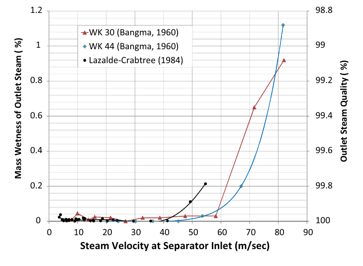
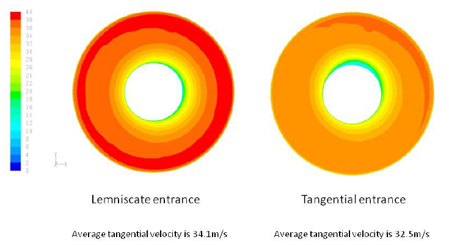

# Literature figures for the final research report

The recommended set has four placements: separator operation, empirical performance versus inlet velocity, a published inlet/flow-field comparison, and wall-film entrainment. Each gives visual support to a different part of the [literature review](draft/01-introduction-and-literature-review.md).

Placements A–D are now inserted as report Figures 1–4. Figure 3 contains both Pointon panels. The report captions and nearby text give the final interpretation; the source numbers below retain their original meanings.

The review used separate source inspections of Zarrouk and Purnanto (2015), Pointon et al. (2009), Rizaldy et al. (2016), relevant figures in Skoog (2020), and the author-hosted Purnanto et al. (2013) text. The local PDF figures in the recommended set were inspected visually. Purnanto's original online figure images could not be inspected; accessible reproductions in the design review are identified separately below.

**All figure numbers below are the original numbers in the cited sources.** They are not new report numbers. PDF pages are counted from the first page of the local file, including Pointon's additional cover page. Compact previews were rendered directly from selected regions of the local PDFs. Their published panels, labels and legends are unchanged; the original captions can be read in the linked full-page previews.

## Recommended set

| Placement | Original source figure | Location in source | Report placement | What it adds |
| --- | --- | --- | --- | --- |
| A. Physical operation | Rizaldy et al. (2016), **Figure 5** | PDF page 3; no page number printed | Section 2.1, after describing the BOC steam pipe and brine discharge | Places rotating flow, wall liquid, steam collection and carryover within a physical vessel |
| B. Performance and loading | Zarrouk and Purnanto (2015), **Figure 12** | PDF page 12; printed page 247 | Section 2.2, after the paragraph on competing effects of velocity | Shows the sharp rise in outlet wetness and the different breakdown regions in the empirical datasets |
| C. Earlier CFD findings | Pointon et al. (2009), **Figures 5 and 7** as paired panels | PDF pages 5 and 6; printed pages 946 and 947 | Section 2.3, alongside the Pointon comparison | Connects a visible change in inlet geometry to the calculated tangential-velocity distribution |
| D. Wall-film physics | Rizaldy et al. (2016), **Figure 9** | PDF page 5; no page number printed | Section 2.4, after introducing deposition, drainage and entrainment | Explains how liquid already at the wall can return to the steam as droplets |

Placement A replaces the earlier flow-route diagram in the report and adds vessel structure. Placements B–D then move from observed performance behaviour to earlier CFD findings and a possible liquid-transfer mechanism.

### A. Physical operation: Rizaldy et al. (2016), Figure 5

**Purpose.** The reader can locate the wall film, internal steam pipe, separate brine outlet and downstream liquid collection. It supplies the physical arrangement missing from the current box-and-arrow operation diagram, and links the operating description to the carryover problem.

**Use.** This is a conceptual flow diagram. Its arrows do not show calculated trajectories or flow rates. The mass-flow symbols belong to the source paper's account and should be defined if the original is used. For a first explanation of operation, a new schematic could retain the physical routes and use plain labels in place of these symbols. Rizaldy's Figure 4 on the same page is a simpler alternative if only the inlet and two outlets are needed.

**Proposed caption.** *Conceptual steam and liquid routes in a vertical bottom-outlet cyclone separator. Liquid can drain through the brine outlet or be carried towards the steam outlet. The wall film and downstream drain are shown schematically. Source: Rizaldy et al. (2016), Figure 5.*

Source: [local primary paper](../../CFD_wiki/raw/053_Rizaldy_Final.pdf); [author-hosted paper](https://www.researchgate.net/publication/310818568_LIQUID_CARRYOVER_IN_GEOTHERMAL_STEAM-WATER_SEPARATORS); [full page with Figures 4–5 and source caption](figures/literature-candidates/wall-film/rizaldy-2016-pdf-page-03.png).

### B. Performance and loading: Zarrouk and Purnanto (2015), Figure 12

**Purpose.** The sharp increase in wetness makes the competing effects of velocity visible. It gives the reader a performance observation to explain before the review introduces possible film behaviour and the present investigations.

**Use.** Preserve both axes, the legend and the individual datasets. The right-hand steam-quality axis runs in the opposite direction to the increasing wetness axis. The datasets concern different separator diameters and conditions. The figure does not establish a breakdown threshold for the current model or identify the cause of every change. The source caption credits data from Bangma (1960) and Lazalde-Crabtree (1984); carry those credits into the report. A new quantitative plot would require traceable data or a documented digitisation, rather than an approximate reconstruction by eye.

**Proposed caption.** *Empirical outlet wetness and steam quality versus inlet steam velocity. The datasets show different regions of rapid wetness increase and concern different separator sizes. Source: Zarrouk and Purnanto (2015), Figure 12, using data from Bangma (1960) and Lazalde-Crabtree (1984).*

Source: [local primary review](<../../CFD_wiki/raw/Zarrouk and Purnanto 2014.pdf>); [DOI](https://doi.org/10.1016/j.geothermics.2014.05.009); [full page and source caption](figures/literature-candidates/design-overview/zarrouk-purnanto-2015-page-12.png).

### C. Earlier CFD findings: Pointon et al. (2009), Figures 5 and 7

**Purpose.** The geometry panel explains the inlet terms. The velocity panel then shows the local information CFD supplies: the two configurations produce different tangential-velocity distributions. This is a direct visual connection between design, internal physics and a reported modelling result.

**Use.** Combine the geometry and velocity comparison into one report figure with separate panel labels. The published mean tangential velocities are 34.1 m/s for the lemniscate entry and 32.5 m/s for the tangential entry. The colour-bar numbers are faint in the source; the mean annotations are clearer. Retain the legend and annotations at sufficient display size. These are calculated fields for Pointon's configurations, rather than measurements or results from the current model. They do not demonstrate film discharge or whole-separator mass closure.

**Proposed caption.** *Published inlet configurations and calculated tangential-velocity fields: scrolled (lemniscate) entry on the left and tangential entry on the right. The reported mean tangential velocities are 34.1 and 32.5 m/s, respectively. The comparison concerns the configurations examined in the earlier study. Source: Pointon et al. (2009), Figures 5 and 7.*

Source: [local primary paper](../../CFD_wiki/raw/1028587.pdf); [publisher-hosted paper](https://publications.mygeoenergynow.org/grc/1028587.pdf); [full geometry page](figures/literature-candidates/pointon/page-5.png); [full velocity page](figures/literature-candidates/pointon/page-6.png).

### D. Wall-film physics: Rizaldy et al. (2016), Figure 9

**Purpose.** This is the clearest figure for the distinction between liquid reaching the wall and liquid remaining collected. It makes the steam–film interaction concrete and provides physical context for the EWF investigation.

**Use.** The two panels are conceptual mechanisms. The source associates panel (a), undercut entrainment, with a lower film Reynolds number and panel (b), roll-wave entrainment, with a higher one. The drawing does not show measured events in this separator or prove that the selected EWF implementation resolves both mechanisms. The original caption credits Ishii and Grolmes (1975); retain that credit alongside the paper consulted.

**Proposed caption.** *Conceptual droplet entrainment from a wall film: (a) undercut entrainment and (b) roll-wave entrainment. Steam interaction with the film can return liquid to the steam flow after wall deposition. Source: Rizaldy et al. (2016), Figure 9, after Ishii and Grolmes (1975).*

Source: [local primary paper](../../CFD_wiki/raw/053_Rizaldy_Final.pdf); [author-hosted paper](https://www.researchgate.net/publication/310818568_LIQUID_CARRYOVER_IN_GEOTHERMAL_STEAM-WATER_SEPARATORS); [full page and original credit](figures/literature-candidates/wall-film/rizaldy-2016-pdf-page-05.png).

## Alternatives and additional support

| Candidate | Verified location and preview | What it would support | Selection judgement |
| --- | --- | --- | --- |
| **Pointon (2009), Figure 2**: steam fraction, capture efficiency and outlet quality | PDF page 3 / printed 944; [preview](figures/literature-candidates/pointon/page-3.png) | Section 2.2: the different denominators in liquid capture and steam quality | Strong optional addition if the metric distinction remains difficult to explain. A new plot from the mass-accounting relation would improve the small labels; this is a relation between defined quantities, rather than field-performance data. |
| **Rizaldy (2016), Figure 6**: sampling and steam-treatment arrangement | PDF page 4; [preview](figures/literature-candidates/wall-film/rizaldy-2016-pdf-page-04.png) | Section 2.2: sampling location, washing, condensate and drain pots | Useful if the field-comparison paragraph needs more context. Its system layout explains the sampling issue more directly than the sodium measurements alone. |
| **Zarrouk and Purnanto (2015), Figure 10**: dimensioned BOC and inlet views | PDF page 10 / printed 245; [preview](figures/literature-candidates/design-overview/zarrouk-purnanto-2015-page-10.png) | Section 2.1: physical steam-pipe arrangement and inlet geometry | Clear alternative to placement A, especially if geometric proportions need explanation. Its caption credits Bangma (1961) and Lazalde-Crabtree (1984). The dimensions are literature design symbols, not the current mesh dimensions. |
| **Zarrouk and Purnanto (2015), Figures 13–14**: three geometries and velocity vectors | PDF pages 13–14 / printed 248–249; [geometry](figures/literature-candidates/design-overview/zarrouk-purnanto-2015-page-13.png), [velocity](figures/literature-candidates/design-overview/zarrouk-purnanto-2015-page-14.png) | Section 2.3: Purnanto's three configurations and smoother spiral entry | Alternative to placement C if the inherited model's literature basis is the priority. Vessel proportions also differ, so this is not an isolated inlet-shape test. The vector comparison is at inlet enthalpy 1600 kJ/kg. |
| **Pointon (2009), Figure 6**: 3 µm droplet paths | PDF page 5 / printed 946; [preview](figures/literature-candidates/pointon/page-5.png) | Sections 2.3 or 2.5: DPM trajectories and collection assumptions | Optional. The illustrated case uses one-way coupling and assumes adhesion/removal at specified walls and the baffle. It does not resolve later film drainage or entrainment. The many paths make the figure visually busy. |
| **Rizaldy (2016), Figure 13**: predicted carryover versus film loading and velocity | PDF page 7; [preview](figures/literature-candidates/wall-film/rizaldy-2016-pdf-page-07.png) | Section 2.4: loading and velocity sensitivity in the entrainment model | Use only as correlation/model predictions. The paper states that the actual brine-flow data needed for comparison were unavailable. Do not describe the curves as measured or field-validated carryover. |
| **Skoog (2020), Figure 6**: vapour/film/droplet flows and exchange rates | PDF page 21 / printed 20; [preview](figures/literature-candidates/wall-film/skoog-2020-pdf-page-21.png) | Section 2.5: separate liquid stores and deposition/entrainment | Lower priority. These are one-dimensional, correlation-based calculations for a heated reactor-channel setting, including evaporation. An original three-field exchange schematic would explain the transferable organisation with less reactor-specific detail. |
| **Zarrouk and Purnanto (2015), Figure 5**: power versus separation pressure | PDF page 7 / printed 242; [preview](figures/literature-candidates/design-overview/zarrouk-purnanto-2015-page-07.png) | Section 2.2: plant-level pressure selection | Optional context. The example does not supply complete operating conditions and cannot establish an optimum pressure for the current model. |

For a new version of Pointon's metric plot, the steady mass-accounting relation is

$$
x_{\mathrm{out}}=
\frac{x_{\mathrm{in}}}
{x_{\mathrm{in}}+(1-\eta_L)(1-x_{\mathrm{in}})},
$$

where $x_{\mathrm{in}}$ is inlet steam mass fraction and $\eta_L$ is collected liquid divided by inlet liquid. This relation assumes that all inlet vapour exits through the steam route, uncollected liquid leaves with it, and accumulation and phase change are absent. It can explain the metric distinction; it must not be used to infer efficiency from the present calculations while their liquid account remains unresolved.

## Purnanto source access and figure choices

The [author-hosted 2013 IPENZ text](https://www.researchgate.net/publication/269519626_CFD_MODELLING_OF_TWO-PHASE_FLOW_INSIDE_GEOTHERMAL_STEAM-WATER_SEPARATORS) verifies the following original locations:

| Original figure | Page in the 2013 version | Potential use | Inspection status |
| --- | ---: | --- | --- |
| Figure 4: spiral-inlet geometry | 2 | Section 2.1 or 2.3 | Caption and location verified; original image not accessible for visual review |
| Figure 7: model scope | 5 | Section 2.5 or methods: represented domain and collection boundary | Caption and location verified; original image not accessible for visual review |
| Figure 11: spiral-inlet velocity profile | 7 | Section 2.3: prior CFD field | Original image not accessible; the related three-design velocity comparison was inspected in review Figure 14 |
| Figure 17: spiral pressure field | 8 | Section 2.2: spatial pressure structure | Caption and location verified; original image not accessible for visual review |

Use the accessible review's figure number and attribution if its image is the one reproduced. The primary 2013 study excludes flashing and does not solve energy, so a pressure illustration must not be described as evidence of a flashing or drying mechanism.

## Source and selection checks

- The local design-review PDF has image–caption mismatches under labels **8/9** and **15/16**. In particular, the pressure-contour image appears beneath caption 16, while text/caption 15 describe it; the image's legend says **Total Pressure**. These panels are excluded from the recommended set. This is a finding about the local copy, rather than a verified error in the published original. The [detailed source review](figures/literature-candidates/design-overview/candidate-review.md) records the inspected pages and credits.
- A version-matched documentation alternative for roughness is Ansys Fluent 2025 R2, **Figure 4.20**, the logarithmic velocity-profile shift, or **Figure 4.21**, equivalent sand-grain roughness. Their numbers and captions were checked in the [official theory guide](https://ansyshelp.ansys.com/public/Views/Secured/corp/v252/en/flu_th/x1-5720008.164.html). They are reserve candidates: they need a discussion of wall-law variables and do not supply liquid-collection evidence. Their images were not fully inspected for inclusion.
- Historical equipment photographs, worldwide separator-share charts and structural-stress figures add less to the current argument than the selected operation, performance and transport figures.
- The inserted report figures retain the source credits and the earlier credits identified in the original captions. The report captions define Figure 1's source symbols and distinguish empirical, calculated and conceptual evidence. The complete draft is numbered from Figure 1 to Figure 11; final page use remains to be checked.
