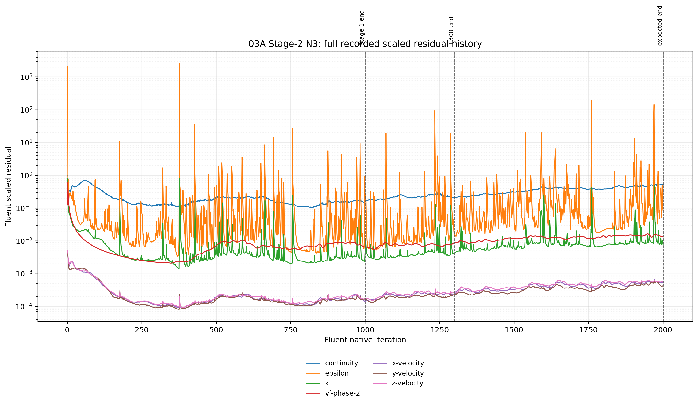

> **Legacy source:** Setups/reports/full-geometry/mixture/steady-liquid-outlet/03a/03a-08b-stage2-N3-results.md  
> **Migration note:** Historical wording, evidence status, and uncertainty labels are preserved; this Project copy is not a reinterpretation. Raw and machine-generated artifacts remain at their legacy paths.

# 03A Stage 2 — N3 results

## Screening role

N3 tests whether added numerical diffusion in the turbulence transport equations suppresses the Stage-1 instability:

```text
k discretisation:       Second Order Upwind → First Order Upwind
epsilon discretisation: Second Order Upwind → First Order Upwind
```

The original Stage-1 under-relaxation factors were retained, including `k URF = 0.8` and `epsilon URF = 0.8`. Momentum remained second-order, volume fraction remained QUICK, pressure remained PRESTO!, and the RNG `k-epsilon` model remained active.

This branch was continued independently from the immutable Stage-1 iteration-1,000 case/data pair. It was not reinitialized and no liquid patch was applied.

## Execution and evidence

| Phase | Native continuation | Endpoint | Verification | Evidence |
|---|---:|---:|---|---|
| Initial screen | +300, ending at Fluent iteration 1300 | Case/data pair present | `RUN_COMPLETED_ENDPOINT_VERIFIED` | initial journal (historical machine artifact path: `../../../../PyAnsys/output/03a_stage2/20260817T125355Z/run/03A-S2-N3-from-i1000-plus300-20260817T125355Z.jou`; not migrated), initial residual history (historical machine artifact path: `../../../../PyAnsys/output/03a_stage2/20260817T125355Z/run/post_simulation_analysis/N3-initial-screen-residual-check.json`; not migrated) |
| Extension | +700, ending at Fluent iteration 2000 | Case/data pair present | `RUN_COMPLETED_ENDPOINT_VERIFIED` | extension journal (historical machine artifact path: `../../../../PyAnsys/output/03a_stage2/20260817T132736Z/extension-700/03A-S2-N3-from-initial-screen-plus700-20260817T132736Z.jou`; not migrated), extension summary (historical machine artifact path: `../../../../PyAnsys/output/03a_stage2/20260817T132736Z/report/N3/N3-summary.json`; not migrated) |

The extension endpoint is the paired remote case/data stem:

```text
03A-S2-N3-from-initial-screen-plus700-20260817T132736Z.cas.h5
03A-S2-N3-from-initial-screen-plus700-20260817T132736Z.dat.h5
```

No Fluent numerical exception or transport failure was recorded for the N3 extension.

## Scaled residual history



[Open the N3 full scaled-residual figure](figures/branches/N3/N3-full-scaled-residuals.png)

The plot uses the direct Fluent scaled-residual monitor values. The histories were stitched using the recorded native iteration coordinates. Retained monitor points from earlier phases were not treated as new iterations, and no missing intervals were interpolated.

### Final 100-iteration statistics at the +700 endpoint

| Residual | Final value | Median | P95 | Minimum in continuation | Maximum in continuation |
|---|---:|---:|---:|---:|---:|
| Continuity | 5.3391e-1 | 4.8200e-1 | 5.3325e-1 | 2.1235e-1 | 5.4740e-1 |
| x-velocity | 5.2847e-4 | 5.3933e-4 | 5.8606e-4 | 2.4237e-4 | 6.6375e-4 |
| y-velocity | 4.2137e-4 | 4.6907e-4 | 5.5925e-4 | 2.2145e-4 | 5.9548e-4 |
| z-velocity | 5.5915e-4 | 5.7538e-4 | 6.2654e-4 | 2.6659e-4 | 6.3998e-4 |
| k | 7.8830e-3 | 9.2380e-3 | 4.3734e-2 | 4.4029e-3 | 5.0355e-1 |
| epsilon | 8.4633e-2 | 1.4268e-1 | 2.8116e+0 | 1.3925e-2 | 1.9815e+2 |
| vf-phase-2 | 1.3215e-2 | 1.4324e-2 | 1.6077e-2 | 8.4377e-3 | 1.6316e-2 |

The N3 +700 continuation does not show a bounded numerical improvement. Continuity rises from approximately `0.2126` at the beginning of the continuation to `0.5339` at the endpoint. The final-window continuity median is approximately three times the Stage-1 endpoint value of `0.1604`. The `epsilon` history remains highly intermittent, with a final-window P95 of approximately `2.81` and a continuation maximum above `198`.

## Flux and conservation evidence

The following values use the same diagnostic all-discovered-pressure-outlet balance definition used by the Stage-1 workflow.

| State | Liquid to steam outlet (kg/s) | Vapour to steam outlet (kg/s) | Total liquid outlet (kg/s) | Total vapour outlet (kg/s) | Mass imbalance (kg/s) | Mass imbalance |
|---|---:|---:|---:|---:|---:|---:|
| Stage-1 endpoint | 0.1425 | 44.1293 | 82.7549 | 81.6556 | 34.0758 | 17.17% |
| N3 after +300 | 0.9105 | 43.7592 | 74.1968 | 81.6974 | 42.5921 | 21.46% |
| N3 after +700 | 4.1626 | 47.1520 | 147.5250 | 80.9302 | 29.9689 | 15.10% |

At the +700 endpoint, the reported carrier metrics are:

```text
liquid inlet       = 116.8468 kg/s
vapour inlet       =  81.6395 kg/s
liquid outlet      = 147.5250 kg/s
vapour outlet      =  80.9302 kg/s
mixture inlet      = 198.4863 kg/s
mixture outlet     = 228.4552 kg/s
eta_phase          =   0.9644
x_out              =   0.9189
```

The N3 +700 endpoint improves the diagnostic mass imbalance relative to Stage 1, from `17.17%` to `15.10%`. However, the improvement is accompanied by a large change in phase routing: liquid flow to the steam outlet increases from `0.1425 kg/s` to `4.1626 kg/s`, total liquid outlet flow increases from `82.7549 kg/s` to `147.5250 kg/s`, and the diagnostic outlet vapour quality decreases from `0.9968` to `0.9189`.

The endpoint flux evidence is in N3 extension flux-check.json (historical machine artifact path: `../../../../PyAnsys/output/03a_stage2/20260817T132736Z/extension-700/post_simulation_analysis/N3-extension-700-flux-check.json`; not migrated).

## Liquid inventory evidence

The N3 monitor-history artifact contains residual history, but the flux and inventory monitor sets have zero recorded points. Therefore this branch has no reliable temporal liquid-inventory history to plot. The N3 result is assessed using endpoint fluxes and conservation diagnostics only; no inventory trend is inferred.

## Screening assessment

| Dimension | N3 assessment |
|---|---|
| Numerical stability | **Worse during the +700 continuation.** Continuity and the turbulence residual envelope rise substantially above the Stage-1 endpoint behaviour. |
| Conservation | **Improved at the +700 endpoint.** The diagnostic imbalance is 15.10%, below the Stage-1 17.17%, although the +300 checkpoint was worse at 21.46%. |
| Physical solution behaviour | **Materially changed.** Liquid outlet routing, liquid carryover to the steam outlet, and the reported outlet phase quality all change substantially; a temporal inventory check is unavailable. |
| Canonical-return qualification | **Not selected at this screening stage.** The conservation improvement is not accompanied by sufficient numerical-stability evidence. |

### Classification

`N3 — STABILISES CONSERVATION BUT CHANGES THE SOLUTION; retain as a documented first-order turbulence result.`

N3 is therefore not currently selected for the canonical-return test. The endpoint balance improvement will remain visible in the final cross-branch comparison, but it will not be interpreted as proof that first-order turbulence transport has produced an authority-ready 03A field.

## Source artifacts

- N3 branch summary JSON (historical machine artifact path: `../../../../PyAnsys/output/03a_stage2/20260817T132736Z/report/N3/N3-summary.json`; not migrated)
- [N3 full scaled-residual figure](figures/branches/N3/N3-full-scaled-residuals.png)
- N3 initial residual history (historical machine artifact path: `../../../../PyAnsys/output/03a_stage2/20260817T125355Z/run/post_simulation_analysis/N3-initial-screen-residual-check.json`; not migrated)
- N3 extension residual history (historical machine artifact path: `../../../../PyAnsys/output/03a_stage2/20260817T132736Z/extension-700/post_simulation_analysis/N3-extension-700-residual-check.json`; not migrated)
- N3 extension monitor history (historical machine artifact path: `../../../../PyAnsys/output/03a_stage2/20260817T132736Z/extension-700/post_simulation_analysis/N3-extension-700-monitor-history.json`; not migrated)
- N3 extension flux evidence (historical machine artifact path: `../../../../PyAnsys/output/03a_stage2/20260817T132736Z/extension-700/post_simulation_analysis/N3-extension-700-flux-check.json`; not migrated)
- Stage-1 reference residual history (historical machine artifact path: `../../../../PyAnsys/output/post_simulation_analysis/03a_08b_parity_full_geometry_iter1000_20260817T110345Z-residual-check.json`; not migrated)
- Stage-1 reference flux evidence (historical machine artifact path: `../../../../PyAnsys/output/post_simulation_analysis/03a_08b_parity_full_geometry_iter1000_20260817T110345Z-flux-check.json`; not migrated)
