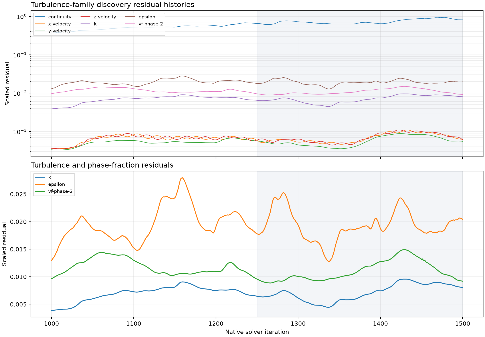
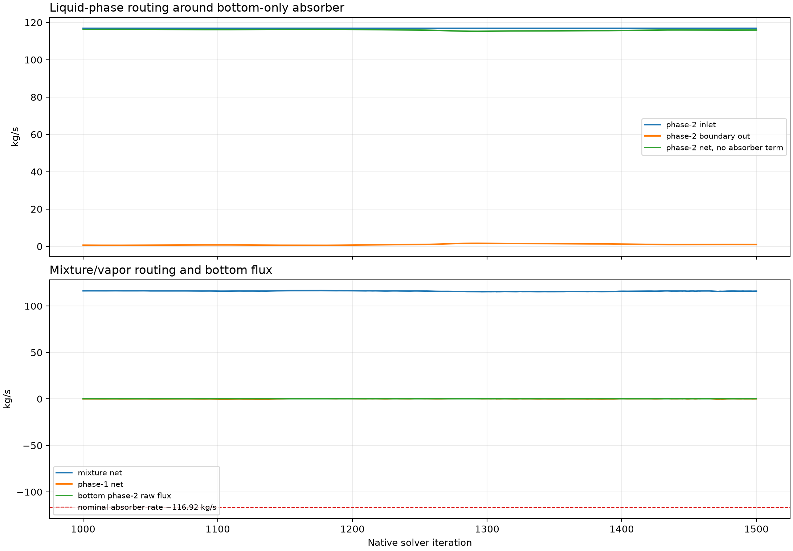
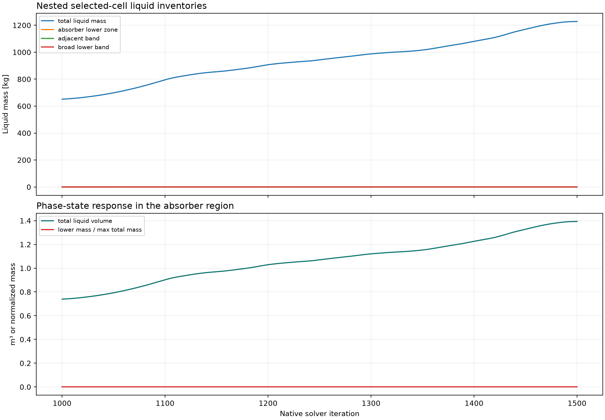

# P71A-T0-RNG-REFERENCE — results

## Answer at a glance

- **Question:** What finite-horizon residual, turbulence-limiting,
  phase-routing, and absorber-balance behaviour does the exact active-1000
  reference produce?
- **Result:** The reference completed the declared 500 active iterations from
  the exact parent, but the recorded histories are strongly non-stationary.
  Total liquid mass increased from 943.23 to 1,227.86 kg over the late
  native-iteration window 1250–1500, while continuity remained of order
  0.65–0.95 in the same tail. Reverse flow and turbulent-viscosity limiting
  were reported on every solved iteration.
- **Evidence status:** complete for the declared finite discovery contract;
  the spatial figure is derived selected-cell evidence and contains no field
  contours.
- **Decision / gate status:** `COMPLETE_VERIFIED` for T0 discovery execution.
  No qualification or hypothesis route is entered.

## Controlled change and parent proof

This child applied no turbulence delta. It loaded the exact paired
`P7-E5-CZ-ABSORB-COLD-RAMP11692` active-1000 parent on `student`, then
preserved the restart field, Mixture formulation, steady solver, bottom wall,
bottom-only phase-2 absorber, vapor-only pressure outlet, inlet conditions,
source tree, numerics, residual criteria, and report definitions.

The parent hashes read before the child were:

```text
case: cd7f27b45435b0c381f9f01bc02e7a3bce3655fbd6269175aab60c262c4c29d3
data: 16b77042d1d62eb3a56aee1b01aee1bfa9fadf96a94f3c3804c6eab12705268b
```

The prepared pair and final active-500 pair were saved, reopened, and read
back. The phase-2 source readback was `-116.9200000000002 kg/s` integrated
over `p7-e5-lower-y010`, matching the commanded `-116.92 kg/s` within the
readback precision. This is source realization evidence, not a claim of
numerical or physical convergence.

## Core visual evidence



_Figure F1. Native residual histories for the finite child horizon, with the
late half-window shaded. The histories are shown raw; no tail was removed or
smoothed._

- **What it shows:** continuity, momentum, k, epsilon, and phase-2
  volume-fraction residual behaviour over 501 recorded points.
- **Observed:** the reference does not settle to a small, stationary residual
  tail; continuity reaches approximately `8.09e-1` at native iteration 1500,
  and the turbulence/phase residuals remain visibly time-varying.
- **Limitation:** the 500-iteration discovery horizon is not a convergence
  qualification horizon.



_Figure F2. Phase-resolved and mixture boundary routing histories using Fluent
  report-file fluxes. Fluent raw boundary flux signs are retained except that
  the plotted boundary-out series is sign-reversed to express outward flow as
  positive; the nominal absorber line is a commanded source reference._

- **What it shows:** phase-2 inlet/outlet routing, mixture and phase-1 net
  routing, and bottom phase-2 raw flux across the same native iteration basis.
- **Observed:** the late phase-2 boundary net without the absorber term is
  approximately `115.67 kg/s` on average, with a range of `0.70 kg/s`; the
  absorber source must remain separately accounted for.
- **Limitation:** the nominal `116.92 kg/s` line is not substituted for the
  integrated source or inventory evidence.



_Figure F3. Selected-cell liquid inventories for the total domain, absorber
  lower zone, adjacent band, and broad lower band, plus total liquid volume.
  These are derived report histories, not contour fields._

- **What it shows:** the spatially selected phase-state evidence available in
  the queue's report instrumentation.
- **Observed:** total liquid inventory rises strongly in the late window, from
  `943.23` to `1,227.86 kg`; the lower-zone liquid-mass report remains zero,
  while the adjacent and broad-band signals remain small and variable.
- **Limitation:** no matched k/epsilon/turbulent-viscosity/volume-fraction
  contours were captured, so no field-level spatial claim is made.

## Numerical adequacy and warnings

- Active solve: 500 iterations after a 50-iteration smoke block; checkpoint
  pairs were written at active 250 and active 500.
- Required report histories: 18/18 present, each with 501 points.
- Scaled residual history: 500 parsed solve points, including continuity,
  three velocity components, k, epsilon, and phase-2 volume fraction.
- Solver diagnostics: 500 reverse-flow messages and 500 turbulent-viscosity
  ratio-limit messages; no AMG divergence or floating-point/fatal messages.
- The repeated pressure-outlet reverse-flow and viscosity-ratio limiting are
  direct solver observations. They are not, by themselves, a physical
  explanation of the absorber behaviour.

## Interpretation and claim boundary

- **Observed:** the exact RNG reference can be advanced through the finite
  discovery horizon and preserves the declared source realization, but its
  residuals and total liquid inventory drift substantially over the recorded
  tail.
- **Inferred:** the reference is not a numerically stationary comparison case
  at this horizon; nearby closure comparisons must be interpreted against this
  non-stationary baseline.
- **Competing explanation:** the observed drift may reflect coupled absorber,
  phase-routing, and turbulence/numerical interactions. This child does not
  isolate those mechanisms beyond holding the declared parent state fixed.
- **Claim boundary:** no statement of steady convergence, physical absorber
  validity, closure superiority, or Phase 08 readiness is supported here.

## Conclusion and next action

T0 is complete as the reference discovery child. The finite reference package
was used for like-for-like comparison with the two approved T1 closure
children. The complete finite family comparison is recorded in
`../family-analysis-summary.json` and the two family-level figures under
`../figures/`. The screen remains discovery-only: no T2–T4 or hypothesis route
is authorized because all three branches retain finite-horizon numerical
uncertainty.

## Run and artifact details

- Run ID: `P71A-T0-RNG-REFERENCE-student-20260911T092613Z`
- Remote final pair: `C:\Users\Shuhei Yokkaichi\Documents\FluentRuns\Phase07\Phase71A\TurbulenceFamily\P71A-T0-RNG-REFERENCE\20260911T092613Z\P71A-T0-RNG-REFERENCE-active500.{cas.h5,dat.h5}`
- Local [run manifest](run-manifest.json), [run paths](run-paths.yaml),
  [residual history](residuals.json), [report histories](reports.json), and
  [analysis summary](analysis-summary.json)
- Attached Fluent [transcript](transcript.txt)
