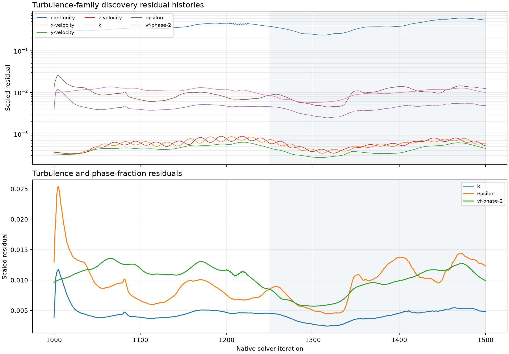
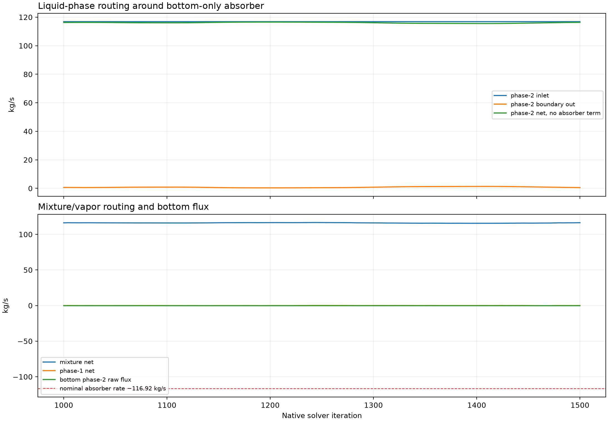
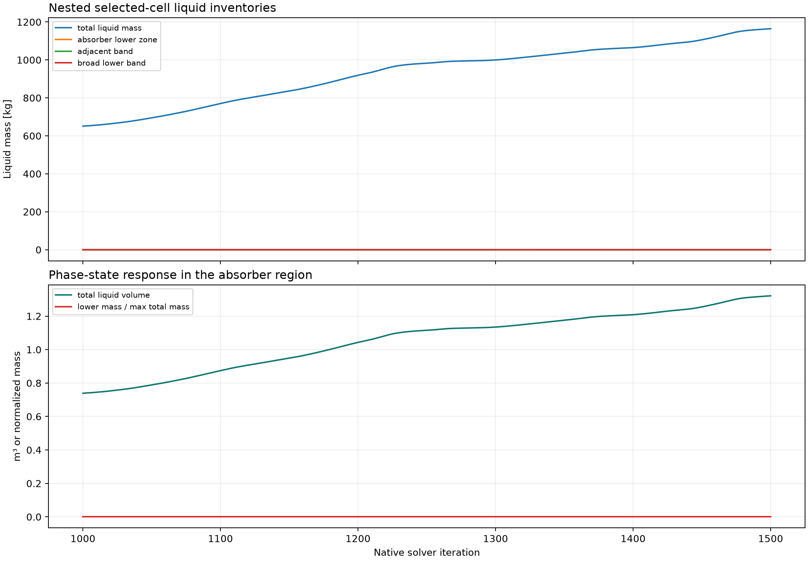

# P71A-T1-STANDARD-KEPSILON — results

## Answer at a glance

- **Question:** Does changing only the k-epsilon closure from RNG to standard
  k-epsilon alter the finite-horizon turbulence and absorber-coupled
  numerical signature?
- **Result:** The exact-parent child completed the declared 500 active
  iterations. Continuity was lower than the T0 reference through much of the
  run, but the branch still showed persistent reverse flow and broad
  turbulent-viscosity ratio limiting. In the late native-iteration window
  1250–1500, total liquid mass rose from 982.72 to 1,164.48 kg and continuity
  ended at `5.47e-1`.
- **Evidence status:** complete for the finite discovery contract; the spatial
  figure is derived selected-cell evidence and contains no field contours.
- **Decision / gate status:** `COMPLETE_VERIFIED` for T1-standard discovery
  execution. No qualification or hypothesis route is entered.

## Controlled delta and parent proof

The child loaded the exact paired `P7-E5-CZ-ABSORB-COLD-RAMP11692` active-1000
parent on `student`, proved the complete parent state, and changed only the
viscous closure from RNG to standard k-epsilon. The restart field was not
initialized, patched, reset, remeshed, or resplit. The Mixture formulation,
steady solver, bottom wall, bottom-only phase-2 absorber, vapor-only pressure
outlet, inlet conditions, source tree, numerics, residual criteria, and report
definitions were preserved.

Parent hashes read before mutation:

```text
case: cd7f27b45435b0c381f9f01bc02e7a3bce3655fbd6269175aab60c262c4c29d3
data: 16b77042d1d62eb3a56aee1b01aee1bfa9fadf96a94f3c3804c6eab12705268b
```

The closure readback, prepared save/reopen, smoke test, checkpoint pair, and
final active-500 pair all passed. The integrated phase-2 source readback was
`-116.9200000000002 kg/s` over `p7-e5-lower-y010`, matching the declared
command within readback precision.

## Core visual evidence



_Figure F1. Native residual histories for the finite standard k-epsilon child
horizon, with the late half-window shaded. Raw histories are retained._

- **What it shows:** continuity, momentum, k, epsilon, and phase-2
  volume-fraction residuals across 501 recorded points.
- **Observed:** standard k-epsilon reduces continuity relative to the T0
  reference over much of the run, but the tail remains oscillatory and ends at
  approximately `5.47e-1`; this is not a stationary low-residual tail.
- **Limitation:** the 500-iteration discovery horizon is not a convergence or
  qualification horizon.



_Figure F2. Phase-resolved and mixture boundary routing histories from Fluent
  report files. Boundary-out series are sign-reversed only for outward-flow
  readability; the absorber rate line is the nominal command, not a measured
  removal surrogate._

- **What it shows:** phase-2, phase-1, and mixture routing, including the
  bottom phase-2 flux relevant to the absorber balance.
- **Observed:** late phase-2 boundary net without the absorber term averages
  about `115.92 kg/s` with a `0.91 kg/s` range, while the integrated source
  readback remains `-116.9200000000002 kg/s`.
- **Limitation:** the boundary histories and source integral are kept as
  distinct evidence channels.



_Figure F3. Selected-cell liquid inventories for the total domain, absorber
  lower zone, adjacent band, and broad lower band, plus total liquid volume.
  These are report-derived selections, not contours._

- **What it shows:** the available lower-zone and nested spatial phase-state
  histories on a matched native iteration basis.
- **Observed:** total liquid mass rises by about `181.76 kg` over the late
  window; the lower-zone liquid-mass report remains zero while adjacent and
  broad-band signals remain small and variable.
- **Limitation:** no matched k/epsilon/turbulent-viscosity/volume-fraction
  contours were captured, so no field-level spatial claim is made.

## Numerical adequacy and warnings

- Active solve: 500 iterations after a 50-iteration smoke block; checkpoint
  pairs were written at active 250 and active 500.
- Required report histories: 18/18 present, each with 501 points.
- Scaled residual history: 500 parsed solve points, including continuity,
  three velocity components, k, epsilon, and phase-2 volume fraction.
- Solver diagnostics: 500 reverse-flow messages and 500 turbulent-viscosity
  ratio-limit messages; no AMG divergence or floating-point/fatal messages.
- The limiter affected roughly 132,000–150,000 cells during the solve. This is
  a recorded numerical diagnostic, not proof of a physical mechanism.

## Interpretation and claim boundary

- **Observed:** the standard closure can advance from the exact parent and
  produces lower continuity residuals than the T0 reference over parts of the
  finite horizon, while retaining strong viscosity limiting, reverse flow,
  and inventory drift.
- **Inferred:** standard k-epsilon changes the numerical trajectory, but the
  finite screen does not establish a stationary or qualified branch.
- **Competing explanation:** residual differences may reflect the coupled
  closure/absorber/phase-routing response; this child isolates only the
  declared closure branch and does not identify causality beyond that control.
- **Claim boundary:** no closure superiority, steady convergence, physical
  absorber validity, or Phase 08 readiness is supported.

## Conclusion and next action

T1-standard is complete as an approved discovery child. Compare it with T0
and T1-realizable using the same report definitions and finite window; the
completed family comparison is recorded in `../family-analysis-summary.json`
and the two family-level figures under `../figures/`. The screen remains
discovery-only: no T2–T4 or hypothesis route is authorized because all three
branches retain finite-horizon numerical uncertainty.

## Run and artifact details

- Run ID: `P71A-T1-STANDARD-KEPSILON-student-20260911T094339Z`
- Remote final pair: `C:\Users\Shuhei Yokkaichi\Documents\FluentRuns\Phase07\Phase71A\TurbulenceFamily\P71A-T1-STANDARD-KEPSILON\20260911T094339Z\P71A-T1-STANDARD-KEPSILON-active500.{cas.h5,dat.h5}`
- Local [run manifest](run-manifest.json), [run paths](run-paths.yaml),
  [residual history](residuals.json), [report histories](reports.json), and
  [analysis summary](analysis-summary.json)
- Attached Fluent [transcript](transcript.txt)
