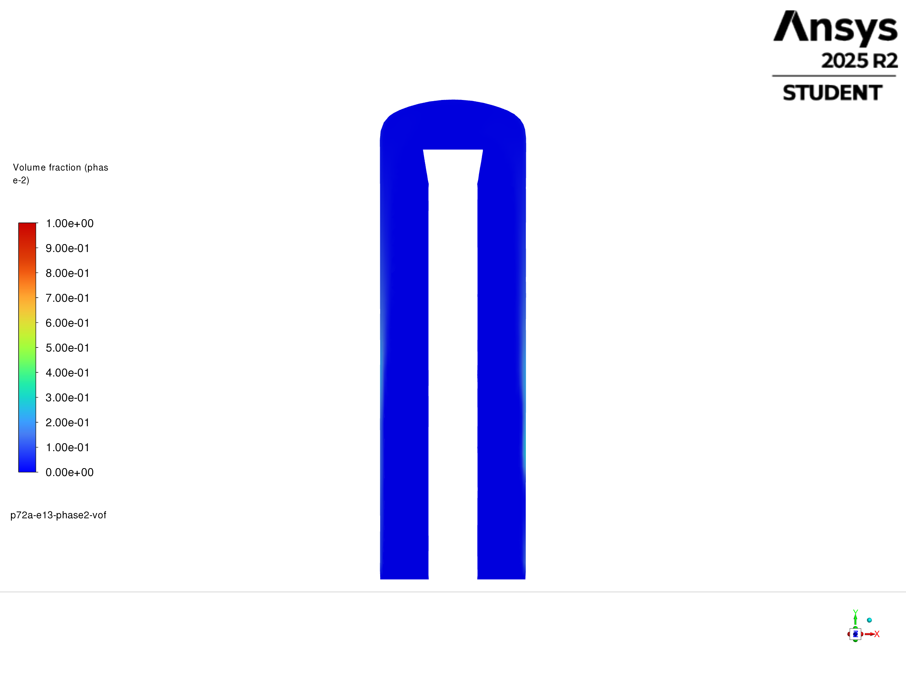
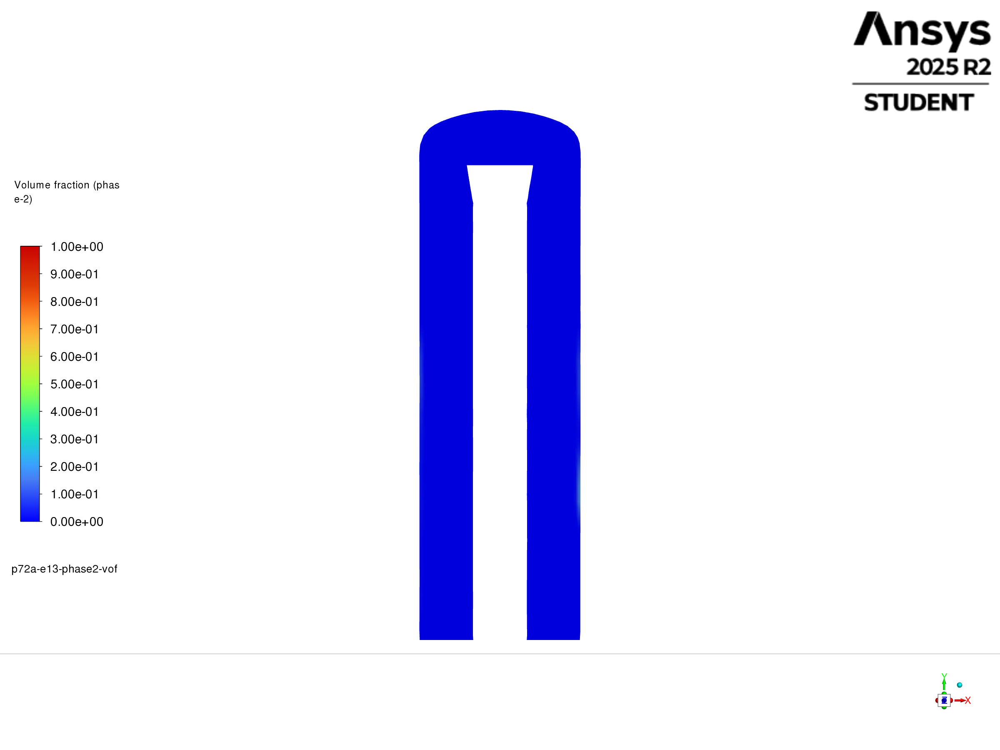
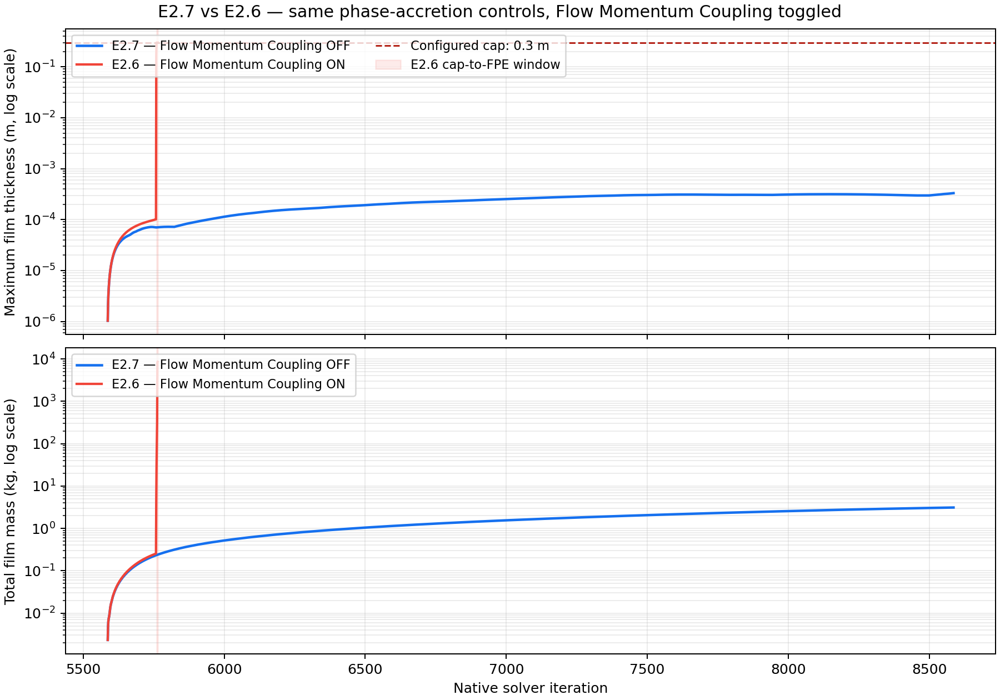
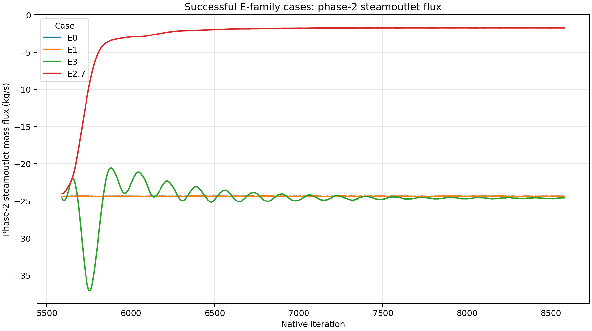

# Phase 7.2A Family E — Execution result

## Native phase-2 volume-fraction contours — 2026-09-23

The four Fluent-native contours use the preserved final native-8586
case/data pairs, X–Y centre cut at Z = 0 m, `phase-2-vof`, fixed 0–1 scale,
and matching orthographic camera and 2400 × 1800 export. Source identities
and settings are in the [E0 export manifest](../../../../PyAnsys/output/phase72a_e0_native_vof_contour_20260923/export-manifest.json),
[E1/E3 export manifest](../../../../PyAnsys/output/phase72a_e1_e3_native_vof_contours_20260923_v2/export-manifest.json),
and [E2.7 export manifest](../../../../PyAnsys/output/phase72a_e27_native_vof_contour_20260923/export-manifest.json).

E0 — smooth, EWF off:

E1 — smooth, basic EWF:

E3 — basic EWF plus R3 roughness:

E2.7 — phase accretion enabled, Flow Momentum Coupling off:

At this scale E0 and E1 look similar; all four cuts are mostly low phase-2
volume fraction with a narrow wall-adjacent cyan region and no distinct thick
liquid layer. These are bulk-liquid contours, not EWF film-thickness contours.
The independent E1/E3 film-thickness reports remain zero, while E2.7 has a
measured nonzero but thin wall film. Film thickness cannot be inferred from
these bulk-volume-fraction colours alone. The first E1/E3 export attempt had an
off-centre crop and was not used for interpretation.

## E1/E3 film thickness and steamoutlet liquid escape — 2026-09-23

The [paired history figure](figures/E1-E3-film-thickness-and-steamoutlet-escape.png)
uses the 300 file-backed samples at native 5590–8580 (10-iteration cadence).
On the active `wall` film surface, both maximum and area-weighted EWF film
thickness were exactly zero at every sample for E1 and E3. This is a measured
zero signal, not a missing report. The [aligned values](../../../../PyAnsys/output/phase72a_family_e_e1_e3_film_escape_20260923/aligned-film-escape.csv)
and [source/summary record](../../../../PyAnsys/output/phase72a_family_e_e1_e3_film_escape_20260923/summary.json)
preserve report identities and original Fluent flux signs.

### Interpretation of the zero-thickness histories

The zero is consistent with the E1/E3 configuration. EWF was enabled and
solved on `wall`, but both cases used `secondary_phase_mode=0` (phase
accretion off); the wall film began with zero film height. DPM coupling,
phase change, and an imposed film source were also off. Thus these runs had no
configured source to transfer the continuous phase-2 liquid into the wall
film. Fluent documents Eulerian secondary-phase capture as the separate
Phase Accretion interaction, with the collected secondary-phase material
matching the film material ([2025 R2 model options](https://ansyshelp.ansys.com/public/Views/Secured/corp/v252/en/flu_ug/flu_ug_ewf_sec_options.html),
[2025 R2 theory guide](https://ansyshelp.ansys.com/public/Views/Secured/corp/v252/en/flu_th/flu_th_ewf_sec_film_submodels.html)).
The E1 transcript shows the film solver advancing, and the thickness histories
are populated at every sample, so the recorded zero is consistent with a dry
film state rather than a missing report. E3 kept the same no-accretion EWF
settings while changing roughness; its zero film history therefore does not
test whether phase-2 liquid would accrete under active Phase Accretion. The
recorded settings are preserved in the [E1 manifest](../../../../PyAnsys/output/phase72a_ewf_student_e1_run_20260923T024000Z/E1/run-manifest.json),
[E3 manifest](../../../../PyAnsys/output/phase72a_ewf_student_e3_run_20260923T032500Z/E3/run-manifest.json),
and [EWF configuration probe](../../../../PyAnsys/output/phase72a_ewf_student_e1_build_20260923T022700Z/probe-receipt.json).

The phase-2 `steamoutlet` signed flux is negative for outflow. Shown as
positive escape magnitude, its native 7590–8580 mean was 24.3617 kg/s for
E1 and 24.6178 kg/s for E3 (+0.2561 kg/s, +1.05%). E3 also had a strong
early transient, peaking at 37.06 kg/s, before its later narrower range.
Neither run demonstrates nonzero film formation; the escape contrast should
not be attributed to film drainage. E3's roughness is the controlled physical
delta relative to E1, but this history alone does not prove a steady response.

## Liquid-inventory comparison — 2026-09-23

The [inventory figure](figures/E0-E1-E3-liquid-inventory-comparison.png)
compares total and lower-zone continuous-liquid mass for E0, E1, and E3 on
the shared native 5590–8580 coordinates (300 points, every 10 iterations).
E2 is excluded because its FPE prevented a comparable continuation. E0's
per-iteration file was sampled only at E1/E3's coordinates; the [aligned
values](../../../../PyAnsys/output/phase72a_family_e_liquid_inventory_comparison_20260923/aligned-inventory.csv)
and [summary](../../../../PyAnsys/output/phase72a_family_e_liquid_inventory_comparison_20260923/summary.json)
retain exact source paths and statistics.

| Case | Mean total liquid mass, 7590–8580 (kg) | Mean lower-zone liquid mass (kg) | Final shared total / lower (kg) |
| --- | ---: | ---: | ---: |
| E0 | 295.936 | 0.08376 | 295.915 / 0.04573 |
| E1 | 295.936 | 0.08376 | 295.915 / 0.04573 |
| E3 | 297.890 | 0.17549 | 298.101 / 0.35701 |

E0 and E1's four liquid-inventory histories are exactly identical at all 300
shared coordinates. E3 has 1.953 kg (+0.660%) more total liquid and 0.09173 kg
(+109.5%) more lower-zone liquid on the final-window mean. Its total inventory
has a large early transient before approaching a higher level; the lower-zone
signal remains intermittent. These are solver-history comparisons, not proof
of steady storage or drainage. Film mass is zero in E1/E3, so the E3 contrast
is consistent with the roughness delta rather than demonstrated film capture.

## Updated result — 2026-09-23 (supersedes the recovery block below)

E0, basic-EWF E1, and the human-selected E1-plus-R3-roughness E3 each
completed an independent 3,000-native-iteration continuation from the verified
native-5586 parent. Their final native coordinate is 8586, and their local and
durable final case/data pairs, 12 paired Fluent-local autosaves, and required
report histories were verified. E1 and E3 recorded zero film mass, thickness,
velocity, outflow, and Courant throughout; neither demonstrates film capture
or drainage. Reverse flow and turbulent-viscosity limiting persisted without
AMG/FPE/nonfinite/fatal events in these completed cases.

| Case | Treatment | Result | Phase-2 `steamoutlet` mean, native 7590–8580 (kg/s) |
| --- | --- | --- | ---: |
| E0 | EWF off, `k_s=0` | complete to 8586 | `-24.3686` |
| E1 | basic EWF, accretion off, `k_s=0` | complete to 8586; film reports zero | `-24.3617` |
| E2 | EWF plus phase accretion, `k_s=0` | FPE at 5653; no final pair | unavailable |
| E2.1 | E2 plus `0.3 m` maximum film thickness | reached cap at 5650; FPE at 5653; no final pair | unavailable |
| E2.2 | E2.1 plus 20 film sub-iterations | reached cap at 5650; FPE at 5653; no final pair | unavailable |
| E2.3 | E2.2 plus `1e-6 s` initial film time step | reached cap at 5647; FPE at 5653; no final pair | unavailable |
| E2.4 | E2.1 with adaptive film Courant `0.05` | reached cap at 5737; FPE at 5742; no final pair | unavailable |
| E2.5 | E2.1 with fixed `1e-6 s` film time step | reached cap at 6018; FPE at 6022; no final pair | unavailable |
| E2.6 | E2.1 with 10 sub-iterations, fixed `1e-5 s`, Courant `0.05`, Coupled Solution ON | cap at 5760; FPE at 5765; 26 native reports recovered through 5764 | unavailable |
| E2.7 | E2.6 settings with film-wall Flow Momentum Coupling OFF; Phase Accretion and Coupled Solution ON | complete to 8586; no cap or FPE; 26 native reports recovered | `-1.7361` |
| E3 | E1 basic EWF plus R3 roughness, `k_s=5e-4 m`, `C_s=0.5` | complete to 8586; film reports zero | `-24.6178` |

Fluent signs are retained (negative means outflow). The E0 mean uses 991
per-iteration points; E1 and E3 use 100 points at 10-iteration cadence over
the same native window. E1 differs from E0 by less than 0.1%; E3's carryover
magnitude is about 1.05% greater than E1's. Solver completion is not a steady
or physical validation claim.

E2 was built, saved/reopened, and instrumented with the live phase-accretion
fields `film-phase2-mass` and `film-phase2-mass-collection`. Film mass rose
from about `0.059 kg` at 5590 to `0.170 kg` at 5640. At 5650 maximum film
thickness hit its configured `0.01 m` limit and maximum film Courant jumped
to about `5.1e5`; film/bulk residuals then diverged with AMG and FPE events.
This initial mass increase is direct evidence that the phase-accretion setup
did create film before the numerical failure; it does not provide a completed
carryover or drainage comparison.
No 250-iteration checkpoint was reached. A separately labelled technical
recovery, changing only the initial film time step from `1e-4` to `1e-6 s`,
reproduced a floating-point exception near 5652. Its Python client remained
unresponsive after the FPE and was terminated without terminating Fluent;
therefore its manifest is stale at `RUNNING_FLUENT_NATIVE_SOLVE`. The clean
pre-solve pair was preserved. A bounded MCP status probe then found the
student Fluent endpoint unresponsive. An additional proposed recovery that
changes only film sub-iterations from 5 to 20 remains unrun.

## E2.1 — maximum-thickness sensitivity — 2026-09-23

E2.1 repeated E2 from the verified native-5586 parent, changing only Fluent's
maximum film thickness from `0.01 m` to `0.3 m`. The saved/reopened build
read back `0.3 m`, with phase accretion active. Fluent native Report Files
were configured at frequency `1` and recovered for all 26 active reports;
each contains 67 samples at every native iteration from 5586 through 5652.
The maximum and area-weighted thickness, film mass, phase-2 film
mass/collection, film outflow/velocity, maximum film Courant, phase-resolved
outlet flux, inventory, absorber, and closure definitions are in the
[recovered native histories](../../../../PyAnsys/output/phase72a_ewf_student_e21_run_20260923T052000Z/E2.1/e21-native-report-histories_20260923_173131.json).

The maximum film thickness first reached the configured `0.3 m` cap at native
5650, the same iteration at which E2 reached its `0.01 m` cap. One iteration
earlier, at 5649, maximum thickness was `0.007735 m`, area-weighted thickness
was `4.51e-6 m`, total film mass was `0.212 kg`, and maximum film Courant was
already `24.6`. At 5650 the capped maximum was `0.30000001 m`, film mass
jumped to `7.03 kg`, and maximum film Courant to `5.09e5`. The last report
sample at 5652 shows area-weighted thickness `0.154 m`, film mass `7256 kg`,
and infinite maximum film Courant. Those terminal film values are part of
numerical divergence and are not physically meaningful predictions. The
transcript records very large residuals, AMG divergence, and a floating-point
exception at native 5653. See the [iteration figure](figures/E2.1-native-iteration-monitoring.png)
and machine-readable [summary](../../../../PyAnsys/output/phase72a_ewf_student_e21_run_20260923T052000Z/E2.1/e21-summary.json).

Raising the cap moved the clipping value from `0.01 m` to `0.3 m` but did not
prevent the early instability. The event still reaches the active thickness
limit at 5650, so this run cannot tell us whether an unconstrained film would
have remained stable beyond that value. There is no valid post-parent
checkpoint: the first scheduled 250-iteration checkpoint was not reached.
The prepared native-5586 pair and all per-iteration reports are preserved.
E2.1 is a numerical block, not a completed carryover or drainage comparison.

## E2.2 — sub-iteration recovery — 2026-09-23

E2.2 repeated E2.1 from the verified native-5586 parent and changed only the
EWF film sub-iterations from 5 to 20. The `0.3 m` thickness cap, phase
accretion, `1e-4 s` initial film time step, and other settings were preserved
and verified after save/reopen. Native Report Files were configured at
frequency `1`; all 26 active files were recovered with 67 samples each from
5586 to 5652. The [native histories](../../../../PyAnsys/output/phase72a_ewf_student_e22_run_20260923T053831Z/E2.2/e22-native-report-histories_20260923_174911.json),
[aligned E2.1/E2.2 history](../../../../PyAnsys/output/phase72a_ewf_student_e22_run_20260923T053831Z/E2.2/e21-e22-aligned-film-history.csv),
and [summary](../../../../PyAnsys/output/phase72a_ewf_student_e22_run_20260923T053831Z/E2.2/e22-summary.json) preserve the samples.

E2.2 also first hit the `0.3 m` cap at 5650 and failed with AMG divergence and
FPE at 5653. At 5649, one iteration before the cap, its maximum thickness
(`0.02165 m`) and maximum Courant (`342`) were already above E2.1's
`0.007735 m` and `24.6`. By 5652 the reported film mass had risen to
`10070 kg` and maximum Courant was infinite; these are numerical-divergence
artifacts, not physical predictions. Raising sub-iterations did not prevent
or delay the cap/FPE event and the run produced no valid post-parent
checkpoint. The [paired figure](figures/E2.1-E2.2-iteration-monitoring.png)
shows the two histories on the same native-iteration axis.

## E2.3 — reduced initial film time step — 2026-09-23

E2.3 repeated E2.2 from the verified native-5586 parent, changing only the
initial film time step from `1e-4 s` to `1e-6 s`; the `0.3 m` cap and 20 film
sub-iterations were retained. The saved/reopened readback confirmed all three
settings. Native Report Files were configured at frequency `1`; all 26 active
files were recovered with 67 samples each from native 5586–5652. Evidence is
preserved in the [native histories](../../../../PyAnsys/output/phase72a_ewf_student_e23_run_20260923T055258Z/E2.3/e23-native-report-histories_20260923_180234.json),
[aligned E2.1–E2.3 histories](../../../../PyAnsys/output/phase72a_ewf_student_e23_run_20260923T055258Z/E2.3/e21-e23-aligned-film-history.csv),
[summary](../../../../PyAnsys/output/phase72a_ewf_student_e23_run_20260923T055258Z/E2.3/e23-summary.json), and [comparison figure](figures/E2.1-E2.3-iteration-monitoring.png).

The smaller initial step did not postpone the instability. Maximum thickness
first hit `0.3 m` at native 5647, three iterations earlier than E2.1/E2.2;
maximum film Courant was `21661` at 5647, `12894` at 5649, and `5.18e13` at
5650. Film mass rose from `0.114 kg` at 5646 to `12.61 kg` at 5647, then to
`10219 kg` by the last sample at 5652 as maximum Courant became infinite.
These post-onset values are numerical divergence artifacts. The transcript
records AMG divergence and FPE at 5653. No 250-iteration checkpoint was
reached, and no valid post-parent case/data pair exists.

Across E2.1–E2.3, changing the cap, film sub-iterations, and initial film
time step did not prevent the early FPE. All three reached the `0.3 m` cap
before failure. The evidence shows numerical instability in this setup; it
does not establish that phase accretion itself is physically invalid. No
carryover, drainage, steady-state, or physical-thickness claim is supported.

## E2.4 — lower adaptive film Courant number — 2026-09-23

E2.4 repeated the E2.1 phase-accretion case independently from the verified
native-5586 parent, retaining its `0.3 m` thickness cap, five film
sub-iterations, and `1e-4 s` initial film step. The only scientific control
change was adaptive EWF maximum Courant `0.25 -> 0.05`. Fluent-native surface
report definitions for maximum/area-average film thickness, total film mass,
film Courant, and phase-accretion quantities were linked to Report Files at
every iteration. The native flow residual monitor was retained, and the
native EWF sub-iteration residuals (`h`, `u`, `v`) were printed to the solve
transcript every film sub-iteration.

E2.4 reached the `0.3 m` maximum film-thickness cap at native `5737` and then
failed with FPE at `5742`; the last complete report sample is `5741`. Compared
with E2.1 (cap at `5650`, FPE at `5653`), the lower adaptive Courant delayed
the cap by 87 iterations and the FPE by 89. It did not prevent cap-reaching or
numerical failure. During terminal divergence, maximum film Courant and the
`h/u/v` residuals became astronomically large or infinite; terminal film mass
and thickness after the cap are not physically interpretable.

Evidence is in the [E2.4 setup and result](e2.4/setup.md), the [E2.1/E2.4/E2.5
cap-hit comparison figure](figures/E2.1-E2.5-film-thickness-monitoring.png), [native
every-iteration report histories](../../../../PyAnsys/output/phase72a_ewf_student_e24_run_20260923T060500Z/E2.4/e24-native-report-histories_20260923_182121.json),
[summary](../../../../PyAnsys/output/phase72a_ewf_student_e24_run_20260923T060500Z/E2.4/e24-summary.json),
and [failure transcript](../../../../PyAnsys/output/phase72a_ewf_student_e24_run_20260923T060500Z/E2.4/transcript-failure-tail.txt).
This supports only that the Courant change delayed the instability in the
observed run; it does not establish stable film transport or reduced carryover.

## E2.5 — fixed EWF film time step — 2026-09-23

E2.5 independently repeated E2.1 from the verified native-5586 parent, with
the `0.3 m` thickness cap and five film sub-iterations retained. The adaptive
film-step flag was OFF and Fluent's fixed EWF `Time-Step` read back as
`1e-6 s` before and after save/reopen. Fluent-native definitions for maximum
and area-average thickness, total film mass, Courant, and the phase-accretion
reports were linked to native Report Files at every iteration. All 26 active
report files were recovered. Flow residuals were retained with Fluent's
residual history; EWF `h/u/v` residuals were present in the native solve
transcript at each film sub-iteration.

Maximum thickness reached the `0.3 m` cap at native `6018`, then Fluent raised
an FPE at `6022`; the last complete report sample is `6021`. This delayed the
E2.1 cap/FPE coordinates (`5650`/`5653`) by 368/369 iterations, and extended
the E2.4 cap/FPE coordinates (`5737`/`5742`) by 281/280 iterations. It did not
avoid cap-reaching or numerical failure. In the divergence tail the EWF
residuals reached `1e210`–`1e215`; maximum Courant also exploded. Film mass
and thickness values after the cap are not interpretable as physical results.

See the [E2.5 setup and result](e2.5/setup.md), [native every-iteration
reports](../../../../PyAnsys/output/phase72a_ewf_student_e25_run_20260923T062200Z/E2.5/e25-native-report-histories_20260923_183617.json),
[summary](../../../../PyAnsys/output/phase72a_ewf_student_e25_run_20260923T062200Z/E2.5/e25-summary.json),
and [native solve transcript](../../../../PyAnsys/output/phase72a_ewf_student_e25_run_20260923T062200Z/E2.5/transcript-native-solve.txt).

E2.5's fixed step prolonged the observed response in that separate setup, but
did not establish stable film growth, drainage, or reduced carryover. The user
later selected the combined E2.6 controls; its outcome is reported below.

Evidence: [E0 manifest](../../../../PyAnsys/output/phase72a_ewf_family_e_student_20260922T115500Z/E0/run-manifest.json),
[E1 manifest](../../../../PyAnsys/output/phase72a_ewf_student_e1_run_20260923T024000Z/E1/run-manifest.json),
[E2 manifest](../../../../PyAnsys/output/phase72a_ewf_student_e2_run_20260923T031600Z/E2/run-manifest.json),
[E3 manifest](../../../../PyAnsys/output/phase72a_ewf_student_e3_run_20260923T032500Z/E3/run-manifest.json),
[E2 time-step recovery receipt](../../../../PyAnsys/output/phase72a_ewf_student_e2_dt_recovery_build_20260923T035600Z/probe-receipt.json),
and [recovery run manifest](../../../../PyAnsys/output/phase72a_ewf_student_e2_dt_recovery_run_20260923T040000Z/E2/run-manifest.json).

The supported conclusion is a negative basic-EWF and EWF-plus-R3 screen in
this model. E2's intended 3,000-iteration accreting-film comparison is not
available; its early numerical failure does not falsify phase accretion as a
physical mechanism. No steady, wall-film-closure, or plant-performance claim
is supported. The historical block text below describes the superseded
Server-3 preflight state, not the current student result.

## Status

**RECOVERY BLOCKED after pre-solve capability probing — 2026-09-22.** The
assigned Server 3 endpoint became reachable at `10.104.145.176:62530` after
the environment was refreshed. The exact 5586 parent and its terminal state
were verified. No `/solve/iterate` command was issued for E0, E1, or E2.

A generated Fluent 2025 R2 TUI wrapper passed the hyphenated film material
`water-liquid-at-psep` as an unquoted Scheme symbol during a disposable E1
build probe. Fluent rejected the material input and then its owned solver ranks
terminated with `SIGSEGV`. This is an implementation failure before a valid
child build, not a numerical failure or scientific result. Server 3 is now
offline at the configured endpoint and the repository is attach-only, so the
queue requires a restarted Fluent endpoint before recovery can continue.

The superseded initial preflight receipt is
[`connectivity-receipt-20260922.json`](../../../../PyAnsys/output/phase72a_ewf_server3_preflight/connectivity-receipt-20260922.json).

The preserved no-solve capability receipts are
[`phase72a_ewf_capability_probe_20260922T103703Z.json`](../../../../PyAnsys/output/phase72a_ewf_capability_probe_20260922T103703Z.json),
[`phase72a_ewf_wall_probe_20260922T103703Z.json`](../../../../PyAnsys/output/phase72a_ewf_wall_probe_20260922T103703Z.json), and
[`phase72a_ewf_basic_build_probe_20260922T104950Z.json`](../../../../PyAnsys/output/phase72a_ewf_basic_build_probe_20260922T104950Z.json).

## Required queue and what was tested

| Case | Requested delta | Result |
|---|---|---|
| E0 | EWF off, `k_s = 0`, independent 5586 control copy | Pre-solve setup attempted; inherited roughness helper rejected an invalid field; no solve |
| E1 | Basic EWF on, `k_s = 0` | Independent capability copies saved; model and `wall` film-zone controls exposed; material configuration probe invalid; no solve |
| E2 | EWF on + phase accretion, `k_s = 0` | Not built or solved; official 2025 R2 semantics verified, live mutation still pending |

The authoritative parent was loaded read-only and remains untouched. All
written case/data artifacts are independent Fluent-local probe copies under
`C:\Users\syok443\Documents\FluentRuns\Phase72A\FamilyE`. None was accepted as
a valid scientific child and none was iterated.

## Preflight evidence

The refreshed endpoint attached to Fluent 2025 R2 and loaded the exact parent
pair. SHA-256 verification matched the phase handoff:

- case: `4fd493972839929f1f0922ad42679456d1f4aea294da86e4b13d6b7c32f754fc`;
- data: `b2261fac8626b2e338c3a9c80c334c8a910d1bfb536f782ef9234623f00e1a72`.

The authoritative `P71V2Iteration` report read `5586`. The terminal absorber,
inventory, and phase-resolved outlet reports matched the handoff. The parent
also read back as Mixture/RNG k-epsilon, smooth-wall, EWF-off, with the v2
absorber/source scaffold intact.

The live EWF probe established that the film wall control is exposed at
`wall.phase[mixture].wall_film`, and zone `wall` is Fluent film-wall ID 33.
`bottom` remained a non-film wall. EWF field availability included film mass,
thickness, velocity components/magnitude, Courant number, coverage, and film
outflow mass. Fluent's separate DPM erosion/accretion model remained off and
must not be substituted for EWF secondary-phase accretion.

## Scientific evidence status

There are no E0/E1/E2 solve histories, active-horizon checkpoints, valid film
transfer histories, outlet comparisons, residual histories, plots, or results
to interpret. In particular, no claim can be made about EWF carryover
reduction, film accretion, film drainage, or numerical health.

Historical repository code contains EWF diagnostic scaffolding and prior
Fluent 2025 R2 naming candidates, but those records were not used as live
readback and cannot substitute for the mandatory current-session audit of:

- EWF enabled state and active film walls;
- basic EWF versus phase-accretion controls;
- film mass/inventory and film velocity/flow toward the lower region;
- bulk-to-film accretion and film-to-bulk transfer; and
- native report definitions and incremental output paths.

## Recovery condition

Resume only after Server 3 exposes a restarted Fluent session and the refreshed
endpoint is recorded in `PyAnsys/.env`. Reload and reverify the authoritative
parent rather than any invalid probe child. Use a quoted native film-material
command, reject any Fluent transcript error, and require the exact material,
model-parameter, film-wall, roughness-zero, DPM-erosion-off, instrumentation,
and save/reopen readbacks before solving. Then execute E0, E1, and E2 in order,
with one native `/solve/iterate 3000` command per valid child as explicitly
requested for this run.

## E2.6 — combined EWF controls — 2026-09-23

E2.6 was built independently from the verified native-5586 parent. The saved
and reopened model read back 10 film sub-iterations, Courant `0.05`, adaptive
stepping OFF, fixed EWF timestep `1e-5 s`, EWF Coupled Solution ON, and the
exploratory `0.3 m` thickness cap. The Courant value is inactive for timestep
selection with adaptive stepping OFF. The fixed film timestep stayed at
`1e-5 s`; the film solver typically stopped at 6–8 sub-iterations while
residuals met its tolerance, then used all 10 in the unstable tail.

Fluent reached the thickness cap at native `5760` and raised an FPE at native
`5765`; the last complete native report sample is `5764`. All 26 configured
Fluent Report Files were recovered, each containing 179 samples from 5586
through 5764. Maximum film Courant first exceeded `0.05` at 5673 despite the
fixed timestep, which confirms why the stored Courant control should not be
read as a timestep limiter in this run.

At the cap-hit iteration, maximum thickness was `0.300000012 m`, while
area-weighted thickness was `0.000658 m`. It remained capped through the last
report point, when area-weighted thickness had risen to `0.1825 m`. Reported
film mass rose from `0.00232 kg` at 5587 to `30.96 kg` at the cap, then to
`8593.59 kg` at 5764. Maximum film Courant escalated from `0.0876` at 5757 to
`2596.6` at 5759, `7.56e5` at 5760, and infinity at the last point. EWF `h/u/v`
residuals reached about `2.43e175`, `3.46e175`, and `1.73e172`; Fluent also
flagged AMG divergence in `k` and `epsilon` before the FPE. The cap and
post-cap values describe numerical runaway and cannot be interpreted as
physical film thickness, mass, or transport.

Relative to E2.1, the combined E2.6 run delayed cap/FPE by 110/112 iterations.
It delayed them 23/23 iterations relative to E2.4 and reached them 258/257
iterations earlier than E2.5. Since E2.6 changed several settings together,
these timings do not isolate any one control's effect. No completed outlet,
drainage, or carryover comparison is available.

The [E2.6 setup](e2.6/setup.md), [monitoring figure](figures/E2.6-combined-film-monitoring.png),
[native every-iteration report histories](../../../../PyAnsys/output/phase72a_ewf_student_e26_run_20260923T065114Z/E2.6/e26-native-report-histories_20260923_190209.json),
[summary](../../../../PyAnsys/output/phase72a_ewf_student_e26_run_20260923T065114Z/E2.6/e26-summary.json),
[run manifest](../../../../PyAnsys/output/phase72a_ewf_student_e26_run_20260923T065114Z/E2.6/run-manifest.json),
and [native solve transcript](../../../../PyAnsys/output/phase72a_ewf_student_e26_run_20260923T065114Z/E2.6/transcript-native-solve.txt)
preserve the result.

## E2.7 — Flow Momentum Coupling off — 2026-09-23

E2.7 repeated E2.6 from the verified native-5586 parent with the same
exploratory `0.3 m` film-thickness cap, 10 maximum film sub-iterations, fixed
film timestep `1e-5 s`, Courant setting `0.05`, adaptive stepping OFF, and EWF
Coupled Solution ON. The sole intended setting change was disabling Flow
Momentum Coupling on film wall `wall`; Phase Accretion remained ON. Saved and
reopened readback confirmed both switches independently. With Flow Momentum
Coupling OFF, gas-to-film momentum influence remains one-way and the film does
not feed momentum back to the bulk flow; this is distinct from both Phase
Accretion and the EWF Coupled Solution algorithm ([Fluent boundary control
documentation](https://ansyshelp.ansys.com/public/Views/Secured/corp/v252/en/flu_ug/flu_ug_boundary_conditions_task_page.html),
[Fluent EWF model controls](https://ansyshelp.ansys.com/public/Views/Secured/corp/v252/en/flu_ug/flu_ug_models_task_page.html)).

The full 3,000-iteration continuation completed at native 8586. Fluent
recovered all 26 native Report Files, each with 3,001 per-iteration samples
from 5586 through 8586. There was no cap hit, FPE, AMG divergence, nonfinite
report, or fatal event. Reverse flow and turbulent-viscosity limiting were
still flagged. The maximum reported film thickness was `0.0003310 m`
(0.331 mm), versus the `0.3 m` cap; the terminal area-weighted thickness was
`0.00006607 m` (0.0661 mm). Film mass reached `3.111 kg` at the final report
point. In the final native 7590–8580 window it rose from `2.149` to `3.106 kg`,
while maximum thickness varied from `0.297` to `0.328 mm`. The film remained
small relative to the configured cap, but its upward trend means this window
does not establish a stationary film state.

At the shared native coordinate 5760, E2.7 reported maximum thickness
`0.0000703 m` and film mass `0.235 kg`; E2.6 was already at the cap
(`0.300000 m`) with `30.96 kg` reported film mass and then failed at 5765.
This is a clear difference in numerical response for these runs, but it is
not a matched stable comparison beyond E2.6's failure point. The comparison is visualized below; the successful-run
phase-2 outlet history is in the [flux comparison](#successful-e-family-phase-2-steamoutlet-flux-comparison--2026-09-23).

[Open the thickness and film-mass comparison](figures/E2.6-E2.7-flow-momentum-coupling-comparison.png).
 In the later
7590–8580 window, phase-2 `steamoutlet` signed flux averaged `-1.7361 kg/s`
(negative is outflow), total liquid inventory averaged `63.03 kg`, and absorber
removal averaged `98.23 kg/s` against a `116.92 kg/s` command. The inventory
and absorber signals were moving or off-command, so this continuation does
not establish source-inclusive closure, steady carryover, improved drainage,
or a physical carryover benefit. EWF residuals remained finite overall, but
their early transient maxima were large (`h=1.83e3`, `u=2.75e4`, `v=105`);
completion alone does not demonstrate convergence.

The Courant setting `0.05` was retained and verified but is inactive for
timestep selection because adaptive stepping was OFF. The actual reported
maximum film Courant reached `0.225` and ended at `0.143`. Thus, within this
particular numerical setup, turning Flow Momentum Coupling off prevented the
cap/FPE sequence seen in E2.6 over the tested 3,000 iterations. It does not
isolate a general physical effect, prove the film solution is converged, or
qualify Phase Accretion as a predictive carryover mechanism.

See the [E2.7 setup and readback](e2.7/setup.md), [E2.6/E2.7 film
comparison](figures/E2.6-E2.7-flow-momentum-coupling-comparison.png),
[native report histories](../../../../PyAnsys/output/phase72a_ewf_student_e27_run_20260923T071523Z/E2.7/report-histories.json),
[summary](../../../../PyAnsys/output/phase72a_ewf_student_e27_run_20260923T071523Z/E2.7/e27-summary.json),
[run manifest](../../../../PyAnsys/output/phase72a_ewf_student_e27_run_20260923T071523Z/E2.7/run-manifest.json),
and [native solve transcript](../../../../PyAnsys/output/phase72a_ewf_student_e27_run_20260923T071523Z/E2.7/transcript-native-solve.txt).

## Successful E-family phase-2 `steamoutlet` flux comparison — 2026-09-23

This simple linear-scale plot compares only E0, E1, E3, and E2.7, the four
successful E-family runs, over their shared native window 5590–8580. All
series use the same 10-iteration coordinates; per-iteration E0/E2.7 histories
were sampled at those existing coordinates without interpolation. Negative
Fluent flux is outflow. E0 and E1 stay near `-24.4 kg/s`; E3 has a strong early
transient before returning near that range. E2.7 trends upward from the same
starting range to about `-1.74 kg/s` by the end. This is
a history comparison only and does not establish that E2.7's change is a
physical carryover reduction.

The [aligned values](figures/e-family-phase2-steamoutlet-flux.csv) and
[Matplotlib script](../../../../PyAnsys/scripts/inspection/plot_phase72a_ewf_family_steamoutlet.py)
preserve the source and plotting method.
