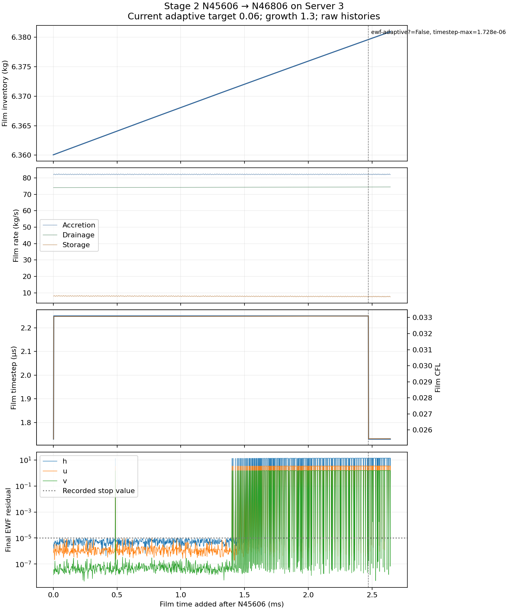

# Stage 2 — Server 3 aggressive continuation result

| Measure | Verified evidence |
| --- | --- |
| Status | SMOKE_COMPLETE |
| Verified native endpoint | N46806 |
| Additional updates | 1200 |
| Film time added after N45606 | 2.643322 ms |
| Total corrected-restart added film time | 43.412338 ms |
| Accepted final film step | 1.728000 µs |
| Film inventory | 6.380954 kg |
| Last-window accretion | 82.156887 kg/s |
| Last-window drainage | 74.469905 kg/s |
| Last-window storage | 7.712651 kg/s |
| Last-window drainage deficit | 9.356466% |
| Overall film ledger error | 0.031191% |
| Maximum thickness in last window | 0.306178 mm |
| Peak CFL in last window | 0.025462 |
| Last-window final EWF residual above 1 | 83 / 100 updates |
| Last-window updates meeting the film stop value | 15.00% |
| Saved-endpoint reopen | PASS |
| Steady film | Not qualified by this record |

Native reports and final EWF subiteration residuals. Adaptive-law steps verified against every printed clock and saved native endpoint; no clock-print quantization in rates.

| Evidence / limit | Record |
| --- | --- |
| Controlled delta and parent | [Setup](setup.md) |
| Machine state and paired endpoint hashes | [Run manifest](../../../../../PyAnsys/output/phase72a-stage2-server3/20261005/moderate-restart/run-manifest.json) |
| Native histories and quantitative summary | [Analysis summary](../../../../../PyAnsys/output/phase72a-stage2-server3/20261005/moderate-restart/analysis-summary.json) |
| Film rates and residuals | [CSV](../../../../../PyAnsys/output/phase72a-stage2-server3/20261005/moderate-restart/film-history.csv) |
| Comparison limit | Server transfer can change residual normalization; a smaller scaled residual alone cannot prove improvement |
| Implicit-film subiteration control | [Fluent 2025 R2 user guide §30.4](https://ansyshelp.ansys.com/public/Views/Secured/corp/v252/en/flu_ug/flu_ug_ewf_sec_eqns.html) |
| Verified numerical change at N46706 | {'ewf-adaptive?': False, 'timestep-max': 1.728e-06}; paired reopen PASS |
| Accounting limit | Film ledger only; steady carrier pseudo-time is not physical film time |
| Scientific limit | No whole-separator closure, timestep independence or physical validation |
| Excluded larger-step branch | [Preserved aggressive-probe evidence](../../../../../PyAnsys/output/phase72a-stage2-server3/20261005/analysis-summary.json); N45906 is not the field parent of this restart |
| Next action | Continue stable batches to the bounded horizon; repair severe inner-film failures before longer compute |
