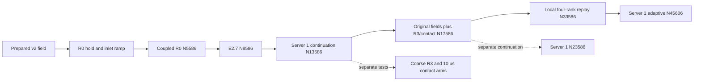

# Field history leading to N45606

| Question | Evidence-backed answer |
| --- | --- |
| Can the whole lineage be traced? | Yes, from the prepared v2 field through R0, E2.7, the original-field contact restart, local replay and adaptive N45606 |
| Has the uploaded history been recovered? | Yes; all 29 native reports and matching JSON histories for both missing segments pass verification. The contact and local replay transcripts are included |
| Earliest recovered reports | Native N1–N3580, read from the original Server 1 monitor files |
| Complete inventory/outlet history range | N1–N45606; no missing native coordinates |
| Carrier residual coverage | All seven equations at 45,606 consecutive native coordinates, N1–N45606 |
| Film residual coverage | N5587–N45373; final-subiteration and per-update peak histories. Only the last 233 adaptive updates lack film residual records |
| Plot coordinate | Native carrier iteration; this axis is not elapsed physical time |
| Liquid inventory definition | Bulk phase-2 mass and bulk + EWF mass shown separately; resident DPM mass is not included |
| Current endpoint | Preserved N45606; this history analysis issued no solve or setting change |

## Lineage and changes

| Plot marker | Native coordinate | Recorded change | Evidence |
| --- | ---: | --- | --- |
| Start | Prepared v2 / N0 | Smooth walls, EWF off; phase-2 virtual collector and steady carrier scaffold | [v2 parent](../../phase-07-1a-absorber-convergence/baseline-v2-virtual-liquid-outlet/results.md) |
| A | N1580 | End of the unintended quarter-feed hold; corrected 2,000-update inlet ramp starts. Both inlet boundaries are written before each 10-update block | [R0 provenance](../../phase-07-1a-absorber-convergence/roughness-family/r0-smooth-control/provenance.md); recovered command/report histories |
| B | N3580 | Full liquid/steam feed, 116.92/80.69 kg/s; SIMPLE → Coupled; Global Time Step selected | [R0 setup](../../phase-07-1a-absorber-convergence/roughness-family/r0-smooth-control/setup.md) |
| — | N4586 | R0 warm-up ends; next 1,000-update control continuation starts without a scientific setting change | [R0 final receipt](../../../../PyAnsys/output/phase71a_r0_control_run4/authoritative-completion-receipt.json) |
| C | N5586 | E2.7 starts from developed R0 fields. Phase accretion and coupled film equations on; flow momentum coupling off; fixed 10 µs film step, 10 subiterations, 0.3 m diagnostic thickness bound | [E2.7 manifest](../../../../PyAnsys/output/phase72a_ewf_student_e27_run_20260923T071523Z/E2.7/run-manifest.json) |
| D | N8586 | E2.7 transferred to Server 1 and repartitioned; 5,000 additional updates. No model or film-step change | [Continuation manifest](../../../../PyAnsys/output/phase72a_ewf_server1_e27_cont5000_20260923T102912Z/run-manifest.json) |
| E | N13586 | Original E2.7 solution fields retained. Apply R3 roughness, height 0.5 mm and Cs 0.5; corrected contact absorber with phase-velocity momentum removal, bulk tau 10 µs, fraction relaxation 0.1; collector EWF edge drainage and DPM escape. Film step 10 → 1 µs; diagnostic thickness bound 1 m | [Contact original-field restart](results.md#contact-absorber-restart-from-original-e27); historical R3/coarse field states are not loaded into this branch |
| F | N17586 | Verified parent loaded into an independent local four-rank replay. Scientific controls retained; 6,000 replay + 10,000 further updates | [Shared local replay manifest](</Users/shuheiyokkaichi/Library/CloudStorage/OneDrive-TheUniversityofAuckland/P4P-Fluent-Artifacts/Phase72A/ContactAbsorber/local20000/20261004T081120Z/run-manifest.json>) |
| G | N33586 | N33586 moved to Server 1. Adaptive film stepping enabled: initial 1 µs, increase factor 1.2, decrease factor 2, Courant target 0.05. Accepted step reaches 1.728 µs | [Adaptive readback](../../../../PyAnsys/output/phase72a-adaptive-server1/20261005/prepared-reopen.json), [adaptive result](results.md#adaptive-film-recovered-at-n45606) |

N1580 is the native ramp boundary, N3580 minus the recorded 2,000 added updates. The command report first shows its increase at N1592 because the report cache lags the boundary write. Plot letters mark both scientific setting changes and machine transfers; D and F do not mean a new physical model. The independent student inlet-ramp run and the old coarse R3/R4/R5 branches do not contribute samples to the selected field history.

## Requested liquid and film histories

| Trace | Definition / limit |
| --- | --- |
| Bulk phase-2 inventory | Native `v2-total-liquid-mass`; excludes wall film |
| Bulk + EWF inventory | Sum of aligned native bulk and film mass. It does not include resident DPM mass |
| Phase-2 steamoutlet flux | Native boundary-only `v2-flux-phase2-steamoutlet`; negative means liquid leaves. Absorber source is not added to this boundary curve |
| Film inventory | Native `p72a-e2.7-ewf-film-mass-total`; zero before EWF starts is justified by the recorded EWF-off model |
| Accretion | Native `secondary-phase-mass-total` numerical rate, kg/s; the native kg label has the previously verified unit discrepancy |
| Drainage | Adjacent cumulative native film-outflow difference divided by the actual accepted film step; kg/s. No differences are taken across a gap |
| Diamond | Common verified N17586 parent; the surrounding trajectory now uses the uploaded original histories |

| Selected endpoint | Bulk liquid (kg) | Film (kg) | Bulk + EWF (kg) | Signed outlet flux (kg/s) |
| --- | ---: | ---: | ---: | ---: |
| R0 N5586 | 295.8536 | 0 | 295.8536 | −24.3344 |
| E2.7 N8586 | 63.0234 | 3.1112 | 66.1346 | −1.7365 |
| E2.7 continuation N13586 | 62.9891 | 5.8425 | 68.8316 | −1.7346 |
| Corrected contact N17586 | 62.9581 | 5.9150 | 68.8732 | −3.6794 |
| Local replay N33586 | 62.9058 | 6.1502 | 69.0560 | −3.6740 |
| Adaptive N45606 | 62.8970 | 6.3600 | 69.2570 | −3.6724 |

| Observation | Bounded interpretation |
| --- | --- |
| The E2.7 branch has much less bulk inventory and liquid outlet flow than developed R0 | This is a numerical model-development response; it does not establish validated separator performance |
| Contact N17586 has about 3.68 kg/s outward liquid versus 1.73 kg/s at original E2.7 | Several controls change at N13586; this cannot isolate roughness, absorber or timestep effects |
| Film inventory grows from 5.8425 kg at original E2.7 to 6.3600 kg at N45606 | Complete corrected-restart history confirms continued storage; no steady-film claim |
| Native film clock reaches 0.120769016 s | Includes 0.08 s of original E2.7 history and 0.040769016 s added after the corrected restart; iteration count is not one constant timestep over the entire lineage |

## Carrier residuals

| Complete exact range | Source |
| --- | --- |
| N1–N13586 | Selected R0 native transcript branch, existing R0 residual exports and E2.7/continuation transcripts |
| N13587–N17586 | Uploaded contact-restart transcript; all 4,000 carrier rows |
| N17587–N33586 | Uploaded local replay transcript; all 16,000 carrier rows agree with the independent native Fluent transcript |
| N33587–N45373 | Captured adaptive transcripts |
| N45374–N45606 | Recent consecutive residual suffix in saved N45606 data; all 233 rows |

Saved carrier residuals use stored raw residual divided by the stored row normalization. At 1,618 coordinates shared with the final adaptive transcript, all seven equations agree within printed rounding; maximum relative difference is 0.00475%. This recovers the final 233 carrier residual rows. It does not recover their event transcript or film subiterations. Residual scaling and machine repartition are retained as provenance; residual curves alone do not establish physical steady state.

| Residual comparison at the Server 1 transfer | Evidence / limit |
| --- | --- |
| Velocity residual normalization, N45606 versus local N33586 | Stored x/y/z normalization denominators are about 4.2494 times greater |
| Apparent velocity residual drop at G | The transfer and normalization change coincide with adaptive activation; the lower scaled values cannot establish that adaptive stepping improved carrier convergence |
| Continuity normalization | Unchanged between these saved endpoints |

## EWF residuals

| Evidence | Observation |
| --- | --- |
| Film thickness and momentum residuals | Both final-subiteration and peak-over-subiterations traces are retained |
| Original 10 µs continuation | Very large native film residual excursions; at N9055 final h/u residuals are 3.714e7/7.463e7 |
| Corrected contact restart, fixed 1 µs | Four updates have at least one final h/u/v residual above 1; at N15661 final h/u/v = 10,686/46,442/257.13 |
| Local replay, fixed 1 µs | 1,268 updates have at least one final h/u/v residual above 1, in repeated bursts between N30738 and N32959 |
| Local replay N30738 | Final h/u/v = 301.35/370.62/6.992; all ten subiterations remain high. Native and client transcripts agree |
| Adaptive N44529 | A late final-subiteration spike, h/u/v = 12.33/3.242/1.422, is retained |
| Final adaptive tail, N45374–N45606 | Film subiterations and event transcript remain unavailable; report histories and carrier residuals are complete |

| Segment | Available film updates | All final h/u/v ≤ 1e−5 | Any final h/u/v > 1 |
| --- | ---: | ---: | ---: |
| Original E2.7, fixed 10 µs | 8,000 | 1,957 (24.46%) | 270 |
| Corrected contact, fixed 1 µs | 4,000 | 3,807 (95.17%) | 4 |
| Local replay, fixed 1 µs | 16,000 | 14,717 (91.98%) | 1,268 |
| Adaptive, available transcript | 11,787 | 10,526 (89.30%) | 1 |

The 1e−5 comparison uses the recorded film subiteration stop value. These are per-update final residual checks, not a physical steady-state criterion. The smooth film mass history and small film ledger error do not establish that every inner film solve converged. The observed excursions do not by themselves quantify their effect on film conservation or decide physical validity.

## Corrected-restart development in actual film time

| Quantity, N13586–N45606 | Verified value / limit |
| --- | --- |
| Total added film time | 40.769016 ms; 20,000 fixed updates plus 12,020 adaptive updates |
| Film inventory | 5.842478 → 6.360050 kg; gain 0.517571 kg |
| Integrated native accretion | 3.349769 kg; sum of native rate × actual accepted film step |
| Cumulative native drainage increment | 2.832411 kg |
| Film ledger error | 0.006367% of integrated accretion; film-side accounting only |
| Final 1,000 adaptive updates | Accretion 82.1518 kg/s; drainage 73.9558 kg/s; storage 8.2017 kg/s |
| Steady film | Not reached; drainage remains 9.9767% below accretion in the final window |
| Numerical adequacy | Repeated high final film residuals limit the fixed-step baseline; low CFL and small ledger error are insufficient to qualify it |

Dashed lines mark the local replay at 4 ms and adaptive activation at 20 ms. The residual trace ends 233 updates before the mass histories. Film time is checked against all 20,000 fixed-step transcript records and the verified adaptive clock reconstruction.

## Early development and branch check

The inlet command figure excludes only the inherited N1 command-cache value of 111.22015 kg/s. Its plotted N2 onward values show the actual quarter-feed hold and corrected ramp. Raw recovered report files retain that first value.

| Branch | Treatment |
| --- | --- |
| Earlier Server 1 N17586–N23586 continuation | Shown separately in orange; shares the verified N17586 parent |
| Local four-rank N17586–N33586 replay | The actual parent of adaptive N45606; recovered report history is shown in blue for direct branch comparison |
| Old-absorber R3 and contact 10 µs cap-seeking tests | Related setting-development tests, not ancestors of the current fields; not stitched into the main curves |

## Evidence and recovery limit

| Artifact | Link |
| --- | --- |
| All six figures in one PDF | [Case history PDF](../../../../PyAnsys/output/phase72a-lineage-N45606/20261005/case-history-N45606.pdf) |
| Requested metric histories; complete N1–N45606 | [Selected lineage CSV](../../../../PyAnsys/output/phase72a-lineage-N45606/20261005/selected-lineage-histories.csv) |
| Carrier residuals | [Carrier CSV](../../../../PyAnsys/output/phase72a-lineage-N45606/20261005/carrier-residuals.csv) |
| Film final/peak residuals | [Film CSV](../../../../PyAnsys/output/phase72a-lineage-N45606/20261005/film-residuals.csv) |
| Source paths, SHA-256, coverage, setting markers and HDF validation | [Lineage manifest](../../../../PyAnsys/output/phase72a-lineage-N45606/20261005/lineage-manifest.json) |
| Corrected-restart film ledger and per-segment residual checks | [Development summary](../../../../PyAnsys/output/phase72a-lineage-N45606/20261005/corrected-film-development-summary.json) |
| Uploaded ZIP identity, CRC and member hashes | [Upload import receipt](../../../../PyAnsys/output/phase72a-lineage-N45606/20261005/raw/history-recovery-import.json) |
| Read-only remote file discovery and recovered source paths | [Remote file list](../../../../PyAnsys/output/phase72a-lineage-N45606/20261005/remote-file-list.json), [recovery receipt](../../../../PyAnsys/output/phase72a-lineage-N45606/20261005/recovery-receipt.json) |
| Reproducible analysis | [Plot script](../../../../PyAnsys/scripts/analysis/plot_phase72a_endpoint_lineage.py) |

| Recovered or remaining evidence | Verification / limit |
| --- | --- |
| OneDrive history-recovery upload | `ContactAbsorber/HistoryRecovery/Phase72A-ContactAbsorber-HistoryRecovery-N13586-N33586-20261005-152931.zip`; 92 members, CRC pass; extracted originals retained under [raw/history-recovery](../../../../PyAnsys/output/phase72a-lineage-N45606/20261005/raw/history-recovery/) |
| Contact original-E2.7 restart, N13586–N17586 | All 29 native `.out` files agree with their JSON histories; 4,001 consecutive report coordinates; all 4,000 accepted film steps verified at 1 µs |
| Local replay, N17586–N33586 | All 29 native `.out` files agree with their JSON histories; 16,001 consecutive report coordinates; all 16,000 accepted film steps verified at 1 µs |
| Contact → replay identity | Saved contact case/data hashes equal replay parent hashes; the replay retains the scientific controls. Native/client replay carrier and film residual summaries agree |
| Only remaining history gap | Adaptive film subiteration/event transcript N45374–N45606; mass reports, outlet flux, carrier residuals and accepted-step clock reconstruction remain complete |

The separate history-recovery ZIP supplies the original desktop evidence that was absent from the endpoint folder. Joins are checked at shared coordinates; no other branch supplies samples for the selected history. Case/data endpoint files alone do not store every monitor or film-subiteration record.
