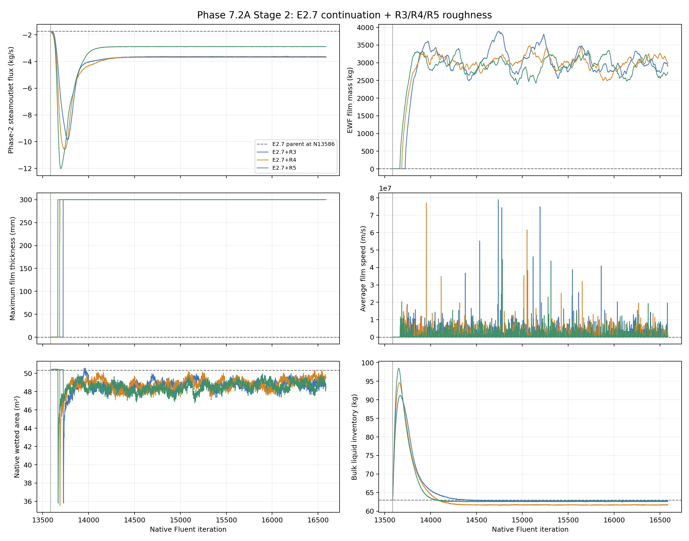
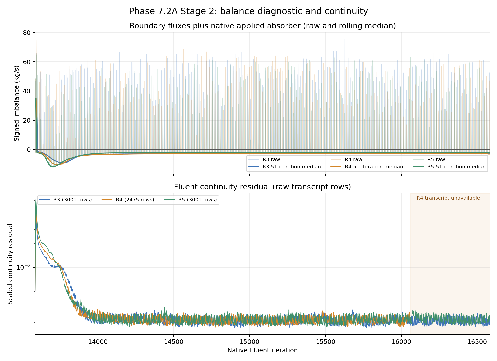
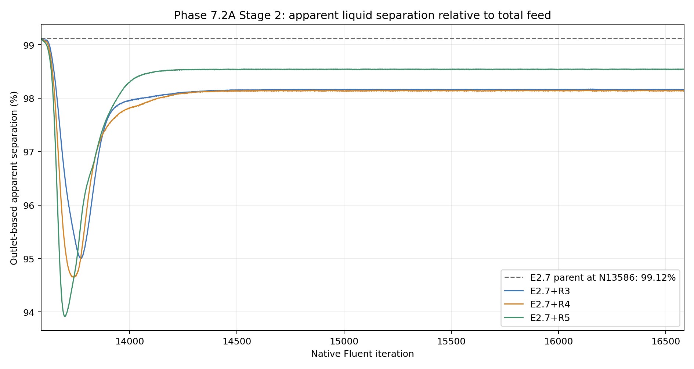
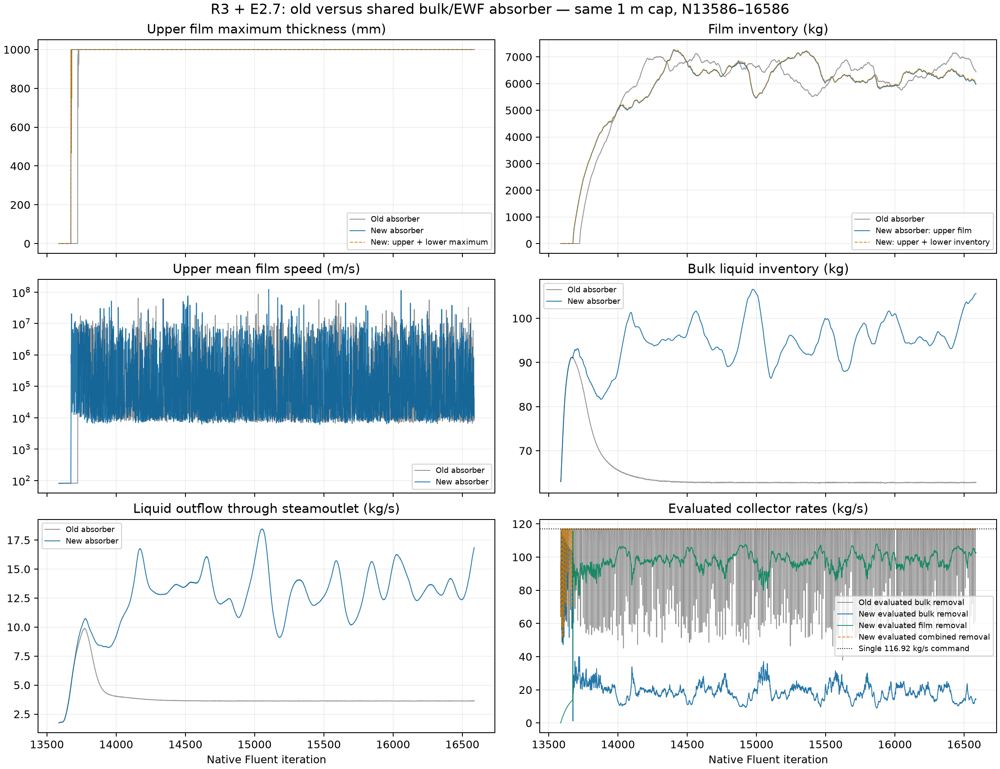
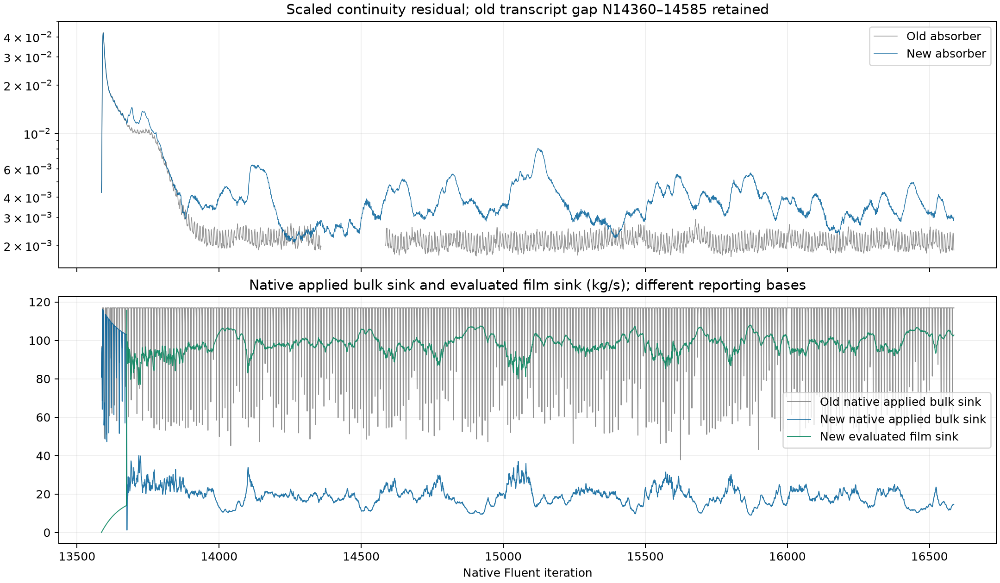

# Phase 7.2A Stage 2 — E2.7 plus R3/R4/R5 roughness results

| Current Server 3 continuation | Record / limit |
| --- | --- |
| Human target | Steady film; retained mass can be nonzero, but its rate of change should approach zero |
| Exact parent | N45606; preserve the independent local four-rank replay lineage |
| Larger-step probes | 6.415943 and 3.207972 µs produced incomplete inner-film solves; preserved at N45906 and excluded as continuation parents |
| Selected moderate restart | Original N45606 fields; target 0.06, growth 1.3, up to 30 inner iterations |
| Contract / current evidence | [Setup](aggressive-server3/setup.md), [continuation results](aggressive-server3/results.md) |
| Historical record | N45606 result and full lineage remain below |

| Whole-case history | Evidence and coverage |
| --- | --- |
| [Field lineage through N45606](case-history-N45606.md) | Residuals, bulk/combined liquid inventory, phase-2 steamoutlet flux, film mass and accretion/drainage; setting markers and replay branches |
| Uploaded history recovered | All 29 native reports in each missing segment match their JSON histories; requested inventories, outlet flux and all seven carrier residuals now cover N1–N45606 without gaps |
| Additional carrier residual recovery | Saved data supplies exact recent residual suffixes, including final N45374–N45606; film/event transcript tail remains missing |
| Recovered film residual limit | Local fixed-1 µs replay has 1,268 updates with at least one final film residual above 1; smooth inventory and small ledger error alone do not qualify the baseline. See [full residual checks](case-history-N45606.md#ewf-residuals) |

## Adaptive film recovered at N45606

| Question | Evidence-backed answer |
| --- | --- |
| Has the film reached steady state? | No; final-window storage remains 8.2017 kg/s |
| Does adaptive stepping increase the film step? | Yes; 1 → 1.728 µs, then held at this setting |
| Why did the controller stop? | gRPC stream timeout; Fluent completed the native batch at N45606 |
| Requested 50 ms corrected-restart horizon | Not reached; current added time is 40.7690 ms |
| Parent lineage | Independent local four-rank N33586 endpoint, continued on Server 1 |
| Exact window | N33586–N45606; 12,020 adaptive updates |
| Native coverage | All 29 reports have 12,021 contiguous coordinates |
| Adaptive film elapsed time | 20.769016 ms; native endpoint clock confirms this time |
| Native clocks | 0.1000000000000217 → 0.1207690160000985 s |
| Film inventory | 6.150172 → 6.360050 kg; +0.209877 kg (+3.4125%) |
| Maximum film thickness | 0.299323 → 0.307210 mm; peak 0.312074 mm |
| Full film ledger error | 0.004799% |
| Peak / final film CFL | 0.026604 / 0.025431; target 0.05 |
| Bulk liquid inventory | 62.90584 → 62.89699 kg; oscillatory |
| Final liquid carryover | 3.67244 kg/s; final-1,000 mean 3.67343 kg/s |
| Final pair | Saved and hashed on local disk; reopened fields and settings match |
| Shared copy | N45606 case/data downloaded on this Mac from OneDrive; both hashes match Server 1 originals |

All native reports are complete. Drainage uses a trailing 100-update window; storage uses a trailing 1,000-update window. Film inventory still increases while maximum thickness falls from its peak.

| 1,000-update window | Film time (ms) | Accretion (kg/s) | Drainage (kg/s) | Storage (kg/s) | Drainage deficit (%) |
| --- | ---: | ---: | ---: | ---: | ---: |
| N33606–N34606 | 1.728 | 82.160 | 70.346 | 11.815 | 14.380 |
| N36606–N37606 | 1.728 | 82.158 | 70.845 | 11.314 | 13.770 |
| N40606–N41606 | 1.728 | 82.157 | 72.807 | 9.356 | 11.381 |
| N44606–N45606 | 1.728 | 82.152 | 73.956 | 8.202 | 9.977 |

The last 233 updates lack the client transcript. Their accepted steps are recovered from complete native CFL reports and the verified adaptive controls; native endpoint time, step and count confirm the reconstruction.

| Timestep observation | Interpretation |
| --- | --- |
| Adaptive step holds at 1.728 µs | Final CFL 0.025431 remains above the 0.025 increase threshold |
| Courant target 0.05 | Native adaptation increases the step only below half this target; [Fluent 2025 R2 algorithm](https://ansyshelp.ansys.com/public/Views/Secured/corp/v252/en/flu_th/flu_th_ewf_sec_sol_alg.html) |
| Storage falls 11.815 → 8.202 kg/s | Drainage improves, but no near-zero storage window is established |
| Final accretion 82.152 vs drainage 73.956 kg/s | About 9.977% remains stored; no film steady-state claim |
| Thickness peaked and then fell | Local thickness alone does not establish stationary global film inventory |

Raw histories and trailing 1,000-update means. Outlet carryover uses the boundary-only report; positive values show outward liquid mass flow. This figure does not qualify full separator conservation.

| Evidence limit | Effect |
| --- | --- |
| Final 233 updates lack client film/event transcript | Carrier residuals now recovered from saved data in the [lineage analysis](case-history-N45606.md#carrier-residuals); no complete film-tail residual or no-event claim |
| Exact endpoint clock reconstruction error | 8.03e-14 s; accepted-step reconstruction agrees with all captured clocks within display rounding |
| Film accretion native label is kg | Analysis retains the previously verified rate meaning in kg/s |
| Film-only ledger | Bulk and whole-separator conservation remain unqualified |
| Positive storage in every 1,000-update window | Steady film remains unqualified |
| Controller return hook | Automatic CLI return failed because the desktop chat had an active writer |

| Next scientific action | Purpose |
| --- | --- |
| Continue from preserved N45606 toward 50 ms total corrected-restart film time | Test whether storage continues to decrease |
| If a faster numerical contrast is needed, test adaptive Courant 0.1 from a preserved parent | Allow a larger step while checking CFL, storage and film ledger; this contrast is not yet tested in Stage 2 |
| Use actual film clock and native accepted steps | Do not infer elapsed time from a maximum-step setting |

| Artifact | Owner |
| --- | --- |
| Analysis and all windows | [Summary](../../../../PyAnsys/output/phase72a-adaptive-server1/20261005/recovered-N45606/analysis-summary.json), [window CSV](../../../../PyAnsys/output/phase72a-adaptive-server1/20261005/recovered-N45606/window-summary.csv) |
| Recovered reports and time provenance | [Film history CSV](../../../../PyAnsys/output/phase72a-adaptive-server1/20261005/recovered-N45606/film-history.csv) |
| Final pair identity | [Endpoint](../../../../PyAnsys/output/phase72a-adaptive-server1/20261005/recovered-N45606/endpoint.json), [reopen](../../../../PyAnsys/output/phase72a-adaptive-server1/20261005/recovered-N45606/reopen.json), [shared copy](../../../../PyAnsys/output/phase72a-adaptive-server1/20261005/recovered-N45606/shared-endpoint.json) |
| Exportable figures | [Film PDF](../../../../PyAnsys/output/phase72a-adaptive-server1/20261005/recovered-N45606/adaptive-film-histories.pdf), [step/CFL PDF](../../../../PyAnsys/output/phase72a-adaptive-server1/20261005/recovered-N45606/adaptive-step-cfl.pdf), [carrier PDF](../../../../PyAnsys/output/phase72a-adaptive-server1/20261005/recovered-N45606/carrier-histories.pdf) |

## Adaptive film: first verified Server 1 test

| Question | Evidence-backed answer |
| --- | --- |
| Can adaptive stepping increase the film step? | Yes in this 1,020-update test: 1.00 → 1.728 µs; native display rounds to 1.73 µs |
| Film stationarity | Not reached; storage remains positive |
| Exact window | N33586–N34606; 20 smoke + 1,000 batch updates |
| Parent lineage | Independent local four-rank N33586 endpoint, continued on Server 1 |
| Source availability | OneDrive case/data/library hashes verified on Server 1 |
| UDF recovery | Restored missing relative library folder from the verified archive; loaded DLL hash matches |
| Prepared and final pair | Both saved/reopened; fields and settings match |
| Controlled changes | Adaptive ON; initial step 1 µs; increase factor 1.2; decrease factor 2 |
| Courant target | Unchanged at 0.05; no native maximum-step bound claimed |
| Measured adaptive elapsed time | 1.761 ms; cumulative native film clock difference |
| Total added time from corrected E2.7 restart | 21.761 ms |
| Parent and end native film clocks | 0.100000 → 0.101761 s; includes earlier model history |
| Maximum thickness | 0.299323 → 0.304534 mm |
| Film inventory | 6.150172 → 6.170980 kg |
| Last 1,000-update inventory gain | 20.417 g in 1.728 ms; 11.8154 kg/s |
| Last 1,000-update drainage deficit | 14.3796% below integrated accretion |
| Full adaptive film ledger error | 0.002171% |
| Peak solved film CFL | 0.0266013 |
| Native coverage | All 29 report histories cover N33586–N34606; all 1,020 updates have native film clocks |
| Next selected horizon | At least 50 ms total added time from corrected E2.7 restart, in 1,000-update batches |
| Claim limit | Stable numerical adaptive stepping in this short window; no steady film, full separator closure or physical validation claim |

Native reports; drainage rate uses a 100-update cumulative-outflow difference. Accretion is a rate in kg/s despite the native film-mass label.

Native accepted-step display is rounded. Elapsed time and film balance use differences in the more precise cumulative film clock.

| Evidence | Owner |
| --- | --- |
| Run and paired endpoints | [Adaptive manifest](../../../../PyAnsys/output/phase72a-adaptive-server1/20261005/run-manifest.json) |
| Final reopen | [N34606 readback](../../../../PyAnsys/output/phase72a-adaptive-server1/20261005/reopen-N34606.json) |
| Histories | [Reports](../../../../PyAnsys/output/phase72a-adaptive-server1/20261005/report-histories.json), [native clocks](../../../../PyAnsys/output/phase72a-adaptive-server1/20261005/film-clock-history.json) |
| Longer-stage completion and wake-up | [Job specification](../../../../PyAnsys/output/phase72a-adaptive-server1/20261005/stage-50ms-job.yaml) |

## Contact absorber: local continuation to N33586

| Question | Result |
| --- | --- |
| Has the film reached steady state? | No. Inventory still increases. |
| Does maximum thickness grow toward the 1 m limit? | No runaway observed in this window; final maximum is 0.2993 mm. |
| Total added film time from E2.7 N13586 | 20,000 updates × 1 µs = 20 ms. |
| Plotted window | N17586–N33586; 16,000 updates = 16 ms. |
| Run identity | Separate local four-rank replay from verified N17586; not the Server 1 N23586 field continuation. |

| Figure | Status | Original image path |
| --- | --- | --- |
| Local film inventory, thickness, native phase accretion rate and phase-2 steamoutlet flux through N33586 | Image file is absent from this checkout. | `../../../../PyAnsys/output/phase72a-contact-absorber-local-20000/20261004T081120Z/film-four-histories.png` |

Raw native histories at fixed 1 µs film timestep. The dashed line marks the local N23586 replay endpoint, followed by the 10,000-update extension.

| Plot | Observation | Meaning |
| --- | --- | --- |
| Film inventory | 5.9150 → 6.1502 kg across the plotted window. | Film continues to accumulate. |
| Film thickness | Maximum stays near 0.30 mm; area-weighted mean rises slowly. | A nearly flat maximum does not establish steady inventory. |
| Native film rate | Phase accretion remains near 82 kg/s. | Liquid transfer into the film; not net inventory growth. |
| Phase 2 steamoutlet flux | Boundary flow stays near −3.67 kg/s. | Negative means liquid leaves; this curve excludes the absorber source. |

| Final-window and verification metric | Value / status |
| --- | --- |
| Inventory gain over N32586–N33586 | 11.89 g in 1 ms. |
| Maximum thickness gain over N32586–N33586 | 0.001954 mm. |
| Accretion–drainage gap over final 1,000 updates | Drainage is 14.47% below accretion. |
| Film ledger error over local 16,000 updates | 0.00808% of integrated accretion. |
| Final case/data SHA-256 | Both verified against the saved manifest. |
| Native history coverage | All 29 reports contain 16,001 contiguous coordinates, N17586–N33586. |
| Final save/reopen check | Pending Fluent service response at the scheduled check. |
| Claim limit | Film-only time and balance; bulk/joint steady convergence remains unqualified. |
| Longer-time question | 20 ms does not establish whether 1 s is needed or sufficient for steady film. |

| Evidence | Record |
| --- | --- |
| Run and endpoint identity | [Local run manifest](../../../../PyAnsys/output/phase72a-contact-absorber-local-20000/20261004T081120Z/run-manifest.json) |
| Raw histories used in the figure | [Native report histories](../../../../PyAnsys/output/phase72a-contact-absorber-local-20000/20261004T081120Z/report-histories.json) |
| Film trends and ledger | [Scheduled check result](../../../../PyAnsys/output/phase72a-contact-absorber-local-20000/20261004T081120Z/scheduled-check-result.json) |

## Contact absorber 10000 updates at 1 microsecond

The human-authorized Server 1 continuation completed all **6,000 additional
updates, N17586–N23586**, preserving the corrected R3/contact scientific
settings and fixed 1e-6 s EWF step. Combined with the earlier original-E2.7
restart, this gives 10,000 updates and **0.01 s added film time**. Film remains
thin, but a steady film has not been reached.

| Figure | Status | Original image path |
| --- | --- | --- |
| Full 10000-update film thickness, inventory and accretion/drainage history | Image file is absent from this checkout. | `../../../../PyAnsys/output/phase72a-contact-absorber-1us-10000/20261003T070351Z/film-time-10000.png` |

| Endpoint | Restart updates | Maximum film thickness (mm) | Film inventory (kg) |
| --- | ---: | ---: | ---: |
| Original E2.7 N13586 | 0 | 0.309791 | 5.842478 |
| Fine-step N17586 | 4000 | 0.298108 | 5.915017 |
| N20586 | 7000 | 0.290349 | 5.964781 |
| N21586 | 8000 | 0.289751 | 5.981079 |
| N22586 | 9000 | 0.289802 | 5.997342 |
| Final N23586 | 10000 | 0.291141 | 6.013528 |

Maximum thickness reached a minimum of 0.289679 mm at N22029 and then began
a small rise. Inventory continued increasing: the final three 1,000-update
windows gained approximately 16.30, 16.26 and 16.19 g, with fitted drifts
of 0.2729%, 0.2716% and 0.2696%. Accretion exceeded drainage by 19.82%,
19.77% and 19.68% of accretion in those windows. All fail the declared
stationarity screen; a nearly flat thickness maximum does not establish
stationary inventory.

Over the full 10,000 updates, native accretion integrates to 0.821996 kg,
outflow increases by 0.651083 kg and inventory increases by 0.171050 kg.
The film ledger closes within **0.016725%**. Peak solved 1 microsecond film
CFL is 0.020526; the inherited N13586 CFL field is excluded from that peak.
The final continuity and phase-2 fraction residuals are 0.0018594 and
0.0030923. These do not establish bulk or joint steady convergence.

This thin-film arm has now advanced beyond the coarse arm's 1.9 ms onset
of the 1 m cap without runaway. That strengthens the timestep-dependent
numerical explanation. It does not isolate an absorber benefit or predict
eventual film stationarity; 10 ms is shorter than the coarse arm's full
40 ms horizon.

The existing Server 1 endpoint was preserved before replacement. Loaded
parent fields and scientific settings passed, and the repartitioned prepared
start reopened exactly before compute. All 29 histories have 6,001 contiguous
coordinates; all seven residual histories have matching coordinates. Six
paired checkpoints were saved and SHA-256 verified on Server 1 local storage.
The final case/data read commands returned and the reopened native reports
reproduced endpoint quantities, but the subsequent full settings readback
stalled. Fresh health RPCs also timed out. **Full final reopen verification,
shared final-file transfer and saved-face drainage attribution remain
blocked by the Server 1 service.** The session was not terminated and no
extra updates were run. The report-based film ledger above is verified
independently of the pending saved-face attribution.

Machine evidence: [run manifest](../../../../PyAnsys/output/phase72a-contact-absorber-1us-10000/20261003T070351Z/run-manifest.json),
[solve verification](../../../../PyAnsys/output/phase72a-contact-absorber-1us-10000/20261003T070351Z/solve-verification.json),
[film assessment](../../../../PyAnsys/output/phase72a-contact-absorber-1us-10000/20261003T070351Z/film-time-assessment.json),
and [residual verification](../../../../PyAnsys/output/phase72a-contact-absorber-1us-10000/20261003T070351Z/residual-verification.json).

| Item | Phase 7.2A Stage 2 — E2.7 plus R3/R4/R5 roughness results |
| --- | --- |
| All three independent children | used the hash-verified E2.7 continuation final pair at native `13586`, changed only the intended outer-wall roughness height (`C_s=0.5`), and reached native `16586` after one `/solve/iterate 3000` Fluent TUI command each |
| — | Every child has 27 Fluent-native report histories with 3,001 points, including the starting coordinate |
|  | The [figure statistics](figures/E2.7-R3-R4-R5-summary.json) and [phase-2 outlet CSV](figures/E2.7-R3-R4-R5-phase2-outlet.csv) accompany the plot |
|  | The [R3](../../../../PyAnsys/output/phase72a_stage2_e27_roughness/R3-20260926T223230Z/run-manifest.json), [R4](../../../../PyAnsys/output/phase72a_stage2_e27_roughness/R4-20260926T223500Z/run-manifest.json), and [R5](../../../../PyAnsys/output/phase72a_stage2_e27_roughness/R5-20260926T223501Z/run-manifest.json) manifests own the machine evidence and final-pair hashes |

| Case        | `k_s` (m) | First native iteration at `0.3 m` film-thickness cap | Final phase-2 `steamoutlet` flux (kg/s) | Tail-500 outlet mean (kg/s) | Final film mass (kg) | Final average film speed (m/s) | Final native wetted area (m²) | Final bulk liquid inventory (kg) |
| ----------- | --------: | ---------------------------------------------------: | --------------------------------------: | --------------------------: | -------------------: | -----------------------------: | ----------------------------: | -------------------------------: |
| E2.7 parent |       `0` |                                not reached by N13586 |                                `-1.735` |                           — |              `5.842` |                        `82.41` |                      `50.338` |                         `62.989` |
| E2.7+R3     |    `5e-4` |                                              `13723` |                                `-3.632` |                    `-3.632` |             `2900.8` |                       `287775` |                      `48.581` |                         `62.781` |
| E2.7+R4     |    `1e-3` |                                              `13685` |                                `-3.682` |                    `-3.678` |             `2985.2` |                        `75098` |                      `49.484` |                         `61.672` |
| E2.7+R5     |    `2e-3` |                                              `13665` |                                `-2.879` |                    `-2.884` |             `2734.7` |                        `25088` |                      `48.389` |                         `62.545` |

| Item | Phase 7.2A Stage 2 — E2.7 plus R3/R4/R5 roughness results |
| --- | --- |
| — | Negative `steamoutlet` phase-2 flux denotes outflow |
|  | Relative to the parent terminal magnitude, the final phase-2 outflow magnitude increased by `109%` for R3, `112%` for R4, and `66%` for R5 |
|  | The outlet histories first show a large transient excursion and then settle near the tail means; none supports a carryover reduction relative to the E2.7 parent |
|  | The three children do not form a monotonic roughness response: R5 has a smaller late outlet magnitude than R3/R4, but all three exceed the parent |
| film response | is the stronger limit on interpretation |

Supporting detail — Phase 7.2A Stage 2 — E2.7 plus R3/R4/R5 roughness results

| Item | Phase 7.2A Stage 2 — E2.7 plus R3/R4/R5 roughness results |
| --- | --- |
| — | Maximum thickness hit the configured `0.3 m` exploratory cap within the first `79–137` child iterations and remained there |
|  | Film mass rose from `5.842 kg` to roughly `2,700–3,000 kg` by N16586, with large fluctuations; area-weighted film speed showed extreme spikes reaching tens of millions of m/s |
| These | are reported Fluent quantities, not credible evidence of physical wall drainage or a stationary film |
| — | Bulk liquid inventory also had a large early transient peak (`91–99 kg` across children) before ending near `62 kg`; endpoint inventory alone obscures that response |
| Wetted area | is the Fluent-native surface integral of `film-coverage` over the active EWF `wall`, recorded every iteration |
| — | At the parent N13586 state, this native method returned `50.338 m²`; the earlier offline threshold reconstruction in [Family E results](../ewf-family/results.md#e27-continuation--another-5000-iterations-on-server-1--2026-09-23) gave `50.690 m²` |
| `0.352 m²` method difference | is unresolved, so this screen compares the three children using the common native definition and does not merge the offline endpoint into their history |
| R3 and R5 runners | retained full local native solve transcripts and recorded no FPE, AMG, nonfinite, or fatal event |
| — | The laptop lost its gRPC/TCP route during R4 near N16060; Fluent continued to N16586 |
| R4 | was reconciled after reconnect from its live terminal iteration, all 27 complete native report files, and hash-verified final pairs |
| — | Its local transcript ends near the disconnect and does not cover the full solve, so a no-event claim is unavailable for R4 |
|  | Fluent reopened a just-saved prepared start data file at native `13585` despite reporting `13586` immediately before save |
|  | For each actual solve, the runner loaded the prepared roughness case and then the verified parent N13586 data; native iteration and E2.7/roughness settings passed readback before compute |
|  | The durable `run-input-N13586` files preserve that exact case-plus-data combination separately from the original prepared snapshots |
| All three `run-input` pairs | were subsequently reopened on Server 3 and passed native `13586`, E2.7, and roughness readback |
| final case/data pairs for all three children | are present in the local OneDrive sync folder and their hashes match the run manifests |

## Balance diagnostic and continuity

| Item | Balance diagnostic and continuity |
| --- | --- |
| [balance/continuity figure](figures/E2.7-R3-R4-R5-balance-continuity.png) | uses the same native iterations |
| Its mass-balance trace | is the signed sum of reported phase-1 inlet/outlet fluxes, phase-2 inlet/outlet fluxes, and the native applied absorber (`kg/s`) |
| — | The raw traces have recurring positive spikes up to about `61–68 kg/s`; the 51-iteration rolling medians remain near `-2` to `-3 kg/s` late in the runs |
|  | Over the final 500 iterations, the mean absolute algebraic imbalance is `7.82 kg/s` (R3), `7.22 kg/s` (R4), and `5.92 kg/s` (R5) |
| [plotted-data summary](figures/E2.7-R3-R4-R5-balance-continuity-summary.json) | records each formula, source, and window statistic |

Supporting detail — Balance diagnostic and continuity

| Item | Balance diagnostic and continuity |
| --- | --- |
| This | is a boundary-plus-absorber diagnostic: EWF transfer and storage are not included, so it is not proof of complete physical mass closure |
| — | The scaled continuity residual drops from its early transient and then oscillates around a few `10^-3` |
|  | Raw transcript rows cover all 3,001 native coordinates for R3 and R5 |
|  | R4 has 2,475 continuity rows through N16060; the plot leaves N16061–16586 blank for R4 because the laptop transcript ended during the connection loss |
|  | The complete R4 mass-balance trace comes from its native report files |
| No continuity values | were interpolated into the gap |

## Outlet-based apparent separation

| Item | Outlet-based apparent separation |
| --- | --- |
| — | For this requested measure, the ratio of phase-2 liquid outflow through `steamoutlet` to total mass in (steam plus liquid inlet) is the carryover fraction, using a minus sign for Fluent's negative outlet flux |
| Its complement | is the outlet-based apparent separation measure: |
| — | `apparent separation (%) = 100 × [1 + signed phase-2 steamoutlet flux / (phase-1 steam-inlet flux + phase-2 liquid-inlet flux)]` |
| [history plot](figures/E2.7-R3-R4-R5-outlet-based-efficiency.png) | uses both inlet reports and the outlet report at every iteration |
| Total mass in | was `197.61 kg/s` (`80.69 kg/s` steam plus `116.92 kg/s` liquid) |

Supporting detail — Outlet-based apparent separation

| Item | Outlet-based apparent separation |
| --- | --- |
| E2.7 parent terminal value | is `99.12%`; the Stage 2 final values are `98.16%` (R3), `98.14%` (R4), and `98.54%` (R5) |
| — | The final-500 means differ by less than `0.01` percentage point from those final values |
|  | The [calculation record](figures/E2.7-R3-R4-R5-outlet-based-efficiency-summary.json) preserves the formula, signs, and values |
| This | is an outlet-based ratio, not validated separator efficiency: liquid can accumulate in the bulk or EWF film, be removed by the virtual absorber, or remain in an unclosed mass balance |
|  | was a completed numerical screen, not a successful routing treatment |
| — | The cap, extreme film values, and unresolved EWF-inclusive closure preclude a physical benefit or convergence claim |

## EWF absorber extension — 3 October 2026

| Item | EWF absorber extension — 3 October 2026 |
| --- | --- |
| — | The [shared collector](ewf-absorber/setup.md) now removes EWF liquid on the 34-face lower outer-wall segment `wall:004`, in addition to the existing bulk phase-2 collector |
|  | The upper film wall does not itself lie in the absorber band |
|  | Negative mass flux removes local film liquid, and negative momentum flux removes its corresponding film momentum |
|  | Bulk and film share the 116.92 kg/s command; film removal reduces the command available to the bulk sink |
| This | is a numerical liquid outlet, not validated stripping or evaporation |

Supporting detail — EWF absorber extension — 3 October 2026

| Item | EWF absorber extension — 3 October 2026 |
| --- | --- |
| source operation | was tested on Server 1 using a seeded lower film and paired source-off/source-on arms, each ten flow iterations |
| Bulk equations, phase accretion and film forcing | were disabled in the disposable fixture; the production EWF coupled solver remained enabled |
| — | Native Film Mass and density-integrated Film Thickness agreed |
|  | Source-off mass changed by only `-7.47e-10 kg`; source-on mass decreased from `0.0503752021` to `0.0455584291 kg` |
|  | Each observed update removed 1% of its starting inventory |
|  | The native loss matched source rate times printed film-time advance within `2.32e-7` relative |
|  | The printed clock advanced one fixed `1e-5 s` step per flow iteration; the RP clock remained stale at zero |
| original instrumentation failure | is preserved, and the [qualified proof](../../../../PyAnsys/output/phase72a-ewf-absorber/smooth-source-proof-20261003T1040/source-proof-qualified.json) reconstructs elapsed time from the twenty native transcript updates without discarding either mass arm or the restoration evidence |
| — | Configuration preserved the E2.7 N13586 upper film inventory of `5.842478445 kg` |
| dry lower wall has zero film sink; bulk removal | remains the parent's `93.4222073 kg/s`, below the command because of the existing bulk volume floor |
| — | The [prepared Stage 2 artifacts](../../../../PyAnsys/output/phase72a-ewf-absorber/stage2-prepared-20261003T1040/prepared-stage2.json) retain separate R3/R4 roughness, local monitor destinations, shared removal accounting, and the diagnostic 1 m cap |
| R5 | remains cancelled |
| — | Server 3's Fluent endpoint became unreachable during the first storage/source build; its valuable endpoint had already been preserved |
| Both new children | are prepared on Server 1 from the verified smooth collector parent |
| — | This proves negative-source operation in an isolated coupled-film check |
|  | It does not yet prove that upper-wall film reaches the collector, that moving film remains numerically credible, or that accumulation stops |
| Those | require the subsequent matched separator screens with film storage, edge transport, source removal, velocity/thickness and source-inclusive closure histories |

## R3 new-absorber direct comparison

| Item | R3 new-absorber direct comparison |
| --- | --- |
| — | On 3 October 2026, the requested local `direct-fluent-use` R3 + E2.7 screen completed exactly 3,000 additional native iterations, N13586–16586 |
| Server 1 | was not accessed |
| — | Both arms use the hash-verified E2.7 N13586 parent, R3 roughness (`5e-4 m`, constant `0.5`) and the diagnostic 1 m film cap |
|  | The new collector adds EWF storage, accretion and negative mass/momentum sources on `wall:004`, sharing the existing 116.92 kg/s command with the bulk collector |
|  | The local run repartitioned the 18-partition input onto four compute workers; this cross-machine comparison can include numerical partition effects |

Supporting detail — R3 new-absorber direct comparison

| Item | R3 new-absorber direct comparison |
| --- | --- |
| [run manifest](../../../../PyAnsys/output/phase72a-r3-ewf-absorber-direct/20261002T205621Z/run-manifest.json) | records three paired checkpoints, the final pair, matching hashes and save/reopen checks |
| — | Recomputed upper/lower/combined film mass, maximum thickness, bulk inventory and boundary-only liquid outlet flux match the terminal report values |
|  | All 40 native report histories have 3,001 consecutive coordinates, including the parent state |
| Checkpoints | remain local; only the selected final pair was mirrored into the local OneDrive folder, with matching hashes |
| Cloud synchronization | was not verified |
| owned local Fluent process tree | was closed after verification; unrelated processes were preserved |
| Values below | are endpoint / final-500 mean |
| — | Both final windows cover N16087–16586 |
| Old film inventory | is the upper wall, its only active EWF wall; new film inventory includes both upper and lower walls |

| Quantity | Old absorber | New shared absorber |
| --- | ---: | ---: |
| Total film inventory (kg) | 6439.94 / 6607.88 | 6009.47 / 6353.91 |
| Bulk liquid inventory (kg) | 62.78 / 62.78 | 105.62 / 97.05 |
| Liquid carryover through `steamoutlet` (kg/s) | 3.632 / 3.632 | 16.846 / 13.399 |
| Upper maximum film thickness (mm) | 1000 / 1000 | 1000 / 1000 |
| Scaled continuity residual | 0.001875 / 0.002115 | 0.003009 / 0.003410 |

| Item | R3 new-absorber direct comparison |
| --- | --- |
| — | The new collector modestly lowers late combined film inventory (`3.84%`), while late carryover is `3.69` times the old value and bulk inventory remains larger and variable |
| new late evaluated command allocation | is `99.776 kg/s` to film and `17.144 kg/s` to bulk |
| Native applied bulk removal | is reported separately: its late mean is `17.150 kg/s` versus `111.121 kg/s` for the old arm |
| — | Evaluated film removal and native applied bulk removal have different reporting bases; their sum is not an independently verified applied mass closure |
|  | Outlet values use boundary flux, excluding the API's additional `User Mass Source` contribution to its computed `Net` result |

Supporting detail — R3 new-absorber direct comparison

| Item | R3 new-absorber direct comparison |
| --- | --- |
| Both films | remain cap-censored |
| — | The new upper wall first reaches 1 m at N13675, earlier than the old arm at N13727 |
| Final new lower film storage | is `34.325 kg`; it is included above |
| Late mean film speeds | remain approximately `1.28e6 m/s` in both arms because of extreme spikes |
| — | These numerical film values do not establish credible drainage, stable accumulation, or physical separator efficiency |
|  | Nonzero lower-wall removal also does not identify how much liquid arrived from upper-film edge transport versus local accretion |

| Item | R3 new-absorber direct comparison |
| --- | --- |
| — | The old continuity trace joins its original 774 rows at N13586–14359 and recovery's 2,001 rows at N14586–16586, retaining the 226-coordinate gap N14360–14585 without interpolation or a line across it |
|  | New continuity covers all 3,001 coordinates |
| Both late windows | are complete |
| — | The [comparison summary](../../../../PyAnsys/output/phase72a-r3-ewf-absorber-direct/20261002T205621Z/comparison-summary.json) preserves endpoint, variability, slope, cap-hit and continuity-coverage details |

## All-liquid contact absorber trial

| Item | All-liquid contact absorber trial |
| --- | --- |
| — | The human's latest instruction replaces the shared inlet-throughput budget with independent capture of liquid entering the existing lower collector |
|  | Local `direct-fluent-use` discovery started from the verified thin-film E2.7 N13586 parent, retaining R3 roughness |
| Server 1 | was not accessed and R5 was not run |
| — | The [run manifest](../../../../PyAnsys/output/phase72a-contact-absorber/20261002T222617Z/run-manifest.json) owns the local pairs, source identity and execution receipts |
| corrected implementation | uses phase-2 mass removal `S_l=-rho_l*alpha_l/tau`, its negative implicit derivative, and Mixture momentum removal using liquid velocity |

Supporting detail — All-liquid contact absorber trial

| Item | All-liquid contact absorber trial |
| --- | --- |
| — | It has no inlet-throughput cap, no vapor mass source and no alpha overwrite |
|  | Native DPM escape operates on the two collector-entry faces as zero-resistance porous jumps and on lower walls |
|  | EWF ends at the upper-wall/lower-wall edge; `wall:004` has EWF off, so transported film leaves through native edge outflow rather than storing there |
|  | Capture refers to the existing 715-cell collector: its stepped interface is not an exact y=0.10 m plane |
| Initial 1 ms/100 microsecond/10 microsecond screens | used mixture velocity in momentum removal and are not accepted implementation results |
| — | The 10 microsecond fast sink destabilized film at the inherited 1e-5 s film step |
|  | Those initial data loads also restored the 0.3 m cap; they are not matched 1 m cap comparisons |
|  | Writing a smaller film step into RP variables alone did not activate it |
| Saved-case load and native timestep output | were needed to verify the recovered 1e-6 s step |
| This failed activation | remains control failure evidence, not a successful timestep sensitivity |
| — | Corrected short screens share liquid-velocity momentum, a verified 1e-6 s film step, a nonbinding 1 m diagnostic cap and explicit volume-fraction relaxation 0.1 |
| Each | uses the same physical N13586 parent data and 100 iterations |
| These | are short numerical sensitivities, not settled collector throughputs |

| Bulk removal time | Collector inventory at N13686 (g) | Collector max liquid fraction (%) | Bulk removal at endpoint (kg/s) |
| --- | ---: | ---: | ---: |
| 100 microseconds | 2.780 | 0.05010 | 27.80 |
| 10 microseconds | 0.496 | 0.01978 | 49.59 |
| 1 microsecond | 0.159 | 0.01302 | 158.81 |

| Item | All-liquid contact absorber trial |
| --- | --- |
| — | The 1 microsecond branch gives only a small further absolute reduction in maximum fraction while increasing source variability and sensitivity |
| 10 microsecond branch | was selected for a further 1,000 iterations, native N13686–14686 |
| — | It completed without explosive film growth |
|  | Endpoint and final 200-iteration values are: |

| Quantity | Endpoint | Final-200 range or mean |
| --- | ---: | ---: |
| Collector bulk liquid inventory (g) | 0.656 | range 0.517–0.827 |
| Collector maximum liquid fraction (%) | 0.02265 | range 0.00981–0.03103 |
| Evaluated bulk removal (kg/s) | 65.632 | mean 61.383; range 51.729–82.691 |
| Maximum upper film thickness (mm) | 0.30806 | range 0.30806–0.30850 |
| Whole-domain bulk liquid inventory (kg) | 67.153 | mean 67.787; continues decreasing |
| Scaled continuity residual | 0.001792 | mean 0.001911 |
| Scaled phase-2 fraction residual | 0.002998 | mean 0.003098 |

| Item | All-liquid contact absorber trial |
| --- | --- |
| maximum film Courant number across the qualifier | was 0.02053 |
| — | Film inventory rose 5.84140→5.86219 kg while film continued to leave |
|  | Over the verified 0.001 s film interval, collector-adjacent edge outflow was 0.0273531 kg (27.3531 kg/s mean) |
|  | Another 0.0360434 kg left at `steaminlet` and 0.00000220 kg at `steamoutlet`; these are not collector capture |
|  | Film inventory change plus all native edge outflow agrees with integrated accretion within 0.007505% |

Supporting detail — All-liquid contact absorber trial

| Item | All-liquid contact absorber trial |
| --- | --- |
| — | The native `film-phase2-mass` report displays kg, but its numerical values act as current accretion kg/s: the independent film ledger verifies that interpretation |
| Its collection coefficient | is dimensionless, not another removal rate |
| — | See the [units and film ledger proof](../../../../PyAnsys/output/phase72a-contact-absorber/20261002T222617Z/film-source-units-closure.json) and [destination ledger](../../../../PyAnsys/output/phase72a-contact-absorber/20261002T222617Z/corrected-film-edge-ledger.json) |
|  | Frozen-field DPM tests cover three diameters (50/500/5000 micrometres), tracking factors 5/20 and interaction off/on |
|  | All 24 collector-contact tests escaped with unchanged remaining mass flow at collector faces; all 12 mesh-verified upper-outlet controls escaped through `steamoutlet` |
|  | No accepted fixture aborted, trapped, evaporated or remained incomplete |
| Two-way tracking/source bookkeeping | is not a converged two-way carrier run |
| Six inherited injection definitions and interaction-off | were restored |
| Earlier invalid fixture points and their raw transcripts | remain excluded from the accepted proofs |
| final N14686 pair | was reopened in a fresh owned local session |
| — | Fields, source hooks, entry boundaries and lower-film boundary matched exactly; the vapor source remained disabled, cap/film step and relaxation were verified, and inherited injections were present |
| Hashes and closure receipts | are in the manifest |
| owned local Fluent processes | were then closed |
| Decision | retain this as a working near-instant contact-removal prototype with a bounded numerical screen |
|  | Finite tau cannot enforce literal zero under continuing inflow |
|  | Bulk removal still varies, total bulk inventory drifts and residuals plateau above 1e-3 |
|  | Film-side closure does not establish applied bulk or whole-separator closure, and steady bulk iterations do not provide the same physical clock as EWF |
|  | This is not a qualified steady separator, a physical efficiency claim, or a matched physical-time comparison with the older 3,000-iteration absorber |
|  | The original speed/loading/two-way DPM study remains separate and pending |

| Figure | Status | Original image path |
| --- | --- | --- |
| Corrected contact-absorber numerical screen | Image file is absent from this checkout. | `../../../../PyAnsys/output/phase72a-contact-absorber/20261002T222617Z/contact-absorber-qualification.png` |

| Item | All-liquid contact absorber trial |
| --- | --- |
| [native volume-fraction contour](../../../../PyAnsys/output/phase72a-contact-absorber/20261002T222617Z/contact-phase2-vof-xy-z0-N14686-detail.png) | uses cell values on z=0 and a fixed 0–0.01 fraction range |
| Red indicates at least 1% liquid; the near-dry collector | is blue |
| — | Upper cells and film faces can extend across the nominal y=0.10 line because the interface is stepped |

## Contact absorber 4000 iteration continuation

| Item | Contact absorber 4000 iteration continuation |
| --- | --- |
| — | The human-requested unchanged R3 + E2.7 contact-absorber continuation completed N14686–18686: 4,000 additional native iterations, four paired local checkpoints at N15686/16686/17686/18686, and 4,001 samples in each of 29 report histories |
|  | The parent hashes and live fields/settings matched before compute |
|  | Retained libcontactv2, bulk tau=10 microseconds, film step=1 microsecond, explicit volume-fraction relaxation=0.1, R3 roughness, native film drainage and saved DPM escape/interaction-off settings |
| No model or control | was changed |
| — | Evidence: [run manifest](../../../../PyAnsys/output/phase72a-contact-absorber-continuation/20261003T001729Z/run-manifest.json), [analysis and film ledger](../../../../PyAnsys/output/phase72a-contact-absorber-continuation/20261003T001729Z/analysis-summary.json) |

| Quantity | N14686 | N18686 |
| --- | ---: | ---: |
| Collector liquid inventory (g) | 0.6563 | 0.6579 |
| Collector maximum liquid fraction (%) | 0.02265 | 0.02284 |
| Bulk collector removal (kg/s) | 65.6321 | 65.7912 |
| Maximum film thickness (mm) | 0.308064 | 0.294430 |
| Film inventory (kg) | 5.86219 | 5.93351 |
| Bulk liquid inventory (kg) | 67.1530 | 62.9182 |
| Liquid steamoutlet boundary outflow magnitude (kg/s) | 4.29818 | 3.67465 |

| Item | Contact absorber 4000 iteration continuation |
| --- | --- |
| — | Peak film thickness decreased 4.43%, while film mass increased 0.071319 kg; thin-film redistribution and continued storage coexist |
| Native printed film steps | were exactly 4,000 at 1e-6 s, adding 0.004 s of film time |
| — | Cumulative film outflow increased 0.258716 kg: 0.111540 kg through the collector edge, 0.147169 kg through the steaminlet edge and 7.172e-6 kg through steamoutlet |
| phase-accretion rate integral | was 0.330009 kg; film inventory change plus all native outflow closes within 0.007632% |
| Accretion | is internal transfer, and the native secondary-phase-mass report retains its recorded kg-label discrepancy despite its established numeric kg/s meaning |

Supporting detail — Contact absorber 4000 iteration continuation

| Item | Contact absorber 4000 iteration continuation |
| --- | --- |
| — | This film-clock ledger does not establish a joint steady bulk/film balance |
| Numerical behaviour remained bounded; maximum film CFL | was 0.016322 |
| — | In the last 200 iterations, bulk removal ranged 49.56–77.20 kg/s (mean 61.94), continuity averaged 1.812e-3 and phase-2 fraction residual averaged 2.895e-3 |
|  | Bulk inventory varied 62.9066–62.9331 kg and source/residual fluctuations persisted |
| collector | remains nearly dry with finite tau, but steady convergence and whole-separator closure remain unqualified |
| — | This continuation does not add a coupled DPM sensitivity study or establish literal zero fraction on the existing stepped collector interface |
| All checkpoint hashes | were independently verified |
| final pair | was loaded in a fresh owned local session at N18686: fields, source hooks, lower EWF boundary, DPM entry boundaries/settings, film parameters and solver controls matched exactly |
| Both owned local Fluent sessions | were then closed; Server 1 was not accessed and R5 remains cancelled |
| — | See [solve verification](../../../../PyAnsys/output/phase72a-contact-absorber-continuation/20261003T001729Z/solve-verification.json) and [reopen proof](../../../../PyAnsys/output/phase72a-contact-absorber-continuation/20261003T001729Z/reopen-comparison.json) |

| Figure | Status | Original image path |
| --- | --- | --- |
| Contact absorber 4000 iteration continuation | Image file is absent from this checkout. | `../../../../PyAnsys/output/phase72a-contact-absorber-continuation/20261003T001729Z/contact-absorber-qualification.png` |

## Contact absorber restart from original E2.7

| Item | Contact absorber restart from original E2.7 |
| --- | --- |
| — | The subsequent human request selected the original E2.7 N13586 solution, before the historical R3 branch reached 0.3 m, for a separate 4,000-iteration R3/new-contact-absorber run |
| original maximum | was 0.30979 mm, not 0.3 m |
| preceding N14686–18686 continuation | remains separate evidence |
| — | The restart completed N13586–17586 with no reinitialization or solution fields from N14686/N18686 |
|  | The verified contact case supplied settings only; the hash-verified original E2.7 data supplied all bulk and film fields |

Supporting detail — Contact absorber restart from original E2.7

| Item | Contact absorber restart from original E2.7 |
| --- | --- |
| Eighteen native field arrays matched the original data exactly | bulk/phase velocity, pressure, turbulence, slip, liquid fraction, film thickness/velocity and cumulative film outflow |
|  | The prepared N13586 pair was reopened before compute |
|  | Retained R3 roughness, libcontactv2/tau=10 microseconds, 1 microsecond film step, explicit fraction relaxation=0.1, native film-edge drainage and DPM escape with interaction off |
|  | The original E2.7 film step was 10 microseconds; this run retains the selected stable contact controls and is not a matched physical-time comparison with the old cap-seeking roughness branches |

| Quantity | Original N13586 fields with new settings | N17586 |
| --- | ---: | ---: |
| Maximum film thickness (mm) | 0.309791 | 0.298108 |
| Film inventory (kg) | 5.842478 | 5.915017 |
| Collector liquid inventory (g) | 0.704111 | 0.609443 |
| Collector maximum liquid fraction (%) | 0.102831 | 0.026055 |
| Bulk liquid inventory (kg) | 62.98913 | 62.95814 |
| Liquid steamoutlet boundary outflow magnitude (kg/s) | 1.734624 | 3.679421 |

| Item | Contact absorber restart from original E2.7 |
| --- | --- |
| — | Film inventory increased 0.072539 kg while peak thickness fell 3.77% |
|  | Over the added 0.004 s of film time, native film outflow increased 0.256541 kg: 0.110595 kg through the collector edge, 0.145938 kg through steaminlet and 7.751e-6 kg through steamoutlet |
|  | Phase-accretion integration supplied 0.329055 kg; inventory change plus all edge outflow closes within 0.007668% |
| Accretion | remains internal transfer |
| The | recorded native secondary-phase-mass unit discrepancy and the separate bulk/film clocks remain as discussed above |

Supporting detail — Contact absorber restart from original E2.7

| Item | Contact absorber restart from original E2.7 |
| --- | --- |
| — | The last 200 iterations had mean continuity 1.856e-3 and phase-2 fraction residual 3.005e-3; bulk removal ranged 53.01–80.39 kg/s (mean 63.34) |
| Maximum film CFL over the run | was 0.020526 |
| — | The film stayed thin and the collector nearly dry, but steady bulk convergence and whole-separator closure remain unqualified |
| No additional coupled DPM sensitivity | is claimed |
| — | Four paired checkpoints at N14586/15586/16586/17586 passed independent hash checks, and all 29 histories contain 4,001 consecutive native samples |
| Printed native film steps | were exactly 4,000 at 1e-6 s |
| — | Final fresh-session reopen matched fields, source hooks, collector/EWF/DPM boundaries, film parameters and solver controls exactly |
| All three owned local sessions | were closed after preservation; Server 1 was not accessed |
| Evidence | [manifest](../../../../PyAnsys/output/phase72a-contact-absorber-e27-restart/20261003T032636Z/run-manifest.json), [original field arrays](../../../../PyAnsys/output/phase72a-contact-absorber-e27-restart/20261003T032636Z/original-field-array-verification.json), [analysis and film ledger](../../../../PyAnsys/output/phase72a-contact-absorber-e27-restart/20261003T032636Z/analysis-summary.json), [final reopen](../../../../PyAnsys/output/phase72a-contact-absorber-e27-restart/20261003T032636Z/reopen-comparison.json) |

| Figure | Status | Original image path |
| --- | --- | --- |
| Contact absorber from original E2.7 | Image file is absent from this checkout. | `../../../../PyAnsys/output/phase72a-contact-absorber-e27-restart/20261003T032636Z/contact-absorber-qualification.png` |

## Contact absorber with E2.7 timestep

| Item | Contact absorber with E2.7 timestep |
| --- | --- |
| — | The human-requested timestep match completed 4,000 iterations, N13586–17586, using E2.7's fixed 1e-5 s (10 microseconds) EWF timestep |
|  | The prepared 1 microsecond contact restart supplied the same original E2.7 solution fields and corrected absorber settings; only `timestep-max` changed |
|  | Prepared settings/fields and a fresh-session reopen passed before compute |
|  | R3, libcontactv2, bulk tau=10 microseconds, fraction relaxation=0.1 and collector boundaries remained fixed |
|  | This isolates timestep within the corrected contact setup; it does not restore every historical old-absorber control |

Supporting detail — Contact absorber with E2.7 timestep

| Item | Contact absorber with E2.7 timestep |
| --- | --- |
| Decision: reject this arm for film runaway and failed film-side mass accounting. | CFL first exceeded one at N13773 (+187 updates); thickness reached the 1 m diagnostic cap at N13776 (+190) |
|  | The full horizon remained finite and was completed without reducing the timestep or changing controls |
|  | Peak reported film CFL was 84,168,112 |
|  | A capped finite solution is not credible physical film accumulation or proof of successful drainage |

| Same original parent, N17586 endpoint | Film timestep 1 microsecond | Film timestep 10 microseconds |
| --- | ---: | ---: |
| Added film time (s) | 0.004 | 0.04 |
| Maximum film thickness (mm) | 0.298108 | 1000 |
| Film inventory (kg) | 5.915017 | 6305.274338 |
| Collector liquid inventory (g) | 0.609443 | 0.609443 |
| Liquid steamoutlet boundary outflow magnitude (kg/s) | 3.679421 | 3.679421 |

| Item | Contact absorber with E2.7 timestep |
| --- | --- |
| — | The nearly dry bulk collector therefore does not establish stable film drainage |
| bulk outlet and collector endpoint values | are identical between these timestep arms; this observation alone does not establish their physical coupling or joint mass closure |
| — | The earlier thin-film result cannot be attributed solely to changing the absorber |
|  | Native film inventory increased 6299.432 kg and cumulative edge outflow increased 47917.732 kg, while the integrated phase-accretion source was only 3.290545 kg over the added 0.04 s |
| resulting film-side ledger error | is 1.648e6% |

Supporting detail — Contact absorber with E2.7 timestep

| Item | Contact absorber with E2.7 timestep |
| --- | --- |
| Edge destinations | are retained as numerical evidence, not physical capture measurements |
| Steady bulk convergence and whole-separator closure | remain unqualified |
| No new coupled DPM sensitivity | is claimed |
| — | At the matched +3,000 coordinate N16586, the historical old-absorber R3 1 m-cap arm reported 6439.944 kg film and this arm 5720.187 kg |
| Both | are cap-seeking numerical failures; their endpoint difference does not support a reliable absorber or efficiency improvement |
| — | Five paired checkpoints at N13686/14586/15586/16586/17586 passed independent hash checks |
|  | All 29 report histories contain 4,001 consecutive coordinates; all 4,000 printed film steps used 1e-5 s |
| All owned local sessions | are closed; Server 1 was not accessed and R5 was not run |
| Evidence | [manifest](../../../../PyAnsys/output/phase72a-contact-absorber-e27-timestep/20261003T050619Z/run-manifest.json), [single-delta verification](../../../../PyAnsys/output/phase72a-contact-absorber-e27-timestep/20261003T050619Z/single-delta-verification.json), [solve verification](../../../../PyAnsys/output/phase72a-contact-absorber-e27-timestep/20261003T050619Z/solve-verification.json), [analysis and failed film ledger](../../../../PyAnsys/output/phase72a-contact-absorber-e27-timestep/20261003T050619Z/analysis-summary.json), [final reopen](../../../../PyAnsys/output/phase72a-contact-absorber-e27-timestep/20261003T050619Z/reopen-comparison.json) |

| Figure | Status | Original image path |
| --- | --- | --- |
| Contact absorber with E2.7 timestep | Image file is absent from this checkout. | `../../../../PyAnsys/output/phase72a-contact-absorber-e27-timestep/20261003T050619Z/contact-absorber-qualification.png` |
