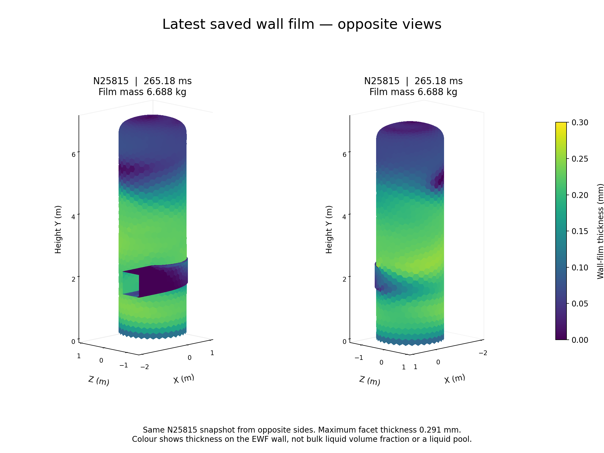
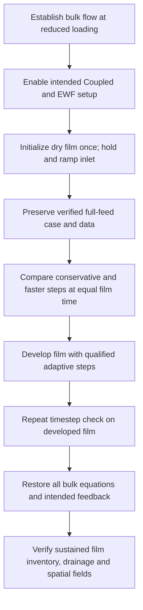

# Stage 3 — Film development results

| Current state | Evidence |
| --- | --- |
| Goal | Fastest numerically adequate film development; stationary film remains unreached |
| Server / parent | Server 1; preserved early-start N5080; 3.5 ms, 0.164512 kg |
| Transfer status | N25815 pair saved/reopened; `VERIFIED_TRANSFER_READY`; Server 1 idle; student server not yet loaded. [Transfer verification](../../../../../../PyAnsys/output/phase72a-stage3-film-development-server1/20261005/transfer-final-N25815.json) |
| Controller | `TRANSFER_READY`; verified N25815; active target None |
| Current restart / film | N25815; 265.184339 ms; 6.688276 kg |
| Branch limit | Initial probes share N5080; selected recoveries restart passing N7190 and N22615. Rejected N8190 and N23615 continuations are excluded from the selected field history; do not add sibling film times |
| Fixed science | Full feed, R3, corrected absorber, bulk Coupled, film equations/forces/sources/boundaries and flow feedback |
| Bulk advancement | Temporarily frozen during matched-time checks and relaxation; restoration required before goal closure |
| Applying the findings | [Findings to apply to another case](#findings-to-apply-to-another-case): observed gains, reusable procedure and transfer limits |
| Spatial film development | [Wall-film thickness on the separator](#wall-film-thickness-on-the-separator): shared-scale saved-snapshot comparison |
| Complete selected history | [Four-panel selected case history](#four-panel-selected-case-history): inventory, signed outlet flux, film mass, accretion and drainage |

| Branch / native interval | Film step (µs) | Added time (ms) | Final film (kg) | Inner pass (%) | Final residual >1 (updates) | Ledger error (%) | Film ms / wall min |
| --- | ---: | ---: | ---: | ---: | ---: | ---: | ---: |
| Initial 30-subiteration probe; N5080–N5180 | 1–1 | 0.1 | 0.172643 | 64.00 | 36 | 0.00015375 | 0.05464 |
| half-step-recovery-1; N5080–N5180 | 0.5–0.5 | 0.05 | 0.168577 | 65.00 | 35 | 0.000149867 | 0.02664 |
| segregated-film-probe-2; N5080–N5180 | 1–1 | 0.1 | 0.172643 | 55.00 | 45 | 0.000157623 | 0.05139 |
| alternative-implicit-probe-3; N5080–N5180 | 1–1 | 0.1 | 0.172643 | Unavailable | Unavailable | 0.000153721 | Not recovered |
| alternative-implicit-probe-3; N5180–N5190 | 1–1 | 0.01 | 0.173456 | Unavailable | Unavailable | 0.000162126 | 0.01062 |
| frozen-bulk-diagnostic-4; N5080–N5180 | 1–1 | 0.1 | 0.172624 | 64.00 | 36 | 0.000154101 | 0.06346 |
| matched-time-conservative-5; N5080–N6080 | 0.5–0.5 | 0.5 | 0.205073 | Unavailable | Unavailable | 0.000187623 | 0.07421 |
| matched-time-candidate-6; N5080–N5180 | 5–5 | 0.5 | 0.205073 | Unavailable | Unavailable | 0.000187671 | 0.3534 |
| matched-time-10us-7; N5080–N5130 | 10–10 | 0.5 | 0.205073 | Unavailable | Unavailable | 0.000187634 | 0.442 |
| matched-time-50us-8; N5080–N5090 | 50–50 | 0.5 | 0.205073 | Unavailable | Unavailable | 0.000187091 | 0.6112 |
| adaptive-development; N5090–N5190 | 12.5–50 | 1.90375 | 0.359507 | Unavailable | Unavailable | 0.000493027 | 1.241 |
| adaptive-development; N5190–N6190 | 16.2–16.2 | 16.25 | 1.676095 | Unavailable | Unavailable | 0.00703287 | 2.377 |
| adaptive-development; N6190–N7190 | 16.2–16.2 | 16.25 | 2.737597 | Unavailable | Unavailable | 0.0288753 | 2.327 |
| adaptive-development; N7190–N8190 | 7.54–23.7 | 16.3144 | 3.327720 | Unavailable | Unavailable | 0.0294408 | 2.288 |
| adaptive-recovery-from-N7190; N7190–N7290 | 5–5 | 0.5 | 2.759282 | Unavailable | Unavailable | 0.0127038 | 0.3223 |
| adaptive-recovery-from-N7190; N7290–N7390 | 5–6.61 | 0.658775 | 2.787119 | Unavailable | Unavailable | 0.0130373 | 0.4206 |
| adaptive-recovery-from-N7190; N7390–N8390 | 3.31–6.61 | 3.64679 | 2.930324 | Unavailable | Unavailable | 0.00961333 | 0.5356 |
| adaptive-recovery-from-N7190; N8390–N9390 | 3.31–3.31 | 3.30625 | 3.051873 | Unavailable | Unavailable | 0.0085869 | 0.4789 |
| adaptive-recovery-from-N7190; N9390–N10390 | 0.827–7.73 | 5.94204 | 3.256746 | Unavailable | Unavailable | 0.0132162 | 0.8592 |
| adaptive-recovery-from-N7190; N10390–N11390 | 7.73–7.73 | 7.73466 | 3.483715 | Unavailable | Unavailable | 0.013698 | Not recovered |
| adaptive-recovery-from-N7190; N11390–N12390 | 7.73–7.73 | 7.73466 | 3.683625 | Unavailable | Unavailable | 0.0110449 | 1.117 |
| adaptive-recovery-from-N7190; N12390–N13390 | 7.73–7.73 | 7.73466 | 3.863540 | Unavailable | Unavailable | 0.0109188 | Not recovered |
| mid-film-reference-N13390; N13390–N14390 | 2.5–2.5 | 2.5 | 3.917620 | Unavailable | Unavailable | 0.00957824 | 0.3643 |
| mid-film-candidate25-N13390; N13390–N13490 | 25–25 | 2.5 | 3.917865 | Unavailable | Unavailable | 0.133906 | 1.603 |
| mid-film-candidate20-N13390; N13390–N13515 | 20–20 | 2.5 | 3.917691 | Unavailable | Unavailable | 0.0474281 | 1.467 |
| adaptive-mid-film-N13390; N13515–N13615 | 20–20 | 2 | 3.959921 | Unavailable | Unavailable | 0.0442549 | 1.297 |
| adaptive-mid-film-N13390; N13615–N14615 | 20–20 | 20 | 4.337925 | Unavailable | Unavailable | 0.0397267 | 2.93 |
| adaptive-mid-film-N13390; N14615–N15615 | 10–20 | 18.5242 | 4.640778 | Unavailable | Unavailable | 0.0250425 | 2.687 |
| adaptive-mid-film-N13390; N15615–N16615 | 17.5–17.5 | 17.4901 | 4.909291 | Unavailable | Unavailable | 0.0132023 | 2.489 |
| adaptive-mid-film-N13390; N16615–N17615 | 17.5–17.5 | 17.4901 | 5.167658 | Unavailable | Unavailable | 0.0136088 | 2.522 |
| adaptive-mid-film-N13390; N17615–N18615 | 17.5–17.5 | 17.4901 | 5.419325 | Unavailable | Unavailable | 0.0135333 | 2.516 |
| adaptive-mid-film-N13390; N18615–N19615 | 17.5–17.5 | 17.4901 | 5.664900 | Unavailable | Unavailable | 0.0140522 | 2.502 |
| adaptive-mid-film-N13390; N19615–N20615 | 17.5–17.5 | 17.4901 | 5.905594 | Unavailable | Unavailable | 0.013982 | 2.496 |
| adaptive-mid-film-N13390; N20615–N21615 | 17.5–17.5 | 17.4901 | 6.141923 | Unavailable | Unavailable | 0.013656 | 2.498 |
| adaptive-mid-film-N13390; N21615–N22615 | 17.5–17.5 | 17.4901 | 6.374296 | Unavailable | Unavailable | 0.013437 | 2.49 |
| adaptive-mid-film-N13390; N22615–N23615 | 8.75–20.6 | 19.0496 | 6.623635 | Unavailable | Unavailable | 0.0323762 | 2.709 |
| adaptive-recovery-from-N22615; N22615–N22715 | 5–5 | 0.5 | 6.380885 | Unavailable | Unavailable | 0.0173277 | 0.3222 |
| adaptive-recovery-from-N22615; N22715–N22815 | 5–7.6 | 0.754987 | 6.390830 | Unavailable | Unavailable | 0.0138061 | 0.4784 |
| adaptive-recovery-from-N22615; N22815–N23815 | 7.6–7.6 | 7.60437 | 6.490627 | Unavailable | Unavailable | 0.0118966 | 1.101 |
| adaptive-recovery-from-N22615; N23815–N24815 | 7.6–7.6 | 7.60438 | 6.589768 | Unavailable | Unavailable | 0.0116446 | 1.102 |
| adaptive-recovery-from-N22615; N24815–N25815 | 7.6–7.6 | 7.60438 | 6.688276 | Unavailable | Unavailable | 0.0127071 | Not recovered |

| Adaptive recovery | Evidence / selected change |
| --- | --- |
| Rejected batch | N22615–N23615; peak Courant 1.22706 exceeds 1; local pair preserved |
| Restart | Exact passing N22615 fields; no initialization |
| Numerical change | Fixed 5 µs ×100; then adaptive Courant 0.2, growth 1.15, reduction 2 |
| Figure lineage | Original passing branch through N7190, followed by the selected recovery; rejected continuation is excluded |

| Mid-development matched-time arm | Mass L1 (%) | Velocity difference (%) | Thickness difference (%) | Drainage difference / accretion (%) | Ledger (%) | Peak Courant | Screen |
| --- | ---: | ---: | ---: | ---: | ---: | ---: | --- |
| 25 µs versus 2.5 µs; identical N13390 fields; +2.5 ms | 0.00757482 | 0.00343449 | 0.000149934 | 0.00364162 | 0.133906 | 0.637097 | FAIL |
| 20 µs versus 2.5 µs; identical N13390 fields; +2.5 ms | 0.00284794 | 0.00206613 | 0.000115333 | 0.00283192 | 0.0474281 | 0.96675 | PASS |

| Mid-development decision | Evidence |
| --- | --- |
| 25 µs rejected | 0.1339% ledger error exceeds 0.1%; field agreement alone does not qualify the step |
| Smaller candidates | 20 µs, then 12.5 µs if needed; reuse the preserved reference and same 2.5 ms horizon |

| Matched film-time comparison | Observation |
| --- | --- |
| Native film time | 78.1616 ms; FROZEN_IDENTICAL_N13390_BULK_FIELDS |
| Reference / candidate step | 2.5 / 20 µs |
| Mass-distribution L1 difference | 0.00284794% |
| Film-mass-weighted velocity difference | 0.00206613% |
| Maximum thickness difference | 0.000115333% |
| Predeclared local screen | PASS; applies to this state and time range |
| Inner-solve limit | No inner residuals available from the alternative solver; no tolerance-pass claim |

| Total liquid inventory | Bulk phase-2 liquid (kg) | EWF film (kg) | Sum (kg) |
| --- | ---: | ---: | ---: |
| Startup endpoint N5080 | 61.054883 | 0.164512 | 61.219395 |
| Latest saved state N25815 | 61.054883 | 6.688276 | 67.743158 |

| Inventory interpretation | Limit |
| --- | --- |
| Definition | Bulk Eulerian phase-2 liquid plus EWF film; diagnostic DPM particles are excluded |
| Frozen development | Bulk inventory is held by the disabled bulk equations; its constant value is not proof of bulk stationarity. Film accumulation increases the sum. Restore all bulk equations to judge full-model inventory and conservation. |
| Physical rate | The film storage rate uses actual film time. Do not assign a physical bulk storage rate from steady pseudo-time updates. |

| Latest complete window | Rate / interpretation |
| --- | --- |
| Accretion / drainage / storage | 81.120965 / 68.177178 / 12.954095 kg/s |
| Drainage deficit | 15.956155% |
| Peak film Courant / maximum thickness | 0.109029 / 0.30372 mm |
| Observation | Inventory is still increasing; film ledger agreement does not establish inner-solve convergence |
| Stationary screen | Three consecutive 1000-update windows with drainage deficit and absolute storage/accretion ≤1%; ledger ≤0.1%; finite fields with nonnegative film thickness; inspect histories |
| Numerical criterion | Original solver: ≥99% inner pass and zero final residual >1. Alternative: matched-time facet-field agreement; inner residuals unavailable; repeat on developed film |
| Goal closure | Restore all bulk equations; verify sustained full-model film stationarity and developed-film timestep agreement |
| Claim limit | Successful startup remains supported; steady film, step-independent film distribution and whole-separator closure remain unqualified |
| Alternative implicit limit | Fluent beta route printed film clocks but no h/u/v subiterations in the tested batch; absence of residuals is not convergence evidence |

| Evidence route | Record |
| --- | --- |
| Intent / criteria | [Setup](setup.md) |
| Native reports, transcripts, residuals, clocks and paired checkpoints | [Manifest](../../../../../../PyAnsys/output/phase72a-stage3-film-development-server1/20261005/run-manifest.json) |
| Reproducible figures | [Analysis script](../../../../../../PyAnsys/scripts/analysis/analyze_phase72a_stage3_film_development.py) |

<!-- BEGIN retained selected case history -->

## Four-panel selected case history

*Selected field path, N1–N25815, with no missing native coordinates. The layout reproduces the supplied N45606 history figure using this Stage 3 case's data and setting-change markers. Diamonds show preserved restart states.*

| Marker | Native iteration | Change in this selected path |
| --- | ---: | --- |
| A | 1580 | Retain historical low-feed bulk fields; enable Coupled, dry EWF, R3 and corrected contact absorber; hold 500 updates at quarter feed |
| B | 2080 | Start the 2000-update inlet ramp |
| C | 4080 | Reach full feed; hold 1000 updates |
| D | 5080 | Freeze bulk advancement; alternative implicit film solver; selected 50 µs ×10 matched-time arm, then adaptive development from N5090 |
| E | 7190 | Restart passing fields; fixed 5 µs ×100, then adaptive target 0.2 |
| F | 13390 | Selected 20 µs ×125 matched-time arm; adaptive target 0.5 from N13515 |
| G | 22615 | Restart passing fields; fixed 5 µs ×100, then adaptive target 0.2 from N22715 |

| Plot evidence / interpretation | Verified basis or limit |
| --- | --- |
| Parent history | Original low-feed N1–N1580 native inventory and outlet reports; EWF off before A |
| Selected startup | N1580–N5080 early Coupled/EWF startup; final parent hashes match the film-development parent pair |
| Selected continuation | Passing N7190 and N22615 restart fields; selected 50 µs and 20 µs arms; sibling tests and rejected N8190/N23615 continuations excluded |
| Coverage | All 25815 native coordinates; five required reports checked against native `.out` files in each continuation segment; inventory, cumulative drainage and outlet-flux joins pass |
| Inventory definition | Bulk Eulerian phase-2 liquid, and its sum with EWF wall-film mass; diagnostic DPM excluded |
| Outlet sign | Native signed phase-2 `steamoutlet` flux; negative values mean outward liquid flow |
| Drainage calculation | Per-update cumulative film outflow difference divided by film-time increment. Constant-step batches use verified full-precision steps; variable batches retain the printed native-clock resolution, with saved endpoint anchors. No rate smoothing. |
| N25815 endpoint | 265.184339 ms film time; bulk 61.054883 kg; film 6.688276 kg; combined 67.743158 kg; signed liquid outlet flux −3.429962 kg/s |
| Flat bulk curves after D | Bulk equations are disabled; constant bulk mass and outlet flux do not establish bulk convergence or whole-model stationarity |
| Film development | Film inventory continues to rise; drainage is below accretion. Elapsed film time differs from the native iteration coordinate. |
| Claim limit | Saved field development only; full-bulk restoration, developed-film timestep qualification and sustained stationarity remain required |
| Export / evidence | [PDF](figures/selected-case-history-N25815.pdf), [CSV](../../../../../../PyAnsys/output/phase72a-stage3-film-development-server1/20261005/selected-history/selected-case-history-N25815.csv), [manifest](../../../../../../PyAnsys/output/phase72a-stage3-film-development-server1/20261005/selected-history/selected-case-history-N25815-manifest.json), [reproduction script](../../../../../../PyAnsys/scripts/analysis/plot_phase72a_stage3_selected_history.py) |

### Scaled residuals

*One plot of all seven native scaled carrier residuals, N1–N5080, with no gaps or smoothing. The retained low-feed parent supplies N1–N1580; the selected early Coupled/EWF startup supplies N1581–N5080. Bulk equations were frozen after N5080, so later film-development updates have no carrier residuals plotted. EWF inner residuals are separate and are not included.*

| Evidence | Record |
| --- | --- |
| Data checks | All 3501 startup residual rows match the native transcript; the N1580 parent join passes; all 5080 plotted rows are finite and positive |
| Scaling | Native Fluent scaling retained; no renormalisation or convergence claim |
| Last carrier solve, N5080 | Continuity 1.863×10⁻³; phase-2 volume fraction 3.3869×10⁻³ |
| Files | [PDF](figures/selected-scaled-residuals-N5080.pdf), [CSV](../../../../../../PyAnsys/output/phase72a-stage3-film-development-server1/20261005/selected-history/selected-scaled-residuals-N5080.csv), [manifest](../../../../../../PyAnsys/output/phase72a-stage3-film-development-server1/20261005/selected-history/selected-scaled-residuals-N5080-manifest.json), [script](../../../../../../PyAnsys/scripts/analysis/plot_phase72a_stage3_scaled_residuals.py) |

<!-- END retained selected case history -->

<!-- BEGIN retained wall thickness views -->

## Wall-film thickness on the separator

*Actual EWF wall-face values at N5190, N13390 and N25815; shared camera and linear colour range 0–0.30 mm. Film time starts at the dry-film activation at A. Python rendering of native Fluent geometry and facet fields; no spatial interpolation.*

| Saved state | Film time (ms) | Film mass (kg) | Maximum facet thickness (mm) | Wall area with thickness ≥1 µm (%) | Wall area with thickness ≥0.1 mm (%) |
| --- | ---: | ---: | ---: | ---: | ---: |
| Early development, N5190 | 5.904 | 0.360 | 0.124 | 45.90 | 0.80 |
| Before step requalification, N13390 | 75.662 | 3.864 | 0.253 | 84.56 | 40.34 |
| Latest snapshot used in this figure, N25815 | 265.184 | 6.688 | 0.291 | 94.44 | 61.98 |

*Opposite views of the same N25815 snapshot, using the same thickness scale. These views expose wall areas hidden in the comparison camera.*

| Observation or qualification | Evidence / limit |
| --- | --- |
| Visual development | The lower and middle separator wall has a broader region of appreciable film at N25815. The upper wall remains much thinner. |
| Peak thickness versus retained mass | Maximum facet thickness rises from 0.253 mm at N13390 to 0.291 mm at N25815, while inventory rises from 3.864 to 6.688 kg. Wall area above 0.1 mm increases from 40.34% to 61.98%; the maximum alone does not describe the growth. |
| Coverage definition | Area-weighted wall facets with thickness ≥1 µm or ≥0.1 mm; these are declared display metrics, not Fluent's default wetted-area definition. Polygon areas come from the native wall geometry. |
| Surface and units | Film-enabled boundary `wall`, 3463 facets, 53.437 m²; height is Fluent Y in metres; thickness is converted from metres to millimetres. |
| Source verification | Each saved snapshot matches the captured wall centroids and face ordering; summed facet mass matches its report. Paired checkpoint identities and file hashes are recorded in the figure manifest. |
| Rendering | Matplotlib colours the actual Fluent wall polygons with their saved face thickness. No node interpolation or smoothing. Visible polygon structure reflects the discrete facet values. |
| Calculation state | Temporarily frozen bulk flow. The film is still developing; these contours do not establish steady film, timestep independence or physical validation. |
| Run impact | Existing verified geometry reused; N25815 facet fields extracted from the idle reopened transfer endpoint; zero additional solve commands. |
| Reproduction / provenance | [Plot script](../../../../../../PyAnsys/scripts/analysis/plot_phase72a_stage3_wall_thickness.py), [figure manifest](../../../../../../PyAnsys/output/phase72a-stage3-film-development-server1/20261005/wall-thickness-views/figure-manifest-N25815.json) |

<!-- END retained wall thickness views -->

<!-- BEGIN retained transfer findings -->

## Findings to apply to another case

| Scope | Interpretation |
| --- | --- |
| Reusable sequence | Controlled startup → matched-film-time step qualification → accelerated film development → full-model verification |
| Numerical transfer | Re-establish the timestep and limits for each case |
| Evidence covered below | Completed tests through N16615; later continuation does not change these test conditions |

| Finding | Observed evidence | Meaning and transfer limit |
| --- | --- | --- |
| Early Coupled/EWF startup can reduce loading excursions | With the combined R3/contact-absorber recipe, ramp peaks fell by 70.15% for continuity, 70.43% for combined liquid inventory and 75.78% for outward liquid carryover. See the [startup result](../results.md#matched-loading-comparison). | Promising startup recipe for this case. Several settings changed together; the test does not isolate the effect of early EWF or Coupled activation. A large activation spike still occurred before the ramp. |
| More bulk iterations can add very little film time | The original 3500 startup updates at 1 µs added only 3.5 ms; drainage was negligible. | Assess development using actual film time, inventory and drainage. Bulk iteration count alone is insufficient. |
| Faster qualified stepping improved film development per wall time | N13615–N14615 added 20 ms in 409.57 s: 2.930 film ms per wall minute. N11390–N12390 added 7.735 ms at 1.117 film ms per wall minute. | About 2.62 times the recent advancement rate. These windows used different film states; this is an observed operational gain, not an isolated timestep benchmark. |
| Small film ledger error does not prove a good inner solve | The original implicit solver at 1 µs with 30 subiterations still had 36 final-residual-above-1 updates out of 100. Halving the step left 35; freezing bulk left 36. | A smaller timestep or frozen bulk alone did not resolve the residual failures. Inspect inner solves as well as inventory and accounting. |
| The alternative implicit route supported larger-step development | The version-matched Fluent 2025 R2 beta route passed local matched-time field and ledger checks, including the 20 µs arm below. | Optional numerical repair. It did not report h/u/v subiterations in these tests; missing residuals do not count as convergence. |
| Close film fields alone do not qualify a step | At identical N13390 parent fields and +2.5 ms, 20 µs passed with 0.04743% ledger error; 25 µs failed with 0.13391%, above the 0.1% criterion, despite close field agreement. | Check spatial fields and the integrated mass balance together. Neither 20 µs nor the 0.1% criterion is a universal default. |
| Step qualification depends on film state | 50 µs passed the early-film +0.5 ms screen. Later, a higher-target adaptive batch reached Courant 2.0075 and was rejected; mid-development 25 µs failed its ledger screen. | Repeat qualification as the film develops. Early-film acceptance is not a permanent stable-step limit. |
| Film development remains distinct from a steady result | At N16615, film mass was 4.909 kg; last-batch accretion/drainage/storage were 81.12/65.78/15.35 kg/s. Bulk equations were frozen. | Inventory was still increasing. Developed-film timestep checks and sustained checks with all bulk equations restored remain required. |

| Procedure for a new dry-film case | Action | Required evidence |
| --- | --- | --- |
| 1. Prepare the intended physics | Check materials, film walls, accretion, drainage topology, feedback, roughness and any absorber needed by that case. Configure reports before solving. | Record the actual source and outlet routes. Reuse this case's R3/contact setup only when it is part of the new scientific intent. |
| 2. Use a controlled startup | Establish reduced-feed bulk flow; activate the intended Coupled/EWF setup, initialize dry film once, hold, then ramp. | Our 25% feed, 500-update hold, 2000-update ramp and 1000-update full-feed hold are a first trial for a similar case. Check activation and loading separately; adjust for the new case. |
| 3. Establish a conservative film baseline | Test a small candidate step. Preserve bulk and film fields when changing numerical controls; do not initialize again. | Finite fields, nonnegative thickness, credible thickness bounds, complete source accounting and adequate inner solves where residuals are available. |
| 4. Qualify a faster step | Branch conservative and faster steps from one saved parent; hold physics and bulk forcing identical; reach equal film time. | Compare mass distribution, thickness, velocity, drainage, Courant and the integrated ledger. A conservative reference is a comparison, not automatic proof of timestep independence. |
| 5. Develop efficiently | Use qualified adaptive controls; inspect a short probe, then approximately 1000-update native batches with local paired checkpoints. | Verify actual accepted steps, film clock and fields. Requalify if accepted steps exceed the tested range or the developing film changes the numerical response. |
| 6. Verify the intended full model | Repeat the timestep comparison on developed film; restore all bulk equations and intended coupling. Continue until rates, inventory and spatial fields persist. | For this experiment, the screen uses three consecutive 1000-update windows with drainage deficit and absolute storage/accretion ≤1%, ledger ≤0.1%, and finite fields, plus spatial-persistence checks. Set justified criteria for the new case. |

| Matched-time example from this experiment | Fixed film step | Updates | Added film time |
| --- | ---: | ---: | ---: |
| Conservative reference from preserved N13390 | 2.5 µs | 1000 | 2.5 ms |
| Passing faster candidate from the same N13390 | 20 µs | 125 | 2.5 ms |
| Rejected candidate from the same N13390 | 25 µs | 100 | 2.5 ms |

| Numerical choice or restriction | How to apply it |
| --- | --- |
| Adaptive controls | In Fluent 2025 R2: Models → Eulerian Wall Film → Solution Method and Control → Adaptive Time Stepping. Below half the Courant target, the step grows; above the target, it reduces. Both factors must exceed 1. [User's Guide §30.4](https://ansyshelp.ansys.com/public/Views/Secured/corp/v252/en/flu_ug/flu_ug_ewf_sec_eqns.html), [Theory Guide §17.4.3](https://ansyshelp.ansys.com/public/Views/Secured/corp/v252/en/flu_th/flu_th_ewf_sec_sol_alg.html). |
| Tested control values | The mid-development continuation used target 0.5, growth 1.15 and reduction 2 after the 20 µs screen. Adaptive control later reduced the step to 17.4900625 µs. Treat these as tested examples; select and qualify values for the new mesh, forcing and film state. |
| Actual step verification | An enabled adaptive flag is insufficient. Check printed accepted steps and saved native film time. In these tests, `timestep-max` did not establish an adaptive ceiling, and the configured initial step could differ from the first continued step. See the [reusable readback procedure](../../../../../../CFD_wiki/wiki/guidance/fluent-general-click-by-click.md#adaptive-ewf-stepping-apply-and-verify-2025-r2). |
| Temporary bulk freezing | The documented steady-film formulation assumes converged, unchanged bulk flow and negligible reciprocal film effect. Our frozen stage was a development procedure; it did not qualify bulk convergence. If intended feedback changes bulk flow, use frozen development as an initial film field and qualify the restored full model. [Theory Guide §17.4.3](https://ansyshelp.ansys.com/public/Views/Secured/corp/v252/en/flu_th/flu_th_ewf_sec_sol_alg.html). |
| Coupling controls | Bulk pressure–velocity Coupled, film Coupled Solution, and Flow Momentum Coupling are separate settings. Preserve each intended setting during a timestep comparison. This case retained film mass/momentum coupling and Flow Momentum Coupling off. |
| Transient-flow restriction | Film substeps must advance consistently with bulk physical time. A frozen steady-flow shortcut does not reproduce a transient startup history. [Theory Guide §17.4.3](https://ansyshelp.ansys.com/public/Views/Secured/corp/v252/en/flu_th/flu_th_ewf_sec_sol_alg.html). |
| Film accounting | For the present accretion-fed configuration, residual mass is ΔMfilm + ΔMdrain − Σ(Aᵢ Δtᵢ). Use actual accepted film-time increments, kg for mass and kg/s for rates. Include every additional input and loss if DPM deposition, stripping, evaporation, clipping or user sources are active. Small film-only error does not establish combined separator closure. |
| Completion target | Drainage must balance net film input, storage must become small, and spatial film fields must persist with the intended bulk equations active. The final mass and required film time belong to the new case; the older reference inventory is not a universal target. |
| Implementation reuse | Adapt the preservation, readback, matched-time comparison and recovery pattern in the [runner](../../../../../../PyAnsys/scripts/setup/continue_phase72a_stage3_film_development.py). Its Server 1 connection, parent N5080, paths and thresholds are case-specific; do not run it unchanged on another case. |

<!-- END retained transfer findings -->
