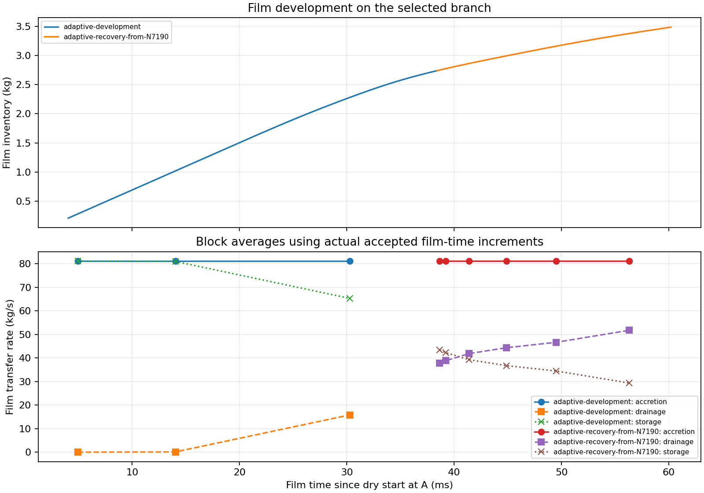
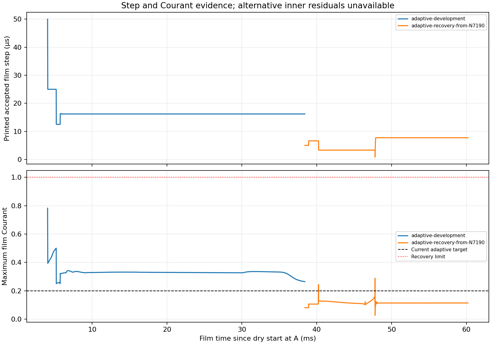

# Stage 3 — Film development results

| Current state | Evidence |
| --- | --- |
| Goal | Fastest numerically adequate film development; stationary film remains unreached |
| Server / parent | Server 1; preserved early-start N5080; 3.5 ms, 0.164512 kg |
| Controller | `RUNNING`; verified N11390; active target 12390 |
| Current restart / film | N11390; 60.192263 ms; 3.483715 kg |
| Connection recovery | Client stream timeout during N10390–N11390; Fluent completed all 1000 updates. Native records and 31 histories recovered; N11390 pair saved/reopened; zero repeated solve updates |
| Branch limit | Initial probes share N5080; adaptive recovery restarts passing N7190. Exclude rejected N8190 from selected field lineage; do not add sibling film times |
| Fixed science | Full feed, R3, corrected absorber, bulk Coupled, film equations/forces/sources/boundaries and flow feedback |
| Bulk advancement | Temporarily frozen during matched-time checks and relaxation; restoration required before goal closure |

| Branch / native interval | Film step (µs) | Added time (ms) | Final film (kg) | Inner pass (%) | Final residual >1 (updates) | Ledger error (%) | Film ms / wall min |
| --- | ---: | ---: | ---: | ---: | ---: | ---: | ---: |
| Initial 30-subiteration probe; N5080–N5180 | 1–1 | 0.1 | 0.172643 | 64.00 | 36 | 0.00015375 | 0.05464 |
| half-step-recovery-1; N5080–N5180 | 0.5–0.5 | 0.05 | 0.168577 | 65.00 | 35 | 0.000149867 | 0.02664 |
| segregated-film-probe-2; N5080–N5180 | 1–1 | 0.1 | 0.172643 | 55.00 | 45 | 0.000157623 | 0.05139 |
| alternative-implicit-probe-3; N5080–N5180 | 1–1 | 0.1 | 0.172643 | Unavailable | Unavailable | 0.000153721 | Not recovered |
| alternative-implicit-probe-3; N5180–N5190 | 1–1 | 0.01 | 0.173456 | Unavailable | Unavailable | 0.000162126 | 0.01062 |
| frozen-bulk-diagnostic-4; N5080–N5180 | 1–1 | 0.1 | 0.172624 | 64.00 | 36 | 0.000154101 | 0.06346 |
| matched-time-conservative-5; N5080–N6080 | 0.5–0.5 | 0.5 | 0.205073 | Unavailable | Unavailable | 0.000187623 | 0.07421 |
| matched-time-candidate-6; N5080–N5180 | 5–5 | 0.5 | 0.205073 | Unavailable | Unavailable | 0.000187671 | 0.3534 |
| matched-time-10us-7; N5080–N5130 | 10–10 | 0.5 | 0.205073 | Unavailable | Unavailable | 0.000187634 | 0.442 |
| matched-time-50us-8; N5080–N5090 | 50–50 | 0.5 | 0.205073 | Unavailable | Unavailable | 0.000187091 | 0.6112 |
| adaptive-development; N5090–N5190 | 12.5–50 | 1.90375 | 0.359507 | Unavailable | Unavailable | 0.000493027 | 1.241 |
| adaptive-development; N5190–N6190 | 16.2–16.2 | 16.25 | 1.676095 | Unavailable | Unavailable | 0.00703287 | 2.377 |
| adaptive-development; N6190–N7190 | 16.2–16.2 | 16.25 | 2.737597 | Unavailable | Unavailable | 0.0288753 | 2.327 |
| adaptive-development; N7190–N8190 | 7.54–23.7 | 16.3144 | 3.327720 | Unavailable | Unavailable | 0.0294408 | 2.288 |
| adaptive-recovery-from-N7190; N7190–N7290 | 5–5 | 0.5 | 2.759282 | Unavailable | Unavailable | 0.0127038 | 0.3223 |
| adaptive-recovery-from-N7190; N7290–N7390 | 5–6.61 | 0.658775 | 2.787119 | Unavailable | Unavailable | 0.0130373 | 0.4206 |
| adaptive-recovery-from-N7190; N7390–N8390 | 3.31–6.61 | 3.64679 | 2.930324 | Unavailable | Unavailable | 0.00961333 | 0.5356 |
| adaptive-recovery-from-N7190; N8390–N9390 | 3.31–3.31 | 3.30625 | 3.051873 | Unavailable | Unavailable | 0.0085869 | 0.4789 |
| adaptive-recovery-from-N7190; N9390–N10390 | 0.827–7.73 | 5.94204 | 3.256746 | Unavailable | Unavailable | 0.0132162 | 0.8592 |
| adaptive-recovery-from-N7190; N10390–N11390 | 7.73–7.73 | 7.73466 | 3.483715 | Unavailable | Unavailable | 0.013698 | Not recovered |

| Adaptive recovery | Evidence / selected change |
| --- | --- |
| Rejected batch | N7190–N8190; peak Courant 2.00752 exceeds 1; local pair preserved |
| Restart | Exact passing N7190 fields; no initialization |
| Numerical change | Fixed 5 µs ×100; then adaptive Courant 0.2, growth 1.15, reduction 2 |
| Figure lineage | Original passing branch through N7190, followed by the selected recovery; rejected continuation is excluded |

| Matched film-time comparison | Observation |
| --- | --- |
| Native film time | 4 ms; identical frozen N5080 bulk fields |
| Reference / candidate step | 0.5 / 50 µs |
| Mass-distribution L1 difference | 0.00574315% |
| Film-mass-weighted velocity difference | 0.369213% |
| Maximum thickness difference | 0.257268% |
| Predeclared local screen | PASS; applies to this state and time range |
| Inner-solve limit | No inner residuals available from the alternative solver; no tolerance-pass claim |

| Latest complete window | Rate / interpretation |
| --- | --- |
| Accretion / drainage / storage | 81.121351 / 51.788063 / 29.344400 kg/s |
| Drainage deficit | 36.159763% |
| Peak film Courant / maximum thickness | 0.114039 / 0.257634 mm |
| Observation | Inventory is still increasing; film ledger agreement does not establish inner-solve convergence |
| Stationary screen | Three consecutive 1000-update windows with drainage deficit and absolute storage/accretion ≤1%; ledger ≤0.1%; finite fields with nonnegative film thickness; inspect histories |
| Numerical criterion | Original solver: ≥99% inner pass and zero final residual >1. Alternative: matched-time facet-field agreement; inner residuals unavailable; repeat on developed film |
| Goal closure | Restore all bulk equations; verify sustained full-model film stationarity and developed-film timestep agreement |
| Claim limit | Successful startup remains supported; steady film, step-independent film distribution and whole-separator closure remain unqualified |
| Alternative implicit limit | Fluent beta route printed film clocks but no h/u/v subiterations in the tested batch; absence of residuals is not convergence evidence |

| Evidence route | Record |
| --- | --- |
| Intent / criteria | [Setup](setup.md) |
| Native reports, transcripts, residuals, clocks and paired checkpoints | [Manifest](../../../../../../PyAnsys/output/phase72a-stage3-film-development-server1/20261005/run-manifest.json) |
| Reproducible figures | [Analysis script](../../../../../../PyAnsys/scripts/analysis/analyze_phase72a_stage3_film_development.py) |
