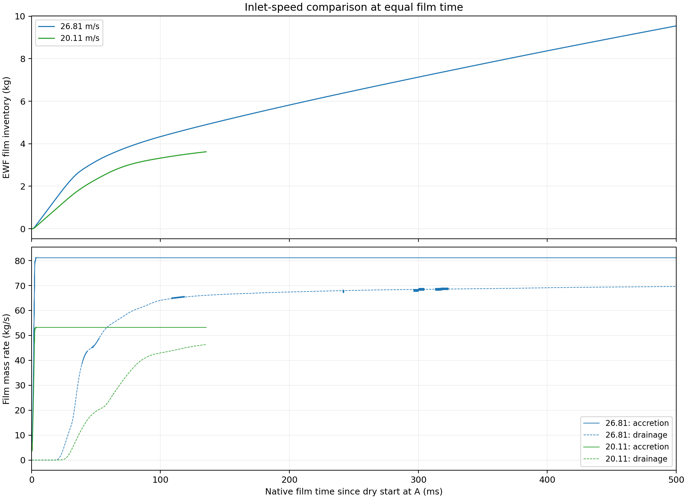

# Stage 3 — Inlet-speed sensitivity at 500 ms

| State | Evidence |
| --- | --- |
| Controller | `PAUSED`; active case low; client stopped and restart guarded |
| Pause limit | Server 1 is unreachable. N18205 is the last verified paired checkpoint. Batch N18205–N19205 was submitted; its native completion and current server idle state are unverified. Reconcile without repeating solves before resume. |
| Scope | Three speed arms; independent startup from prepared A; film develops under each arm's frozen bulk fields |
| Horizon | 500 ms native film time; not carrier elapsed physical time or a stationarity declaration |
| Setup | [Scientific contract](setup.md) |
| Machine state | [Campaign manifest](../../../../../../PyAnsys/output/phase72a-stage3-speed-sensitivity-server1/20261006/run-manifest.json) |
| Supervision | [Read-only monitor](../../../../../../PyAnsys/output/phase72a-stage3-speed-sensitivity-server1/20261006/monitor-state.json) |

*Raw selected film histories; no smoothing. Solid rate lines show accretion; dashed lines show drainage. Rejected branches and unselected timestep arms are excluded.*

| Nominal speed (m/s) | State | Film time (ms) | Film mass (kg) | Bulk + film (kg) | Maximum facet thickness (mm) |
| ---: | --- | ---: | ---: | ---: | ---: |
| 26.81 | COMPLETE_500MS | 500.000000 | 9.544399 | 70.599282 | 0.380346 |
| 20.11 | PAUSED | 135.451176 | 3.622503 | 54.363416 | 0.271091 |
| 32.14 | PENDING | — | — | — | — |

| Nominal speed (m/s) | Final-window accretion (kg/s) | Drainage (kg/s) | Storage (kg/s) | Drainage deficit (%) |
| ---: | ---: | ---: | ---: | ---: |
| 26.81 | 81.121377 | 69.599777 | 11.527971 | 14.202915 |
| 20.11 | 53.210726 | 46.007670 | 7.209373 | 13.536850 |

| Nominal speed (m/s) | Liquid feed (kg/s) | Vapor feed (kg/s) | Liquid steam-outlet flux (kg/s; signed) | Liquid steam-outlet/feed (%) | Contact removal (kg/s) |
| ---: | ---: | ---: | ---: | ---: | ---: |
| 26.81 | 116.920000 | 80.690000 | -3.429962 | 2.933597 | 77.351386 |
| 20.11 | 87.700903 | 60.525024 | -1.241907 | 1.416071 | 88.306970 |

*Carrier snapshots are fixed after each speed's own startup. Steam-outlet flux excludes the volume contact source; negative is outward. Outlet/feed is a reported ratio, not a qualified separator-efficiency result.*

*Rates use a common final 10 ms film-time window, with partial boundary increments weighted by overlap. During execution these are the latest available windows, not all 500 ms endpoints.*

| Qualification | Limit |
| --- | --- |
| Bulk fields | Frozen after each speed's own startup; constant carrier inventory and outlet flux do not establish full-model convergence |
| Film solver | Alternative implicit inner residuals unavailable; not counted as passed |
| Comparison | Equal-time developing-film sensitivity; full-model stationarity, whole-separator closure and timestep independence remain unqualified |

| Scaled carrier residual: final 500 startup updates | 26.81 m/s | 20.11 m/s | 32.14 m/s |
| --- | ---: | ---: | ---: |
| continuity | 0.0019747 | 0.001735 | — |
| x-velocity | 2.7235e-06 | 3.4184e-06 | — |
| y-velocity | 2.6437e-06 | 3.0723e-06 | — |
| z-velocity | 2.8018e-06 | 3.0657e-06 | — |
| k | 0.00011289 | 0.00012058 | — |
| epsilon | 0.00080631 | 0.0008904 | — |
| phase-2 | 0.0032252 | 0.0060422 | — |

*All seven carrier residuals cover N1581–N5080 for each available arm. Bulk equations are then frozen; there are no new carrier residuals during the long film continuation. Reported scaled means do not prove stationarity.*
