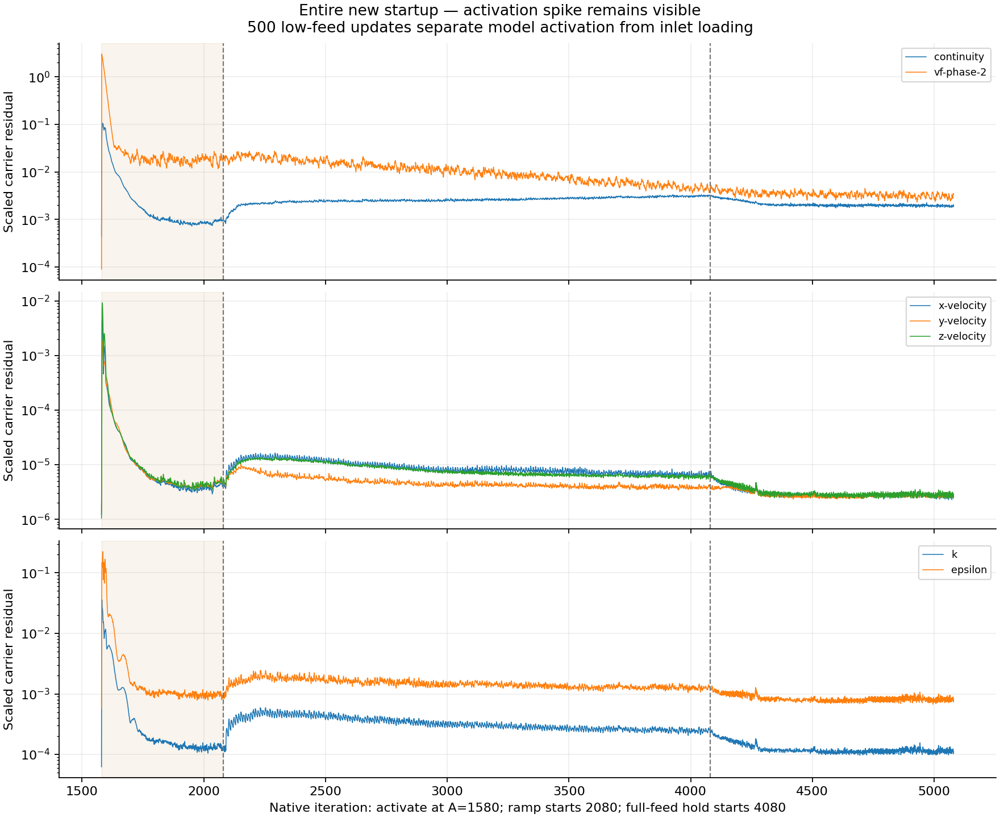
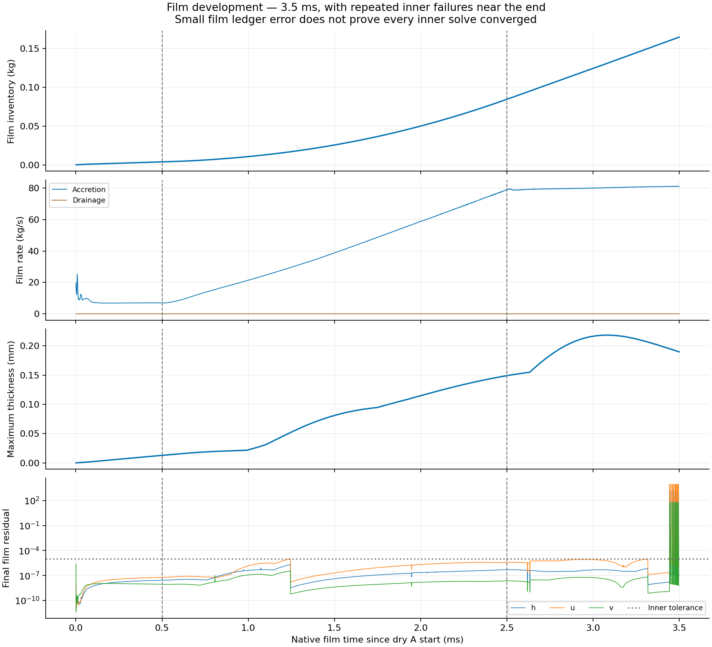

# Stage 3 — Early Coupled/EWF startup: completed result

| Question / status | Verified answer |
| --- | --- |
| Did the selected run finish? | Yes; N1580–N5080, 3500 updates; saved/reopened final pair; Server 1 verified idle |
| Did the loading spike fall? | Peak continuity, combined liquid inventory and liquid carryover are lower during the ramp |
| Was the startup spike avoided? | No; simultaneous model activation at A creates a large low-feed residual spike |
| Did all residuals improve? | No; scaled phase fraction stays higher; its normalization differs between runs |
| Did the film solve remain adequate? | All 2000 ramp updates meet the inner tolerance; 15 late target-hold updates do not |
| Is the film steady? | No; film fills; drainage is negligible at 3.5 ms |
| Selected use | Retain as a promising carrier-startup candidate; complete-run convergence and developed-film reproduction are not qualified |
| Run cost | 57.70 min, including checkpoints and verification; preparation excluded |
| Current endpoint | Server 1 N5080; no extra solve submitted |
| Run contract | [Setup](setup.md) |

## Matched loading comparison

Raw native histories. Historical N1581–N4580 and new N2081–N5080; 2000 ramp updates followed by 1000 target-feed updates. The shaded region is the target-feed hold; historical EWF remains off throughout this comparison.

| Ramp measure | Historical ramp | Early EWF + R3/contact | Change |
| --- | ---: | ---: | ---: |
| Peak continuity residual | 0.011166 | 0.0033336 | -70.15% |
| Peak bulk + film liquid | 182.518 kg | 53.9715 kg | -70.43% |
| Peak outward liquid at steamoutlet | 8.99517 kg/s | 2.17887 kg/s | -75.78% |
| Continuity 95th percentile | 0.0093913 | 0.00311895 | -66.79% |

| Final 500 of matched target hold | Historical | Early EWF + R3/contact |
| --- | ---: | ---: |
| Mean continuity residual | 0.00312557 | 0.0019747 |
| Mean bulk + film liquid (kg) | 289.203 | 60.2252 |
| Mean outward liquid at steamoutlet (kg/s) | 23.3615 | 3.30115 |

| Comparison control / limit | Verified fact |
| --- | --- |
| Bulk parent | Source hashes match A; all 17 checked bulk cell-field arrays match exactly |
| Inlet schedule | All 200 boundary-write/readback blocks match the prescribed 10-update ramp schedule |
| Report cache | Original command trace lags one row at each increment; 199 raw rows differ by one 0.43845 kg/s liquid increment |
| Alignment | Use ramp progress and verified boundary commands; do not treat the cache offset as a changed loading rate |
| Continuity normalization | Denominator 386.045961 at A, throughout saved historical ramp data, and throughout new data from A |
| Other residual normalization | Velocity and phase-fraction denominators differ; their scaled ratios are not direct raw-residual ratios |
| Physical changes | R3, contact absorber, fixed 1 µs film and activation timing change together |
| Attribution | The combined recipe improves these ramp measures; no isolated Coupled/EWF timing benefit |

## Complete startup and activation response

Native N1580–N5080. The first shaded 500-update window separates simultaneous model activation at A from inlet loading.

| Observation | Value / implication |
| --- | --- |
| Activation-hold peak continuity | 0.10593; larger than the historical ramp peak |
| Activation-hold peak scaled phase fraction | 3.0231 |
| Inference | Abrupt activation of the new contact source may contribute; simultaneous settings prevent causal separation |
| Final bulk mass | 61.054883 kg |
| Final film mass | 0.164512 kg |
| Final combined mass | 61.219395 kg |
| Final outward liquid | 3.429962 kg/s |
| Bulk gain during final 500 | 2.264414 kg; still rising |
| Bulk time | Steady pseudo-time; do not convert bulk kg/update slope to physical kg/s |

## Film evidence and numerical limits

All 3500 film clocks and final-subiteration records are present. Dotted line: recorded 1e−5 inner tolerance; dashed stage boundaries: 0.5 and 2.5 ms.

| Film measure | Result |
| --- | --- |
| Accepted step / elapsed time | Every printed accepted step 1 µs; saved clock 3.500 ms |
| Peak film Courant | 0.013450 |
| Peak / final maximum thickness | 0.218278 / 0.189723 mm |
| Integrated accretion | 0.164512383 kg |
| Cumulative drainage | 3.05485538e-07 kg |
| Film ledger error | 0.00004824% of integrated accretion |
| Film ledger | ΔM + ΔD − Σ(A Δt); film-only accounting |
| Inner tolerance | 3485/3500 updates meet all h/u/v ≤1e−5 |
| During ramp | 2000/2000 meet the inner tolerance |
| Late failures | 15 updates at N5025–N5076; 15% of final 100 updates; all reach the ten-subiteration limit |
| Largest final h/u/v | 1315.134 / 9150.082 / 59.84849 |
| Final-500 accretion / drainage | 80.736503 / 0.000226681 kg/s |
| Final-500 film storage | 80.736367 kg/s; nearly all accretion stays in the film |
| Numerical interpretation | Small film ledger error and low Courant do not establish convergence of each inner solve |

| Accounting / coverage | Verification or limit |
| --- | --- |
| Native reports | All 31 .out files match JSON; N1580–N5080, 3501 coordinates each |
| New solve histories | All seven carrier residuals, film subiterations and film clocks cover N1581–N5080 without gaps |
| Flux report files | Boundary-only; match saved computed without-sources flux at endpoint |
| Contact source | Independent contact-removal expression equals −applied source at all 3500 solve rows |
| Initial N1580 source cache | Legacy applied-source report retains 29.23 kg/s; independent new-source report is 10734.97 kg/s; exclude this unsolved row from source tracking |
| Final-500 boundary/contact residual | 50.604847 kg/s; excludes EWF transfers; not full closure |
| Complete separator | Joint source scope, bulk stationarity and physical validation remain unqualified |
| Developed film | Final 0.1645 kg is an early dry-start film; not a reproduced developed endpoint |

## Decision and artifacts

| Next action | Status |
| --- | --- |
| Retain this recipe | Supported for reducing the carrier continuity excursion and liquid storage/carryover during loading |
| Diagnose late inner-film bursts | Required before qualifying a longer film-development continuation; not tested here |
| Preserve endpoint | N5080 pair reopened; shared copies match Server 1 hashes; idle verified |
| Further compute | None submitted after this screen |
| Automatic chat return | CLI failed due to desktop active-writer lock; analysis recovered in this desktop chat |

| Evidence | Link |
| --- | --- |
| Audited metrics / hashes / normalization | [Analysis summary](../../../../../PyAnsys/output/phase72a-stage3-early-ewf-server1/20261005/analysis-summary.json) |
| Three figures as PDF | [Startup comparison PDF](../../../../../PyAnsys/output/phase72a-stage3-early-ewf-server1/20261005/startup-comparison.pdf) |
| Native transcript | [Run transcript](../../../../../PyAnsys/output/phase72a-stage3-early-ewf-server1/20261005/run-transcript.txt) |
| Histories | [Report histories](../../../../../PyAnsys/output/phase72a-stage3-early-ewf-server1/20261005/final-histories.json) |
| Final state and native film clock | [Saved/reopened endpoint](../../../../../PyAnsys/output/phase72a-stage3-early-ewf-server1/20261005/final-reopen.json) |
| Reproducible analysis | [Analysis script](../../../../../PyAnsys/scripts/analysis/analyze_phase72a_stage3_early_ewf.py) |
