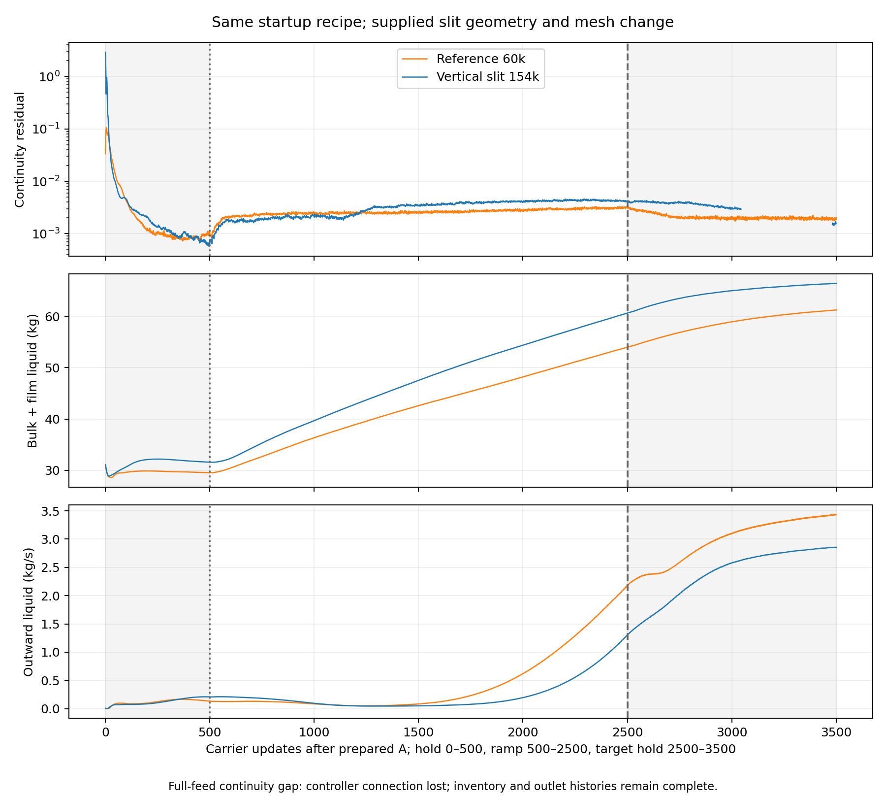
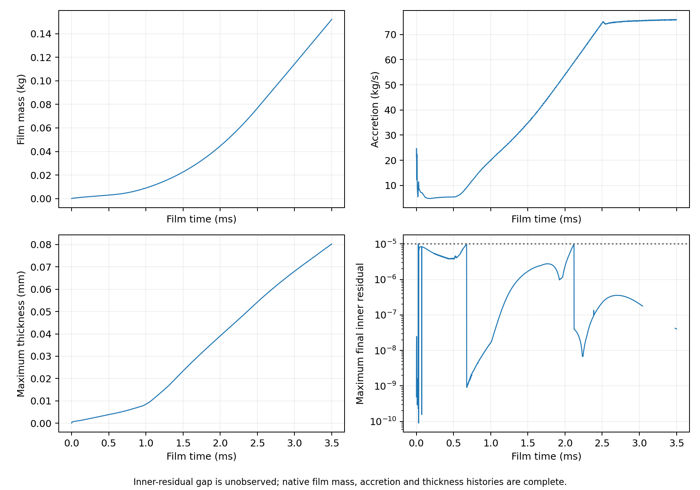

# Vertical-slit 154k startup — completed result

| Item | Verified result |
| --- | --- |
| Completion | 3500 updates; N1580–N5080; final pair saved/reopened |
| Native reports | 31 complete frequency-1 histories |
| Ramp | All 200 ten-update blocks match the reference schedule |
| Mapped A bulk inventory | 31.436038 kg; reference 31.357136 kg |
| Final bulk / film | 66.241383 / 0.152181 kg |
| Final outward liquid | 2.854843 kg/s |
| Film inner failures | 0 among 3063 observed updates; 0 during the complete ramp |
| Streamed evidence gaps | 437 carrier and 437 film-inner updates missing during full-feed hold; no final-500 continuity comparison |
| Recovery | Python controller timed out during the full-feed hold; Fluent finished the original native command; final endpoint recovered without further iterations |
| Film clock | 3.500000 ms |
| Comparison limit | Supplied geometry and mesh change together; residual normalization requires qualification |
| Scientific limit | No steady-film, physical-validation or mesh-convergence claim |
| Setup | [Run contract](setup.md) |

| Ramp peak | Reference 60k | Vertical slit 154k |
| --- | ---: | ---: |
| continuity | 0.0033336 | 0.004596 |
| combined_liquid_kg | 53.9715 | 60.6245 |
| outward_liquid_kg_s | 2.17887 | 1.30038 |

| Evidence | Link |
| --- | --- |
| Full metrics | [Analysis summary](../../../../../../PyAnsys/output/phase72a-stage3-slit154k-server3/20261005/analysis-summary.json) |
| Native paths and hashes | [Manifest](../../../../../../PyAnsys/output/phase72a-stage3-slit154k-server3/20261005/run-manifest.json) |
