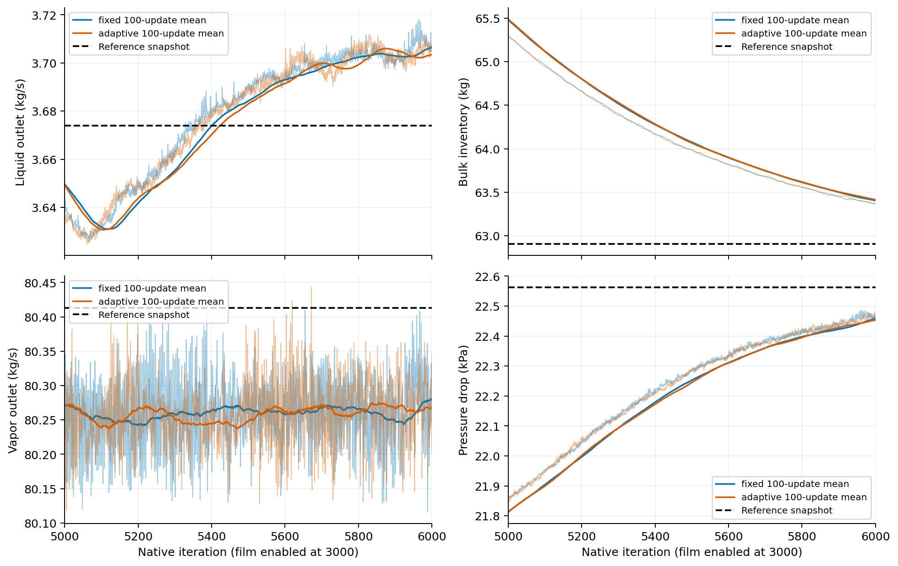
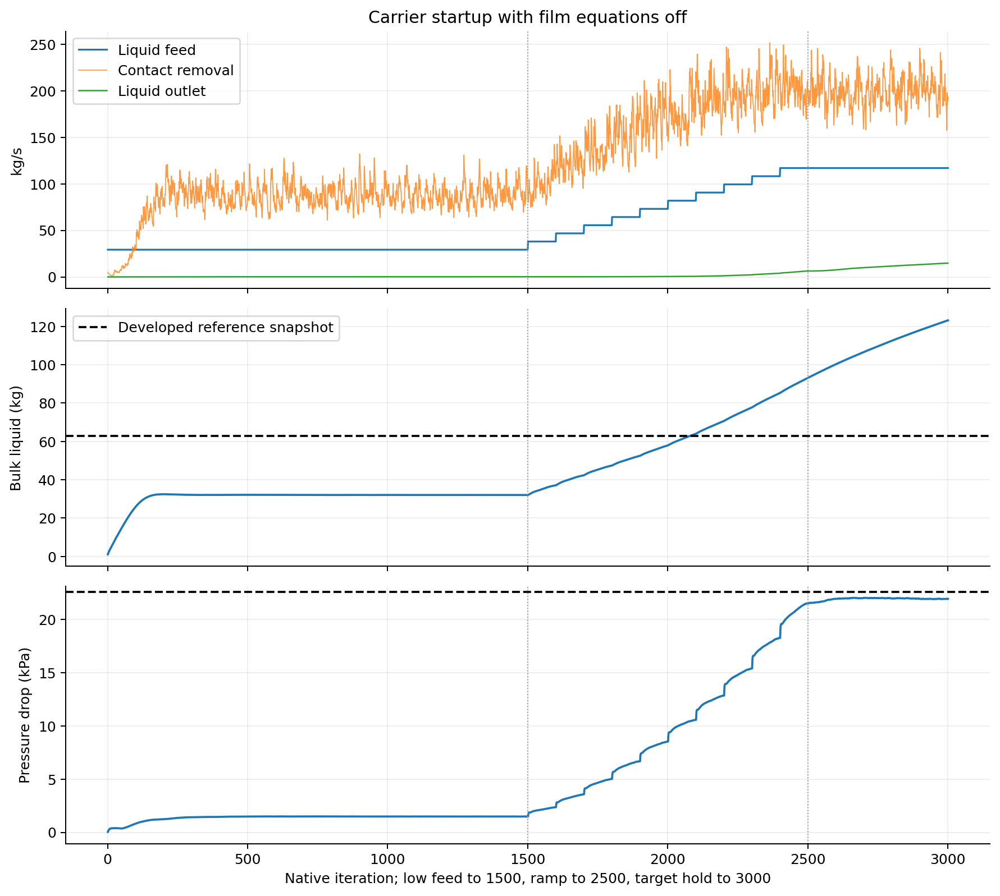
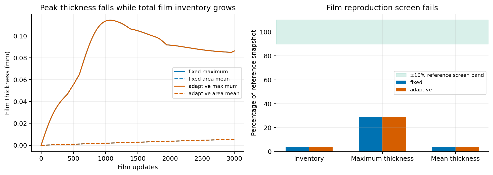
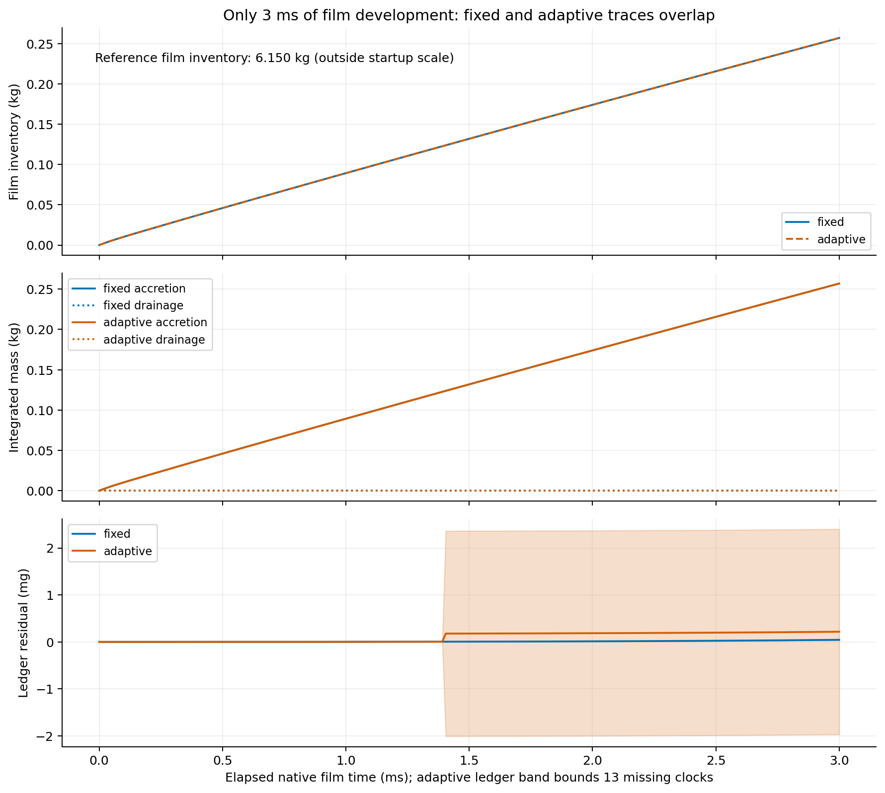
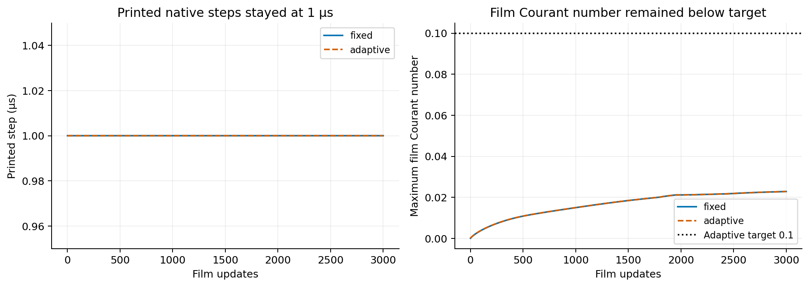
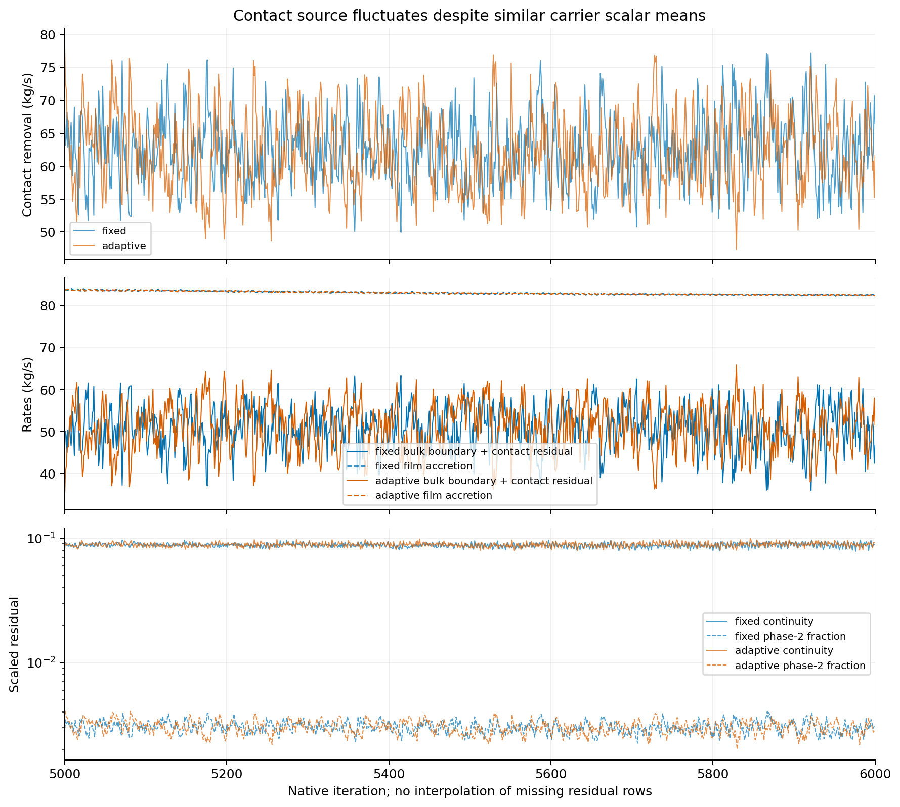
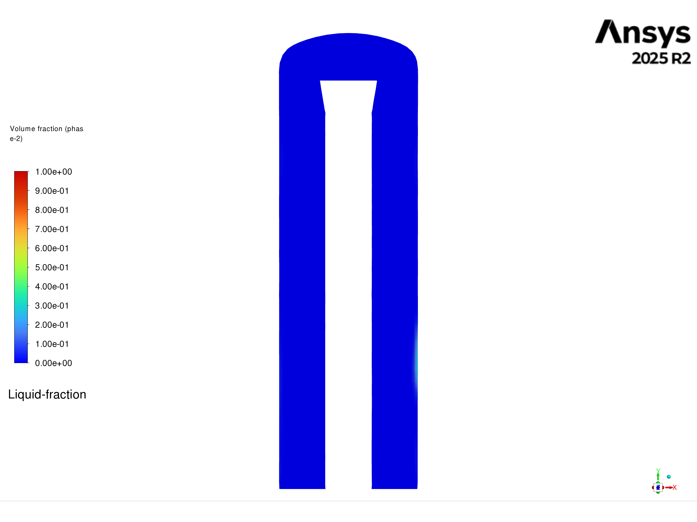
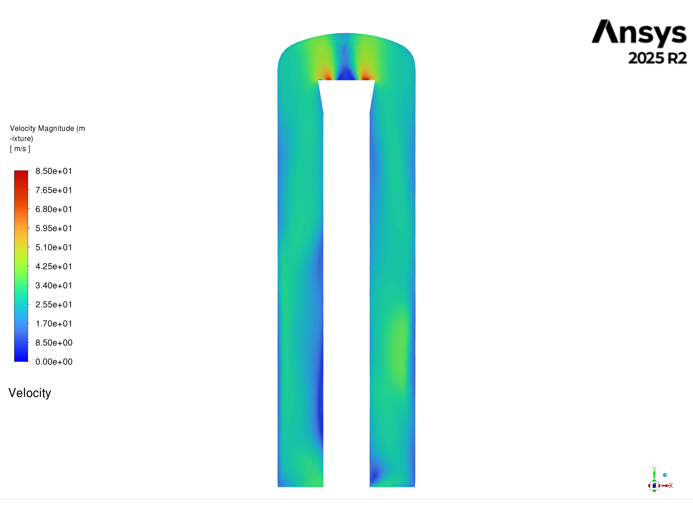
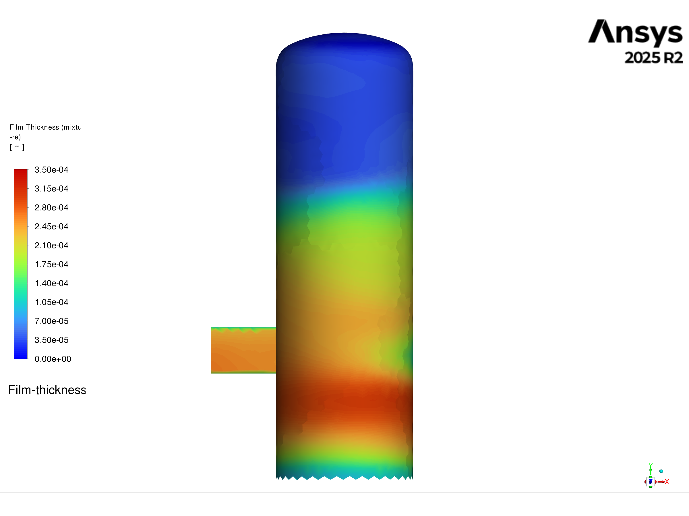
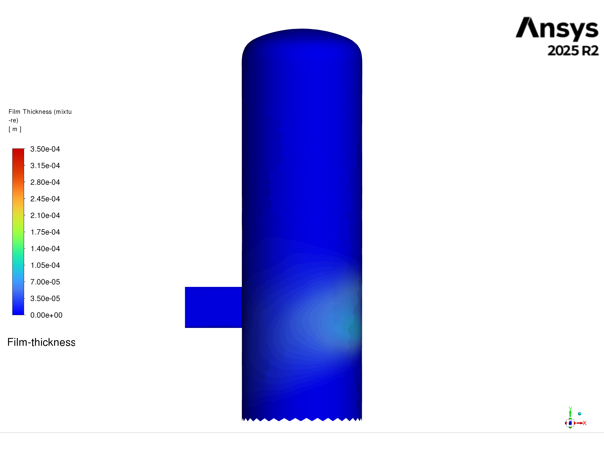

# Stage 3 — Shortened reconstruction: results report

| Question / decision | Result |
| --- | --- |
| Did the prescribed run finish? | Yes: bulk N0–N3000; fixed and adaptive film N3000–N6000; both final paired endpoints reopened |
| Did the carrier scalars reproduce the reference? | Final-500 pressure, vapor outlet, liquid carryover and bulk inventory meet declared snapshot tolerances |
| Did the developed film reproduce? | No: only 3 ms elapsed; inventory is 4.18% of the developed reference |
| Did adaptive stepping accelerate film time? | No observed acceleration: printed steps remain 1 µs; both arms reach 3 ms |
| Is the separator steady or fully balanced? | Not qualified: film fills, bulk inventory still falls, source fluctuates and whole-separator accounting remains open |
| Can this recipe be used for mesh convergence now? | No; retain it as a tested carrier-startup candidate, not a qualified reconstruction |
| Next compute decision | Analyse these completed screens first; no further solve or mesh case submitted |
| Run contract | [Setup and predeclared tolerances](setup.md) |
| Machine evidence | [Audited summary](../../../../PyAnsys/output/phase72a-stage3-server3/20261005/analysis-summary.json) |
| Reference | Corrected R3/contact N33586, independent four-rank replay; developed but not stationary |
| Current endpoint | Server 3 adaptive N6000, 18 compute ranks; saved locally; verified idle before postprocessing |

## Authorized adaptive continuation — current status

| Item | Recorded state |
| --- | --- |
| Selected contrast | Slightly more aggressive adaptive controls; 2000 updates from N6000 |
| Execution | N7000 saved/reopened; final N7000–N8000 batch selected |
| Native film step in first 20 updates | 1.00 → 3.71 µs |
| Added film time in first 20 updates | 0.064737 ms |
| Peak film Courant | 0.085013 |
| Film ledger error | 0.000136% |
| Control effectiveness | Actual step grows; timestep-max 2 µs is not an observed adaptive ceiling |
| Instrumentation repair | Refresh native film clock from saved data before checking transcript endpoint; no repeated updates |
| Machine evidence | [Continuation manifest](../../../../PyAnsys/output/phase72a-stage3-server3/20261005/adaptive-aggressive-N6000-N8000/run-manifest.json) |
| Limits | Preliminary smoke evidence; final N8000 result pending |

## Carrier reconstruction

| Metric | Reference snapshot | Fixed final-500 mean | Adaptive final-500 mean | Fixed / adaptive difference | Declared screen |
| --- | --- | --- | --- | --- | --- |
| Pressure drop (kPa) | 22.5630 | 22.3900 | 22.3896 | -0.767% / -0.769% | ±5%: both pass |
| Vapor outlet (kg/s) | 80.4131 | 80.2643 | 80.2660 | -0.185% / -0.183% | ±5%: both pass |
| Liquid carryover (kg/s) | 3.6740 | 3.7005 | 3.6999 | +0.723% / +0.705% | ±10%: both pass |
| Bulk liquid inventory (kg) | 62.9058 | 63.6338 | 63.6362 | +1.157% / +1.161% | ±10%: both pass |

Native report histories, N5000–N6000. Thin traces are raw values; solid trends are trailing 100-update means. Dashed black lines are the preserved N33586 snapshot, not a stationary reference window. Similar means support a carrier snapshot screen; continuing inventory decline limits the claim.

| Inventory / window sensitivity | Fixed | Adaptive | Meaning |
| --- | --- | --- | --- |
| Bulk inventory change, last 500 updates (kg) | -0.6248 | -0.6088 | Continued decline; not a stationary inventory |
| Bulk mean, last 250 / 500 / 1000 updates (kg) | 63.480 / 63.634 / 64.096 | 63.484 / 63.636 / 64.098 | Screen depends on the stated finite window |
| Liquid carryover mean, last 250 / 500 / 1000 (kg/s) | 3.7045 / 3.7005 / 3.6790 | 3.7040 / 3.6999 / 3.6782 | Outlet response is close across finite windows |

Native N1–N3000 histories with EWF equations off. The source is the independently verified contact sink; flux histories are boundary-only. The dry-film N3000 state still has 123.15 kg of bulk liquid. The closer carrier response develops after EWF is enabled, so the 3000-update bulk hold alone is not a reproduced endpoint.

## Film development and matched-time comparison

| Film quantity | Reference N33586 | Fixed N6000 | Adaptive N6000 | Judgement |
| --- | --- | --- | --- | --- |
| Elapsed time from common dry-film parent (ms) | Different developed lineage | 3.000 | 3.000 | Matched native elapsed time |
| Film inventory (kg) | 6.150172 | 0.256943 | 0.256942 | About 95.82% below reference; fails ±10% screen |
| Maximum thickness (mm) | 0.299323 | 0.086162 | 0.086163 | About 71.21% below reference; fails screen |
| Area-mean thickness (mm) | 0.130607 | 0.005457 | 0.005456 | About 95.82% below reference; fails screen |
| Cumulative drainage since dry start (kg) | Different time origin | 2.6397985e-07 | 2.6388683e-07 | Nearly all accretion remains stored |
| Fixed/adaptive inventory difference | — | Matched-time endpoint | -0.000345% | Agreement does not establish developed-film reproduction |
| Peak thickness before final endpoint (mm) | Different developed lineage | 0.114266 at N4073 | 0.114265 at N4073 | Peak later falls while inventory grows; peak thickness alone cannot establish stationarity |

Native film-wall reports on the only active EWF wall, `wall`. The green comparison band is the declared ±10% snapshot tolerance. Both endpoint values and final-500 means fail the inventory and thickness screens. Film thickness is a distribution diagnostic, not a stationarity test.

Film ledger: ΔM + ΔD − ∫A dt. A is native film-phase accretion (kg/s); D is cumulative edge outflow (kg). Fixed integration uses every accepted native clock. The adaptive shaded band bounds the 13 missing step clocks without assigning invented times to those updates.

| Film window | Fixed inventory growth (kg/s) | Adaptive inventory growth (kg/s) | Fixed drainage (kg/s) | Interpretation |
| --- | --- | --- | --- | --- |
| 0–1 ms | 89.245 | 89.244 | 0.00001221 | Accretion fills the wall film |
| 1–2 ms | 84.735 | 84.735 | 0.00007005 | Accretion fills the wall film |
| 2–3 ms | 82.963 | 82.963 | 0.00018171 | Accretion fills the wall film |

| Ledger / timestep evidence | Fixed | Adaptive | Claim limit |
| --- | --- | --- | --- |
| Worst absolute film ledger error (% of integrated accretion) | 0.00001704% | ≤0.00093470% | Both below the 1% screen; adaptive value is a conservative bound |
| Printed accepted film step (µs) | 1.000 | 1.000 | No native step increase observed |
| Observed peak film Courant number | 0.022826 | 0.022826 | Adaptive peak covers observed records only |
| Adaptive controls | Fixed mode | Initial 1 µs; target 0.1; increase 1.2; decrease 2.0 | Readback confirms candidate settings; mechanism behind unchanged steps remains unverified |
| Effective timestep contrast | Observed 1 µs steps | Observed 1 µs steps | Supports short-run repeatability at this step; does not test larger adaptive steps |
| Missing per-update clocks | 0 after terminal reconciliation | N4392–N4404 (13 updates) | Full mass/source histories exist; individual accepted steps in this interval remain unknown |
| Terminal clock | 3.000 ms | 3.000 ms | Printed final film line reconciled to paired/reopened N6000; terminal residual row absent |

Native printed step and Courant evidence. Missing adaptive clock rows remain gaps. Low Courant number and a true adaptive flag do not prove that Fluent increased its timestep. This test does not establish an adaptive efficiency gain or an effective native maximum-step bound.

## Source accounting and numerical limits

| Definition / observation | Evidence | Meaning |
| --- | --- | --- |
| Native report-file liquid flux | Endpoint histories equal the computed `without-sources` values | Use boundary flow directly; do not subtract the UDF source again |
| Instantaneous computed phase-2 flux | Contains boundary flow plus User Mass Source in each report | For a computed snapshot, remove the source once per boundary report before summing boundaries |
| Independent source check | Contact expression equals −applied UDF source at every saved history row | Source implementation and reported contact removal agree |
| Bulk boundary + contact residual | R = liquid feed − carrier liquid outlet − contact removal | Excludes EWF transfers; report separately from the film ledger |
| R, final-500 mean (kg/s) | Fixed 50.627; adaptive 51.304 | Large residual; not a closed whole-separator account |
| Conditional R − film accretion (kg/s) | Fixed -32.008; adaptive -31.333 | Still large; native bulk/film source scope must be audited before calling this a full balance |
| Contact removal, final-500 mean ± standard deviation (kg/s) | Fixed 62.59 ± 5.30; adaptive 61.92 ± 5.58 | Persistent source oscillation despite similar carrier means |
| Scaled continuity, late mean | Fixed 0.0877; adaptive 0.0888 | High residual plateau; no numerical-convergence claim |
| Warning events | Reverse-flow and turbulent-viscosity limiting recur; no detected fatal run events | Warnings help locate numerical limits; counts are transcript messages, not unique events |
| Carrier time | Steady Coupled pseudo-time updates with EWF time advancement | Do not convert bulk kg/update inventory slope to a physical kg/s storage term |
| DPM | Six inherited one-way diagnostic injections, each 1e-20 kg/s; no two-way carrier source | Definitions preserved; fresh complete particle-fate comparison is missing |
| Film scope | `wall` active; inner separator and lower wall patches are not film walls; Flow Momentum Coupling off | Film closure applies to the verified wall/report scope |

Raw N5000–N6000 histories. The boundary/contact residual and film accretion are separate rate diagnostics; this plot does not assert a verified interphase balance. Carrier inventory decline, source oscillation and continuity plateau prevent a steady whole-model claim.

## Spatial comparison from native Fluent graphics

| Comparison policy | Value |
| --- | --- |
| Source identity | Preserved reference N33586, dry N3000 and fixed/adaptive N6000 paired checkpoints; remote hashes checked before loading |
| Carrier plane | XY at Z = 0 m; orthographic view along +Z |
| Shared field ranges | Liquid fraction 0–1; velocity 0–85 m/s; film thickness 0–0.35 mm |
| Film surface | Only confirmed active EWF wall `wall`; projection is a front view of the three-dimensional wall |
| Pixel source | Native Fluent picture exports; transferred without image reconstruction or compositing |
| Provenance and visual QA | [Native figure manifest](../../../../PyAnsys/output/phase72a-stage3-server3/20261005/native-figure-manifest.json) |

| Developed reference N33586 | Adaptive startup N6000, 3 ms |
| --- | --- |
|  |  |
|  |  |
|  |  |

Carrier contours support the close scalar screen, while the wall-film comparison shows the much smaller developed inventory. A centre-plane comparison does not prove agreement throughout the full three-dimensional volume.

| Same-plane native facet diagnostic | Dry N3000 vs reference | Fixed N6000 vs reference | Adaptive N6000 vs reference |
| --- | --- | --- | --- |
| Liquid fraction RMS absolute difference | 0.0082588 | 9.62928e-05 | 8.73662e-05 |
| Velocity RMS difference (m/s) | 4.90778 | 0.152853 | 0.149306 |

These are unweighted differences at the same native facet coordinates. They are supporting diagnostics; no mesh weighting or predeclared spatial tolerance is implied.

| Supporting native exports | Link |
| --- | --- |
| Fixed N6000 | [Liquid fraction](figures/native-fixed-N6000-phase-2-vof.png), [velocity](figures/native-fixed-N6000-velocity-magnitude.png), [film thickness](figures/native-fixed-N6000-film-thickness.png) |
| Common dry-film N3000 | [Liquid fraction](figures/native-bulk-dry-N3000-phase-2-vof.png), [velocity](figures/native-bulk-dry-N3000-velocity-magnitude.png) |

## Tested recipe, measured cost and next use

| Recipe step / cost | Measured result / status |
| --- | --- |
| 0–1500 | 25% target liquid/vapor mass flows; Coupled and R3 from start; EWF equations off |
| 1500–2500 | Ten 100-update steps to target 116.92 / 80.69 kg/s |
| 2500–3000 | Target-feed hold with EWF off; preserve common dry-film parent |
| 3000–6000 | Initialize dry EWF; 3000 updates at 1 µs, or this tested adaptive candidate |
| Bulk cost | 29.82 min, including smoke/evidence timing; excludes interruption waiting |
| Fixed film cost | 32.54 min for 3000 updates and block endpoint saves |
| One fixed reconstruction candidate | 62.36 min documented startup + fixed-film blocks; preparation and fault/human waiting excluded |
| Adaptive documented subtotal | 28.66 min; pre-stop N4000–N4404 timing not captured; not a complete cost or speedup claim |
| Historical cost comparison | Different hardware/rank history and no matching measured baseline; no demonstrated cost-reduction percentage |
| Reusable now | Executable carrier startup and finite 3 ms film screen, with paired endpoints and evidence |
| Before developed-film reconstruction | Investigate native adaptive control effectiveness; select a bounded physical-film-time continuation; compare against an explicitly chosen developed state |
| Before a steady/full-separator claim | Sustained inventory/transfer balance; verified EWF mass-source scope; lower source oscillation; residual and full spatial evidence |
| Before mesh convergence | Reconstruction qualification plus physical collector extent and wall/film-treatment preservation across meshes |
| Current continuation decision | No further solve launched; existing evidence is sufficient to report this finite startup screen |

| Required evidence still missing | Effect on claims |
| --- | --- |
| Stationary developed-reference window | Snapshot agreement cannot certify a steady reference or reconstructed steady state |
| Developed drainage and film distribution | Short startup is not a complete replacement for model-development history |
| Verified whole-separator mass ledger including EWF source scope | Good film-only closure cannot establish bulk-plus-film conservation |
| Fresh complete DPM fate comparison | No particle-routing reproduction claim |
| 13 adaptive step clocks and full adaptive solve timing | Bound film accounting; retain gaps; no full adaptive efficiency comparison |
| Matched historical reconstruction cost | No quantified speed improvement over the old procedure |

| Machine artifact | Link |
| --- | --- |
| Execution and local checkpoint hashes | [Run manifest](../../../../PyAnsys/output/phase72a-stage3-server3/20261005/run-manifest.json) |
| Completed resumed job | [Job manifest](../../../../PyAnsys/output/phase72a-stage3-server3/20261005/user-resume-job-manifest.json) |
| Live N6000 idle / saved-field verification | [Readback receipt](../../../../PyAnsys/output/phase72a-stage3-server3/20261005/analysis-live-N6000.json) |
| Exact native report scope | [Report definitions](../../../../PyAnsys/output/phase72a-stage3-server3/20261005/analysis-report-definitions.json) |
| Analysis implementation | [History reduction](../../../../PyAnsys/scripts/analysis/analyze_phase72a_stage3.py) |
| Native spatial export implementation | [Fluent graphics export](../../../../PyAnsys/scripts/inspection/export_phase72a_stage3_native.py) |
