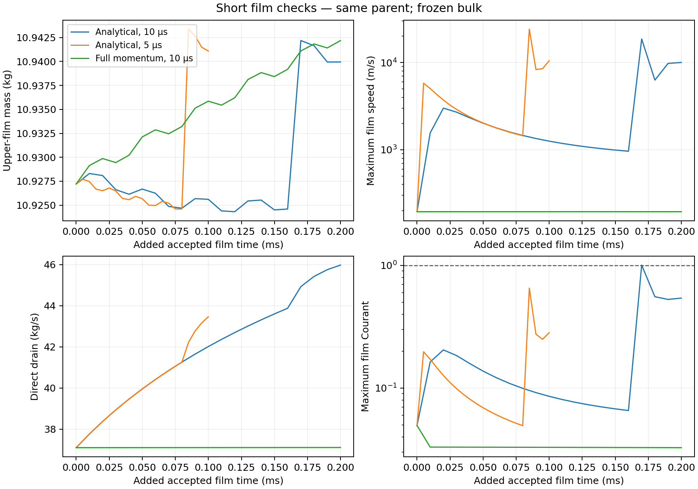
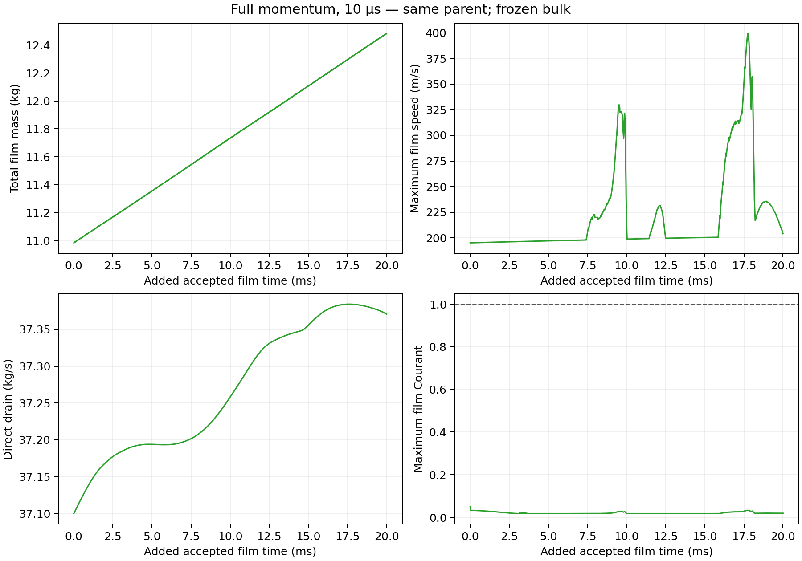

# Stage 4 — Analytical film: short comparison and recovery

| Decision | Current evidence / action |
| --- | --- |
| Status | **Analytical 10 µs rejected; analytical 5 µs unqualified; full-momentum +20 ms control checkpoint verified, qualification incomplete** |
| Method decision | Analytical film remains unqualified; no long development run while speed/source accounting is unresolved |
| Server 1 | Idle at verified N43483 / film clock 0.4081843386354826 s; total +20 ms; frozen bulk; no further solve submitted |
| Next action | Reconcile DPM/source accounting; assess report overhead; diagnose analytical high velocities and interfacial forcing before analytical extension |
| Duplicate compute guard | Unresolved submission blocks `submit`; recovery contains no solve or initialization command |

| Smoke observation | Value | Evidence / limit |
| --- | --- | --- |
| Prepared parent | N41483; film clock 0.3881843386354626 s | Paired save/reopen verified; [arm manifest](../../../../../PyAnsys/output/phase72a-stage4-analytical/20261008/analytical10/run-manifest.json) |
| Selected method | Analytical velocity; Solve Momentum ON; EWF and Phase Accretion ON | Native parameter readback; [prepared readback](../../../../../PyAnsys/output/phase72a-stage4-analytical/20261008/analytical10/prepared-readback.json) |
| Film step | 10 µs, fixed | Prepared readback; native smoke journal |
| Accepted added film time | 0.0002000000000002 s ≈ 0.2 ms | Bounded native RPC observation before closure; persisted in the [closure review](../../../../../PyAnsys/output/phase72a-stage4-analytical/20261008/inspection/closure-cause-review.json) |
| Verified film clock | 0.3883843386354628 s | Saved pair reopened; native solution state matched |
| Observed native film counter | 39923 | Exactly 20 updates beyond the prepared film counter |
| Final Courant | 0.5415672469 | Lower than the earlier peak; endpoint alone would miss rejection |
| Complete-history peak Courant | **1.0063604116** | Native guard: **NUMERICAL_REJECTED** |
| Complete-history peak thickness | 1.9781 mm | Below 300 mm rejection limit |
| Complete-history peak speed | **18,619.7 m/s** | Severe velocity excursion; final upper-wall maximum still 10,021.0 m/s |
| Verified saved endpoint | `run-N41483-N41503/rejected-preserved.cas.h5` and `.dat.h5` | Both hashed and reopened; exact hashes in the arm/block manifests |
| Proven preparation | Previous N68483 preserved; N41483 parent and analytical prepared pair hashed | [Preserved previous endpoint](../../../../../PyAnsys/output/phase72a-stage4-analytical/20261008/preserved-current.json) |

Native N41483–N41503: 20 updates per arm; 0.2 ms at 10 µs and 0.1 ms at 5 µs; frozen bulk. The complete Courant history contains the peak that the final readback misses. [Figure source hashes and selection](../../../../../PyAnsys/output/phase72a-stage4-analytical/20261008/figure-provenance.json).

| Short screen | Analytical 10 µs | Analytical 5 µs | Full momentum 10 µs |
| --- | ---: | ---: | ---: |
| Updates | 20 | 20 | 20 |
| Added film time | 0.2 ms | 0.1 ms | 0.2 ms |
| Peak Courant | **1.00636: rejected** | 0.652924: guard passed | **0.0495637: guard passed** |
| Peak film speed | 18,619.7 m/s | **24,160.9 m/s** | 195.267 m/s |
| Final upper-wall peak speed | 10,021.0 m/s | 10,480.5 m/s | 195.199 m/s |
| Film storage increase | 0.0260454 kg | 0.0234262 kg | 0.0149835 kg |
| Direct drain | 0.0083271 kg | 0.00398588 kg | 0.00742082 kg |
| Apparent rate-integral ledger discrepancy | 0.0177979 kg / 49.92% | 0.0197341 kg / 112.18% | **0.000412780 kg / 1.05295%** |
| DPM tracking events | 1 | 1 | 1 |
| Native `injection_interval` readback | 40 µs | 20 µs | 40 µs |
| Whole iteration command time | 17.137 s | 16.784 s | 16.815 s |
| Parallel timer per update | 0.124 s | 0.133 s | 0.135 s |
| Qualification | Failed Courant guard; speed/source issues | High speeds/source issues remain | Short functional probe passes 5% ledger bound; full qualification needs ≤1% and longer evidence |

Different physical horizons and DPM tracking-event times limit the timestep comparison. The `injection_interval` values are native endpoint readbacks; they do not establish the nominal tracking cadence. All three checks share the same parent and physical settings; neither analytical check establishes time convergence or useful acceleration.

| Direction / performance check | Evidence / decision |
| --- | --- |
| Analytical momentum closure | Severe excursions absent from the matched 10 µs momentum-equation control; retain as research branch, not a selected production method |
| Wet-face contribution | Final upper-film mass above the diagnostic 1,000 m/s threshold: 0.1805 kg / 1.65% at 10 µs; 0.2452 kg / 2.24% at 5 µs; zero in momentum control. Threshold describes the tail; it is not a new acceptance limit. |
| Claimed acceleration | No measured benefit in these 20-update checks; different timing scopes, short horizons and server restart limit cost inference |
| Interactive plots | Already OFF; no display setting changed; [readback and physics invariance](../../../../../PyAnsys/output/phase72a-stage4-analytical/20261008/momentum10/display-overhead-screen.json) |
| Longer control | N41503→N42924 accepted 1,421 updates before client monitor interruption; endpoint recovered; N42924→N43483 completed the remaining 559. Total +20 ms / 2,000 updates from N41483; checkpoint verified; no physics change. |
| Timing scope | Partial control: parallel timer 139.704 s versus whole iteration time 818.300 s for 1,421 updates; 0.098 versus 0.576 s/update. DPM uses 49.0% of the parallel timer. The gap motivates a report-overhead test; it does not yet prove its cause. |
| Physics simplification | No further effects disabled; EWF and accretion remain mandatory; first isolate forcing/coupling that creates the analytical tail |

| Functional / accounting check | Result | Claim limit |
| --- | --- | --- |
| Total film inventory | 10.982861 → 11.008907 kg | +0.026045 kg; 0.2 ms is too short to assess steady behaviour |
| Direct drain | 0.0083271 kg; mean 41.6355 kg/s | Positive direct film removal with frozen bulk |
| Phase Accretion rate integral | 0.0229181 kg | Native solved source history; reopened instantaneous source resets |
| DPM reported-rate integral | 0.0127350 kg | One tracking event; parcel/event deposition not independently reconciled |
| Stripping / edge separation | 0.0185598 / 0.0003125 kg | Cumulative native stock differences |
| Other native film outflow | 0.0002062 kg | Separate from direct drain |
| Apparent ledger discrepancy | 0.0177979 kg; 49.92% of integrated reported input | Rate-integral accounting fails; do not call this a proved 49.92% physical mass error before DPM event reconciliation |
| Physical bulk reports | Constant inventory and physical liquid/vapour outlet flux | API `without-sources` mass-flow component matches native file convention |
| Cost | Parallel timer 0.124 s/update; whole iteration command 17.137 s / 20 updates | Distinct timing scopes; DPM uses 70.7% of the parallel timer; no qualified speed benefit yet |
| Fastest final face | 44.86 µm thickness; 10,021 m/s; separate forcing array reports 25.24 Pa at that array index, but same-face alignment is not verified | [Forcing readback](../../../../../PyAnsys/output/phase72a-stage4-analytical/20261008/inspection/wall-forcing-review.json); forcing array lacks face centres / a shared film-field receipt; verify alignment before using that value. Bulk wall shear is not yet proved to equal EWF interfacial traction |

| Full-momentum control | Verified 20 ms evidence / limit |
| --- | --- |
| Accepted endpoint | N43483; film clock 0.4081843386354826 s; 2,000 total updates / +20 ms from N41483 |
| Peak Courant / thickness / speed | 0.0495637 / 2.16634 mm / 399.434 m/s across the short check and both development segments |
| Total film storage increase | 1.50157 kg; mean storage 75.08 kg/s; positive storage excludes a steady-film claim |
| Direct film drain | 0.745375 kg integrated over +20 ms; mean 37.27 kg/s |
| Apparent reported-rate ledger discrepancy | 0.0625366 kg / 1.59036%; exceeds 1% qualification target; DPM event accounting remains unresolved |
| Frozen bulk | Physical liquid inventory and liquid/vapour steam-outlet flux unchanged |
| Whole iteration time | 1,159.648 s ≈ 19.33 min for 2,000 accepted updates across three segments; excludes save/reopen/retrieval time. About 0.0621 accepted film seconds per wall-clock hour over this screen; not a long-run cost extrapolation. |
| Stop category | Client monitoring error; no Courant/thickness rejection and Fluent remained open |
| Preserved evidence | [Partial block manifest](../../../../../PyAnsys/output/phase72a-stage4-analytical/20261008/momentum10/run-N41503-N43483/run-manifest.json); hashed case/data reopened; all 62 text artifacts match server hashes |
| Completed tail | [N42924→N43483 manifest](../../../../../PyAnsys/output/phase72a-stage4-analytical/20261008/momentum10/run-N42924-N43483/run-manifest.json): 559 recorded updates and matching native film counter/clock; case/data hashed and reopened; all 62 text artifacts match server hashes |
| Restart limit | Control includes checkpoint reopens and a recovered client interruption; it is not an uninterrupted development trajectory |
| Achieved inner convergence | No sub-iteration residual history recorded; configured limits alone do not establish achieved convergence |

| Closure finding | Assessment |
| --- | --- |
| Last failing operation | Fluent Scheme `system()` → `cmd /c powershell -EncodedCommand`; bulk file metadata, no solve command |
| Reconstructed command length | About 25,400 characters for 64 source paths; [machine review](../../../../../PyAnsys/output/phase72a-stage4-analytical/20261008/inspection/closure-cause-review.json) |
| Windows command limit | 8,191 characters; [Microsoft primary documentation](https://learn.microsoft.com/en-US/troubleshoot/windows-client/shell-experience/command-line-string-limitation) |
| Confirmed defect | The metadata command exceeded the command-prompt limit |
| Confirmed process failure | `cx2520.exe` / Cortex, 11:37:08 NZDT; exception `0xC0000409`, WER failure parameter 2; [hashed Windows event record](../../../../../PyAnsys/output/phase72a-stage4-analytical/20261008/inspection/windows-crash-review.json) |
| Failure category | Fast-fail with stack-cookie-check failure; [Microsoft exception documentation](https://learn.microsoft.com/en-us/cpp/intrinsics/fastfail?view=msvc-170) and [failure-code definitions](https://devblogs.microsoft.com/oldnewthing/20190108-00/?p=100655) |
| Native solve completion | Guard rejected the smoke; both diagnostic files written; transcript stopped normally at 11:34:55 NZDT |
| Trigger interpretation | Strong inference: oversized `system()` command caused Cortex failure during evidence collection; exact internal stack requires dump/symbol inspection |
| Removed route | Bulk PowerShell invocation, including the proposed `.ps1` workaround |
| Replacement | One file at a time; native text read; short `certutil` checksum with 1,024-character limit and exact numeric ASCII encoding |
| Recovery proof | 62 text files matched server SHA256; both checkpoint files hashed; pair reopened; no repeated solve |
| Offline safety checks | Fourteen checks passed: command bounds, literal Windows paths, report ownership/relative paths, input safety, duplicate-solve prevention, paired recovery, immutable transfer and partial/native accepted-count handling; [test source](../../../../../PyAnsys/tests/test_phase72a_analytical_recovery.py) |
| Live-file handling | Deactivation alone keeps Windows handles open. Reopen the verified saved pair, then deactivate owned reports before checksum reads; source histories preserve rates that clear on reload. |
| Later native-journal interruption | Active-run Scheme status query raised `eval: unbound variable`, error object `let`; native transcript recorded journal interruption at N42924. Fluent stayed open and saved both partial checkpoint files. [Exact transcript](../../../../../PyAnsys/output/phase72a-stage4-analytical/20261008/momentum10/run-N41503-N43483/raw/solve.trn). |
| Monitoring prevention | No Scheme queries during active native solves. Observe the passive transcript service; perform status/readback/retrieval when the journal is terminal. |
| Accepted-count repair | Old journal counted requested 1,980 updates despite only 1,421 recorded. Recovery reconciles both contiguous guard histories, transcript, saved iteration and native film clock/count. Future journals count recorded updates and reject an incomplete requested block. |

| Missing evidence | Effect on interpretation |
| --- | --- |
| DPM parcel/event mass accounting | Positive film drain/accretion observed; conservation qualification still fails |
| EWF interfacial traction and momentum-source behaviour | High speeds remain unexplained; smaller timestep alone is insufficient |
| Crash dump / symbolized stack | Process failure category proved; exact internal cause remains an inference |
| Matched development horizons and physical DPM tracking cadence | Matched 0.2 ms analytical/full-momentum probes exist; short windows and unmatched 5 µs physical horizon prevent a qualified accuracy or development-cost comparison |
| Sustained film balance | No steady-film claim |

| Recovery order | Required condition |
| --- | --- |
| Read existing native status and reports | Terminal native evidence; preserve partial evidence if no terminal pair exists |
| Check saved case and data | Both exist; hash each with a short command |
| Reopen saved endpoint | Verify iteration, native film clock, mandatory models, drain and frozen bulk; do not initialize |
| Complete smoke analysis | Check every recorded sample, accepted time, finite fields, collection/removal and mass ledger |
| Select continuation | Use the [setup](setup.md) conditions; no repetition of completed smoke steps |
