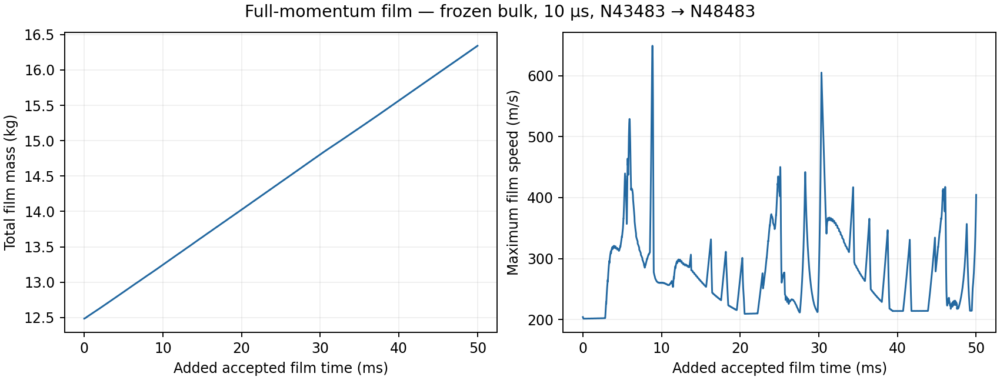
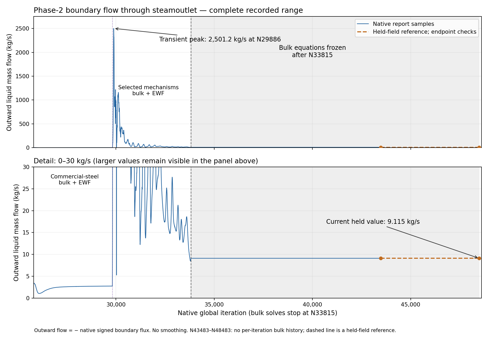

# Stage 4 — Reduced-report film continuation

| Decision | Current state |
| --- | --- |
| Status | COMPLETE: N43483 → N48483; 5,000 accepted updates / +50 ms; paired endpoint hash/reopen verified; all 19 source text files match server hashes; Server 1 idle |
| Question / setup | [Full-momentum +50 ms development](setup.md) |
| Selected parent | Preserved N43483 / 0.4081843386354826 s |
| Verified endpoint | N48483 / native film clock 0.4581843386355326 s; native counter, printed updates and clock advance agree |
| Selected diagnostics | 17 essential per-update reports; physics and 10 µs / 20-film-step DPM controls retained |
| Restart proof | Original parent hashes verified; prepared child saved/reopened; geometry-matched film fields exactly equal; bulk, wall, model and source controls retained; no initialization |
| Preserved sibling | Cadence40 N42503 case/data retained and hash/reopen verified before replacement |
| Native execution | Fluent-owned journal; all recorded Courant and thickness samples checked at each 1,000-update interval; native autosave at 5,000 updates; local paired endpoint on horizon or rejection, plus transcript |
| Live observation | At 02:20 UTC the bounded Settings query confirmed idle; native status confirmed horizon reached. Earlier quiet transcript / 12 s query timeout did not indicate a stopped run. |
| Accuracy boundary | This 50 ms window has 1.0809% original reported-rate discrepancy and positive storage; independent DPM event mass and achieved inner residuals remain unavailable |
| Inner-solve evidence | Selected alternative implicit route printed film clocks without h/u/v sub-iteration histories in the earlier [Stage 3 test](../../stage-03-shortened-reconstruction/early-ewf-startup/film-development/results.md). Current 30 / 10⁻⁵ controls do not prove achieved convergence or a useful iteration-reduction speed gain. |
| Next decision | Assess timestep/source accounting and rising upper-film inventory before further extension; retain all original ledger terms and selected physics |

| Measured quantity — accepted +50 ms | Result / limit |
| --- | --- |
| Total film inventory | 12.484435 → 16.341850 kg; +3.857415 kg |
| Upper / lower endpoint inventory | 16.286466 / 0.055383 kg; upper inventory increases while lower inventory remains small |
| Direct film removal | 1.861220 kg; mean 37.2244 kg/s |
| Mean film storage | +77.1483 kg/s; film is still developing |
| Peak Courant / thickness | 0.0424993 / 2.25610 mm; configured guards passed |
| Peak reported film speed | 649.074 m/s; finite field evidence and low Courant do not establish physical credibility |
| Phase Accretion / reported DPM input | 6.929349 / 2.907060 kg; 250 native tracking events; DPM event mass remains independently unreconciled |
| Original ledger residual | +0.106321 kg / 1.080888% of integrated reported input; no correction applied; above the 1% target |
| Frozen bulk | Before/after physical inventory and outlet reports unchanged; continuous bulk histories intentionally absent |
| Whole-command solve time | 2,181.409 s / 36.36 min; sum of the five 1,000-update commands; save/reopen/retrieval excluded |
| Achieved inner residuals | No sub-iteration rows in the native transcript; unavailable under the selected alternative implicit route |

Raw per-update native histories, N43483 → N48483; no smoothing. [Source hashes, paired endpoint and units](figures/development-history.provenance.json). The inventory continues to rise; speed excursions remain a physical-credibility concern despite the passed Courant/thickness guards.

| Film-balance review | Evidence / interpretation |
| --- | --- |
| Reported additions / departures | 196.728 / 121.706 kg/s; reported net input 75.022 kg/s versus measured storage 77.148 kg/s; original +2.126 kg/s discrepancy retained |
| Storage over five successive 10 ms windows | 76.25, 77.85, 78.04, 76.14, 77.46 kg/s; no observed approach to zero in the tested window |
| Direct drain over the same windows | 37.39, 37.47, 37.25, 37.06, 36.96 kg/s; no upward trend matching storage |
| Collector interpretation | The sink acts on the lower film; lower inventory stays near 0.056 kg while upper inventory rises. Film delivery to that collector and source consistency need review; a stronger local sink does not establish a corrected upper-wall route. |
| Fluent frozen-flow method | [Theory §17.4.3.1](https://ansyshelp.ansys.com/public/Views/Secured/corp/v252/en/flu_th/flu_th_ewf_sec_sol_alg.html#flu_th_ewf_sec_sol_alg_steady) explicitly allows a converged frozen bulk field when film influence on that flow is negligible; freezing is not itself proof of an invalid method |
| Claim / next diagnosis | Later balance is not ruled out. Current evidence does not support another long extension as a steady-film proof; first audit source accounting, transport direction and wall/edge routing, then test the frozen-flow assumption with a matched bulk refresh. Retain EWF and Phase Accretion. |
| Machine review | [Windowed budget and source pointers](../../../../../PyAnsys/output/phase72a-stage4-core-development/20261008/film-balance-review.json); no new solve or ledger correction |

| Spatial evidence — same N48483 endpoint | Result / limit |
| --- | --- |
| Native figures | [Whole and upper bulk-VF / EWF-thickness views](spatial-views.md); four selected figures passed visual review; source state unchanged and no solve issued |
| Physical height distribution | 74.05% of main-wall film mass lies above Y = 4 m; native “upper” report covers the main wall across the vessel |
| Visible film pattern | Thicker band below the dome and thinner film farther down the rear wall; wall-surface projection, with front faces excluded |
| Interpretation | Bulk VF is frozen and separate from the EWF field. The static maps locate stored film; they do not establish transport direction, later balance or steady-film behaviour. |

| Phase-2 steamoutlet history | Result / evidence limit |
| --- | --- |
| Quantity / sign | Boundary-only phase-2 mass flow through `steamoutlet`; plot uses positive outward flow = minus native signed flux; kg/s |
| Selected Stage 4 history | N25815–N43483: 17,669 unsmoothed native samples stitched along the current lineage; matching boundary rows verified and removed once |
| Commercial-steel start / end | Outward flow 3.429962 kg/s at N25815 → 2.753579 kg/s at N29815 |
| Selected-mechanism transient | Peak outward flow 2,501.191981 kg/s at N29886; retained in the full-range panel; a transient value, not a steady carryover result |
| Bulk-freeze endpoint | Outward flow 9.115419 kg/s at N33815; later native report samples repeat this held-field value |
| Latest N48483 readback | Signed boundary flux −9.115419 kg/s. Source-inclusive alias −98.778344 kg/s also contains the user-source term −89.662925 kg/s and must not be reported as outlet boundary flow. |
| Latest interval evidence | Continuous bulk reports were omitted in the reduced-report N43483–N48483 run. The dashed segment is a held-field reference, bounded by endpoint checks; it is not an invented per-iteration history. |
| Interpretation | The plateau follows the bulk freeze. It does not establish a steady film or measure a later bulk carryover response to film development. |
| Reproducibility | [History CSV](../../../../../PyAnsys/output/phase72a-stage4-core-development/20261008/phase2-steamoutlet-vs-iteration.csv), [source hashes / provenance](../../../../../PyAnsys/output/phase72a-stage4-core-development/20261008/phase2-steamoutlet-history.json), [PDF](figures/phase2-steamoutlet-vs-iteration.pdf), [plot script](../../../../../PyAnsys/scripts/analysis/plot_phase72a_stage4_steamoutlet_history.py) |

| Machine evidence owner | Link / state |
| --- | --- |
| Current native job | [Continuation manifest](../../../../../PyAnsys/output/phase72a-stage4-core-development/20261008/core17/run-manifest.json); owns server paths, paired hashes, preparation proof and active target |
| Completed block | [N43483 → N48483 native job](../../../../../PyAnsys/output/phase72a-stage4-core-development/20261008/core17/run-N43483-N48483); submitted 2026-10-08 01:39:44 UTC |
| Derived metrics | [Analysis summary](../../../../../PyAnsys/output/phase72a-stage4-core-development/20261008/analysis-summary.json); original ledger equation and source hashes in the linked block analysis |
| Performance selection | [Matched report-cost result](../report-cost/results.md): 29.52% lower solve time with identical common histories and geometry-matched film arrays in the +10 ms test |
| Coupling selection | [Cadence result](../dpm-cadence/results.md): retain 20 film updates per DPM tracking step; no ledger correction |
