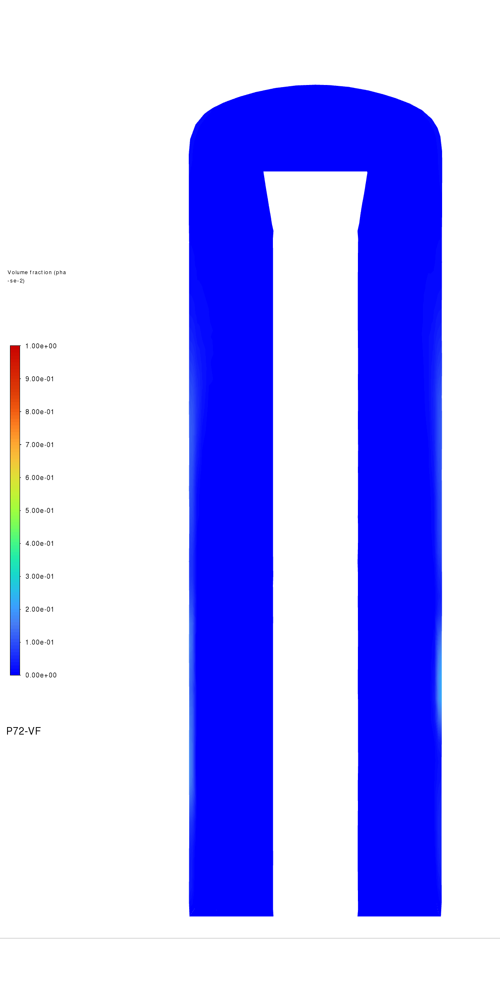
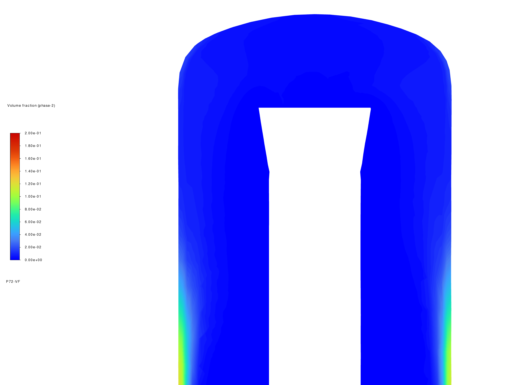
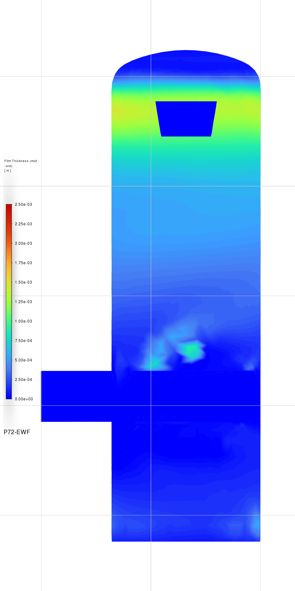
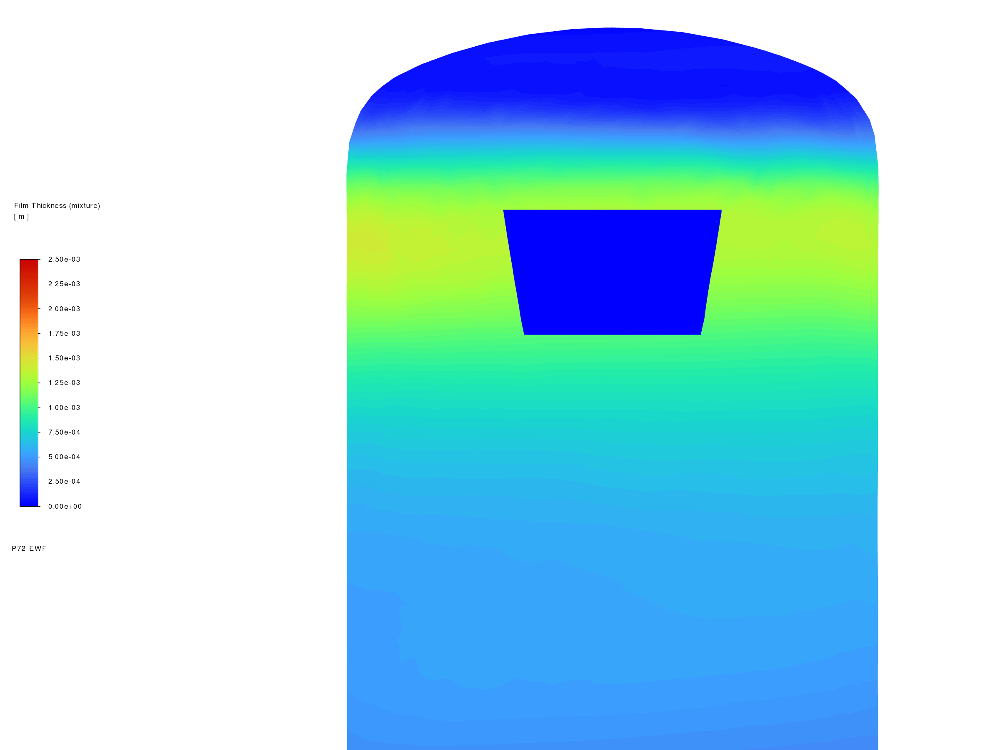

# N48483 — Bulk liquid and wall-film views

| Figure brief | Basis |
| --- | --- |
| Question | Where are the bulk liquid and EWF film in the separator, particularly near its top? |
| Source | Server 1, Fluent 2025 R2; verified N48483 paired endpoint, native film clock 0.4581843386355326 s |
| Source identity / export receipt | [Native figure manifest](../../../../../PyAnsys/output/phase72a-stage4-core-development/20261008/native-figures/export-025921.json); original case/data hashes verified before export; scientific state unchanged afterward |
| Geometry / coordinates | Native separator geometry, metres; vertical direction Y; upper clips span Y = 4.1–7.1 m |
| Bulk view | Phase-2 liquid volume fraction on X–Y centre plane at Z = 0; orthographic camera from positive Z |
| Film view | Native film thickness on EWF walls `wall` and `wall:004`, clipped to Z = −2–0 m to expose the rear half |
| Visual scales | Whole bulk VF: 0–1; upper bulk detail: 0–0.2; both EWF views: 0–0.0025 m = 0–2.5 mm; native lighting disabled |
| Production boundary | Native Fluent PNG exports; PNG bytes match server SHA256; no solver steps, initialization, source-pair writes, or scientific-setting changes |
| Claim limit | Bulk VF was frozen during film development. EWF thickness is a separate wall field. One checkpoint does not establish film direction, drainage balance, steady film, or physical accuracy. |

| Visible result / calculation | Interpretation |
| --- | --- |
| Bulk centre cut | Most of the section has a low liquid VF. Higher VF occurs near the outer wall, particularly farther down the section. The centre plane misses much of the tangential inlet. |
| Upper bulk detail | Maximum native contour value on the upper centre-plane clip is 0.12033. The explicit 0–0.2 scale makes the near-wall distribution easier to see; colours must not be compared directly with the whole-view 0–1 scale. |
| Rear-wall EWF | A thicker band lies below the top dome. Film becomes thinner farther down the main wall, with local thicker patches near the inlet region. The filled colour is a projection of wall surfaces, not liquid filling the vessel volume. |
| Film mass by physical height | 12.05936 of 16.28647 kg on the main wall lies above Y = 4 m: 74.05%. This sums native face film mass by face-centroid height. The native report named “upper” covers the main wall across the vessel; it does not mean only the physical top. |
| Visible versus whole-wall maximum | Rear-half displayed maximum is 1.42528 mm. The full main-wall field reaches 2.23867 mm at this endpoint; the cutaway does not show every face. |
| Diagnostic export limits | Two supporting exports were excluded because of cropped or overlapping legends. Earlier exports are marked superseded in their machine manifests. The four figures below passed visual review. |
| Quantitative source | [Spatial summary and field hash](../../../../../PyAnsys/output/phase72a-stage4-core-development/20261008/native-figures/spatial-summary.json); [run and balance evidence](results.md) |

**Bulk liquid VF — whole separator.** Centre plane at Z = 0; scale 0–1. White regions have no fluid-plane surface.

**Bulk liquid VF — upper region.** Same centre plane, clipped to Y = 4.1–7.1 m; detail scale 0–0.2.

**EWF thickness — whole separator.** Rear-half wall projection; scale 0–2.5 mm. Fluent prints the legend in metres. The native reference grid is retained in this whole-wall export.

**EWF thickness — upper region.** Same rear-half wall field and colour scale; clip Y = 4.1–7.1 m.

