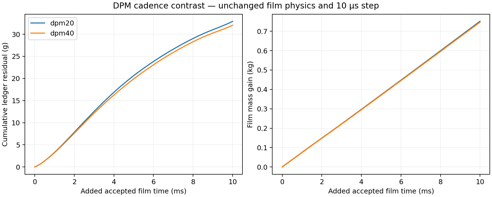

# Stage 4 — DPM cadence accounting screen

| Decision | Current state |
| --- | --- |
| Status | COMPLETE: cadence40 reached N42503; 1,000 updates / 10 ms; pair and all 19 source files hash/reopen verified |
| Question / setup | [Does the discrepancy follow tracking cadence?](setup.md) |
| Ledger treatment | Original reported-rate ledger retained; no correction factor applied |
| Required proof | Tracking-event mass and native normalization interval; cadence comparison alone cannot establish conservation |

| Arm / accepted film time | Tracking events | Ledger error | Residual / reported DPM input | Whole-command solve time |
| --- | ---: | ---: | ---: | ---: |
| DPM20 / +10 ms | 50; first at update 17, then every 20 | 1.6721% | 5.3408% | 410.207 s |
| DPM40 / +10 ms | 25; first at update 17, then every 40 | 1.6290% | 5.1939% | 389.738 s |

| Baseline observation | Implication |
| --- | --- |
| Per-update residual | Discrepancy is distributed over film updates; 0.001616 kg of 0.032901 kg occurs at the 50 tracking-associated updates |
| Event pulse hypothesis | A large, single-update mass impulse is not supported by this baseline; an applied-rate/normalization difference remains possible |
| Native DPM summary | Full60 endpoint summary captured before reopen; native report marked stale. No extra DPM tracking update was issued; independent event mass remains unavailable. |
| Diagnostic inlet feed | Six injections total 6 × 10⁻²⁰ kg/s; current film DPM source cannot be fresh inlet feed. Stripping/separation recirculation is the main candidate source; its event accounting still needs proof. |
| Inner convergence | Achieved inner residual history still absent; source normalization is not yet the sole established cause |
| Decision | Retain the 20-step cadence. The discrepancy did not halve; a simple inverse-cadence correction is rejected. A 4.99% timing gain does not support changing the selected coupling cadence. |

| Artifact owner | Link |
| --- | --- |
| Derived comparison and source manifest hashes | [Machine comparison summary](../../../../../PyAnsys/output/phase72a-stage4-dpm-cadence/20261008/comparison-summary.json) |
| Native job, guarded save and restart records | [Cadence40 manifest](../../../../../PyAnsys/output/phase72a-stage4-dpm-cadence/20261008/dpm40/run-manifest.json) |

Same N41503, +10 ms accepted film time and 10 µs step. [Source hashes, units and uncorrected ledger equation](figures/cadence-accounting.provenance.json).

| Comparison / limit | Result |
| --- | --- |
| Original hypothesis | Residual / DPM input would halve from cadence20 to cadence40 |
| Observed ratio | 0.9725; the simple inverse-cadence hypothesis is not supported |
| Film gain change | −0.5854% |
| Direct drain change | +0.2445% |
| Reported DPM input change | +0.1582% |
| Whole-command cost change | −4.9899%; one paired window |
| Stability | Both peak Courant 0.03268; cadence40 peak thickness 1.975 mm; finite fields |
| Current accuracy status | Original uncorrected balance remains above 1%; independent event mass and achieved inner residuals unavailable |
| Loss-overlap test | Scope-local histories do not support direct overlap: outflow increments are on the lower collector, while separated increments are on upper walls. Retain both terms. |
| Recovery | An own capture client stalled in optional GetBuildInfo before any Fluent mutation; interrupted that client and bounded optional metadata. Fluent remained open and the native endpoint was recovered. |

| Native reporting audit | Finding / implication |
| --- | --- |
| Film-wall flux at cadence40 endpoint | Upper 0, lower −37.5353 kg/s; lower agrees with the direct film sink at the endpoint |
| Scope-local cumulative losses | Both arms: upper outflow increment is zero to round-off; lower separated increment is exactly zero. All outflow change is lower; all separated change is upper. Direct duplication is not supported. |
| Current ledger | Retain every original term; neither an inverse-cadence multiplier nor deletion of separation is justified |
| Remaining proof | Source application, independent DPM event mass and achieved film inner convergence still need review; this audit does not resolve every possible accounting error |
| Machine audit | [Scope-local loss proof](../../../../../PyAnsys/output/phase72a-stage4-dpm-cadence/20261008/inspection/loss-overlap-hypothesis.json); original ledger unchanged |
| Ordinary development | [Native +50 ms continuation](../core-development/results.md) submitted from preserved N43483 with 17 reports and original 20-step DPM cadence; diagnostic while accounting/convergence remain unqualified |
