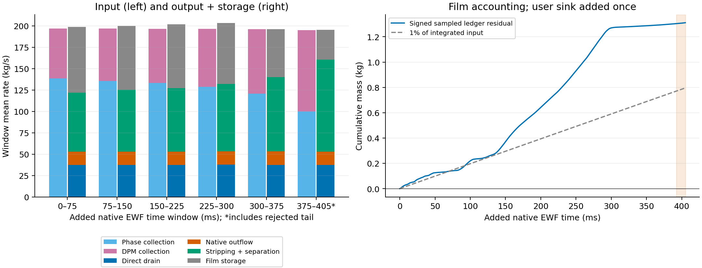

# Stage 4 — Long native EWF development

| Question / status | Recovered result |
| --- | --- |
| Did the long run finish? | **Native Courant guard stopped at N68483; 27,000 / 200,000 additional updates, 13.5%** |
| Native classification | **NUMERICAL_REJECTED**; first crossing at N67648 |
| Recovery | 36 necessary files read directly from Server 1; each matched server size and SHA-256; no archive transfer |
| Evidence coverage | 32 native report histories, 27,001 consecutive samples each; 27,000 printed film updates; saved endpoint reopened |
| Added native film time | **0.405 s verified** by accepted steps, printed clocks, saved clock and film counter |
| Native endpoint clock | **0.7931843386351183 s**; parent 0.3881843386354626 s |
| Drainage during frozen bulk | **Active**; direct drain removed 15.156844 kg; three bulk inventory/flux histories unchanged |
| Film stationarity | **Not demonstrated**; upper film still accumulated before the Courant guard crossing |
| Human thickness limit | Peak 4.443778 mm, below 300 mm; **UNREALISTIC thickness flag not triggered** |
| Endpoint integrity | Rejected case/data hashes recorded; native reopen, counter, settings and persistent report comparisons PASS |
| Inner-film convergence | Unverified; saved transcript contains no inner residual rows |
| Current Server 1 | Reopened rejected N68483 endpoint for inspection; no new solve calls |

Raw histories over N41483–N68483; time from accepted 15 microsecond steps, checked against the native clock. Shading begins at the first Courant ≥1 sample, +392.475 ms. The lower-panel right axis uses the verified constant sink coefficient; its rate is proportional to lower-film mass. No smoothing or rejected-tail removal.

| Film metric | Parent N41483 | Reopened endpoint N68483 / continuation peak |
| --- | ---: | ---: |
| Total film mass, kg | 10.982861 | 38.560598 |
| Upper film mass, kg | 10.927212 | 38.504745 |
| Lower film mass, kg | 0.055650 | 0.055853 |
| Direct drain rate, kg/s | 37.099895 | 37.235444 |
| Maximum thickness, mm | 1.978071 | 4.443778; peak at N68483 |
| Maximum film Courant | 0.04956368 | Final 0.6190512; peak 4.066397 at N68434 |
| Lower-film peak Courant | — | 0.01391246 |
| Upper-film maximum speed, m/s | 195.114838 | Final 489.772949; peak 3217.198975 at N68434 |
| Film update counter | 39903 | 66903 |

| Drain / storage assessment | Evidence |
| --- | --- |
| Total film gain | +27.577737 kg; almost all on the upper wall |
| Lower-film gain | +0.000203 kg; lower-film mass ranged 0.055650–0.056774 kg |
| Transport into the lower region | Inferred net 21.495832 kg over 405 ms from lower storage + native outflow + direct sink − local collection; includes any local sampled balance error |
| Local lower-wall collection | 0.001685 kg, compared with 15.156844 kg direct removal and 6.340470 kg native lower-film outflow; removal cannot be supplied by local collection alone |
| Endpoint downward motion | Mass-weighted vertical film velocity −4.416 m/s on the upper wall and −24.058 m/s on the lower wall; 65.42% / 100% of upper / lower film mass lies on faces with downward velocity |
| Mean direct drain | 37.424306 kg/s over the 405 ms continuation |
| Mean total film storage | +68.093178 kg/s over the complete recorded continuation; rejected tail included |
| Last 75 ms before the first guard crossing | +49.472172 kg/s storage; descriptive window, no Courant ≥1 samples |
| Last 15 ms before the first guard crossing | +37.354019 kg/s storage, 19.1553% of sampled film input |
| Drain performance conclusion | Direct removal continued with frozen bulk; local collector inventory stayed bounded; film input still exceeded the combined film-removal/transfer terms plus sampled imbalance |
| Upper film behaviour | Continuing accumulation; no stationary upper-film inventory in the assessed pre-crossing windows |
| Whole-system boundary | Stripping/separation transfer liquid out of film; they are not external brine drainage |

Five 75 ms windows and the remaining 30 ms; the final window includes the rejected tail. Collection uses current native source rate × accepted step; direct removal uses preceding rate × step. Native outflow, stripping and separation use cumulative differences. The ledger residual is storage + outputs − inputs; direct user sink is added once.

| Film ledger over 405 ms | Mass, kg |
| --- | ---: |
| Phase collection into film | 52.227340 |
| DPM collection into film | 27.304106 |
| Total sampled input | 79.531446 |
| Inventory increase | 27.577737 |
| Native film outflow | 6.340470 |
| Stripping transfer | 30.318549 |
| Edge-separation transfer | 1.448741 |
| Direct user sink | 15.156844 |
| Signed sampled ledger residual | +1.310894 |
| Absolute residual / input | **1.648272%**, above the declared 1% criterion |
| Direct sink left/right quadrature span | 0.000002033 kg; does not explain the whole-ledger discrepancy |

| Numerical / accounting assessment | Result / limit |
| --- | --- |
| First Courant ≥1 | N67648; +392.475 ms; 56 samples ≥1 across the full continuation |
| Guard delay | 835 additional updates followed the first crossing before the 1000-update block returned |
| Peak location and timing | Upper wall; film speed and Courant maxima share N68434 |
| Peak speed interpretation | Strong upper-film momentum spike; no individual force, stripping model or numerical operator isolated |
| Parent / endpoint momentum evidence | Upper mass-weighted speed 126.673 → 254.026 m/s; mean vertical velocity +7.307 → −4.416 m/s. Two snapshots do not establish continuous momentum growth or a complete downward-transport blockage |
| Lower collector | Courant stayed below 0.014 while the direct sink remained active |
| Numerical stop mechanism | Native guard rejected the interval; no floating-point-exception or divergence message in the saved transcript |
| Before-crossing ledger | Whole pre-crossing sampled error 1.691439%; last pre-crossing 15 ms error 0.231952% |
| Inner solve | Configured 30 subiterations / tolerance 1e-5 persisted; achieved residuals were not recorded |
| Steady-film qualification | Failed numerical guard and continuing storage; 405 ms also shorter than the required three 0.25 s windows |
| Physical claim | No fully coupled separator convergence, resolved drain hydraulics or physical validation |

| Frozen bulk readback | Unchanged recorded value |
| --- | ---: |
| Bulk liquid inventory, kg | 162.298993 |
| Phase-2 steam-outlet boundary flux without sources, kg/s | -9.115419 |
| Phase-1 steam-outlet flux, kg/s | -80.850298 |
| Bulk equation groups | All OFF in reopened case |

| Current EWF settings / drain cadence | Native readback / interpretation |
| --- | --- |
| Film mass and momentum equations | ON; gravity, surface shear, wall viscous force, pressure gradient, spreading and momentum advection ON |
| Surface tension | ON; 0.07194 N/m |
| Collection and particle mechanisms | DPM collection, phase accretion, splashing, stripping and edge separation ON globally; collector `wall:004` retains local splashing and boundary separation OFF |
| Coupling | EWF coupled solution ON; Flow Momentum Coupling OFF on both active film walls; bulk equations frozen |
| Other film controls | Energy, scalar and vapour equations OFF; adaptive stepping and film / curvature smoothing OFF |
| Time and inner solve | Fixed 15 µs accepted film step; 30 maximum inner subiterations, stopping tolerance 1e-5 |
| Direct lower-film drain | Enabled; removes mass and matching XYZ momentum; capture time 1.5 ms, coefficient 666.667 /s |
| Expression refresh | Profile Update Interval = 1 global solver iteration; current native proof establishes one accepted film step per iteration and progressive source removal at 15 µs |
| `P72dRefreshSpan = 15 µs` | Rate-bound parameter in `min(1/tau, 0.01/RefreshSpan)`; does not schedule a separate drain operation |
| Proposed 1 µs step | With one film step per global iteration and profile interval 1, refresh should occur each 1 µs; not yet tested. Same physical drain rate gives `k × dt = 0.0667%`, versus 1% at 15 µs |
| Inner-step limitation | The [2025 R2 Run Calculation guide](https://ansyshelp.ansys.com/public/Views/Secured/corp/v252/en/flu_ug/flu_ug_run_calculation_task_page.html) defines expression refresh in solver iterations; it does not guarantee refresh at every EWF inner subiteration or sub-time-step |

| Persistence / remaining gap | Consequence |
| --- | --- |
| Native data read clears instantaneous phase-accretion rates | Use solved histories for collection integration; reopened zeros are not zero production input |
| Source-inclusive phase-2 outlet report | Reopened total -98.778344 kg/s includes User Mass Source -89.662925 kg/s; compare native boundary history against its without-sources component |
| Inner residual history absent from saved transcript | Cannot recover per-update inner convergence from this transcript; future continuation must record it explicitly |
| Sampled ledger exceeds 1% | Accounting / numerical error remains unresolved; stable-looking inventories do not qualify closure |
| One combined film-physics configuration | Cannot identify a setting to disable from this run alone |
| Film fields recovered at N68483 | Endpoint mass/thickness/XYZ velocity arrays saved; no spatial map of the N68434 peak event |

| Decision / next useful contrast | Scope |
| --- | --- |
| Current result | **Drain works during EWF-only solving; upper film continues to accumulate and develops large speed/Courant spikes** |
| Promotion | Rejected endpoint retained as diagnostic evidence; no steady-film promotion |
| Candidate numerical contrast | Fixed 10 µs from verified drain-ON N41483; same film mechanisms and physical drain capture time; capture inner residuals and check balance before long continuation |
| Human-proposed bulk-refresh cycle | +20 ms frozen-bulk EWF → 500 bulk iterations with EWF active → +20 ms frozen-bulk EWF; proposal only, no run submitted |
| Matched comparison | Save the common +20 ms checkpoint; compare the refresh arm with uninterrupted frozen-bulk EWF from that checkpoint at the same accepted film endpoint time |
| Expected count / time | 2000 film steps per 20 ms; 500 bulk iterations add 5 ms film time only if the one-film-step-per-iteration mapping is verified; then each arm ends +45 ms from N41483 |
| Drain invariant for proposed screen | τ=1.5 ms and rate 666.667 /s; expression update interval 1; declare refresh bound 10 µs without changing the physical removal coefficient |
| Decision evidence for bulk refresh | Compare upper-film growth, collection, removal, speed and Courant at matched film time; inspect bulk residuals, inventory and outlet flux through the 500-iteration refresh |
| Numerical limitation of 10 µs | At unchanged velocity and length scale, the previous peak Courant 4.066 would scale to about 2.711; a shorter step is a screen, not proof of repaired stability |
| Timing interpretation | Bulk steady-solver iterations are relaxation updates; film has its own accepted physical clock. No time-resolved bulk or fully coupled steady-state claim from this alternating schedule |
| Recovery checkpoint availability | Native paired files listed at N45000, N50000, N55000, N60000 and N65000; latest pre-crossing pair not reopened in this inspection |
| Further solves | None submitted during recovery or analysis |

| Evidence owner / artifact | Record |
| --- | --- |
| Exact experiment contract | [Setup](setup.md) |
| Current analysis / raw hashes | [Analysis summary](../../../../../../PyAnsys/output/phase72a-stage4-ewf-long-native/20261007/analysis-summary.json) |
| Aligned native histories | [CSV](../../../../../../PyAnsys/output/phase72a-stage4-ewf-long-native/20261007/film-history.csv) |
| Direct retrieval and server file metadata | [Receipt](../../../../../../PyAnsys/output/phase72a-stage4-ewf-long-native/20261007/retrieval-20261008/receipt.json); [metadata](../../../../../../PyAnsys/output/phase72a-stage4-ewf-long-native/20261007/retrieval-20261008/export-metadata.json) |
| Immutable copied source files | [Native raw bundle](../../../../../../PyAnsys/output/phase72a-stage4-ewf-long-native/20261007/raw/terminal-N68483) |
| Endpoint reopen and persistent-field checks | [Verification](../../../../../../PyAnsys/output/phase72a-stage4-ewf-long-native/20261007/inspection/reopen-N68483.json) |
| Current settings and transport / cadence reduction | [Native settings](../../../../../../PyAnsys/output/phase72a-stage4-ewf-long-native/20261007/inspection/current-ewf-settings-20261008.json); [derived evidence and source hashes](../../../../../../PyAnsys/output/phase72a-stage4-ewf-long-native/20261007/inspection/transport-and-drain-cadence-20261008.json) |
| Native job state | [Manifest](../../../../../../PyAnsys/output/phase72a-stage4-ewf-long-native/20261007/run-manifest.json) |
| Reproducible analysis | [Script](../../../../../../PyAnsys/scripts/analysis/analyze_phase72a_stage4_long_native.py) |
| Direct file access implementation | [Retrieval script](../../../../../../PyAnsys/scripts/inspection/retrieve_phase72a_stage4_long_native.py) |
| Rejected native pair | `C:/Users/syok443/Documents/FluentRuns/Phase72A/Stage4/ewf-long-20261007/rejected-preserved.cas.h5` and `.dat.h5` |
| Figure provenance / visual QA | [Provenance](figures/provenance.json) |
| Earlier isolated / matched drain proof | [Direct-drain result](../results.md) |
