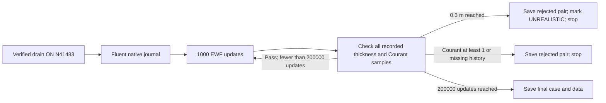

# Stage 4 — Long EWF development with direct drainage

| Question / selection | Contract |
| --- | --- |
| Human direction | Long Server 1 run submitted through native TUI; continue when the laptop closes |
| Question | Does the full selected EWF model with direct drainage approach a stationary film under held bulk forcing? |
| Selected contrast | Extend time from the verified drain-ON endpoint; no additional film-physics change |
| Selection reason | All originally requested film mechanisms are already ON; earlier OFF routes failed longer checks; drain-ON screen remains numerically stable |
| Parent | Native N41483; film time 0.3881843386354626 s; [verified direct-drain result](../results.md) |
| Parent case | `C:/Users/syok443/Documents/FluentRuns/Phase72A/Stage4/ewf-drain-20261007/on/drain-screen-N40503-N41483.cas.h5` |
| Parent data | Same stem, `.dat.h5`; exact pair and hashes in [parent manifest](../../../../../../PyAnsys/output/phase72a-stage4-ewf-drain/20261007/run-manifest.json) |
| Initialization | Forbidden; preserve developed upper/lower film and bulk fields |
| Requested horizon | 200,000 additional native updates; 3.000 s added film time |
| Expected endpoint | N241483; native film time approximately 3.3881843386354626 s, subject to native verification |
| Step | Fixed 15 microseconds; adaptive stepping OFF |
| Film inner solve | Alternative implicit scheme; 30 subiterations; tolerance 1e-5; profile/source refresh every update |
| Runtime estimate | About 34 hours at the measured 597.9 s / 980 updates; late-film cost may change |

| Setting | Selected value |
| --- | --- |
| Film mass / momentum equations | ON |
| Pressure Gradient / Spreading Term / Surface Tension | ON / ON / ON |
| Gravity / Surface Shear | ON / ON |
| Particle Splashing / Edge Separation / Particle Stripping | ON / ON / ON on upper film; collector retains its proven wall settings |
| DPM Coupling / Phase Accretion / EWF Coupled Solution | ON / ON / ON |
| Flow Momentum Coupling | OFF on both active film walls; earlier ON probes produced floating-point failures |
| Bulk equations | All frozen: drift, flow, turbulence and multiphase advancement OFF |
| Active film walls | Upper `wall`; lower collector `wall:004` |
| Direct sink | ON; thickness-proportional mass sink plus matching film momentum; capture time 1.5 ms |
| Materials / roughness / source coefficients | Exact drain-ON parent values; no material-property sensitivity in this run |
| Global Maximum Thickness | 0.3 m; reaching the cap invalidates this run |

| Native execution / evidence | Requirement |
| --- | --- |
| Run owner | Fluent Scheme/TUI on Server 1; Python prepares/submits, then exits |
| Native solve | 200 server-owned blocks of `/solve/iterate 1000`; no laptop controller |
| Entry command | `/file/read-journal "C:/Users/syok443/Documents/FluentRuns/Phase72A/Stage4/ewf-long-20261007/native-long-run.jou"` |
| Work root | `C:/Users/syok443/Documents/FluentRuns/Phase72A/Stage4/ewf-long-20261007` |
| Native transcript / progress | `native-long-run.trn`; `native-status.scm`; status written after each block |
| Reports | Fresh local `monitors/`; all retained native reports each update; upper/lower/total stock, collection, outflow, stripping, separation, maximum thickness, Courant and direct sink |
| Native checkpoints | Paired case/data every 5,000 absolute iterations; keep the latest 12 autosave sets; fresh local `checkpoints/` |
| Final pair | `final-N241483.cas.h5` and `.dat.h5`; produced by Fluent after the complete horizon |
| Rejected pair | `rejected-preserved.cas.h5` and `.dat.h5`; produced before the native job ends |
| Thickness guard | Scan every report sample since the native start, after each 1,000-update block; a peak ≥0.3 m remains a rejection even if thickness later falls |
| Unrealistic marker | Native `UNREALISTIC.txt` plus native status; no subsequent blocks |
| Numerical guard | Any sampled maximum Courant ≥1, nonfinite/negative guard value, missing or nonconsecutive iteration history prevents another block |
| Guard delay | Checks occur at block boundaries; up to 999 further updates can follow a threshold crossing before the block returns |
| Guard proof | Native synthetic Fluent-format history tests: recovered 0.3 m peak, healthy history, missing endpoint, Courant ≥1 |
| Source accounting | Direct user sink is excluded from native film outflow; integrate it separately and add it once |
| Source persistence | Native data read clears instantaneous phase-accretion rates; solved histories own their integration |

| Stationarity assessment after run | Predeclared test |
| --- | --- |
| Main figure | Total/upper/lower film inventory and maximum thickness versus actual native film time |
| Balance figure | Window-mean collection, direct drainage, native outflow, stripping/separation and storage rate |
| Qualification windows | Last three consecutive 0.25 s windows; use native accepted-step/time evidence |
| Inventory trend | Fitted inventory change within each window <1% of window-mean stock |
| Window means | Consecutive total/upper/lower inventory means differ <1%; ignore relative lower-stock test if near numerical zero and report an absolute bound |
| Throughput / storage | Absolute mean storage <1% of mean film input in each window |
| Film ledger | Integrated collection = stock change + native outflow + stripping + separation + direct sink; residual <1% of input, with quadrature span reported |
| Thickness distribution | Consecutive window-mean maximum thickness differs <5%; saved film maps must not show continuing gross redistribution |
| Inner solve | Review complete native film residual histories; persistent failure to meet the declared inner tolerance prevents a qualified numerical stationarity claim |
| Rapid source cycle | A repeated short cycle may support statistical stationarity only if its window means and film balance pass; report cycle amplitude explicitly |
| Threshold / numerical rejection | No steady-film claim from a clipped or rejected interval |
| Horizon limit | A growing film at 3 s added time means no demonstrated stationary film within this horizon; it does not prove that no steady state exists |
| Claim boundary | Film behaviour under fixed carrier forcing and an assumed numerical drain; no fully coupled separator convergence or physical drain validation |

| Owner | Record |
| --- | --- |
| Native preparation / submission | [Script](../../../../../../PyAnsys/scripts/setup/submit_phase72a_stage4_long_native.py) |
| Machine status | [Run manifest](../../../../../../PyAnsys/output/phase72a-stage4-ewf-long-native/20261007/run-manifest.json) |
| Prepared verification | [Native readback](../../../../../../PyAnsys/output/phase72a-stage4-ewf-long-native/20261007/prepared-readback.json) |
| Current result | [Results](results.md) |
