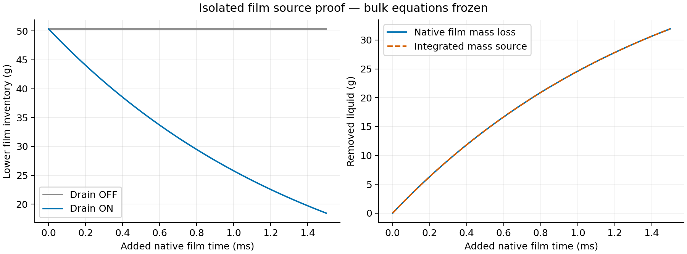
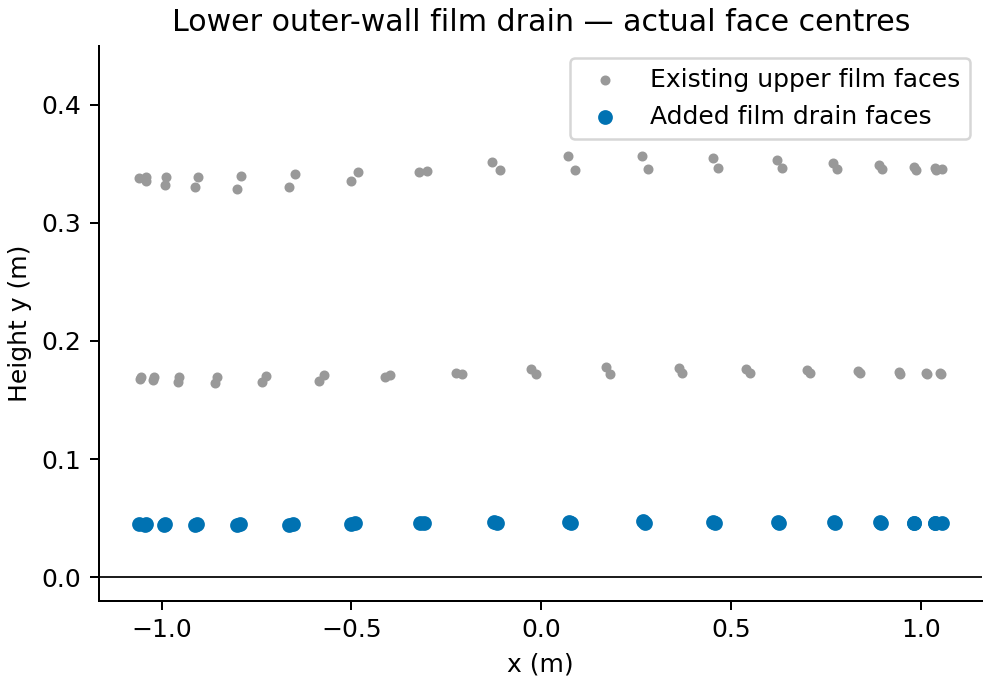
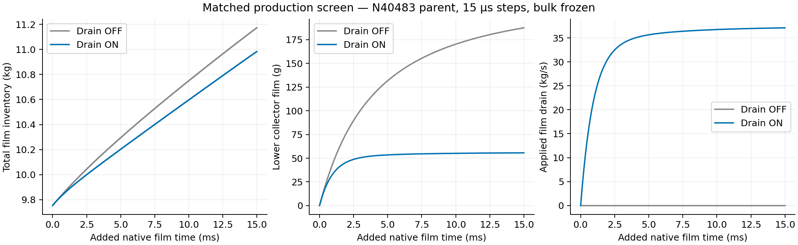

# Stage 4 — Direct EWF drain

| Question / status | Evidence |
| --- | --- |
| Does the local drain work while bulk stays frozen? | **YES — native isolated source proof passed** |
| Does production film reach the new collector? | **YES — native production mass reached the lower film; direct sink removed 0.508790 kg over 15 ms** |
| Lower collector | Existing `wall:004`, 34 faces; new EWF storage initially dry |
| Removed quantity | Local film liquid mass plus matching mean-film momentum |
| Trial coefficient | Capture time 1.5 ms; 1% nominal local source depletion per 15 microsecond update |
| Verified drain-ON parent | N41483 / 0.3881843386354626 s; all bulk equation groups frozen; 15 microseconds; paired final verification PASS |
| Later Server 1 continuation | [Recovered long-run analysis](long-development/results.md); N68483 / +405 ms; direct drain active; upper film still accumulates; Courant guard rejection; paired reopen PASS |
| Original fields | N40483 / 0.3731843386354754 s preserved; all 3,463 geometry-matched upper film mass/thickness/XYZ velocity values exact |
| Film limit | 0.3 m; any native sample reaching it marks the run **UNREALISTIC** |
| Claim limit | Numerical collector; no pool hydraulics, whole-separator closure or steady-film claim |

100 native updates per arm; 15 microseconds; identical seeded lower film; bulk equations and film forcing/collection disabled; EWF coupled solution retained. The integrated source uses each preceding native source rate and the verified film step.

| Native source proof | Drain OFF | Drain ON |
| --- | ---: | ---: |
| Initial lower film, g | 50.375202 | 50.375202 |
| Final lower film, g | 50.375124 | 18.438937 |
| Film loss, g | 0.0000783 | 31.936266 |
| Added native film time, ms | 1.5 | 1.5 |
| Bulk inventory / boundary-flux reports | Fixed | Fixed |
| Source-only per-update depletion | 0 within drift tolerance | 1.0000000–1.00000135% |
| Maximum per-step source/mass-loss difference | — | 0.000135% |
| Native film outflow increment, g | 0.0000508 | 0.0000164 |
| Native report convention | User sink excluded from film outflow | Report direct sink separately |
| Paired save/reopen | PASS | PASS |
| Production restoration after fixture | Exact original upper fields, clock and counter; lower wall dry | Same restored production pair |

Actual mesh face centres near the lower outer wall. Existing segment vertices extend to 0.118351 m; this is not a fitted y=0.10 m capture plane.

Same expanded, initially dry N40483 parent; 1000 updates / 15 ms per arm. The ON probe continues without data reload. All selected upper film physics remain ON; Flow Momentum Coupling remains OFF.

| Production metric | Drain OFF | Drain ON |
| --- | ---: | ---: |
| Final native iteration | 41483 | 41483 |
| Added native film time, ms | 15.000 | 15.000 |
| Initial total film, kg | 9.752614 | 9.752614 |
| Final total film, kg | 11.172556 | 10.982861 |
| Final upper film, kg | 10.985035 | 10.927212 |
| Final lower film, kg | 0.187520 | 0.055650 |
| Integrated direct sink, kg | 0 | 0.508790 |
| Native film outflow increment, kg | 0.530232 | 0.211108 |
| Direct sink + native outflow, kg | 0.530232 | 0.719898 |
| Final direct sink rate, kg/s | 0 | 37.099895 |
| Last-500 direct sink mean, kg/s | 0 | 36.825878 |
| Last-500 total film growth, kg/s | 86.078068 | 77.722863 |
| Peak native Courant | 0.05018137 | 0.04983767 |
| Peak native film thickness, m | 0.002073558 | 0.002054896 |
| 0.3 m threshold reached | No | No |
| Bulk inventory / flux reports | Fixed | Fixed |
| Final paired save/reopen | PASS | PASS |

| Interpretation | Bounded result |
| --- | --- |
| Direct film removal | Source-only proof and full-physics production removal work with every bulk equation frozen |
| Lower collector inventory | 70.32% lower with direct sink ON at 15 ms |
| Total retained film | 0.189694 kg lower with direct sink ON |
| Upper-to-lower routing | Local lower collection is only 0.0000624 kg; inferred in-film transport plus sampled ledger residual is 0.717690 kg OFF / 0.775485 kg ON |
| Two removal paths | Expanded lower film opens native edge outflow; local user sink adds direct removal on collector faces |
| Comparison boundary | OFF/ON isolate sink activation on the same expanded film domain; adding the lower film also changes the old parent edge network |
| Continuing development | Total film still grows at 77.723 kg/s in the final 7.5 ms of ON; no steady-film claim |
| Capture time | 1.5 ms is an assumed numerical collector time; physical drainage capacity remains uncalibrated |
| Scope | Film balance under held carrier forcing; no whole-separator closure or resolved pool hydraulics |

| Film ledger over 15 ms, kg | OFF | ON |
| --- | ---: | ---: |
| Integrated phase collection | 2.100984 | 2.101162 |
| Integrated DPM collection | 0.851543 | 0.851583 |
| Inventory increase | 1.419941 | 1.230247 |
| Native outflow | 0.530232 | 0.211108 |
| Stripping transfer | 0.997459 | 0.997658 |
| Edge-separation transfer | 0.012432 | 0.012068 |
| Direct user sink, preceding-rate integral | 0 | 0.508790 |
| Sampled ledger residual | 0.007537 | 0.007127 |
| Residual / integrated input | 0.2553% | 0.2414% |

| Accounting / persistence | Rule / observation |
| --- | --- |
| Sign and scope | Inputs positive into film; inventory/outflow/stripping/separation are native cumulative differences; direct sink is reported as positive removed mass |
| Native outflow convention | Isolated proof shows user sink excluded; add the separately integrated direct sink once |
| Sink quadrature | Preceding native rate × verified 15 microsecond step; current-rate alternative gives 0.509346 kg; span 0.000556 kg |
| Instantaneous phase-accretion rate | Clears on native data read; use solved report histories for source integration; stored mass, thickness, velocity and transfer fields remain valid |
| Recovery | OFF endpoint reconciliation added zero solver updates; immutable solved histories retained |
| Current readback | Original upper-wall film physics, roughness, material, methods and fixed stepping retained; direct sink ON; all bulk equation groups OFF |
| Next continuation | Verified ON final pair; 15 microseconds; preserve local pairs; reaching 0.3 m marks UNREALISTIC and stops further batches |

| Owner / artifact | Link |
| --- | --- |
| Runnable intent | [Setup](setup.md) |
| Direct source implementation | [Local drain module](../../../../../PyAnsys/src/pyansys_fluent/ewf_local_drain.py) |
| Native runner | [Build / proof / screens](../../../../../PyAnsys/scripts/setup/run_phase72a_stage4_ewf_drain.py) |
| Campaign status | [Native manifest](../../../../../PyAnsys/output/phase72a-stage4-ewf-drain/20261007/run-manifest.json) |
| Reduced metrics / raw integrity | [Analysis](../../../../../PyAnsys/output/phase72a-stage4-ewf-drain/20261007/analysis-summary.json); [raw hashes](../../../../../PyAnsys/output/phase72a-stage4-ewf-drain/20261007/raw-hashes.json) |
| Final native verification | [Verification](../../../../../PyAnsys/output/phase72a-stage4-ewf-drain/20261007/verification.json) |
| Source proof / restoration | [Proof receipt](../../../../../PyAnsys/output/phase72a-stage4-ewf-drain/20261007/proof/proof.json) |
