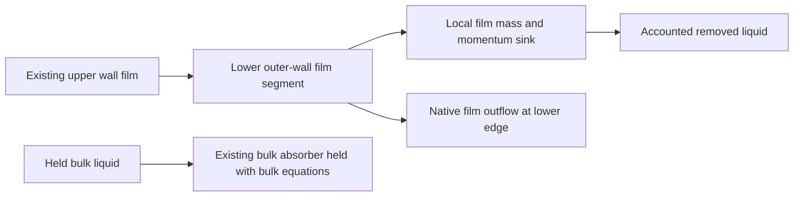

# Stage 4 — Direct EWF drain in the lower collector

| Contract | Selected design |
| --- | --- |
| Human authority | 7 October 2026: design absorber/drain that works while only EWF equations advance |
| Question | Can a local film mass/momentum sink remove collector film while every bulk equation stays frozen? |
| Classification | Partial repeat of the Stage 2 seeded-film source proof; new independent film-only sink and current Stage 4 fields / 15 microsecond step |
| Exact parent | Saved/reopened N40483, native film clock 0.3731843386354754 s; film 9.752614046 kg |
| Parent configuration | Maximum Thickness 0.3 m; Flow Momentum Coupling OFF; all selected physical film terms ON; bulk frozen |
| Drain location | Enable EWF on existing lower outer-wall `wall:004`; 34 faces, centre heights 0.043964–0.047341 m inside the lower collector |
| Geometry limit | Existing mesh segment; vertices extend to 0.118351 m; not an exact fitted y=0.10 m capture plane |
| Controlled change | Extend film domain to lower segment; add local negative film mass source and matching mean-film-velocity momentum source |
| Upper film / bulk | Preserve every existing upper-film facet, bulk data, native iteration and film clock during production-case build |
| Lower new storage | Initially dry; allocate only the added film storage; if native initialization is needed, restore all original solution data and prove exact upper-field persistence before compute |
| Film sink | s_m = −k ρ max(h,0), kg/(m² s); applies only on lower segment |
| OFF / ON control | Same native User Source Terms in both arms; dimensionless P72dEnabled=0 / 1; OFF reports exactly zero applied sink |
| Momentum sink | s_p,j = s_m u_film,j, N/m²; remove momentum with the liquid |
| Removal coefficient | k = min(1/τ, f/Δt_refresh); τ=1.5 ms, f=0.01, declared refresh span 15 microseconds; k=666.666667 s⁻¹ |
| Coefficient basis | Assumed numerical capture time; 1% of local film per nominal source-refresh span; not a plant drainage calibration |
| Source cadence | Profile Update Interval 1; prove native film advance and local depletion while bulk is frozen; do not use steady-bulk DeltaTime |
| Bulk absorber | Retain the current contact mass/momentum hooks; film sink has no bulk inventory or inlet-throughput normalization |
| Other invariants | Mesh, material, roughness, inlet values, upper EWF settings, particle injection/boundary settings, 15 microseconds, 30 film subiterations |
| New lower boundary | Initial Condition + User Source Terms; Flow Momentum Coupling OFF; lower particle splash / boundary separation OFF; bottom/inner walls remain outside EWF |
| First proof | Disposable lower-film fixture: source OFF then ON from identical seeded film; bulk / film forcing / phase collection OFF; native field histories and printed film time |
| Fixture limit | No physical claim from seeded film; restore saved production fields after proof; no fixture state enters the production continuation |
| Production screen | Independent OFF/ON children of the same expanded, initially dry lower-film parent; 1000 EWF updates / 15 ms each; 20-update ON instrumentation probe included |
| Proof criteria | OFF fixture inventory fixed; ON loss positive and nonnegative; loss agrees with applied source and measured time within 3%; depletion ≤1.05% per update; bulk fields fixed |
| Production evidence | Separate upper/lower/combined inventories, negative user-source rate, native film outflow, stripping/separation, phase/DPM sources, maximum thickness/Courant and exact accepted film time |
| Accounting | Establish whether native outflow includes user-source removal; count each removal once; integrate the separately reported sink using actual film-time increments |
| Numerical bounds | Native Courant ≤1, finite/nonnegative film fields; thickness ≥0.3 m marks **UNREALISTIC** and stops further batches after endpoint preservation |
| Outcome | Source proof establishes the drain operator; production comparison tests transport into the drain; success does not require instant steady film |
| Claim limits | Ideal numerical liquid collector, no resolved brine pool/outlet hydraulics; no whole-separator closure while bulk stays frozen |

| Core artifact | Question / reduction |
| --- | --- |
| Source-proof plot | OFF/ON seeded lower-film inventory against native film time; source-integrated removal versus measured inventory loss |
| Drain comparison plot | Upper/lower/combined film inventories and drain rate for matched OFF/ON production histories |
| Endpoint / ledger table | Fixed bulk stocks/fluxes; 15 ms clock; source, film outflow and cumulative transfer accounting; guard values; paired persistence |

| Evidence basis | Owner / transfer limit |
| --- | --- |
| Parent configuration | [Native 0.3 m configuration](../../../../../PyAnsys/output/phase72a-stage4-film-limit/20261007/run-manifest.json) |
| Live geometry / fields | [Inspection](../../../../../PyAnsys/output/phase72a-stage4-ewf-drain/20261007/inspection.json) |
| Closest prior source proof | [Stage 2 result](../../stage-02-combined-ewf-roughness/results.md); seeded frozen-bulk 10 microsecond proof; original raw proof receipt absent in this checkout |
| Existing source implementation | [Shared-budget collector](../../../../../PyAnsys/src/pyansys_fluent/ewf_absorber.py); reuse source API, not its bulk-dependent removal budget |
| Source-panel screenshot | [Official Figure 30.6](https://ansyshelp.ansys.com/public/Views/Secured/corp/v252/en/flu_ug/graphics/g_flu_ug_ewf_bc_sources.png); inspected: local mass flux kg/(m² s), XYZ momentum flux N/m² |
| Version / source controls | [Fluent 2025 R2 §30.5.2](https://ansyshelp.ansys.com/public/Views/Secured/corp/v252/en/flu_ug/flu_ug_ewf_sec_bound.html); source terms require Initial Condition |
| Expression variables | [Fluent 2025 R2 §5.5](https://ansyshelp.ansys.com/public/Views/Secured/corp/v252/en/flu_ug/flu_ug_expressions_Appendix_fieldvars.html); FilmThickness, FilmVelocity |

| Reproducible operation | Verified path / ordering |
| --- | --- |
| Version | Fluent 2025 R2 / v252; attached Server 1; no other session altered |
| Add lower film wall | Settings `wall["wall:004"].phase["mixture"].wall_film`: `eulerian_film_wall=True`, `film_condition_type="film-wall-initial"`, `film_height=0`, momentum feedback OFF |
| Allocate before reading fields | Native TUI `/define/models/eulerian-wallfilm/initialize-wallfilm-model`; then read exact original `.dat.h5` and restore original EWF parameter list |
| Preservation proof | Geometry-matched upper face centres; exact mass, thickness and XYZ velocity values; dry new lower wall; same bulk reports, counter and film clock |
| Attach source | Native User Source Terms ON; mass `P72dSink`; XYZ momentum `P72dSinkX/Y/Z`; source switch `P72dEnabled=0/1` |
| Step / update | Fixed 15 microseconds, 30 subiterations, Profile Update Interval 1; unchanged parent film numerics |
| Execute | [Runner](../../../../../PyAnsys/scripts/setup/run_phase72a_stage4_ewf_drain.py): `--build`, `--proof`, `--screen off`, `--screen on`; existing receipts require explicit reconciliation |
| Probe persistence | Save ON probe pair; continue without data reload so source cadence matches the single OFF batch; prepare/final pairs are reopened |
| Restart-rate convention | Native data read clears instantaneous phase-accretion rate; use immutable solved histories for source integration; check stored inventory, transfers, thickness, Courant and drain separately |
| Run command | Native TUI `/solve/iterate 100` for each isolated source arm; `/solve/iterate 1000` for OFF production; ON 20 + 980 updates |
| Native files | Paired case/data and monitor/transcript files under Server 1 local `FluentRuns/Phase72A/Stage4/ewf-drain-20261007`; no OneDrive checkpoint history |
