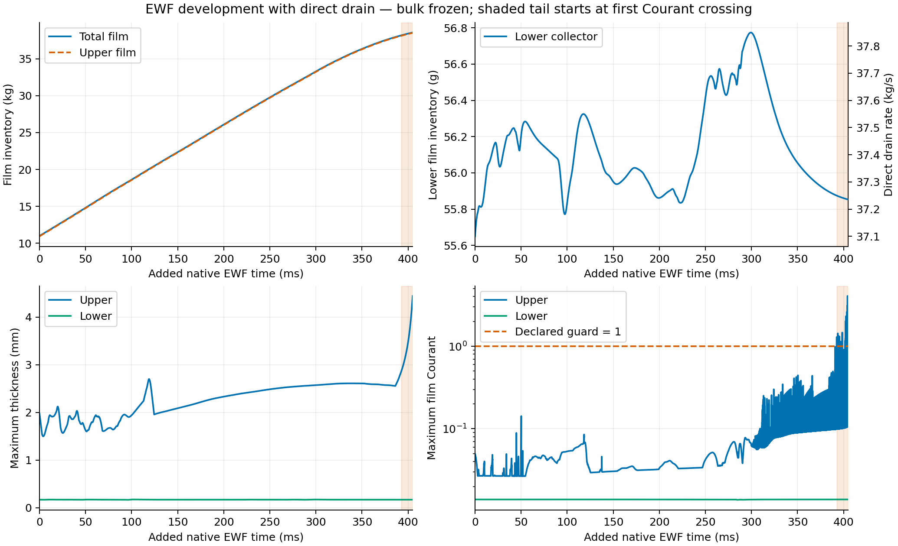
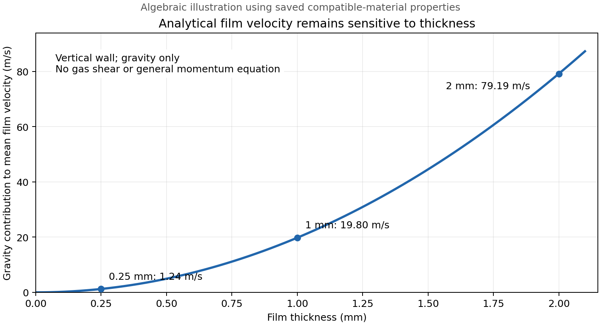

# Stage 4 — EWF accuracy and development cost

| Decision | Review, 8 October 2026 |
| --- | --- |
| Human priority | Retain EWF and Phase Accretion. Develop a repeatable wall-film method for mesh convergence. Accept less model complexity when its effect is measured and acceptable. |
| Session authority | Full ownership of Server 1. Other servers and their active preparation work remain under their own contracts. |
| Recommended direction | Resolve numerical and transfer consistency first. Use frozen-bulk film development with measured bulk refreshes. Select additional physics by their effect on the required outputs. |
| Human preference | Analytical film velocity is the preferred candidate after the human's follow-up. Keep EWF mass transport and Phase Accretion. |
| Final model candidate | Qualify analytical velocity for mesh convergence using balances, wall transport, bulk response and a numerically acceptable full-momentum comparison where available. Do not use the rejected full-momentum run as accuracy truth. |
| Alternative use | If analytical velocity changes the required final outputs too much, test it as preparation before full momentum. Measure the correction time and total benefit. |
| Current run decision | Assessment only. No new solves or Fluent settings changes submitted. The 10 µs / bulk-refresh cycle remains a candidate. |
| Live inspection | Bounded read-only native RPC verified Fluent 25.2.0, unchanged film clock 0.7931843386351183 s, counter 66903, step 15 µs, full momentum and Phase Accretion. Bulk/idle status was not rechecked. No solves or Fluent settings changes. [Receipt](../../../../PyAnsys/output/phase72a-stage4-method-review/20261008/server1-readback.json). |

## Evidence that changes the direction

Native N41483–N68483 histories; shading starts at the first declared Courant crossing. The upper film continues to fill while lower collector inventory remains bounded. The rejected tail is retained in this source figure.

| Observation | Implication | Owner |
| --- | --- | --- |
| Film mass 10.98 → 38.56 kg over +405 ms; lower film remains near 0.056 kg | A functioning lower drain has not established stationary upper-wall transport | [Long-development result](ewf-only-drain/long-development/results.md) |
| Peak film speed 3217 m/s and Courant 4.07 occur together on the upper wall | Inspect momentum, source timing and local fields before adding mechanisms; no term is isolated as the cause | [Long-development result](ewf-only-drain/long-development/results.md) |
| First Courant crossing follows +392.475 ms | A +20 ms screen proves instrumentation and short response only; it cannot establish longer stability | [Long-development result](ewf-only-drain/long-development/results.md) |
| Film ledger error 1.65%; achieved inner residuals absent | Balance and equation convergence must be recorded before qualification | [Long-development result](ewf-only-drain/long-development/results.md) |
| Stripping OFF suppresses the four-step source cycle but fails the longer check | Lower short-window variation is not a reason to remove stripping | [Setting sensitivity](setting-sensitivity/results.md) |
| Surface Tension OFF, Spreading OFF and Curvature Smoothing ON fail on the stripping-OFF parent | Those conditional failures do not rank each option under the current drain-ON / stripping-ON model | [Setting sensitivity](setting-sensitivity/results.md) |
| Flow Momentum Coupling ON caused floating-point failures | Retain OFF in the working route; record the excluded reciprocal interface-motion feedback | [Selected mechanisms](realism-continuation/results.md) |
| Native particle injection span changes on reopen in the long-run manifest | Configured counts alone do not prove actual transfer cadence; read back and observe the effective update sequence | [Manifest](../../../../PyAnsys/output/phase72a-stage4-ewf-long-native/20261007/run-manifest.json) |

## Physics and cost choices

| Option | Recommended treatment | Accuracy / cost tradeoff |
| --- | --- | --- |
| EWF mass transport and Phase Accretion | Mandatory in every candidate | Preserve the film supply, transport and inventory problem |
| Gravity, gas shear and wall viscous force | Retain | Core drivers and resistance for drainage; removing them changes the wall-transport question |
| Full film momentum and advection | Comparison and fallback model | Retain inertia and transported momentum. More expensive and currently vulnerable to large local speeds. First establish numerically acceptable reference evidence. |
| Analytical film velocity | Preferred candidate; qualify before final adoption | Uses shear/gravity balance and avoids solving film momentum. Omits the general pressure/inertia response; may be unsuitable in swirl, thick film or strong deposition. No guaranteed speedup. |
| Pressure gradient, spreading and surface tension | Retain in the full-momentum comparison; audit active paths under analytical velocity | The analytical velocity closure does not solve general pressure/curvature momentum response. Surface tension can still enter stripping and edge-separation criteria. A retained flag is not proof of an active force. |
| EWF Coupled Solution | Retain for the full-momentum reference; inspect relevance in analytical mode | Couples film mass and momentum numerically; distinct from bulk Flow Momentum Coupling. Earlier OFF tests did not give a useful repair. |
| Flow Momentum Coupling | OFF in the working method | Excludes reciprocal interface-motion feedback. Accretion and stripping still transfer mass/momentum; OFF does not remove all bulk-film exchanges. |
| Stripping and edge separation | Retain initially; audit return paths and rate contributions | These transfer liquid back to the bulk/particles and can affect carryover. They are not external drainage. Stripping is already a major ledger term. |
| Splashing | Lower-priority matched sensitivity | Can affect particle recollection and carryover. The DPM film source is substantial, but the share caused by splash is not isolated. |
| Film energy, evaporation and condensation | Defer unless the thermal question requires them | Adds equations and property dependence. Phase Accretion is distinct from phase change. A justified isothermal material model may be sufficient. |
| Partial wetting / contact angle | Defer pending relevant wall data | Could affect dry patches and rivulets; guessed contact angles add uncertainty and mesh dependence. |
| Wall roughness | Keep one recorded value across mesh tests; audit its active paths | Bulk turbulence roughness is not a complete model of liquid-wall friction or wetting. Check film/wall law and mesh compatibility. |
| Direct film drain | Keep the verified physical capture time and collector region | Numerical outlet surrogate, not resolved drain hydraulics. Do not strengthen it to manufacture faster stationary behaviour. |

| Property / validity check | Reason |
| --- | --- |
| Verify liquid density, viscosity and surface tension against the chosen pressure/temperature/composition | Correct material properties can matter more than extra switches. The inherited 0.07194 N/m surface tension is close to room-temperature water; actual film temperature/composition remain unestablished. [Existing property review](setting-sensitivity/research.md). |
| Compare thickness with local wall curvature and inspect film Reynolds number / velocity-profile assumptions | Staying below the human 0.3 m rejection limit does not prove a valid thin film. Do not lower the numerical thickness cap to obtain apparent drainage. |
| Audit enabled wall edges on each mesh | An edge adjoining no other film wall can become a film outlet. Preserve the physical collector extent and distinguish intended drainage from unintended film escape. |

## Recommended solve method

| Analytical closure | Interpretation |
| --- | --- |
| Mean film velocity estimate | `u_mean = tau_g * h / (2 * mu) + rho * g_parallel * h^2 / (3 * mu)`; vector components parallel to the wall |
| Retained solve | Time-dependent film mass transport, accretion and compatible collection/removal submodels |
| Removed solve | General film momentum equation; instantaneous shear/gravity balance replaces its transient and convective response |
| Selection requirement | Keep Solve Momentum enabled and select Analytical Solution. Solve Momentum OFF holds existing velocities; it is not this closure. Prove exact native settings and model compatibility on a saved child. |
| Time interpretation | Film mass remains transient, but momentum responds through an equilibrium approximation. Do not equate its development curve with a full transient momentum solution. |
| Thickness sensitivity | Gravity contribution grows with `h^2`; low viscosity or continued accumulation can still give large velocities and restrictive Courant values. |
| Illustrative property check | Saved compatible-material density 881.210876 kg/m³ and viscosity 0.000145544 Pa·s give vertical, gravity-only mean velocities about 1.24 m/s at 0.25 mm, 19.80 m/s at 1 mm and 79.19 m/s at 2 mm. These are algebraic estimates, not separator predictions; shear, turbulence and closure validity are not established by them. [Property evidence](../../../../PyAnsys/output/phase72a-stage4-realism/20261007/run-manifest.json). |

Algebraic illustration from the saved compatible-material properties, not a Fluent result. [Source hash, equation and assumptions](figures/analytical-gravity-scaling.provenance.json). The closure can still demand short timesteps as film thickness grows.

| Step | Purpose and evidence |
| --- | --- |
| 1. Preserve the current diagnostic endpoint; restore a verified acceptable parent | N41483 is the matched drain-ON comparison parent. A later pre-crossing checkpoint is useful only after independent readback/field checks; pre-crossing does not mean physically qualified. |
| 2. Prove the analytical candidate and retain a numerical comparison | Change only the momentum method where compatible. Verify accretion, direct drainage, particle/phase transfers, retained fields and clock. Compare with full momentum at 10 µs and a smaller step where useful; capture achieved convergence, balance, upper/lower transport and local speed fields. |
| 3. Separate timestep from transfer-cadence effects | Verify one film step per global update, effective DPM/injection cadence, source relaxation and drain refresh. If an active interval is truly 20 film steps, it represents 300 µs at 15 µs but 200 µs at 10 µs. Preserve a physical interval where supported, or make cadence a separate contrast. |
| 4. Select the fastest numerically acceptable film stepping | Compare fixed and native adaptive stepping. A target around 0.1–0.2 is a conservative starting screen, not a validated stability limit. Verify actual steps, growth and source bounds; the existing `timestep-max` value has not proved an adaptive ceiling. |
| 5. Alternate film development with bulk refresh | Use long frozen-bulk film blocks while forcing remains useful. Refresh bulk with EWF/accretion active. Judge refresh duration by bulk inventory, accretion, outlet flux and residual response, then freeze again. |
| 6. Decide the role of analytical velocity | If the simpler final model gives acceptable required outputs and stable physical checks, use it consistently for mesh convergence. Otherwise compare analytical preparation followed by full momentum against full-momentum development; measure total time including correction. |
| 7. Qualify and fix the method before mesh comparison | Check timestep, initialization and any retained model simplification. Use the same final physical settings, material basis and physical drainage region on every mesh. |

| Human-proposed 20 ms → 500 bulk updates → 20 ms cycle | Assessment |
| --- | --- |
| Suitability | Useful first test of changed forcing; not yet the selected recurring schedule |
| Common first block | +20 ms at 10 µs requires 2000 accepted steps if the mapping is verified |
| Refresh arm | 500 bulk iterations with EWF active; verify actual film-time increment rather than assume +5 ms |
| Control arm | Frozen bulk from the same first checkpoint, ending at the refresh arm's actual film clock |
| Selection signal | Better upper-film transport/storage and stable sources at acceptable cost; bulk fields must also settle |
| Cost concern | Repeating expensive bulk solves at a fixed short interval can consume the saved film-development time |
| Long-check requirement | Extend the selected numerical route beyond the previous onset region, or reject it earlier on a demonstrated failure; short clean screens are insufficient |
| Timing boundary | Steady bulk iterations are relaxation updates. Their count does not describe time-resolved bulk motion. |

## Acceptance and benchmarking

| Test | Recommended use |
| --- | --- |
| Film equation solve | Record achieved residual/change criterion and iteration count where the active native algorithm exposes them. A configured 30 iterations / 1e-5 is not achieved-convergence evidence. |
| Numerical fields | Finite mass/thickness/velocity, no cap removal, no unresolved extreme speed growth; conservative Courant monitoring plus local momentum diagnosis |
| Film mass balance | Resolve the current error against the retained 1% criterion; integrate sources on their accepted time/update convention |
| Combined liquid balance | During active-bulk qualification, include bulk, film and particle exchanges; cancel internal transfers and count each external drain/outlet once |
| Stationarity | Retain separate upper/lower inventory and drain/storage windows; extend beyond transport/development times. Frozen-bulk stationarity is a conditional wall-film result. |
| Bulk refresh completion | Repeated refreshes cease to change the required outputs materially; no result promoted from the held steamoutlet flux alone |
| Timestep and initialization | Estimate their effects separately; keep them comfortably below the mesh differences to be interpreted |
| Spatial discretization | Hold the final film mass scheme consistent across meshes; test numerical diffusion before interpreting thin-film fronts or routing changes |
| Runtime metric | Report accepted film seconds per wall-clock hour, total time to a qualified endpoint, inner-solve effort and bulk-refresh cost |
| Spatial evidence | Film thickness/velocity versus wall height; collector delivery; near-wall accretion/shear and local extreme-speed locations |
| Mesh rule | Match final model and acceptance criteria, not iteration count. A common film time supports transient comparisons; different development times are acceptable only for qualified stationary endpoints. |
| Mesh resolution | Inspect wall-face length and near-wall forcing, not bulk cell count alone. Higher surface resolution can require smaller accepted film steps. |

| Fixed step | Accepted steps per 1 s of film development |
| --- | ---: |
| 1 µs | 1,000,000 |
| 5 µs | 200,000 |
| 10 µs | 100,000 |
| 15 µs | About 66,667 |

Step counts are arithmetic, not runtime estimates. At unchanged local velocity and face length, reducing 15 to 10 µs would change the rejected peak Courant from 4.07 to about 2.71. The actual evolved solution can change; this estimate does not predict stability.

## Primary sources checked for this review

| Fluent 2025 R2 source | Used for |
| --- | --- |
| [Model options, UG 30.3](https://ansyshelp.ansys.com/public/Views/Secured/corp/v252/en/flu_ug/flu_ug_ewf_sec_options.html) | Analytical velocity selection, momentum forces, dependencies and phase-accretion availability; disabling Solve Momentum fixes existing velocity and is not the analytical method |
| [Analytical velocity, Theory 17.2.4](https://ansyshelp.ansys.com/public/Views/Secured/corp/v252/en/flu_th/flu_th_ewf_sec_film_vel.html) | Shear/gravity velocity assumptions |
| [Solution controls, UG 30.4](https://ansyshelp.ansys.com/public/Views/Secured/corp/v252/en/flu_ug/flu_ug_ewf_sec_eqns.html) | Implicit stopping/reporting, DPM controls and thickness-cap removal |
| [Solution algorithm, Theory 17.4.3](https://ansyshelp.ansys.com/public/Views/Secured/corp/v252/en/flu_th/flu_th_ewf_sec_sol_alg.html) | Frozen-bulk assumption and Courant-based adaptive rule |
| [Temporal schemes, Theory 17.4.1](https://ansyshelp.ansys.com/public/Views/Secured/corp/v252/en/flu_th/flu_th_ewf_sec_time_diff.html) | Iterative film updates and time accuracy |
| [Coupled film solution, Theory 17.4.4](https://ansyshelp.ansys.com/public/Views/Secured/corp/v252/en/flu_th/flu_th_ewf_sec_time_coupl.html) | Film coupling and curvature smoothing |
| [Film submodels, Theory 17.2.1](https://ansyshelp.ansys.com/public/Views/Secured/corp/v252/en/flu_th/flu_th_ewf_sec_film_submodels.html) | Accretion and stripping/separation transfers |
| [Wall-film boundaries, UG 30.5](https://ansyshelp.ansys.com/public/Views/Secured/corp/v252/en/flu_ug/flu_ug_ewf_sec_bound.html) | One-way interface-motion coupling, film edge outlets, wetting and impact roughness |
| [Thin-film assumptions, Theory 17.1](https://ansyshelp.ansys.com/public/Views/Secured/corp/v252/en/flu_th/flu_th_ewf_intro.html) | Thickness relative to curvature and assumed velocity profile |

These sources establish available models and their assumptions. Candidate stability, accuracy and speed remain case-specific tests.
