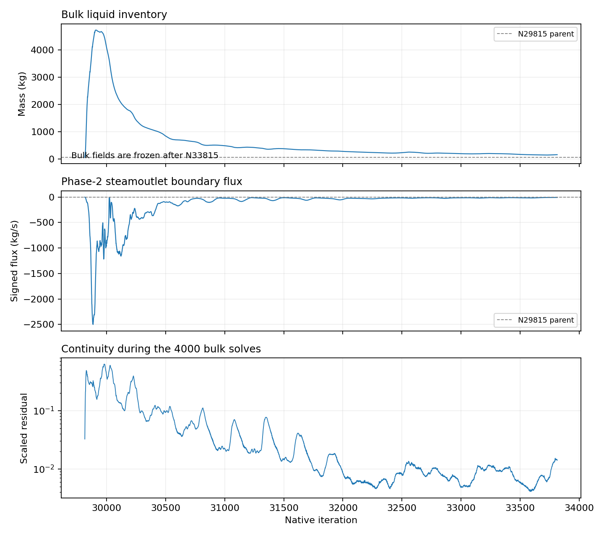
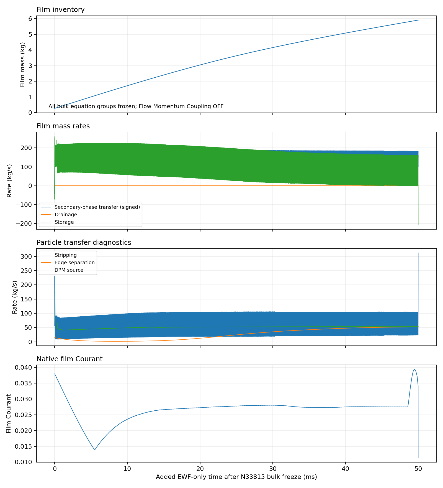

# Stage 4 — Flow Momentum Coupling OFF: completed 4000 bulk updates and 50 ms EWF-only

| Question / outcome | Evidence |
| --- | --- |
| Does the feedback-OFF route run? | Yes: requested horizon completed without the feedback-ON FPE |
| Controlled physical change | Flow Momentum Coupling OFF on active film wall wall; all other selected targets ON |
| Parent | Original verified selected-settings N29815; commercial-steel roughness; no initialization |
| Bulk horizon | N29815 → N33815: 4000 updates, including the human-requested extra 2000 |
| Bulk-active film time | +4 ms at fixed 1 microsecond step |
| Bulk freeze | All four equation groups OFF at N33815; saved/reopened; monitored bulk fields unchanged afterward |
| EWF-only horizon | N33815 → N37149: +50 ms; 3333 steps at 15 microseconds and one final 5.00000004 microsecond step |
| Final native film clock | 0.3231843386354754 s |
| Final prepared controls | 15 microseconds restored without further solves; feedback OFF; bulk frozen |
| Checkpoint verification | Every paired endpoint saved on Fluent host local disk; hashes and reopen checks passed |
| Scientific result | Numerically viable selected route; film still accumulating at 50 ms; no steady-film claim |

*Native history over 4000 bulk solves. Signed negative steamoutlet flux denotes outflow. The large initial inventory and outlet pulse remain visible; continuity still varies at the endpoint.*

| Metric | N29815 parent | N33815 bulk freeze | N37149 final |
| --- | ---: | ---: | ---: |
| Bulk liquid inventory (kg) | 61.7862 | 162.299 | 162.299 |
| Signed phase-2 steamoutlet boundary flux (kg/s) | -2.75358 | -9.11542 | -9.11542 |
| Film inventory (kg) | 6.78315 | 0.263809 | 5.90703 |
| Signed secondary-phase transfer (kg/s) | 92.3484 | -41.5256 | 102.142 |
| DPM film mass source (kg/s) | 0 | 174.475 | 54.4391 |

| Bulk interpretation | Result |
| --- | --- |
| Final continuity | 0.014127; peak 0.62337; 4000 native rows |
| Effect of the extra 2000 updates | Bulk inventory 316.614 → 162.299 kg; film inventory 0.173111 → 0.263809 kg |
| Frozen bulk rows | Final bulk inventory and boundary flux repeat by design; they are not a new bulk solution |
| Boundary flux definition | Native boundary-only report; compute snapshot also supplies a source-inclusive alias which is excluded from this comparison |
| Separation claim | Final outlet magnitude remains above the parent; inventory and unresolved bulk residuals prevent a benefit claim |

*50 ms EWF-only window after the N33815 bulk freeze. Native cumulative outflow, stripped and separated masses are differenced using accepted film time. Unsmooth signals retained. The final trimmed step coincides with a short storage/stripping pulse.*

| Approximately last 5 ms | Mean rate (kg/s) |
| --- | ---: |
| Signed secondary-phase transfer | 142.858 |
| DPM film mass source | 54.1077 |
| Film outflow | 0 |
| Stripping | 64.5627 |
| Edge separation | 51.8703 |
| Film storage | 80.8146 |

| Film interpretation / accounting | Result |
| --- | --- |
| Film growth in EWF-only stage | 0.263809 → 5.907035 kg; +5.643226 kg |
| Last approximately 5 ms inventory change | +0.404492 kg; not stationary |
| Final maximum film thickness | 1.37855 mm |
| Peak film Courant | 0.388683 in bulk-active stage; 0.0394037 in EWF-only stage |
| Native film outflow | Zero through this selected window; distinct from bulk collector removal and particle transfers |
| Signed secondary-phase report | Negative at 1063 sampled points; do not describe the full signal as pure positive accretion |
| Sampled film ledger: bulk active | Residual +0.406096 kg; absolute-source-normalized difference 6.46055% |
| Sampled film ledger: bulk frozen | Residual +0.00919404 kg; absolute-source-normalized difference 0.0927613% |
| Ledger definition | Δ(film + cumulative outflow + stripped + separated) − ∫(signed secondary-phase transfer + DPM film source) dt |
| Ledger limit | Sampled film diagnostic; not whole-system closure, escaped-particle mass accounting, or physical validation |
| Actual DPM tracking | 367 native tracking events; counts are not unique particles or escaped mass |
| Bulk/film momentum feedback | OFF; bulk-to-film shear remains enabled; film and particle mass transfers remain enabled |
| Global DPM continuous-phase interaction | Retained OFF; distinct from EWF DPM Coupling ON |
| Inner film convergence | Alternative implicit solver prints no inner residual rows; finite Courant and completion do not establish inner residual convergence |
| Settings qualification | No mesh, time-step, model-coefficient or physical-validation study performed |
| Feedback-ON comparison | Initial inherited-controls FPE at N29827; conservative route FPE at N29829; both preserved in [original results](../results.md) |
| Next action | Requested experiment complete; retain the verified endpoint and bounded result for the next selected Stage 4 contrast |

| Evidence owner | Record |
| --- | --- |
| Exact contract | [Setup](setup.md) |
| Runner / extension | [Feedback-OFF preparation](../../../../../../PyAnsys/scripts/setup/retry_phase72a_stage4_feedback_off.py); [Extra bulk updates and native reconciliation](../../../../../../PyAnsys/scripts/setup/extend_phase72a_stage4_feedback_off.py) |
| Final identity / readback | [Final manifest: local paths, hashes, flags and equations](../../../../../../PyAnsys/output/phase72a-stage4-realism/20261007/feedback-off/run-manifest.json) |
| Numerical / physical summaries | [Analysis summary](../../../../../../PyAnsys/output/phase72a-stage4-realism/20261007/feedback-off/analysis-summary.json); [Full 7335-point native history](../../../../../../PyAnsys/output/phase72a-stage4-realism/20261007/feedback-off/diagnostics.csv) |
| Immutable evidence | [Native transcripts, reports and readbacks](../../../../../../PyAnsys/output/phase72a-stage4-realism/20261007/feedback-off/raw/N37149) |
| Figure provenance | [Inputs and hashes](../../../../../../PyAnsys/output/phase72a-stage4-realism/20261007/feedback-off/figure-manifest.json); [Plot script](../../../../../../PyAnsys/scripts/analysis/analyze_phase72a_stage4_realism.py) |
| Native mass definitions | [Fluent 2025 R2 field definitions](https://ansyshelp.ansys.com/public/Views/Secured/corp/v252/en/flu_ug/flu_ug_fvdefs.html): outflow, stripped and separated mass are cumulative quantities |
