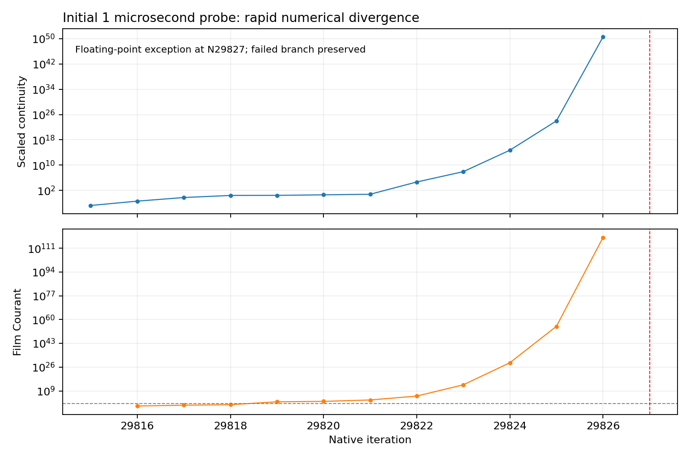

# Stage 4 — Selected EWF mechanisms: feedback-ON numerical failures

| Question / status | Answer |
| --- | --- |
| Selected settings | All user-selected targets enabled; native readback and paired save/reopen passed |
| Initial parent | Commercial-steel N29815; film clock 269.184338636 ms; no initialization |
| First solve | Requested 20-update instrumentation probe at 1 microsecond; Fluent stopped with FPE at N29827 |
| Numerical observation | Film Courant 15.32204 at the fourth film update; continuity rises rapidly; late fields diverge |
| Scientific result | The combined settings are numerically unstable under inherited controls; no isolated mechanism attribution |
| Recovery | Verified N29815 prepared pair restored; smaller film step and more conservative bulk controls applied and saved/reopened |
| Recovery solve | Reconciled on retry: FPE at N29829; original implicit residuals reach inf; not a valid continuation |
| Previous control block | Timed-out control requests resolved before retry; conservative-probe FPE recovered from native transcript |
| Bulk horizon | 2000 selected iterations not verified; failed restarted updates excluded |
| Film-only horizon | Additional 50 ms not run or verified; target 15 microseconds not tested |
| Current selected work | [Completed feedback-OFF retry](feedback-off/results.md); 4000 bulk updates, then +50 ms EWF-only; N37149 |

*Native transcript from the discarded 1 microsecond probe. The Courant trace excludes the final infinite value. Both panels show numerical failure, not useful physical response.*

| Target | Saved/reopened state |
| --- | --- |
| Pressure Gradient / Spreading Term / Surface Tension | ON / ON / ON |
| Flow Momentum Coupling on wall | ON |
| DPM Coupling / Particle Splashing | ON / ON |
| Edge Separation / Particle Stripping | ON / ON |
| Wall splash / Allow Boundary Separation | ON / ON |
| Phase Accretion | ON; native secondary-phase mode 1 |
| Solve Momentum / Momentum Equation | ON / ON |
| Gravity Force / Surface Shear Force | ON / ON |
| EWF Coupled Solution | ON |
| Surface-tension coefficient | Inherited 0.07194 N/m; not newly fitted |
| Separation thresholds | Native critical Weber number 0; critical angle 0.349066 rad; model 0; random separation off |
| Stripping coefficients | Critical shear 100 Pa; diameter coefficient 0.14; mass coefficient 0.5; beta 0.3; inherited |
| DPM prerequisite | Added water-liquid-at-psep-pcle; density 881.210876 kg/m3; viscosity 0.000145544 Pa·s; existing diagnostic feed unchanged |
| Global DPM interaction with continuous phase | Retained off; distinct from enabled EWF DPM Coupling |
| Mesh / feeds / collector / roughness | Parent retained; no new geometry or liquid loading |

| Numerical factor | Initial failed probe | Prepared recovery |
| --- | ---: | ---: |
| Fixed film step | 1 microsecond | 0.1 microsecond |
| Film solver | Inherited alternative implicit | Original implicit |
| Film subiterations | 30 | 100 |
| Bulk automatic pseudo-time scale | 1.0 | 0.01 |
| Explicit pressure / momentum relaxation | 0.5 / 0.5 | 0.1 / 0.1 |
| k / epsilon pseudo relaxation | 0.75 / 0.75 | 0.1 / 0.1 |
| Requested physical flags | All ON | All ON |
| Save/reopen | PASS | PASS |
| Solve result | FPE at N29827 | Reconciled FPE at N29829 |

| Evidence / provenance | Record |
| --- | --- |
| Executable recipe | [Runner](../../../../../PyAnsys/scripts/setup/run_phase72a_stage4_realism.py) |
| Parent preservation | [Pair and hashes](../../../../../PyAnsys/output/phase72a-stage4-realism/20261007/parent-pair.json) |
| Initial prepared proof | [Readback and reopen](../../../../../PyAnsys/output/phase72a-stage4-realism/20261007/prepared-reopen.json) |
| Failed source evidence | [Immutable first-attempt extraction](../../../../../PyAnsys/output/phase72a-stage4-realism/20261007/raw/failed-attempt1-N29827/extraction.json) |
| Recovery prepared proof | [State and run controls](../../../../../PyAnsys/output/phase72a-stage4-realism/20261007/recovery1-prepared.json) |
| Current machine status | [Run manifest](../../../../../PyAnsys/output/phase72a-stage4-realism/20261007/run-manifest.json) |
| Control block | [Bounded checks](../../../../../PyAnsys/output/phase72a-stage4-realism/20261007/control-block.json) |
| Local artifacts | [Run paths](../../../../../PyAnsys/output/phase72a-stage4-realism/20261007/run-paths.json) |
| Fluent configuration source | [v252 model options / Figure 30.1](https://ansyshelp.ansys.com/public/Views/Secured/corp/v252/en/flu_ug/flu_ug_ewf_sec_options.html); [wall options / Figure 30.9](https://ansyshelp.ansys.com/public/Views/Secured/corp/v252/en/flu_ug/flu_ug_ewf_sec_bound.html) |

| Next action | Requirement |
| --- | --- |
| Control recovery | Complete; native N29829 FPE reconciled and preserved before feedback-OFF restart |
| Retry source | Original selected-settings prepared N29815 pair; feedback OFF; original controls; no initialization |
| Current continuation | Human-selected feedback-OFF retry; retain all other selected physical settings |
| Requested horizon in selected retry | Complete in feedback-OFF child: 4000 verified bulk updates after human extension; then +50 ms EWF-only at 15 microseconds, with final trimmed step |
| Claim limit | No steady-film, bulk/film closure, physical realism, separation improvement or completed-horizon claim |
