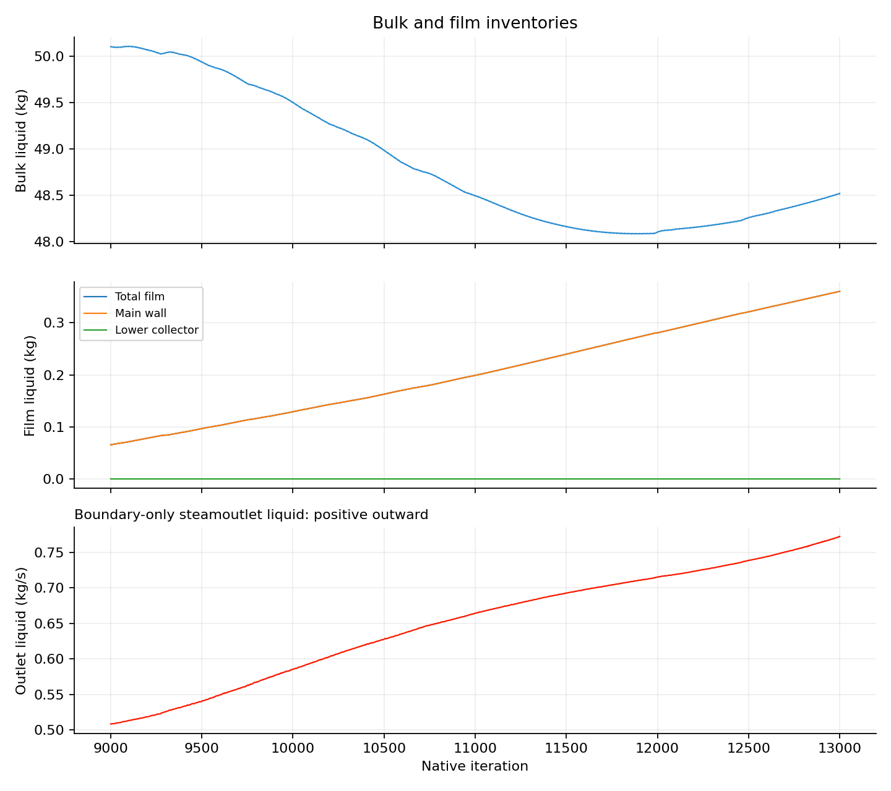
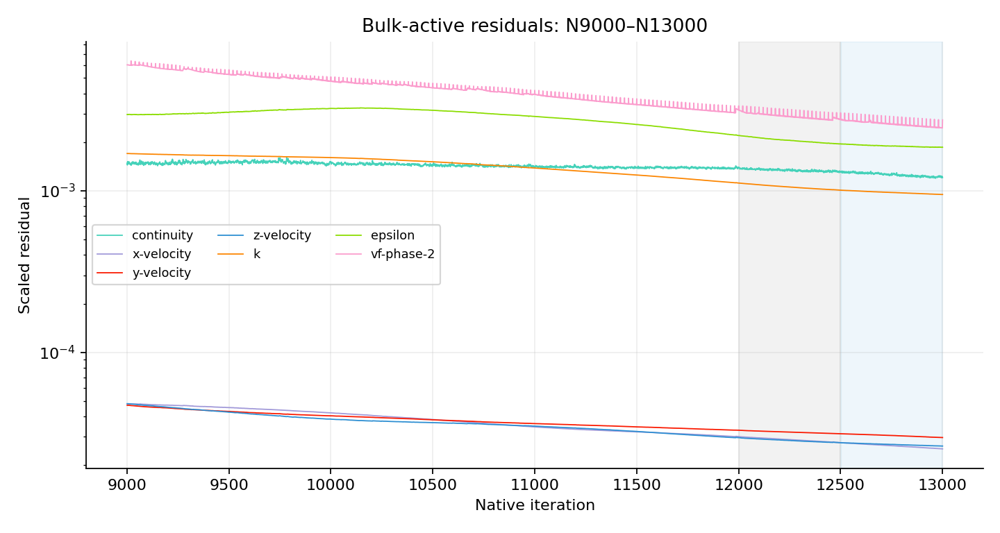
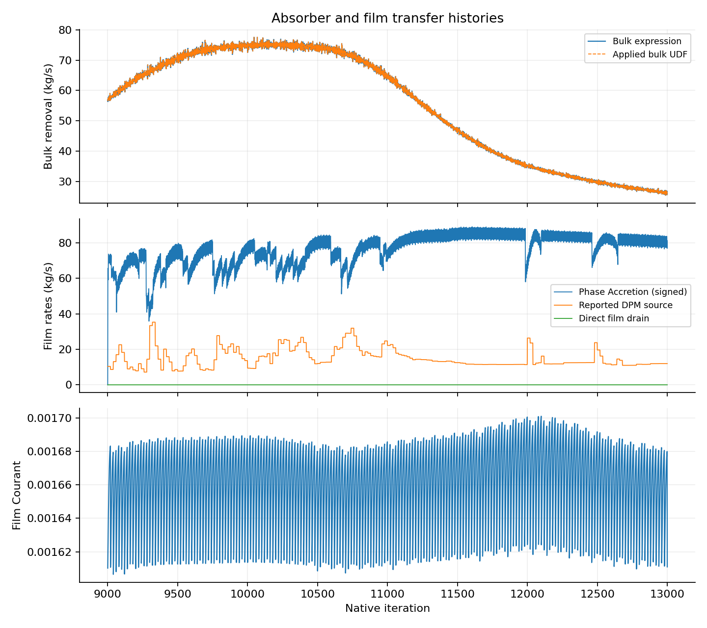

# N9000 → N13000 — bulk still changes

| Question / answer | Evidence |
| --- | --- |
| Freeze bulk now? | **No. Keep bulk active.** Collector/removal and outlet flux still trend over the final 500 iterations |
| Execution | Complete: 4,000 bulk updates and 4,000 accepted 1 µs film steps; +4 ms film time |
| Final native state | N13000; film clock 0.005642000000000347 s |
| Restart evidence | Final case/data hashed; data reopened; persistent fields and controls matched; full case reload omitted to avoid known GUI dialogs |
| Autosaves | N10000, N11000, N12000 and N13000; all four case/data pairs present and hashed |
| Selected shared pair | Phase72A / `stage4-replacement-20261008/final-N13000.cas.h5` and `.dat.h5`; Server 1 shared copies hash-matched |
| Numerical result | Finite reports, complete native histories, no fatal solver event; Courant and thickness guards passed |
| Interpretation | Bulk has not reached a stationary response; film continues to fill |

| Quantity | N9000 | N13000 | Change over final 500 iterations | Mean change: final 500 versus preceding 500 |
| --- | ---: | ---: | ---: | ---: |
| Total bulk liquid, kg | 50.0993 | 48.5188 | +0.5395% | +0.4414% |
| Lower bulk liquid, kg | 0.000564834 | 0.000265753 | −11.4089% | −13.6686% |
| Bulk contact removal, kg/s | 56.4834 | 26.5753 | −11.4089% | −13.6686% |
| Actual outlet liquid, kg/s outward | 0.508329 | 0.772391 | +4.5738% | +3.8871% |
| Total film liquid, kg | 0.0655343 | 0.360477 | +12.2261% | +13.1888% |
| Direct film drain, kg/s | 0.0000104004 | 0.00561559 | +12.8566% | +16.3683% |

Native complete histories, N9000–N13000. Bulk liquid falls and then rises; outlet liquid increases throughout. Main-wall and total-film curves overlap because lower-film storage remains small.

All 4,000 native bulk residual rows. Grey and blue bands mark N12001–N12500 and N12501–N13000. Lower residuals do not establish a stationary bulk inventory or outlet.

Applied bulk UDF removal matches the independent expression at every reported update. Phase Accretion is signed; the initial instantaneous rate resets on parent data reopening, so its N9000 point is not an inherited physical rate.

| Numerical / source check | Result |
| --- | ---: |
| Continuity residual at N13000 | 1.2068 × 10⁻³ |
| Phase-2 VF residual at N13000 | 2.7429 × 10⁻³ |
| k / ε residual at N13000 | 9.4739 × 10⁻⁴ / 1.8582 × 10⁻³ |
| Peak film Courant | 0.00170111 |
| Peak film thickness | 0.100947 mm |
| Peak reported film speed | 90.1071 m/s |
| Film inventory increase | 0.294943 kg |
| Integrated direct film removal | 8.24588 × 10⁻⁶ kg |
| Integrated reported Phase Accretion | 0.305193 kg |
| Integrated reported DPM source | 0.0601768 kg |
| Original reported-rate film ledger residual | +0.00148603 kg; 0.406720% |
| DPM tracking events | 200 |
| Achieved inner residual rows | 0 |
| Bulk absorber versus expression discrepancy | 0 kg/s |

| Limitation / next action | Effect |
| --- | --- |
| Short accepted film time | +4 ms does not establish a steady film |
| Direct drain removes only 8.25 mg here | Functional frozen-bulk proof remains valid; this hold does not establish useful drainage performance |
| Missing DPM event-mass accounting and achieved inner residuals | No film-accuracy or whole-system closure qualification |
| Increasing reported film speed | Retain speed monitoring; small Courant alone does not validate the film transport |
| Selected continuation | Another fixed 4,000-iteration bulk-active hold, N13000 → N17000, with the same conservative controls and paired 1,000-iteration autosaves |
| Native evidence | [Block manifest](../../../../../../PyAnsys/output/phase72a-stage4-replacement/20261008/bulk-N9000-N13000/run-manifest.json), [analysis](../../../../../../PyAnsys/output/phase72a-stage4-replacement/20261008/bulk-N9000-N13000/analysis-summary.json), [paired-file verification](../../../../../../PyAnsys/output/phase72a-stage4-replacement/20261008/bulk-N9000-N13000/artifact-verification.json) |
| Frozen-bulk drain compatibility | [Original source proof](../results.md) remains applicable; retained setup and source hooks matched on endpoint readback |
