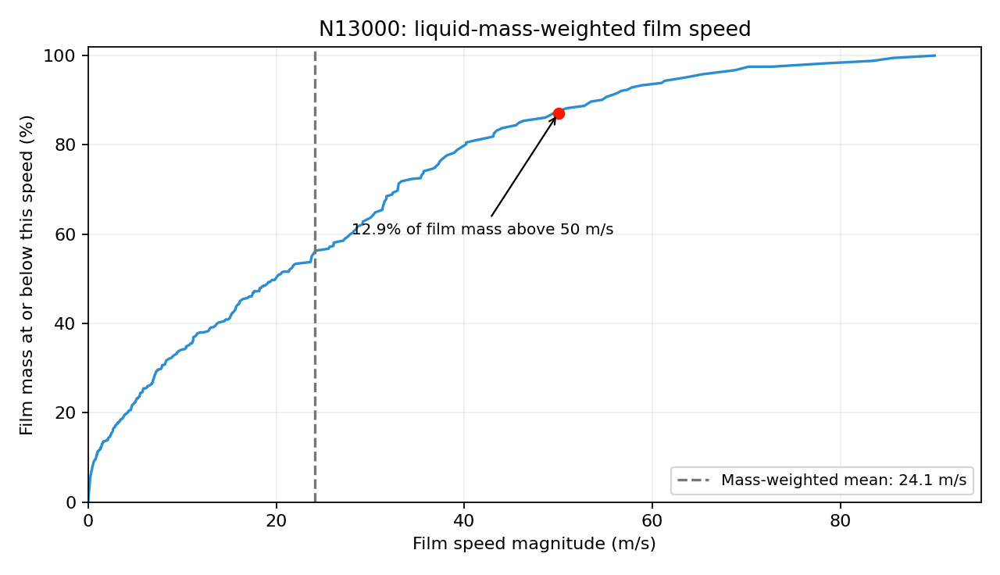

# Film-speed review — diagnostic priority

| Item | Evidence / decision |
| --- | --- |
| Human concern | Film speed seems too high; check wall resistance and surface tension before adding transport force |
| Current fixed-input run | N13000 → N17000 native hold; retain inputs and finish its horizon |
| Latest completed speed evidence | N9000 → N13000 peak reported film speed 90.1071 m/s; maximum over both film walls, not a mass-weighted average |
| Current film material | `water-liquid-at-psep`; density 881.210876 kg/m³, viscosity 0.000145544 Pa·s |
| Wall-viscous term | ON in endpoint and continuation readback |
| Driving terms | Gravity, aerodynamic shear, pressure gradient, spreading and momentum advection ON; DPM and Phase Accretion transfer mass/momentum |
| Surface tension | ON, 0.07194 N/m; curvature smoothing OFF |
| Roughness | Bulk-wall turbulence height 0.045 mm on both film walls; this does not establish extra direct EWF wall resistance |
| Coupling | Full film momentum, film Coupled Solution ON; film-motion feedback to bulk OFF |
| Material consistency checked | All six named feed injections use `water-liquid-at-psep-pcle`; its density, viscosity and surface tension match current film values; other stored particle materials are not these injection materials |
| Property question | 0.07194 N/m is close to 25°C pure-water surface tension; verify intended film temperature/composition before replacing it; energy is not solved |
| Endpoint field verification | Offline N13000 case/data SHA-256 match; reconstructed film mass and maximum speed match native reports |
| Mass-weighted speed | Mean 24.1221 m/s; median 19.9073; 90th percentile 54.3695; 95th 63.2147; 99th 84.0416 m/s |
| High-speed liquid | 12.9172% of film mass above 50 m/s; 1.7611% above 80 m/s |
| Fastest face | Face 4546: 90.0471 m/s; thickness 71.3564 µm; film mass 1.9254 g; global XYZ velocity (−10.4497, −27.6411, 85.0603) m/s |
| Interpretation | High speeds involve substantial film mass; the maximum is not only an almost dry-face value. Physical credibility still needs the driving/resisting force balance |
| Current decision | Human selected [staged bulk/EWF development planning](../staged-finalisation/setup.md), first screen 50 ms and per-mesh timestep checks. Retain velocity evidence/monitoring; no added downward-force campaign selected. Coarse-mesh causation remains unproven. |

| Required endpoint diagnostic | Purpose |
| --- | --- |
| Film mass-weighted mean and weighted velocity percentiles | N13000 completed offline; repeat on N17000 to judge persistence |
| Position, film thickness and film mass at fastest faces | N13000 maximum thickness/mass checked; inspect neighbouring source and pressure gradients next |
| Signed velocity along gravity and tangential/swirl components | Determine whether high speed contributes to transport into the collector |
| Nearby gas/secondary-phase velocity and wall shear | Check aerodynamic and accretion momentum forcing |
| Pressure and film-height/curvature gradients | Identify other plausible accelerating terms |
| Achieved EWF inner residuals | Establish whether film momentum is converged at each step; current transcript lacks these rows |
| Matched single-change diagnostic, if needed | Change only a suspected mechanism in a preserved child; compare speed, liquid mass, drain rate and ledger |

One saved N13000 endpoint; weights are local film mass reconstructed from native thickness, verified density and mesh face area. Mass and maximum speed match native reports.

| Source | Role |
| --- | --- |
| [Offline field analysis](../../../../../PyAnsys/output/phase72a-stage4-replacement/20261008/film-speed-N13000/summary.json) | Paired source hashes, fields, face ranges, mass weights, velocity distributions and native checks |
| [Analysis implementation](../../../../../PyAnsys/scripts/analysis/analyze_phase72a_stage4_film_speed.py) | Reproducible offline HDF5 extraction; no Fluent query |
| [Continuation settings](../../../../../PyAnsys/output/phase72a-stage4-replacement/20261008/bulk-N13000-N17000/run-manifest.json) | Case-specific material and control readback |
| [Completed hold](bulk-hold-4000/results.md) | Native speed, film mass and numerical limits |
| [Fluent 2025 R2 film momentum equation](https://ansyshelp.ansys.com/public/Views/Secured/corp/v252/en/flu_th/flu_th_ewf_sec_eqns.html) | Wall/gas viscous shear and curvature/pressure forces |
| [Fluent film submodels](https://ansyshelp.ansys.com/public/Views/Secured/corp/v252/en/flu_th/flu_th_ewf_sec_film_submodels.html) | Accretion and DPM momentum transfer |
| [IAPWS surface tension](https://iapws.org/technical-guidance/release/Surf-H2O.download) | Pure-water temperature dependence; actual film temperature/composition still required |
| [Earlier property review](../setting-sensitivity/research.md) | Existing hot-liquid surface-tension question; old-case pressure is not a verified replacement-case input |
