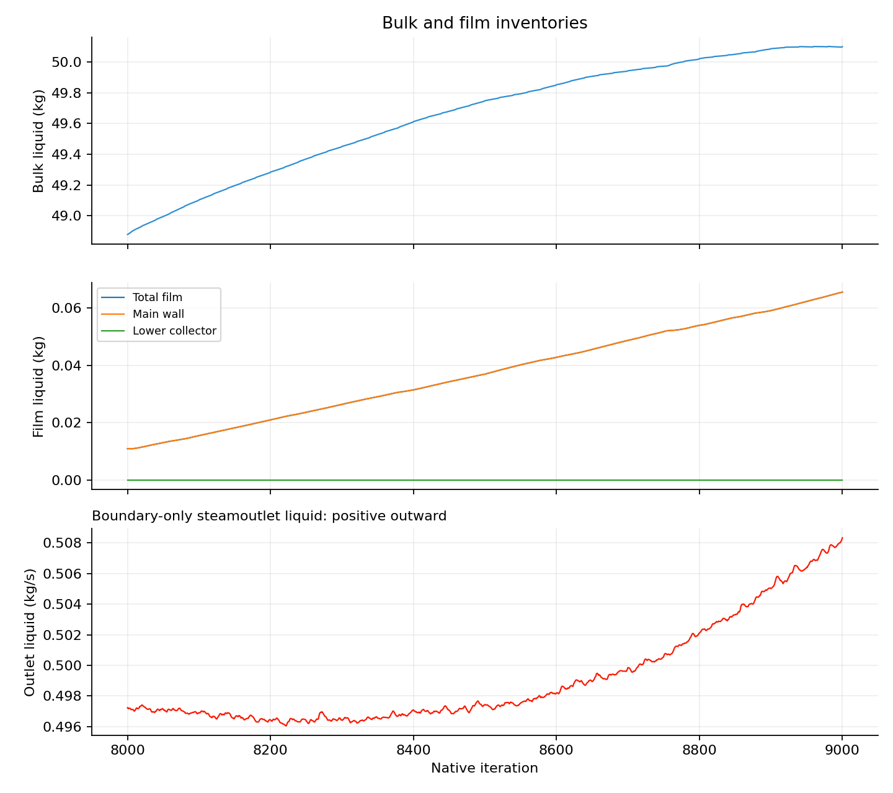
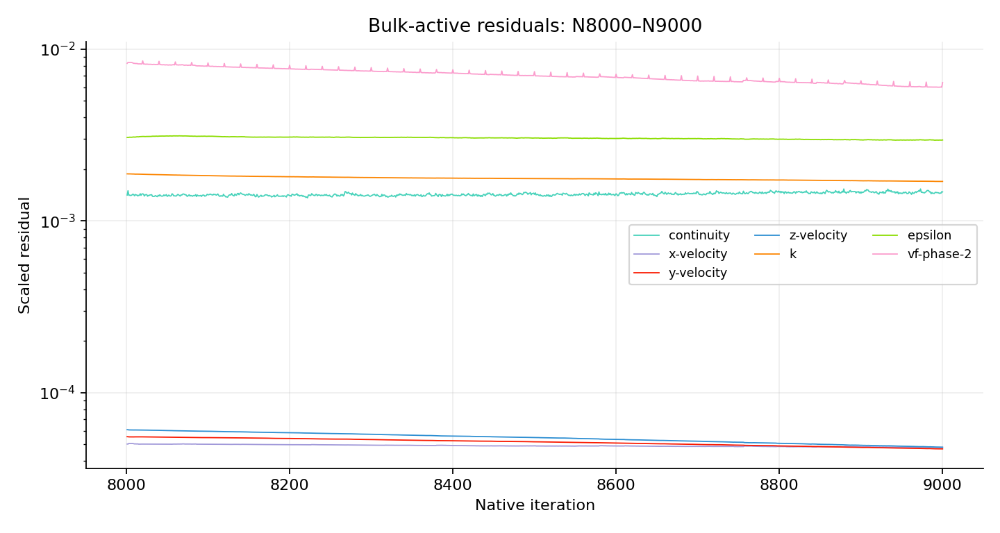
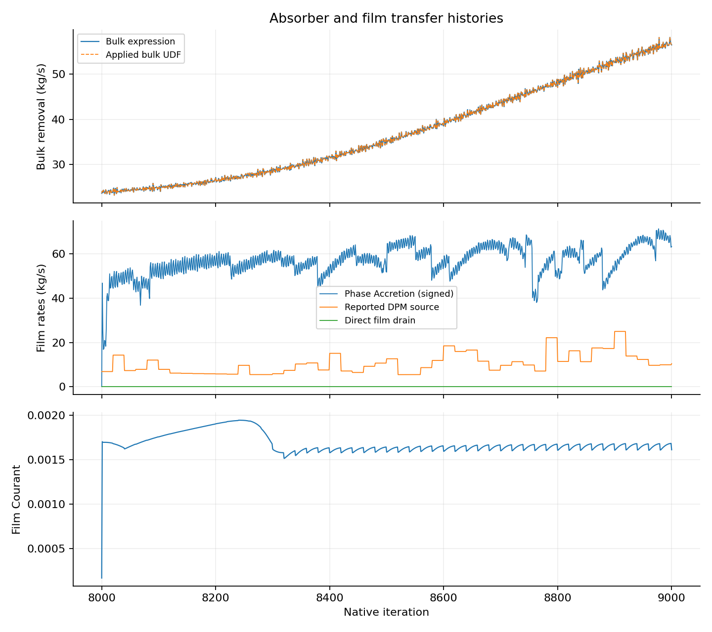

# Stage 4 — Supplied N8000 parent: bulk response and frozen-bulk drain proof

| Decision | Evidence / action |
| --- | --- |
| Requested test | Complete: one native N8000 → N9000 command; 1,000 bulk iterations and 1,000 accepted film steps; +1 ms film time |
| Bulk-freeze decision | Keep bulk active. Recommend another fixed 1,000-iteration hold at the same inputs before reconsidering freeze. No further solve submitted. |
| Strongest late trend | Lower bulk collector inventory and contact removal increased 15.79% over the last 200 iterations; adjacent 200-iteration mean increased 20.59% |
| Other late trends | Bulk total liquid +0.1549%; steamoutlet outward liquid +1.2284%; film liquid +21.40% over the last 200 iterations |
| Interpretation | Total bulk liquid begins to flatten near the end, but the collector and outlet still change. These data do not support a steady-bulk qualification or a bulk freeze yet. |
| Current endpoint | Native N9000; film clock 0.001641999999999884 s; solver idle; all bulk equations active; EWF and Phase Accretion ON |
| Numerical qualification | Courant and thickness guards passed; all stored inventory reports finite and nonnegative. Short film development only. |
| Preserved lineage | Original Phase72A N8000 pair and previous N48483 endpoint retained. Supplied parent uses the same 60,964-cell mesh; no mesh replacement was performed. |

| Quantity | N8000 | N9000 | Response |
| --- | ---: | ---: | --- |
| Bulk liquid inventory | 48.878516 kg | 50.099303 kg | +1.220787 kg / +2.4976% |
| Lower bulk collector inventory | 0.236035 g | 0.564834 g | +139.30%; continued late rise |
| Bulk contact removal | 23.603464 kg/s | 56.483359 kg/s | Applied UDF and independent expression agree at every recorded iteration |
| Steamoutlet liquid, positive outward | 0.497236 kg/s | 0.508329 kg/s | +2.2309%; boundary flux only |
| Total EWF liquid | 10.956452 g | 65.534315 g | +54.577863 g; continued storage |
| Lower EWF liquid | 0 | 15.6006 µg | Nearly all film mass is on the main wall |
| Direct film removal during run | — | 6.18515 µg integrated | Positive but negligible at this early film time |
| Film Courant maximum | — | 0.001942467 | Below guard 1 |
| Film thickness maximum | — | 0.0642917 mm | Below guard 300 mm |
| Reported film-speed maximum | — | 48.7072 m/s | No physical velocity validation |

| Scaled residual | First run row | Final run row | Interpretation |
| --- | ---: | ---: | --- |
| Continuity | 1.4147 × 10⁻³ | 1.4758 × 10⁻³ | Bounded; not decreasing |
| X velocity | 5.0173 × 10⁻⁵ | 4.7971 × 10⁻⁵ | Slow decrease |
| Y velocity | 5.5362 × 10⁻⁵ | 4.7006 × 10⁻⁵ | Slow decrease |
| Z velocity | 6.0796 × 10⁻⁵ | 4.8079 × 10⁻⁵ | Slow decrease |
| k | 1.8796 × 10⁻³ | 1.6987 × 10⁻³ | Still changes |
| ε | 3.0624 × 10⁻³ | 2.9601 × 10⁻³ | Still changes |
| Phase-2 volume fraction | 8.2787 × 10⁻³ | 6.3993 × 10⁻³ | Still decreases; periodic peaks |

| Absorber compatibility check | Result / limit |
| --- | --- |
| Existing bulk contact absorber | Original phase-2 10 µs contact UDF and matching momentum sinks retained; no vapor mass sink |
| Bulk absorber with frozen bulk | Its evaluated rate can remain nonzero, but stored bulk inventory does not advance. It cannot provide direct EWF drainage. |
| Added film absorber | Thickness-proportional mass sink and matching XYZ momentum sinks on `wall:004`; capture time 1.5 ms; independent of inlet throughput command |
| Source refresh | Every bulk iteration; conservative 10 µs refresh span; 0.0066667 maximum declared-span fraction, below 1% |
| Source-off fixture | 100 × 1 µs, bulk frozen; 0.050375202 kg film inventory stayed constant to roundoff |
| Source-on fixture | Same initial film and forcing; 0.050375202 → 0.047125306 kg; 0.003249896 kg removed; largest stepwise source-integral relative error 3.96 × 10⁻⁹ |
| Production frozen-bulk smoke | All production film effects ON; 20 × 1 µs; bulk held; positive direct removal; peak Courant 0.001699438; reported-rate film ledger difference 1.4293%, below declared 5% functional limit |
| Diagnostic accounting | 200 fixture updates + 20 production smoke updates; original prepared N8000 fields and clock restored before requested bulk run |
| Frozen-bulk source assumption | Phase Accretion and DPM act under the held bulk state. This is film development with fixed bulk supply, not whole-system mass closure. |

| Film ledger — requested 1,000-iteration run | Value / limit |
| --- | --- |
| Integrated reported Phase Accretion source | 0.056834061 kg |
| Integrated reported DPM source | 0.010413290 kg |
| Film storage increase | 0.054577863 kg |
| Stripped-film cumulative increase | 0.013182895 kg |
| Separated-film cumulative increase | 0.000048111 kg |
| Native film-outflow increase | 0 kg; direct user source excluded from this native cumulative field |
| Direct film sink integral | 0.000000006185 kg |
| Reported-rate ledger residual | +0.000561524 kg; 0.835013% of integrated reported sources |
| Remaining evidence gaps | DPM event-mass accounting unresolved; 50 native DPM tracking events observed. Alternative implicit solver did not print achieved inner residuals. |
| Claim limit | No steady film, drainage benefit, carryover benefit, physical validation, whole-system closure or mesh-convergence claim |

| Execution / readback check | Verified result |
| --- | --- |
| Physics and walls | Full film momentum and retained force terms, collection/splashing, stripping and separation ON; Flow Momentum Coupling OFF; main wall plus lower `wall:004`; bottom excluded; original roughness retained |
| Film numerics | 1 µs, alternative implicit/coupled solver, 30 inner iterations / 10⁻⁵, DPM every 20 updates, 0.3 m film limit |
| Detached solve | Fluent-owned journal; single `/solve/iterate 1000`; remote local transcript, residual export and final paired files |
| Live observation | Passive transcript service was silent; passive monitor stream confirmed numerical progress. No Scheme status query issued during native solve. |
| File verification | Both final files SHA-256 verified; saved data reopened at N9000; controls, inventories and persistent report values match |
| Case readback limit | Prepared child had paired case/data reopen verification. Final case was saved and hash-verified; final data was reopened. Full final-case reload omitted to avoid the observed GUI file-load pauses. |
| Volatile source field | Instantaneous Phase Accretion report resets to zero on data read. Source accounting uses the original native histories, not a cold reopened rate. EWF / Accretion settings remain ON. |
| Code recovery | Repeated fixture case loads removed; unique retry paths; reallocate production film effects before restoring saved data; preserve accepted native film clocks |
| Outlet definition | N9000 source-inclusive API value −56.991688 kg/s = user source −56.483359 plus boundary −0.508329 kg/s. Only the boundary component is outlet flow. |

| Owning record | Link |
| --- | --- |
| Test contract | [Setup](setup.md) |
| Exact paths, hashes and current machine state | [Run manifest](../../../../../PyAnsys/output/phase72a-stage4-replacement/20261008/run-manifest.json) |
| Drain proof | [Functional evidence](../../../../../PyAnsys/output/phase72a-stage4-replacement/20261008/drain-proof.json) |
| Native checkpoint and report definitions | [Block manifest](../../../../../PyAnsys/output/phase72a-stage4-replacement/20261008/bulk-N8000-N9000/run-manifest.json) |
| Metrics and source hashes | [Analysis summary](../../../../../PyAnsys/output/phase72a-stage4-replacement/20261008/bulk-N8000-N9000/analysis-summary.json) |
| Full native history | [Transcript](../../../../../PyAnsys/output/phase72a-stage4-replacement/20261008/bulk-N8000-N9000/native-run.trn) |
