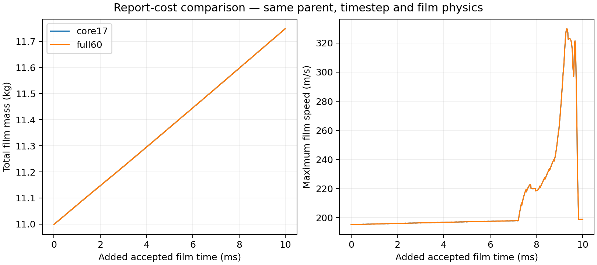

# Stage 4 — Native report-cost screen

| Decision | Current state |
| --- | --- |
| Status | COMPLETE: both 1,000-update arms accepted; paired endpoints hash/reopen verified; 17-report setup selected for continuation |
| Question / setup | [Can report cost be reduced without changing film development?](setup.md) |
| Parent | Exact saved full-momentum N41503; completed N43483 control remains preserved |
| Common restart state | Native elapsed injection span 40→10 µs after prepared save/reopen; all other film-state values and model parameters unchanged. Require 10 µs prepared span in full60 arm. |
| Required evidence | 1,000 accepted updates per arm; common native film histories; matching endpoint fields; bulk/model/source readbacks; whole-command and parallel timing |
| Qualification boundary | Existing 20 ms control has 1.59% reported-rate discrepancy and positive storage; report optimization alone cannot qualify physical accuracy or steady film |

| Arm / accepted film time | Whole-command solve time | Peak Courant | Peak thickness | Film gain | Direct drain | Reported-rate balance error |
| --- | ---: | ---: | ---: | ---: | ---: | ---: |
| Core17 / +10 ms | 410.207 s / 6.84 min | 0.03268 | 1.971 mm | 0.750855 kg | 0.371918 kg | 1.6721% |
| Full60 / +10 ms | 581.985 s / 9.70 min | 0.03268 | 1.971 mm | 0.750855 kg | 0.371918 kg | 1.6721% |

| Evidence / interpretation | Finding |
| --- | --- |
| Restart and endpoint | N41503 → N42503; 1,000 printed and accepted film updates; native time advanced by 10 ms; pair and 19 source files hash checked |
| Invariants | Bulk reports and film parameters unchanged before/after core17; continuous bulk histories intentionally absent |
| Balance | The original reported-rate ledger remains unqualified against 1%; no DPM normalization correction applied |
| Storage | 75.09 kg/s mean positive storage; no steady-film claim |
| Performance decision | PASS: 29.5159% lower whole-command solve time / 1.41876× advancement; 17 shared histories and all geometry-matched film arrays exactly equal. Adopt 17 reports at frequency 1 for further frozen-bulk film development. |
| Machine owner | [Comparison summary](../../../../../PyAnsys/output/phase72a-stage4-report-cost/20261008/comparison-summary.json); arm manifests own restart paths and hashes |

Same N41503 parent, +10 ms accepted film time, 10 µs and film physics. The two curves overlap. [Source windows, hashes and units](figures/report-cost-agreement.provenance.json).

| Decision / limit | Meaning |
| --- | --- |
| Selected diagnostics | Retain 17 essential reports at every update; read bulk before/after frozen-bulk solves. Restore required continuous bulk reports during any bulk refresh |
| Tested agreement | All common native histories and all mass/thickness/XYZ velocity arrays have zero maximum difference after matching face centres |
| Performance window | One matched pair on this mesh/session; timing excludes native save, reopen and evidence retrieval; do not assume the same percentage on a new mesh |
| Scientific qualification | Original ledger discrepancy 1.6721%; positive film storage; achieved inner residuals absent. Reporting gain does not qualify film physics or steady state |
| Completed diagnostic / continuation | [DPM cadence contrast](../dpm-cadence/results.md) retained the original 20-step cadence. [Native +50 ms continuation](../core-development/results.md) now submitted using 17 reports and unchanged 10 µs step. |

| Cost evidence | Measured / limit |
| --- | --- |
| Reduced-report whole command | 410.207 s; this owns the reported advancement cost |
| Reduced-report parallel timer | 101.681 s total; 51.982 s DPM; displayed 51.1% DPM share applies to this timer, not the whole command |
| DPM share of whole command | 12.67%; reducing DPM cost alone cannot remove the remaining 87.33% |
| Unassigned time | Difference between parallel and whole-command timing is not attributed entirely to reports or film momentum |
| Diagnostic stream opportunity | Six inlet feeds total 6 × 10⁻²⁰ kg/s. A future preserved-child contrast could reduce diagnostic streams while retaining physical stripped/separated particles; test field/source agreement before use |
