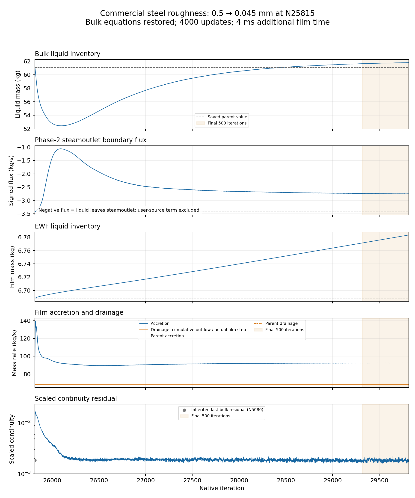

# Stage 4 — Results

| Evidence | Observation | Limit |
| --- | --- | --- |
| [Long native EWF development](ewf-only-drain/long-development/results.md) | Native +3 s / 200,000-update continuation started from drain-ON N41483; submission client exited | Completion and stationarity pending verification |
| [Direct EWF drain N40483–N41483](ewf-only-drain/results.md) | Native source proof and matched 15 ms screens passed; direct sink removed 0.508790 kg; lower film 70.32% lower; bulk frozen | Total film still grows; assumed 1.5 ms capture time; no whole-separator closure |
| [Feedback-OFF N29815–N37149](realism-continuation/feedback-off/results.md) | 4000 bulk updates; then +50 ms EWF-only; final film mass 5.907 kg | Film grew about 0.40 kg in last 5 ms; bulk continuity 0.0141; no steady-film or benefit claim |
| [Commercial steel N25815–N29815](commercial-steel/results.md) | Outlet-flux magnitude falls 19.72%; bulk inventory rises 1.20%; EWF inventory rises 1.42% | Roughness, bulk advancement and film timestep changed together |
| Final-500 film rates | Accretion 92.329 kg/s; drainage 68.247 kg/s; storage 24.087 kg/s | Film still fills; no steady-film claim |
| Final-500 continuity | Mean 1.846e-3 | Near inherited parent scale; no full-convergence claim |
| Added film time | 4 ms over 4000 updates | Short response window |
| Next low-feed startup | Planned method only | No selected EWF/wall configuration or executed startup yet |

*Recorded as the first Stage 4 result at the human's request. It continues Stage 3 N25815 fields; it did not replay the low-feed startup.*

| Owner / next decision | Record |
| --- | --- |
| Exact result, definitions and figures | [Commercial-steel result](commercial-steel/results.md) |
| Next startup method | [Stage 4 setup](setup.md) |
| Scientific direction | [Phase context](../CONTEXT.md) |
