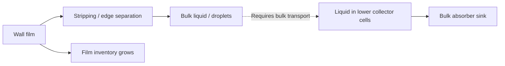

# Stage 4 — Film drainage audit and 0.3 m limit

| Current decision | Evidence / rule |
| --- | --- |
| Human authority | 7 October 2026: set wall-film limit to 0.3; classify a run that reaches the limit as unrealistic |
| Units | Native film thickness uses metres: 0.3 m = 300 mm |
| Exact parent | Saved/reopened stripping-ON control, N40483; native film clock 0.3731843386354754 s |
| Declared change | `thickness-limit`: 1.0 → 0.3 m |
| Native readback / paired reopen | **PASS**; all other native film parameters, bulk settings, persisted fields and film clock unchanged |
| Current maximum thickness | 0.001542619 m = 1.542619 mm; limit not reached |
| Current pair on Fluent local disk | `C:\Users\syok443\Documents\FluentRuns\Phase72A\Stage4\film-limit-20261007\limit03-N40483.cas.h5` and matching `.dat.h5` |
| Solver updates for this change | Zero; no initialization |
| Retained settings | Bulk equations frozen; target step 15 microseconds; Flow Momentum Coupling OFF; stripping / edge separation / EWF Coupled Solution ON |
| Run rule | Any recorded native maximum thickness ≥0.3 m → **UNREALISTIC**; a later decrease does not clear the classification |
| Check scope | All native thickness samples in each large batch; preserve paired endpoint and stop before a further batch |
| Cap behaviour | Fluent removes film material where its Maximum Thickness is exceeded; this is a numerical limit, not a physical drain |
| Physical claim | A run below the limit still needs film, bulk and conservation checks; no physical validation follows from this guard |

| Absorber / film route | Verified configuration or observation |
| --- | --- |
| Bulk absorber | `contact_mass_10us::libcontactv2`, phase-2 mass sink in `p71a-v2-virtual-outlet` |
| Absorber source scope | Cell liquid density and volume fraction; no direct wall-film mass source |
| Active film surface | `wall` |
| Lower collector film surfaces | `wall:004` and `bottom`: EWF disabled |
| Direct EWF sink at absorber | **Not configured** |
| Indirect route | Stripping / edge separation return film mass to particles or the bulk secondary phase; subsequent transport could bring liquid to the bulk absorber |
| Frozen-bulk restriction | This EWF-only interval does not advance bulk transport or demonstrate new absorber removal |
| Bulk absorber report | 89.662925 kg/s at the held bulk state; a source-rate report, not integrated new removal during frozen-bulk film advancement |

| Accepted control account, N37149 → N40483 / +50 ms | Mass (kg) |
| --- | ---: |
| Film inventory, start → end | 5.907034813 → 9.752614046 |
| Net film storage | +3.845579233 |
| Integrated secondary-phase source | 6.989228187 |
| Integrated DPM source | 2.851988295 |
| New cumulative stripping | 3.322097316 |
| New cumulative edge separation | 2.714792260 |
| New wall-scope film outflow | 0 |

| Last 500 nominal updates, N39983 → N40482 / 7.5 ms | Mean rate (kg/s) |
| --- | ---: |
| Secondary phase → film | +138.80410 |
| DPM → film | +58.03542 |
| Film → stripping | 67.02876 |
| Film → edge separation | 55.19786 |
| Film outflow | 0 |
| Net storage from native inventory differences | +75.76062 |

*Rates and source integrals are native film-account diagnostics. Collection and re-entrainment can recycle mass; these are not independent external separator feeds. Sampled full-horizon film-ledger gap: 0.4192%; whole-separator closure is not established.*

| Historical sensitivity branch | Peak thickness (m) | Assessment under new 0.3 m rule |
| --- | ---: | --- |
| Accepted stripping-ON control | 0.001866235 | Limit not reached; film still filling |
| Stripping OFF | 0.003287518 | Limit not reached; Courant screen failed |
| EWF Coupled Solution OFF, stripping ON | 0.001442386 | Limit not reached; source cycle remains |
| Surface Tension OFF after stripping OFF | 1 | **UNREALISTIC** |
| Spreading OFF after stripping OFF | 1 | **UNREALISTIC** |
| EWF Coupled Solution OFF after stripping OFF | 0.003861615 | Limit not reached; Courant screen failed |
| Curvature Smoothing ON after stripping OFF | 1 | **UNREALISTIC** |

*This table applies the new criterion to existing immutable histories. Those historical trials used a 1 m native cap; no trial was rerun with the 0.3 m cap.*

| Evidence / implementation | Owner |
| --- | --- |
| Configuration and local pair identity | [New configuration receipt](../../../../../PyAnsys/output/phase72a-stage4-film-limit/20261007/run-manifest.json) |
| Saved/reopened state | [Reopened native readback](../../../../../PyAnsys/output/phase72a-stage4-film-limit/20261007/reopened.json) |
| Verification | [PASS: native parameter change, unchanged solution, guard checks and immutable-source hashes](../../../../../PyAnsys/output/phase72a-stage4-film-limit/20261007/verification.json) |
| Drainage account and retrospective classifications | [Native-evidence assessment](../../../../../PyAnsys/output/phase72a-stage4-film-limit/20261007/drainage-and-thickness-assessment.json) |
| Executable configuration | [Configure film limit](../../../../../PyAnsys/scripts/setup/configure_phase72a_stage4_film_limit.py) |
| Batch guard | [Stage 4 runner](../../../../../PyAnsys/scripts/setup/run_phase72a_stage4_realism.py); [whole-history classifier](../../../../../PyAnsys/src/pyansys_fluent/film_thickness_guard.py) |
| Native bulk source implementation | [Contact absorber source](../../../../../PyAnsys/src/pyansys_fluent/contact_absorber.c) |
| Historical run evidence | [Setting sensitivity results](results.md) |
| Fluent 2025 R2 cap definition | [EWF solution controls](https://ansyshelp.ansys.com/public/Views/Secured/corp/v252/en/flu_ug/flu_ug_ewf_sec_eqns.html) |
| Fluent 2025 R2 removal / phase-transfer definitions | [Film submodels](https://ansyshelp.ansys.com/public/Views/Secured/corp/v252/en/flu_th/flu_th_ewf_sec_film_submodels.html) |
