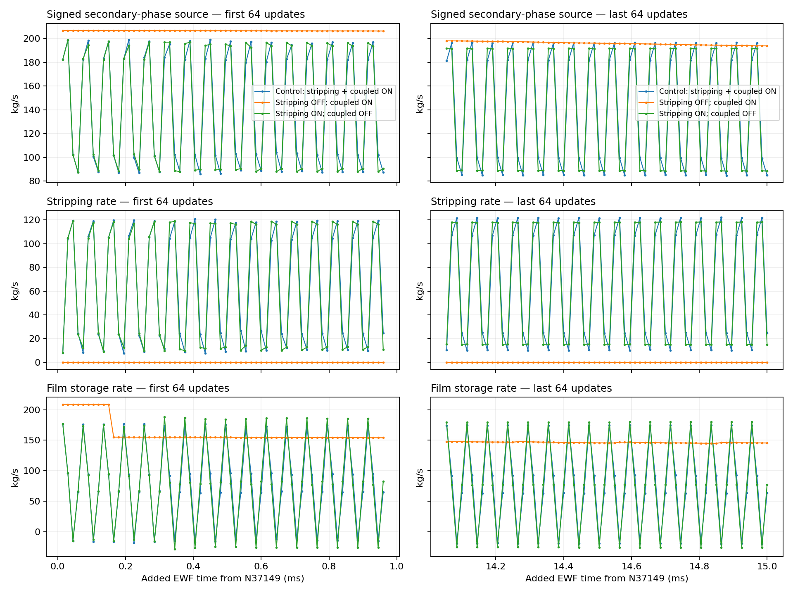
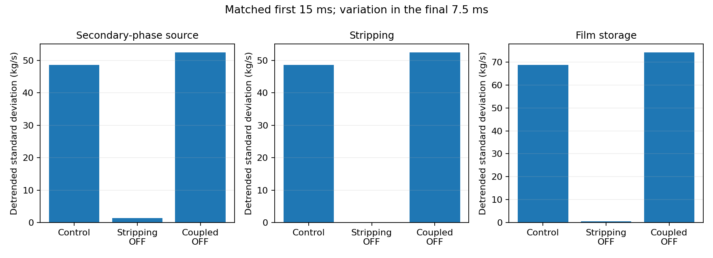
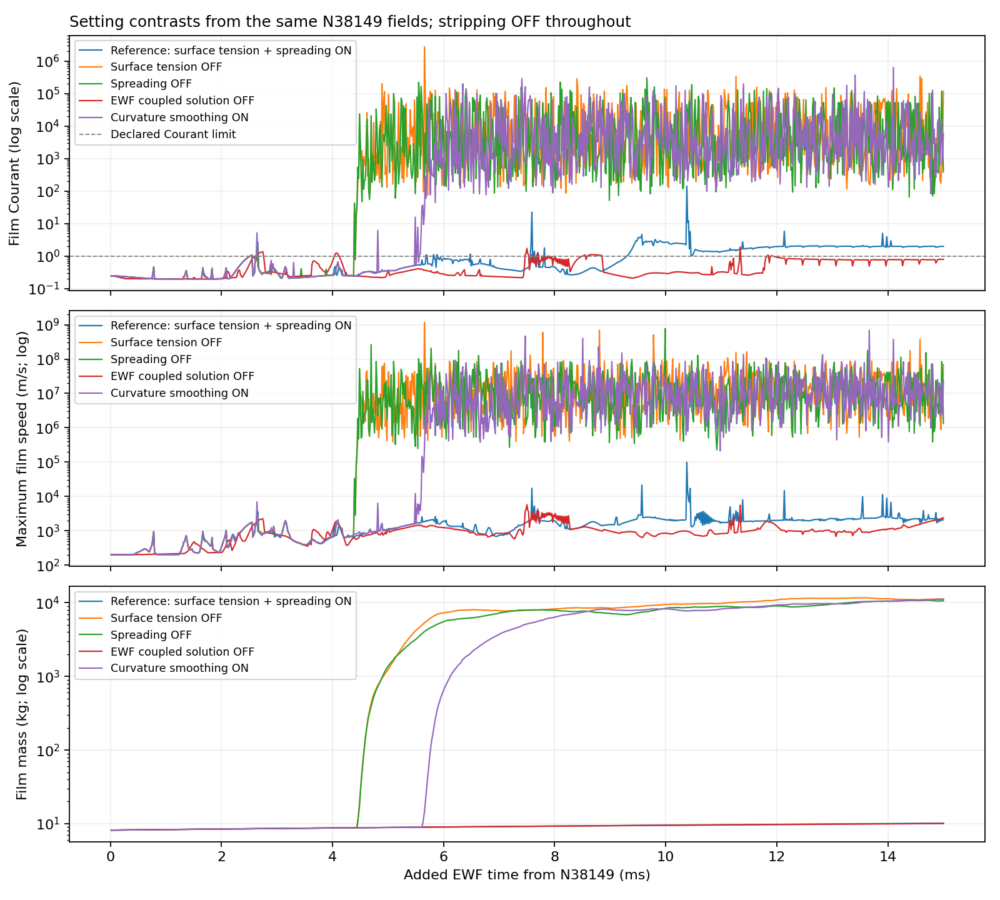
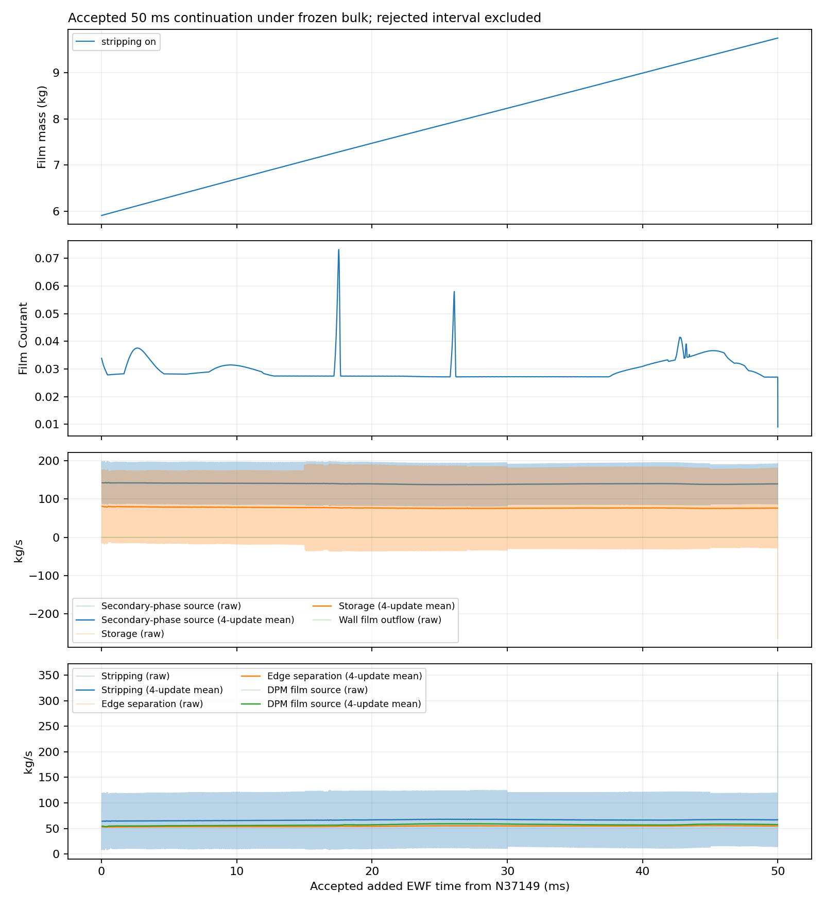

# Stage 4 — EWF setting sensitivity under frozen bulk flow

| Question / decision | Verified result |
| --- | --- |
| Main finding | Particle Stripping controls the rapid four-step source/storage cycle in the tested model combination |
| Short-window reduction | Stripping OFF reduces source variation by 97.24% and storage variation by 99.13% over the matched final 7.5 ms window |
| Longer OFF result | Stripping OFF then exceeds the declared Courant guard; removing Surface Tension or Spreading, disabling EWF Coupled Solution, or enabling Curvature Smoothing does not repair that route at 15 microseconds |
| Numerical switch alone | EWF Coupled Solution OFF with stripping ON leaves the cycle and increases variation about 7.7% |
| Selected route | Restore stripping ON, EWF Coupled Solution ON, Curvature Smoothing OFF; Flow Momentum Coupling stays OFF; all other human-selected terms ON |
| Completed continuation | N37149 → N40483; 3334 accepted film updates; +50 ms; native clock 0.373184338635475 s |
| Film step | 3333 updates at 15 microseconds and one final 5 microsecond trim; live controls restored to 15 microseconds |
| Bulk | All bulk equation groups OFF; native bulk liquid and steamoutlet phase-flux histories remain fixed |
| Outcome limit | No supported OFF setting selected; source cycling remains; film inventory still grows; no stationary or physically validated separator claim |
| Current configuration after this run | Native maximum thickness changed to 0.3 m at unchanged N40483 / film clock; any threshold crossing is **UNREALISTIC**; [configuration and drainage audit](film-limit.md) |
| Direct film drainage at absorber | Not configured; contact sink removes bulk phase-2 liquid only; stripping / edge separation remove film mass, but new wall-scope film outflow is zero |

*Three independent children start from the same N37149 case/data fields and film clock. Each runs 1000 updates / 15 ms. Initial and final 64-update windows show the four-step pattern. For stripping OFF, zero new stripping follows from the verified switch; the unavailable native stripped-mass field is recorded as inactive.*

| First matched 15 ms | Secondary-source detrended SD (kg/s) | Storage detrended SD (kg/s) | Peak native film Courant | Final film inventory (kg) |
| --- | ---: | ---: | ---: | ---: |
| Control: stripping / coupled ON | 48.674 | 68.827 | 0.0375415 | 7.08789 |
| Stripping OFF only | 1.3448 | 0.59592 | 0.453354 | 8.18867 |
| EWF Coupled Solution OFF only | 52.417 | 74.124 | 0.0339654 | 7.07549 |

*Variation uses the last 500 updates / 7.5 ms and removes only a linear trend. The control four-step component explains almost all rapid variation. Stripping OFF removes that component but increases mean storage from 78.14 to 149.98 kg/s in this window. Reduced variation does not establish longer stability or physical accuracy.*

| Next matched 15 ms from stripping-OFF N38149 | Peak native Courant | Peak reported film speed (m/s) | Peak thickness (m) | Decision |
| --- | ---: | ---: | ---: | --- |
| Reference: stripping OFF; original forces / coupled ON | 141.9885 | 99240.33 | 0.003287518 | Rejected |
| Surface Tension OFF alone relative to reference parent | 2746519 | 1.169373e+09 | 1 | Rejected |
| Spreading OFF alone relative to reference parent | 306903.3 | 7.713717e+08 | 1 | Rejected |
| EWF Coupled Solution OFF alone relative to reference parent | 1.914106 | 5798.829 | 0.003861615 | Rejected |
| Curvature Smoothing ON alone relative to reference parent | 643624.3 | 6.86358e+08 | 1 | Rejected |

*Every curve starts from the same saved stripping-OFF N38149 fields. Each treatment changes one further native parameter. The dashed Courant value of 1 is this experiment's declared screen, not a universal implicit-scheme stability limit. Large values and thickness clipping are rejected numerical diagnostics; they are not physical film predictions. These intervals are excluded from the accepted continuation.*

| Accepted 50 ms control continuation | Value |
| --- | ---: |
| Film inventory, start → end | 5.9070348 → 9.752614 kg |
| Mean net storage over 50 ms | 76.91158 kg/s |
| Peak native Courant | 0.07314831 |
| Peak reported film speed | 744.7756 m/s |
| Final maximum reported film speed | 186.3704 m/s |
| Final reported area-average film speed | 80.93177 m/s |
| Peak film thickness | 0.001866235 m |
| Sampled film-ledger gap / block-integrated source magnitudes | 0.4191791% |
| Frozen bulk liquid inventory | 162.2989933 kg |
| Frozen native phase-2 steamoutlet boundary flux | -9.115419315 kg/s |
| Final-window secondary-source detrended SD | 52.19826 kg/s |
| Final-window storage detrended SD | 73.80735 kg/s |
| New wall-scope film outflow | 0 kg |

*Only the accepted stripping-ON control contributes to this 50 ms history. Each endpoint was saved and reopened. The final 5 microsecond trim is included in time and inventory, but excluded from the final-window variation metric. Raw rates are shown with non-overlapping four-update means over 60 microseconds; the means expose the slower trend and do not repair the solver or prove convergence. Bulk equations stay frozen; no failed OFF interval is included.*

| Interpretation / limitation | Evidence and implication |
| --- | --- |
| Source-feedback hypothesis | Previous endpoint corr(secondary[t], stripping[t−1]) = −0.999998. Matched stripping removal suppresses the cycle. This supports delayed transfer feedback as a mechanism; it does not prove a Fluent defect. |
| Time-step limit | The pattern repeats every four updates at this one step size. No half-step contrast was run; no physical wave-frequency or time-step-independence claim. |
| Physical-model sensitivity | Stripping OFF also changes particle production, the DPM return source, mean film collection and storage. It is not a pure numerical damping control. |
| Frozen bulk | Native scalar histories and OFF equation flags verify the hold. No new bulk residual rows, reconvergence or whole-separator transient conservation test. |
| Film account | The reported gap is a sampled film ledger from native source rates and cumulative transfers. It does not establish full coupled conservation or correct transfer timing. |
| Film equation convergence | Alternative implicit scheme retained; 30 subiterations and stop value 1e-5. This route prints no inner residual rows, so low Courant does not certify convergence of each film equation update. |
| Film state | Net inventory increases over the selected horizon; low Courant and successful paired restart do not establish a steady film. |
| Unresolved settings | Phase Accretion, DPM coupling, gravity, shear and Edge Separation were retained. These tests do not rule out interactions involving them. |
| Property scope | Material properties, including inherited surface tension, were held fixed. See the untested hot-liquid property issue in the research record. |
| Inactive report recovery | Disabled stripped-mass field disappears after reload. Remove the inactive report before OFF solves; record zero new stripping by verified OFF status, without a synthetic native history. |
| Paired-reload report reset | Instantaneous secondary-source report resets from 84.8059 kg/s to zero when restoring the control pair. Film stocks, clock and all other checked reports match. New native update histories supply the continuation sources. |
| Solver state | Server 1 left open at N40483; frozen bulk; ready step 15 microseconds; no initialization; other sessions preserved. |

| Evidence owner | Record |
| --- | --- |
| Scientific contract / research | [Setup](setup.md); [mechanisms and Fluent 2025 R2 primary sources](research.md) |
| Comparison and selected continuation | [Derived metrics](../../../../../PyAnsys/output/phase72a-stage4-sensitivity/20261007/comparison-summary.json); [accepted native-update table](../../../../../PyAnsys/output/phase72a-stage4-sensitivity/20261007/accepted-continuation.csv); [four-update diagnostic means](../../../../../PyAnsys/output/phase72a-stage4-sensitivity/20261007/four-update-means.csv) |
| Immutable screen evidence | [Stripping ON](../../../../../PyAnsys/output/phase72a-stage4-sensitivity/20261007/stripping-on/raw/screen-N38149); [stripping OFF](../../../../../PyAnsys/output/phase72a-stage4-sensitivity/20261007/stripping-off/raw/screen-N38149); [coupled OFF only](../../../../../PyAnsys/output/phase72a-stage4-sensitivity/20261007/coupled-off/raw/screen-N38149) |
| Failed stripping continuation | [Rejected N39149 interval](../../../../../PyAnsys/output/phase72a-stage4-sensitivity/20261007/stripping-off/raw/rejected-continuation-N39149) |
| Conditional evidence | [Treatment paths and matched metrics](../../../../../PyAnsys/output/phase72a-stage4-sensitivity/20261007/comparison-summary.json) |
| Final native evidence / hashes | [Immutable final N40483 reports, transcripts, pairs and controls](../../../../../PyAnsys/output/phase72a-stage4-sensitivity/20261007/stripping-on/raw/final-N40483) |
| Current machine status / Windows pair paths | [Campaign manifest](../../../../../PyAnsys/output/phase72a-stage4-sensitivity/20261007/run-manifest.json); [selected control manifest](../../../../../PyAnsys/output/phase72a-stage4-sensitivity/20261007/stripping-on/run-manifest.json) |
| Verification / live state | [PASS receipt](../../../../../PyAnsys/output/phase72a-stage4-sensitivity/20261007/verification.json); [final native readback](../../../../../PyAnsys/output/phase72a-stage4-sensitivity/20261007/final-live-readback.json) |
| Executable implementation | [Runner](../../../../../PyAnsys/scripts/setup/run_phase72a_stage4_setting_sensitivity.py); [analysis](../../../../../PyAnsys/scripts/analysis/analyze_phase72a_stage4_setting_sensitivity.py); [read-only verifier](../../../../../PyAnsys/scripts/inspection/verify_phase72a_stage4_setting_sensitivity.py) |
