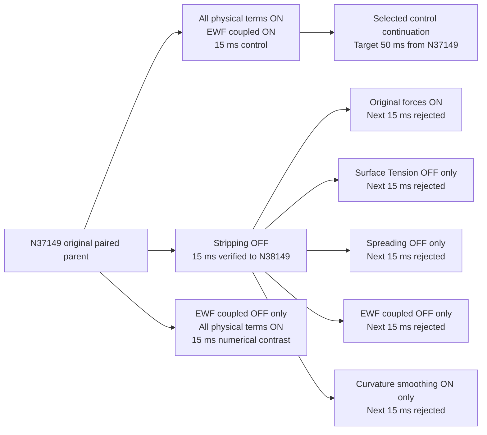

# Stage 4 — Targeted setting sensitivity from N37149

| Contract | Value |
| --- | --- |
| Human authority | 7 October 2026: research the high variation; disable a suspected setting and continue; sensitivity analysis |
| Question | Which selected EWF setting drives the rapid mass-source/storage variation under frozen bulk forcing? |
| Parent | Verified feedback-OFF final-ready-15us N37149 pair; film clock 0.3231843386354754 s |
| Parent fields | Film 5.907034813 kg; frozen bulk liquid 162.298993325 kg; no initialization |
| First physical contrast | Particle Stripping ON versus OFF; independent children of the same saved parent |
| Fixed controls | 15 microseconds; alternative implicit film solver; 30 subiterations; EWF Coupled Solution ON; all bulk equation groups OFF |
| Fixed physics | Flow Momentum Coupling OFF; pressure, spreading, surface tension, gravity, shear, accretion, DPM coupling, splash and edge separation retained ON |
| Other invariants | Mesh, wall scope, material properties, roughness, feeds, collector, DPM interval and injection identities |
| Screen horizon | 1000 film updates / 15 ms per matched child; OFF instrumentation probe included in this horizon |
| Primary window | Last 500 steps / 7.5 ms; also inspect initial 64 steps after the matched restart |
| Primary metric | Detrended source/storage standard deviation; four-step Fourier component; lag-two correlation |
| Success screen | At least 75% reduction in both signed-secondary-source and storage variation; finite film reports; Courant below 1; frozen bulk verified |
| Conditional next screen | If stripping OFF does not suppress the variation, test Surface Tension OFF alone from the same parent; consider a separate half-step numerical control |
| Selected continuation | Target +50 ms from N37149; reject numerical excursions and continue from the last verified checkpoint |
| Longer stripping-OFF result | Courant exceeds 1 at 17.52 ms and peaks at 141.9885; 15–30 ms interval rejected and preserved |
| Secondary matched parent | Verified stripping-OFF N38149 / +15 ms; film clock 0.3381843386354627 s |
| Secondary controlled delta | Surface Tension OFF alone relative to stripping-OFF parent; all remaining terms retained |
| Secondary reference | Saved stripping-OFF, surface-tension-ON N38149 → N39149 interval; same initial fields and 15 microseconds |
| Secondary screen / horizon | +15 ms matched screen; then continue supported child for +35 ms from N38149, giving +50 ms total from N37149 |
| Secondary outcome | Surface Tension OFF rejected: peak Courant 2,746,519, film thickness clipped at 1 m; original Surface Tension ON reference also exceeds guard but less severely |
| Third controlled delta | Spreading OFF alone from the same verified stripping-OFF N38149 parent; Surface Tension restored ON; compare against the saved original 15 ms interval |
| Conditional numerical contrast | If the Spreading screen fails, first turn EWF Coupled Solution OFF alone from original N37149, with stripping and every selected physical film term ON. Compare against the original 15 ms all-physical-terms-ON control. If the source cycle persists, test coupled-OFF with stripping already OFF from N38149. |
| Numerical-contrast selection | Same 75% source/storage variation reduction screen, finite histories, Courant <1 and no thickness clipping; prefer a supported change that retains the selected physical film terms |
| Coupled-OFF conditional outcome | Rejected: peak Courant 1.914106 and peak reported film speed 5798.83 m/s; sampled film-ledger discrepancy 14.87% in the 980-update block |
| Curvature control | From verified stripping-OFF N38149: Curvature Smoothing ON alone; EWF Coupled Solution and all film forces ON; retain inherited smoothing level 2, factor 0.5 and base 0; fixed 15 microseconds |
| Curvature outcome | Rejected: peak Courant 643,624.3 and thickness reaches the 1 m limit; endpoint saved and excluded from accepted lineage |
| Selected supported route | Original stripping-ON / coupled-ON / smoothing-OFF control; Flow Momentum Coupling stays OFF; continue the saved 15 ms control endpoint to +50 ms total from N37149 |
| Bounded recovery choice | If smoothing cannot support the longer route, retain the numerically supported physical-model control. Do not choose an OFF switch solely because it reduces short-window source variation. |
| Parent and checkpoints | Preserve parent and each child on Fluent host local disk; separate native report files and transcripts |
| Disabled mechanism report | Check native availability; record an inactive field explicitly; zero new stripping is justified only by verified model OFF, not missing rows |
| Required evidence | Saved/reopened flags, native time/Courant, active native source reports, cumulative transfers, film inventory, DPM tracking and frozen bulk fields |
| Claim limit | Model-toggle sensitivity under frozen flow; no physical stripping invalidation, fully coupled stability or stationary-film claim |
| Closest precedent | Previous feedback-OFF continuation: all current physics ON; no matched stripping-OFF contrast; NEW sensitivity |

| Current configuration after the completed sensitivity | Contract |
| --- | --- |
| Human-selected maximum thickness | 0.3 m; native readback, saved/reopened from N40483; zero new solver updates |
| Run classification | Any recorded maximum thickness ≥0.3 m → **UNREALISTIC**; preserve endpoint and stop further batches |
| Baseline for future matched children | Hold the same 0.3 m numerical cap in every child; record it separately from a mechanism switch |
| Direct EWF absorber drain | Not configured; the current contact absorber acts on bulk phase-2 liquid |
| Configuration / drainage owner | [Film limit and drainage audit](film-limit.md); historical sensitivity evidence retains its original 1 m cap |

| Core figure | Scope and decision |
| --- | --- |
| Matched source/storage traces | First 64 updates and final 64 updates of each screen; same units and axes; identify periodic variation |
| Sensitivity summary | Last-500 detrended variation and four-step amplitude; separate mean transfer from fluctuation |
| Conditional setting comparison | Same N38149 fields; native Courant, maximum reported speed and inventory across the reference interval and four controlled force / solution children |
| Selected continuation | Film inventory and sources over actual added film time through 50 ms; qualify persistence and accumulation |

| Research owner | Record |
| --- | --- |
| Ranked mechanisms and sources | [Research brief](research.md) |
| Previous native evidence | [Feedback-OFF result](../realism-continuation/feedback-off/results.md) |
