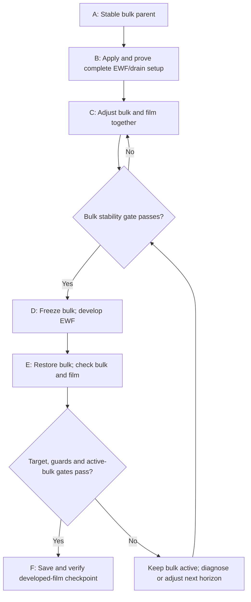

# Staged bulk and EWF development — first 50 ms screen

| Contract | Selected direction |
| --- | --- |
| Human direction | 8 October 2026: plan bulk stabilization → complete EWF/drain configuration → bulk-plus-film adjustment → frozen-bulk film development → bulk reactivation → final checkpoint |
| First film horizon | Human selected 50 ms; record accepted EWF steps and native film time |
| Cost priority — updated 8 October 2026 | Human requests a more aggressive timestep strategy for large meshes; 0.5 µs on 2.6M is an example of high cost, not a selected production step. Test larger candidates and choose the fastest passing film-time advancement. |
| Timestep method — human revision | Use a continuous sequence: +2 ms at 1 µs, then +2 ms at 2 µs, retaining fields and film clock. No restart or repeated-parent comparison for this screen. This is a timestep-change robustness/cost screen; different film ages prevent controlled timestep-error measurement. |
| Purpose | Produce a reproducible developed-film checkpoint with bulk restored and stable on each mesh |
| Status | Human authorized implementation and execution from the original **N8000 / 60,964-cell** pair on Server 1; runner and watcher use the active laptop |
| Current compute | Previous N13000 → N17000 continuation is complete; final pair hashed and data reopened before replacement. New execution belongs to the [staged run record](results.md). Other meshes remain planned. |
| Mesh hypothesis | Coarse mesh may contribute to excessive film speed; cause not isolated |
| Scope | Prepared bulk parents, mandatory EWF and Phase Accretion, direct film drainage, per-mesh timestep checks, temporary bulk freeze and final bulk-active checks |
| Other work | Existing Phase 9 startup jobs and other servers retain their own authority; this plan does not modify them |
| Numerical thresholds below | Proposed first-screen operating criteria, not Fluent defaults or physical validation limits |
| Parent policy | Verify exact case/data, mesh identity, bulk mode, stored film fields and clock; preserve every valuable parent |
| Initialization | No bulk initialization; retain existing film unless a separately recorded matched comparison specifies a common film start |
| Configuration policy | Apply the complete intended setup once, then hold physics fixed through the production sequence |
| Final label | Developed-film checkpoint at declared age with stable active bulk; steady-film and mesh-independence claims require additional evidence |

| Executable contract — 60k pilot | Value / order |
| --- | --- |
| Runner | [run_phase72a_staged_ewf.py](../../../../../PyAnsys/scripts/setup/run_phase72a_staged_ewf.py) |
| Watcher | [watch_phase72a_staged_ewf.py](../../../../../PyAnsys/scripts/orchestration/watch_phase72a_staged_ewf.py); local receipts/passive output only; no Fluent control |
| Machine job / code review | [Exact job](../../../../../PyAnsys/output/phase72a-stage4-staged/20261008/job.json); [stepwise code review](../../../../../PyAnsys/output/phase72a-stage4-staged/20261008/code-review.json) |
| Original parent | `auto-8000-1-08000.cas.h5` / `.dat.h5`; original fields/clock retained; load case once, then data; no bulk initialization |
| First startup check | 20 native updates at the inherited 0.1 µs step; prove native count, clock, terminal receipt, paired files and histories before larger commands |
| A | Original bulk active; three 1,000-update windows; at most 10,000 baseline updates before a preserved unqualified stop |
| B | Full proven film parameter packet; direct lower-film mass/XYZ sink, τ=1.5 ms; one film step between profile/flow refreshes; profile interval 1; declared source span 10 µs |
| Cadence proof | Disposable zero-forcing lower-film fixture, 100 updates at each 1/2/5/10 µs step; prove actual removal matches the source and preserves bulk; restore the exact pre-fixture production data and clock |
| DPM timing | Selected 20 µs physical interval: 20/10/4/2 film updates at 1/2/5/10 µs; actual native source/tracking messages retained |
| C / E | At least three 1,000-update windows, at most 10,000 per stability attempt; inventory, actual outlet, collector, pressure and residual gates |
| Step rejection | Stop increases at a failed step. For finite soft-limit failure, reduce to a previously acceptable step in the same fields and require a 1,000-update recovery block; fatal events, Courant ≥1, clipping or negative fields preserve and stop |
| Fixed native command order | Start native transcript → `/solve/iterate N` → write paired endpoint → stop native transcript → write terminal receipt → print a unique passive return token |
| During native solve | Runner waits for blocking native `Exec(wait=True)` to return. A passive v0 Monitor stream records progress; watcher reads local progress files/PID only. No Settings/Scheme query or exception-driven data restore before execution returns. The SDK transcript stream was silent in the startup test; the native transcript and disk terminal receipt remain required evidence |
| Final persistence | Save and hash case/data; reopen data and compare persistent fields/controls. Full repeated case reload is avoided because earlier loads raised GUI dialogs; that limitation is recorded |
| Laptop policy | Human confirms laptop stays active; current native block is Fluent-owned, but future transitions and supervision need the laptop runner/watcher |

## Stages and transition rules

| Stage | Run mode / minimum | Exit condition | Preserve |
| --- | --- | --- | --- |
| A — bulk baseline | All intended bulk equations active, full feed; retain mandatory startup EWF/accretion | Bulk gate below passes over three consecutive 1,000-update windows | Verified bulk parent and initial film state |
| B — complete configuration | Apply settings and source hooks; one bounded build/drain smoke; restore production fields after disposable tests | Controls/units/materials/wall mapping match; direct film removal works with frozen bulk; source/momentum accounting and refresh bound verified | Prepared case/data; setup readback and proof |
| C — post-change adjustment | Bulk and EWF active; first decision after at least 3,000 bulk updates; extend by 1,000 where the next transition is unresolved | Bulk gate passes after the last configuration change; film remains numerically acceptable; growing film mass alone does not prevent freeze | Pair immediately before bulk freeze |
| D — film development | Freeze bulk equation advancement; continue EWF, accretion and required particle/film processes; preserve source refresh | Reach the planned freeze-stage boundary derived from the 50 ms target and reserved final bulk-active interval; numerical guards pass | Developed-film pair with accepted clock/count and ledger |
| E — bulk reactivation | Restore every previously active bulk equation; continue EWF; at least 3,000 bulk updates with no configuration change | Bulk gate passes; film/source checks pass; first-screen time target reached; assess changes in film and outlet after reactivation | Final active-bulk histories and spatial fields |
| F — endpoint verification | Idle endpoint; save/hash pair, reopen safely, compare persistent fields/controls | Required histories, paired checkpoints, source definitions and final bulk mode verified | Selected shared final pair and concise status/limits |

| Failure / unresolved condition | Action |
| --- | --- |
| Bulk still drifts at C or E | Keep bulk active and use another 1,000-update decision block; do not freeze to hide drift |
| E changes the film materially | Keep bulk active until it passes; choose another bounded film interval and repeat D → E if useful |
| 50 ms reached before bulk is acceptable | Preserve the 50 ms screen as unqualified; extend active-bulk development or select a common later horizon; do not label it finalized |
| Numerical/source guard fails | Preserve endpoint; repair controls, timestep or accounting in a recoverable child; repeat the affected proof |
| Production physics/property/source law changes | Restart C; repeat affected build/drain/timestep proof; do not continue from an obsolete stability gate |
| Planned compute allowance is exhausted | Preserve a partial checkpoint with failed/missing gates; no silent threshold relaxation |

## Bulk stability gate — proposed initial thresholds

| Metric | Requirement in each of three consecutive 1,000-update windows |
| --- | --- |
| Total bulk liquid inventory | Range ≤1% of window mean; adjacent window means differ by ≤0.5% |
| Pressure drop | Adjacent means differ by ≤2%; range ≤5% of characteristic mean magnitude |
| Actual phase-2 steamoutlet boundary flux | Adjacent means differ by ≤2%; range ≤5%, using the low-flow normalization below |
| Applied bulk collector removal | Same 2% mean / 5% range limits; applied rate agrees with its independently computed expression |
| Lower-collector liquid inventory | Record lower-region and contact inventory in active-bulk histories for redistribution review. The current runner does not apply a separate lower-region drift gate; this remains a qualification limit |
| Residuals | Require complete finite nonnegative residual rows. Each final-window residual mean must be ≤1.25 times the preceding mean, with a 1e-8 floor; record continuity, velocity, turbulence and phase-fraction residual levels |
| Routing / sources | Use boundary-only flux for outlet; report source-inclusive values separately; identify bulk collector, EWF transfer and diagnostic particle sources |
| Transition | All required metrics pass; save pair before freeze; record the measured stable baseline |

| Definition / limit | Value |
| --- | --- |
| Mean-change normalization | Absolute mean difference divided by the greater of the two mean magnitudes and a fixed characteristic floor |
| Low-flow floor | Proposed 0.1% of the commanded liquid feed, fixed before the run; report absolute changes near zero |
| Pressure floor | Choose a fixed pressure scale from the intended operating point before testing; do not divide by a near-zero pressure difference |
| Residual role | Residuals support the inventory/flux evidence; small residuals alone do not permit freeze |
| Existing Phase 9 gate | Its looser startup-maturity screen is not automatically this pre-freeze gate |
| Field agreement | Review lower-region and main-wall liquid VF at saved checkpoints to catch redistribution hidden by total inventory. This spatial comparison is not automated by the current runner and is required before a stronger stable-field qualification |

## Complete settings packet — items that must not be missed

| Group | Verify before C and retain through D/E |
| --- | --- |
| Bulk basis | Mesh quality/identity, full feed, outlet pressure and backflow, gravity, phase materials/slip, turbulence, bulk Coupled controls and roughness |
| Film physics | EWF + Phase Accretion ON; full film momentum; declare gravity, gas shear, wall-viscous resistance, pressure, spreading, surface tension and advection |
| Film material | Density, viscosity and surface tension from one declared operating-property basis; compatible collected phase and particle materials; energy/phase-change status explicit |
| Feedback | Film Coupled Solution and Flow Momentum Coupling recorded separately; use the chosen production feedback state during C and E |
| Film walls / edges | Verify each mesh's main-wall/collector mapping and connected film path; preserve intended film outlets and separation edges; wall names from the 60k case are not defaults |
| Direct film absorber | Local film mass sink and matched XYZ momentum sinks; verify rate, units, density, capture time and that depletion protection does not silently change the intended sink law |
| Bulk absorber | Retain intended phase-2 collector and matching momentum/turbulence hooks; verify absence/presence of vapor sinks explicitly |
| Particle processes | Collection, splash, stripping/separation, injection materials/loading, source definitions and DPM update schedule |
| Source timing | Prove refresh during frozen-bulk iteration; record actual film steps between source refreshes; recompute the safe bound when timestep changes |
| Film numerics | Discretization, implicit/coupled option, inner limit/stop value, achieved residuals, timestep and smoothing |
| Thickness protection | Record native Maximum Thickness and any clipping; clipping removes film mass and is not intended drainage |
| Reports | Bulk total/lower inventory, boundary-only phase outlet flux, collector applied/expression rates, pressure drop, film inventories/transfers, drain, Courant, thickness and speed |
| Persistence | Prepared and terminal pairs, controls/fields after reopen, original parent identity and retained film clock |

## Per-mesh EWF timestep selection

| Step | Decision rule |
| --- | --- |
| Inspect wall mesh | Check film-wall face/edge spacing, skewness, transitions and collector connection; total fluid cell count is not a timestep rule |
| Initial estimate | Use local tangential speed and wall spacing; scaling C ∼ |u|Δt/L is an estimate only; check the native Film Courant field |
| Transfer estimate between meshes | At comparable local velocity, halving the relevant wall spacing suggests halving Δt to retain the same advective Courant. If velocity also doubles, the estimate becomes one quarter. Use the local spacing/speed pair, not a fluid-cell-count ratio; this does not cover every force timescale. |
| Dry starting film | A zero initial Courant does not establish a safe production step; use bulk tangential forcing as a cautious estimate and inspect the developing film |
| First continuous block | In frozen-bulk stage D, run +2 ms at 1 µs: 2,000 accepted film steps. Establish trends and throughput; preserve an endpoint without reloading it. Local spacing/forcing and source-refresh checks must pass first. |
| Second continuous block | Change to 2 µs at the saved boundary and continue +2 ms: 1,000 accepted film steps. Keep film fields, film clock, bulk freeze and intended physics/source laws; save the +4 ms endpoint. |
| Aggressive candidate ladder — human selected | If 2 µs passes the operating checks, test 5 µs in the same forward run; if 5 µs passes, test 10 µs. Use at least 1,000 accepted updates at each fixed step: +5 ms at 5 µs and +10 ms at 10 µs. Save before each switch; verify source timing first; do not proceed through a failed stage. |
| Screen duration limit | A short evolving-film block is not an accuracy guarantee; extend at fixed inputs if source transport has barely responded or drain delivery is unresolved |
| Fixed physics / timing | Same material, forces, drain coefficient, feedback, wall scope, smoothing and bulk forcing; preserve equivalent physical DPM/source timing where feasible and record any unavoidable timing changes |
| Field interpretation | Compare mass/storage, source/drain trends, mass-weighted velocity, thickness and spatial delivery on the continuous film clock. Look for sharp persistent changes or new oscillations after the switch; natural evolution means endpoint differences are not timestep-error estimates. |
| Courant interpretation | At unchanged velocity/spacing, doubling Δt should approximately double advective Courant. Compare Courant/Δt and actual velocity as well as raw Courant; a larger Courant alone does not imply a new velocity spike. |
| Proposed source check | Reported-rate film ledger error ≤1% in each block; integrate using each accepted step. Unresolved event accounting remains a claim limit, not a passed whole-system closure test. Zero drainage does not prove the drain path. |
| Inner solve | Instrument achieved film residuals; target h/u/v ≤10⁻⁵ on ≥99% of steps; reaching the iteration allowance is not proof of convergence |
| Missing inner residuals | Label the screen limited; do not claim timestep accuracy or achieved inner convergence. A larger step is provisionally usable only if observed fields, source balance and guards remain acceptable. |
| Native Courant | Proposed production operating ceiling 0.1: above it, preserve and reduce step/repeat the affected proof; rejection at ≥1. Inspect every accepted update, not only endpoint value. These are proposed plan guards, not changes to the existing journal. |
| Surface tension | Monitor new thickness/curvature oscillations and drain-response changes after the switch; implicit/coupled settings and this sequential screen do not establish capillary accuracy |
| Select step | Choose the provisionally acceptable candidate with the highest measured film milliseconds per wall minute, including inner-solve and DPM/source cost; evolving film state limits direct cost attribution |
| First screen | After the ladder decision, hold the selected step fixed for the remainder where guards permit; retain all earlier blocks in the film clock and ledger |
| Developed-film check | Reassess guards, inner solves, sources and velocity near the developed endpoint; a young-film screen does not prove adequacy for a thicker later film |
| Ambiguous switch response | Extend at fixed step or reduce the step in the same continuing run and inspect behaviour. Use a saved checkpoint for recovery only if needed; no matched-parent restart is part of the selected screen. |
| Adaptive option | Later option after the fixed-step operating screen; observe actual accepted steps and enforce the observed acceptable upper step independently of the native `timestep-max` name |

| Continuous ladder block | Fixed step | Added film time | Accepted EWF steps | Cumulative ladder film time |
| --- | ---: | ---: | ---: | ---: |
| Baseline | 1 µs | 2 ms | 2,000 | 2 ms |
| First increase | 2 µs | 2 ms | 1,000 | 4 ms |
| If 2 µs passes | 5 µs | 5 ms | 1,000 | 9 ms |
| If 5 µs passes | 10 µs | 10 ms | 1,000 | 19 ms |

| Ladder decision | Rule |
| --- | --- |
| Pass to next step | Current block satisfies Courant/source/inner-solve operating checks, with no unexplained persistent switch-linked field deterioration; source-refresh proof for the next step passes |
| Provisional production choice | Use the acceptable step with the highest observed film-time throughput; 10 µs need not be selected if it raises inner cost or worsens behaviour |
| Source-refresh examples | To retain a 10 µs refresh interval, 5 µs requires refresh at least every two steps and 10 µs every step. Actual callback timing and declared depletion span must be verified; these are not assumed Fluent-control settings. |
| Remaining target | The full ladder contributes 19 ms to the 50 ms target, leaving 31 ms before subtracting prior post-configuration film advancement. Reserve the final active-bulk interval using the selected step and observed step/iteration relation. |
| Final reserve at larger step | If one film step occurs per bulk iteration, 3,000 final active-bulk iterations consume 15 ms at 5 µs or 30 ms at 10 µs. After a full ladder, a 10 µs selection may leave little or no frozen-development interval; restore bulk when the reserve boundary is reached and report any horizon overshoot. |

| Fixed accepted film step | Steps for 50 ms, before accounting for time already advanced |
| --- | ---: |
| 0.25 µs | 200,000 |
| 0.5 µs | 100,000 |
| 1 µs | 50,000 |
| 2 µs | 25,000 |
| 5 µs | 10,000 |
| 10 µs | 5,000 |

| Candidate step | Illustrative solve time for 50 ms at 1 second per accepted step |
| --- | ---: |
| 0.5 µs | 27.8 h |
| 1 µs | 13.9 h |
| 2 µs | 6.94 h |
| 5 µs | 2.78 h |
| 10 µs | 1.39 h |

| Cost interpretation | Requirement |
| --- | --- |
| Larger mesh | More work per update, potentially smaller film step; measure both effects |
| Forecast | After the verified pilot, estimate remaining wall time from actual film-time advance per wall minute |
| Timing-table limit | The 1 second/step table is arithmetic only, not a measured 2.6M forecast. No prepared full-physics frozen-bulk EWF throughput for that mesh has been established by this plan; startup bulk-active timing is a different workload. |
| Source-refresh restriction | A safe Courant does not override the drain/source depletion bound; improve proven refresh cadence or reduce step rather than silently altering absorber strength |
| Current drain example | τ = 1.5 ms gives 666.7 s⁻¹ removal. With a 1% maximum removal fraction per stale-profile interval, refresh span must be ≤15 µs. Ten film steps at 1 µs give 10 µs; ten at 5 µs give 50 µs and would cap the rate at 200 s⁻¹. Prove a shorter refresh span or use a smaller step before adopting that candidate. These values apply to the current source implementation only. |
| First switch example | If actual refresh is every ten film steps, changing 1 → 2 µs changes the span 10 → 20 µs and would cap the coefficient at 500 s⁻¹. Five steps at 2 µs retain a 10 µs span. Verify actual refresh and the source's declared bound before switching; do not infer cadence from a control name alone. |
| Planning allowance | Proposed review after 10,000 new bulk-active updates in C or E, or two unsuccessful freeze/reactivation cycles; revise the method before repeating unchanged cycles |

## Film clock, final target and comparisons

| Item | Rule |
| --- | --- |
| Production origin | Record t_cfg and film fields immediately after the complete configuration is proved and disposable tests are restored |
| 50 ms target | First-screen target is t_cfg + 0.050 s; count film advancement during C, D and E |
| Sequential pilot accounting | The +2 ms at 1 µs and +2 ms at 2 µs contribute +4 ms to the target, in addition to earlier C advancement; they are not discarded comparison time. Total accepted pilot steps: 3,000. |
| Bulk iteration versus film update | Establish their observed relation on each case; native counters are not automatically accepted EWF-step counters |
| Reserve final bulk interval | With fixed step and measured film updates per bulk iteration, reserve the film time consumed by at least 3,000 final bulk updates before the target |
| Example | At one accepted 1 µs film step per bulk update, reserve 3 ms: frozen development reaches +47 ms, then final bulk-active 3,000 updates reach +50 ms if the gates pass |
| Already beyond reserve point | Reactivate bulk immediately; report the resulting final film age and any target overshoot |
| Final active-bulk adjustment | It advances film time; never reset the film clock or pretend final age remains at the frozen-stage endpoint |
| Different starting films | Equal added time is not equal film age/state; record initial fields and native clock; a matched mesh comparison needs a declared common film start or demonstrated loss of initial-state dependence |
| Different final ages | Use a common accepted-age comparison point or select a common later target; do not compare unmatched-age endpoints as a pure mesh effect |
| First 50 ms screen | Minimum developed-film horizon; does not guarantee transport to the drain or film stationarity |
| Later horizon | 100/250 ms are possible later decisions from the first-screen evidence and measured cost; they are not automatic commitments |

## Finalization labels and required evidence

| Label | Requirements |
| --- | --- |
| Developed-film checkpoint — first screen complete | Declared horizon reached; bulk active and stability gate passed; finite film fields, source/step checks and paired output evidence; all limitations explicit |
| Steady film under frozen bulk | Additional three equal film-time windows with absolute storage/supply ≤1%, rates without drift, ledger within the declared tolerance and persistent spatial film fields; claim conditional on frozen forcing |
| Steady bulk-and-film solution | Restore all bulk equations; the same film persistence and rate-balance evidence survives continued active-bulk updates; final feedback state explicit |
| Mesh-convergence result | Same model/property/absorber basis, comparable film starts and accepted ages, timestep adequacy and verified output definitions across meshes; sequential timestep robustness alone does not isolate timestep error, which remains a claim limit without separate evidence |

| Core evidence | Source / decision use |
| --- | --- |
| Bulk transition plot | Native iteration; inventory, pressure drop, actual outlet and collector rates; show three decision windows |
| Film development plot | Accepted film time; total/main/lower film, source, drain and storage rates; mark freeze/reactivation |
| Numerical plot | Actual accepted step, native Courant, thickness, achieved inner residuals and source ledger |
| Endpoint fields | Bulk VF, film thickness, signed velocity and liquid-mass-weighted speed distribution; compare before/after reactivation |
| Completion receipt | Paired endpoint and autosave hashes, output coverage, reopened controls/fields, bulk-active final state and exact native clocks |

| Execution / existing evidence | Basis |
| --- | --- |
| Run control | Fluent-owned journals; one fixed-input native solve to each required decision; paired local checkpoints and passive observation; no Scheme queries into an active journal |
| Current response | [N9000 → N13000](../replacement-parent/bulk-hold-4000/results.md): bulk still changes despite decreasing residuals |
| Drain compatibility | [Replacement-parent proof](../replacement-parent/results.md): direct lower-film removal with frozen bulk verified for that setup |
| Speed evidence | [N13000 field review](../replacement-parent/film-speed-review.md): mass-weighted mean 24.1 m/s; 12.9% of mass above 50 m/s; mesh cause unproven |
| Earlier timestep/transition precedent | [Stage 3 film-development method](../../stage-03-shortened-reconstruction/early-ewf-startup/film-development/setup.md); case-specific tests, not replacement-mesh defaults |
| Official steady/frozen algorithm | [Fluent 2025 R2 Theory §17.4.3](https://ansyshelp.ansys.com/public/Views/Secured/corp/v252/en/flu_th/flu_th_ewf_sec_sol_alg.html) |
| Official controls | [Fluent 2025 R2 UG §30.4](https://ansyshelp.ansys.com/public/Views/Secured/corp/v252/en/flu_ug/flu_ug_ewf_sec_eqns.html) |
