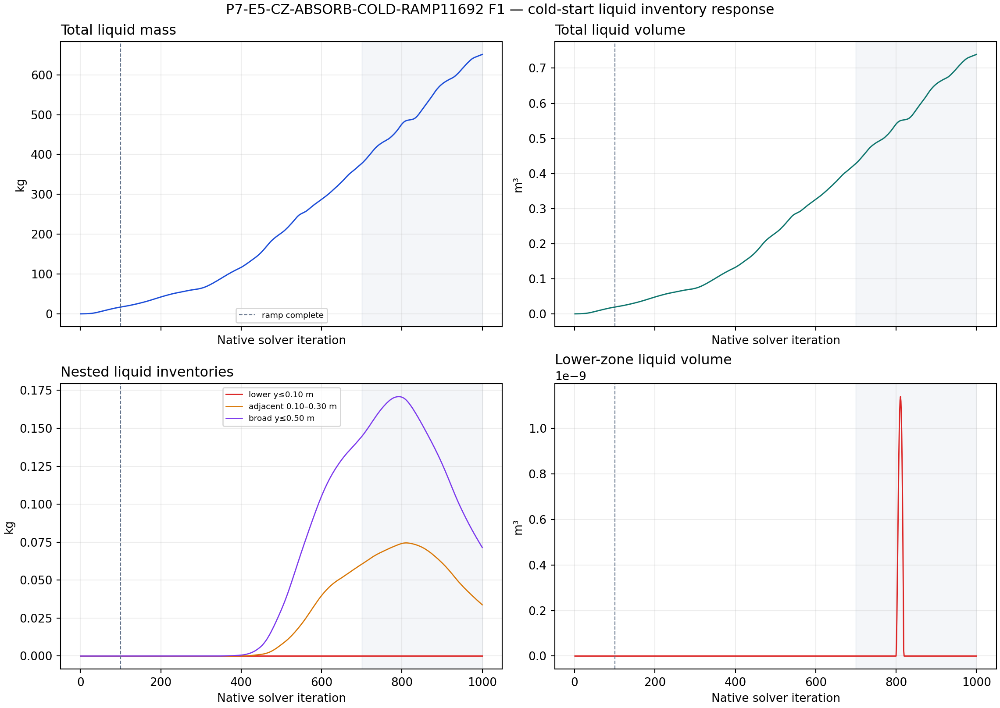
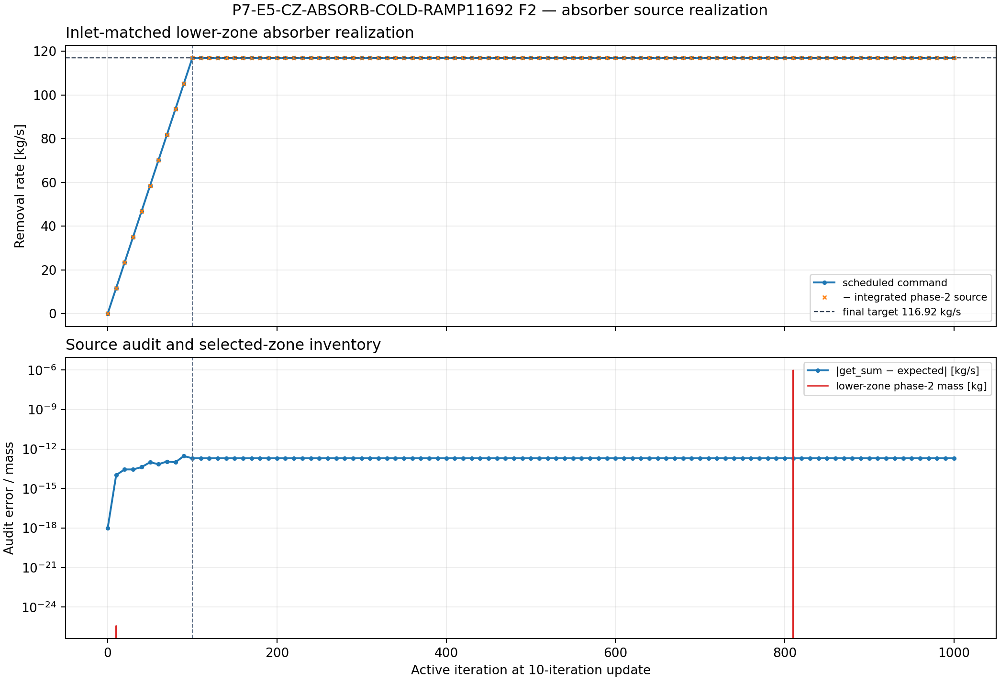
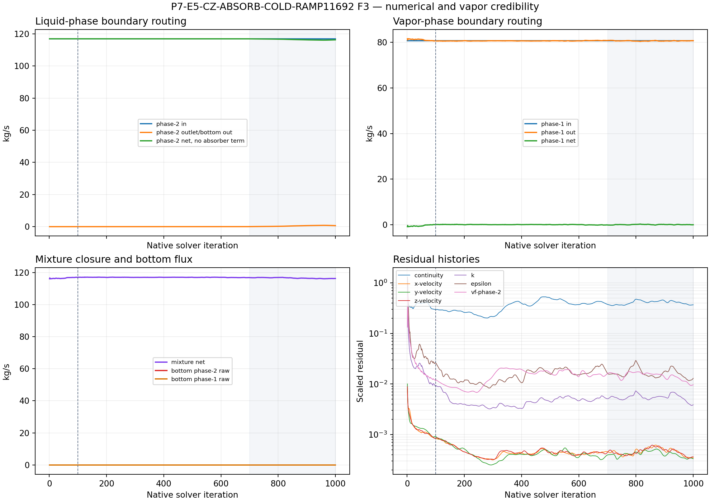

# P7-E5-CZ-ABSORB-COLD-RAMP11692 results

## Terminal classification

`COMPLETE` execution at the declared 1,000 active-iteration discovery
horizon, with a `PARTIAL` planned evidence package. The Fluent process stayed
attached through terminal verification, wrote the final paired case/data, and
reopened the final pair successfully. The result is a finite-horizon
discovery observation, not a converged solution or a physical separator
qualification.

Run ID: `P7-E5-CZ-ABSORB-COLD-RAMP11692-student-20260910T135421Z`

The executed child used the exact E0-style initialized case/data pair before
treatment iterations, split the existing mesh into the 3,794-cell
`p7-e5-lower-y010` zone, retained the bottom wall, and applied only the
lower-zone phase-2 absorber. No outlet, patch/reset, remesh, resplit, or
second initialization was introduced.

## Direct answer to the discovery question

The inlet-matched absorber was realized correctly, but this fresh-start run did
not establish a bounded cold-start branch. The integrated phase-2 source ramped
from 0 to `116.92 kg/s` over active iterations 0–100 and remained at that
value. Its Fluent `get_sum` audit error stayed at approximately
`3.0×10⁻¹³ kg/s`, and the direct phase-1 mass source remained off at every
update. However, essentially no phase-2 liquid entered the selected lower zone:
the lower-zone liquid mass stayed at zero apart from a transient numerical
trace of approximately `1.0×10⁻⁶ kg`, and the lower-zone liquid volume stayed
at zero apart from approximately `1.1×10⁻⁹ m³`.

Meanwhile, total liquid inventory increased from approximately `0.009 kg` at
the first report point to `651.30 kg` at active 1,000. In the declared late
window, active 700–1,000, it increased from `377.51 kg` to `651.30 kg`, with a
linear late-window slope of approximately `+0.943 kg/native iteration`.
Total liquid volume increased from `0.4284 m³` to `0.7391 m³` in the same
window. The lower adjacent and broad bands remained small by comparison and
declined late, ending at approximately `0.0337 kg` and `0.0715 kg`.

The bounded-branch hypothesis is therefore weakened for this exact
cold-start/source schedule. The result does not prove that the absorber can
never remove liquid after phase-2 liquid reaches the lower zone; it shows that
the tested initialized state did not deliver measurable liquid inventory to
that zone while the global liquid inventory continued to grow.

## Core figures

### F1 — cold-start inventory response

F1 is complete for the recorded inventory histories. The total liquid mass and
volume rise persist after the absorber ramp is complete at active 100. The
selected lower-zone mass and volume remain effectively zero, while the nested
adjacent and broad bands show only small transient excursions. The shaded area
is the declared late analysis window, active 700–1,000.

### F2 — inlet-matched source realization

F2 is complete for the source schedule and integrated source audit. The
scheduled command and measured integrated phase-2 source overlap throughout
the ramp and hold. The source is therefore not merely nominally configured;
Fluent reports the requested volumetric removal rate. The lower-zone mass trace
is shown on the same update coordinate to make the key distinction visible:
source realization is precise, but the selected zone is not carrying liquid.

### F3 — numerical and vapor credibility

F3 is partial. The phase-resolved boundary fluxes, bottom fluxes, mixture
closure proxy, and residual histories were recovered for all 1,000 points.
The phase-2 bottom flux remains zero, consistent with the retained bottom-wall
abstraction. Late phase-2 boundary outflow is small relative to the
`116.92 kg/s` inlet and varies over the window. Phase-1 inlet/outlet routing is
near `80.7–80.8 kg/s` with a small oscillatory net. The residual histories
remain finite but are not converged: late continuity is approximately 0.36–0.47
and the phase volume-fraction residual is approximately `0.0094–0.0176`.

The executed child did not configure a vapor-inventory report history. F3
therefore uses the recorded phase-1 fluxes and residuals, but it cannot claim
the full pre-run vapor-inventory evidence contract.

## Evidence ledger

| Evidence item | Status | Result |
| --- | --- | --- |
| Exact E0 initialized parent identity | `Reported` / complete | Initialized case/data pair was loaded before treatment iterations and read back. |
| Cell-zone split | `Reported` / complete | `p7-e5-lower-y010`, `0≤y≤0.10 m`, 3,794 marked cells; global mesh counts preserved. |
| Source selectivity | `Observed` / complete | Lower-zone phase-2 mass source and matched mixture momentum terms on; parent sources and direct phase-1 mass source off. |
| Source realization | `Observed` / complete | 101 updates; 0→116.92 kg/s ramp; maximum absolute `get_sum` error about `3.0×10⁻¹³ kg/s`. |
| Lower-zone liquid response | `Observed` / complete | Approximately zero through the full history, apart from numerical-scale traces. |
| Global inventory response | `Observed` / complete | Positive drift; `+0.943 kg/iteration` in the active 700–1,000 window. |
| Bottom liquid flux | `Observed` / complete | Phase-2 bottom flux remains zero; bottom remains a wall. |
| Residuals | `Observed` / complete | 1,000 points recovered; finite but oscillatory/non-converged. |
| Solver warnings | `Observed` / complete | No AMG divergence or floating-point fatal was detected; reversed-flow and turbulent-viscosity limiting warnings were frequent. |
| Vapor-inventory history | `Missing Info` / incomplete | Not configured by the executed child; do not infer it from phase-1 boundary flux. |

## Interpretation boundary

### Reported / observed

- The run reached active 1,000 and passed final save/reopen verification.
- The source rate was audited in the selected lower cell zone at machine
  precision.
- The absorber did not encounter measurable phase-2 liquid in the selected
  zone during this initialized transient.
- Total liquid inventory continued to increase across the run and across the
  late window.
- The residuals and warning histories show an executable but numerically
  unsettled flow field.

### Inferred, with limits

The most economical explanation consistent with these histories is that the
global source command is not the limiting implementation step in this run;
liquid transport into the lower absorber zone is. This remains an inference,
because the missing vapor-inventory history and non-converged residuals leave
the full phase balance incomplete. A lower-zone source audit alone does not
prove that the source represents a real brine-pool interface.

### Not claimed

- No steady-state solution was found or ruled out in general.
- No physical drainage rate, brine-pool capacity, or plant-performance result
  is claimed.
- The result does not authorize an outlet, patch/reset route, or a change to the
  no-outlet absorber question.
- The result is not a hypothesis qualification run.

## Auto Loop disposition

The independent lifecycle review returned `DISCOVERY_EXECUTION: PASS` and
`DISCOVERY_EVIDENCE: BLOCK`. The run is useful because it separates source
realization from liquid access to the absorber, but it does not supply the
complete planned evidence package or a positive bounded-branch hypothesis.
The allowed Auto Loop action is therefore a durable evidence-gate block/defer
through the recorded stop time, `2026-09-11 09:00` Pacific/Auckland. No new
experimental action is authorized by this review. In particular, do not enter
`HYPOTHESIS_DEFINITION`, `HYPOTHESIS_RUN_READY`, or qualification, and do not
add an outlet, patch/reset fields, remesh, or reinterpret the positive drift as
proof that the absorber concept is impossible.

## Durable artifacts

- Setup contract: [setup.md](setup.md)
- Terminal run paths: [run-paths.yaml](run-paths.yaml)
- Manifest: `PyAnsys/output/phase07_cz_absorb_cold/P7-E5-CZ-ABSORB-COLD-RAMP11692-student-20260910T135421Z-manifest.json`
- Recovered report histories: `PyAnsys/output/phase07_cz_absorb_cold/P7-E5-CZ-ABSORB-COLD-RAMP11692-student-20260910T135421Z-reports.json`
- Residual history: `PyAnsys/output/phase07_cz_absorb_cold/P7-E5-CZ-ABSORB-COLD-RAMP11692-student-20260910T135421Z-residuals.json`
- Analysis summary: `PyAnsys/output/phase07_cz_absorb_cold/P7-E5-CZ-ABSORB-COLD-RAMP11692-student-20260910T135421Z-analysis.json`
