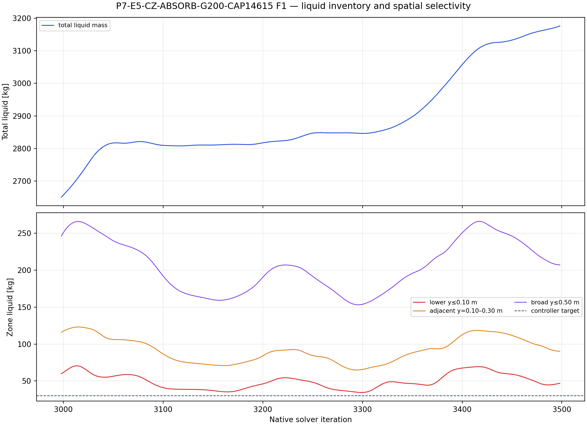
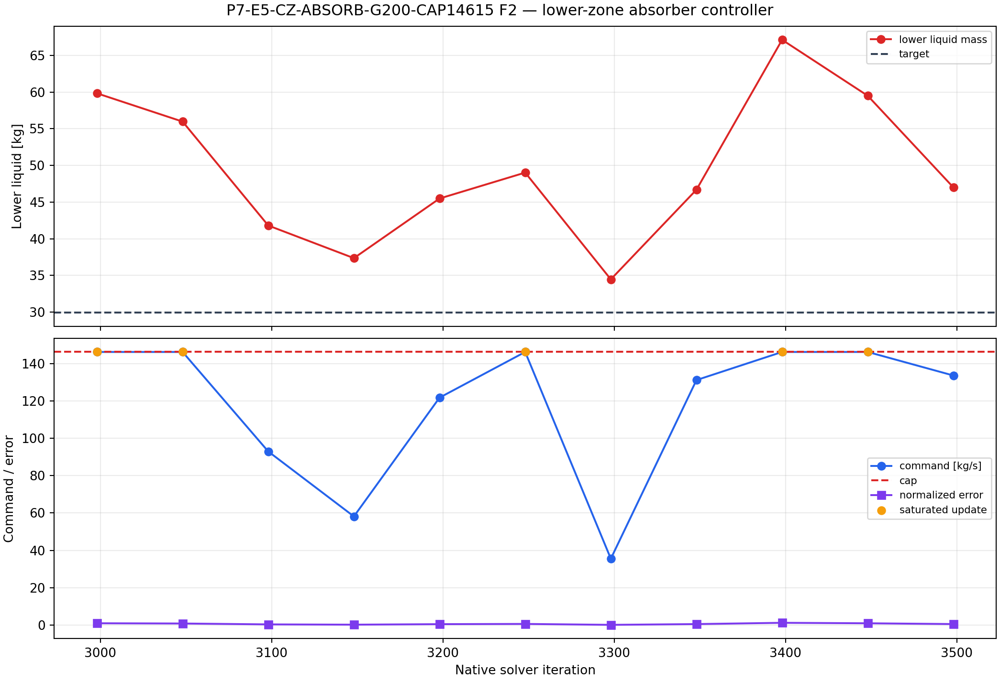
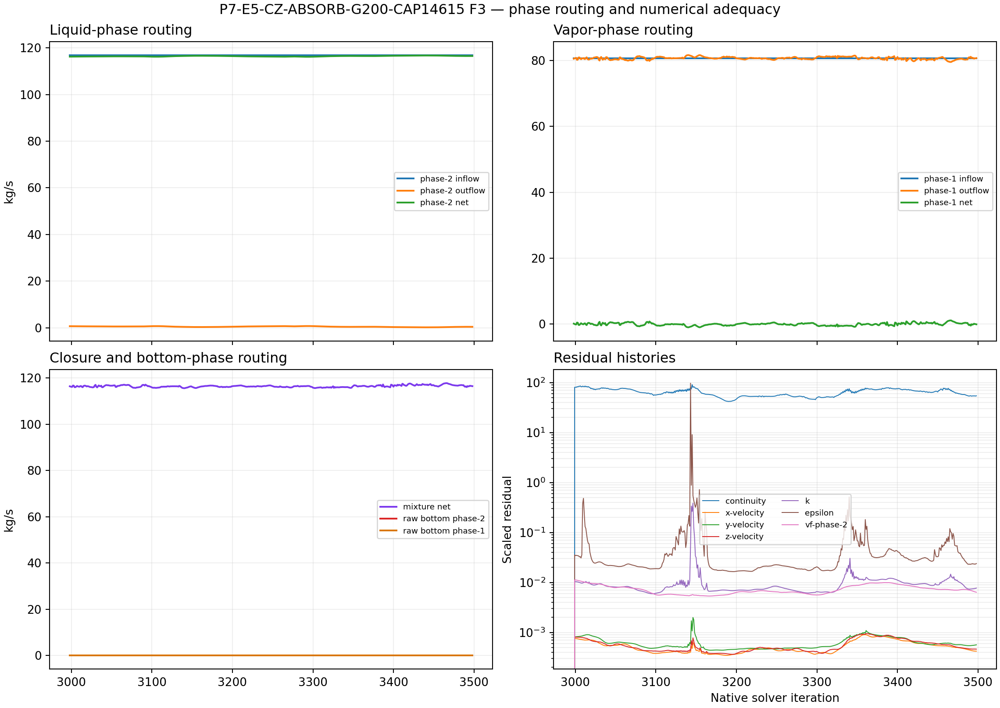

# P7-E5-CZ-ABSORB-G200-CAP14615 results

## Answer at a glance

**Status: COMPLETE_VERIFIED execution; discovery result is negative/inconclusive for absorber control.**

The child completed all `500` controller-active iterations from the exact
verified G100 active-2,500 parent. The lower-zone phase-2 source was applied
and audited, the direct phase-1 mass source remained off, and the paired final
case/data state was saved and reopened successfully. The controller did not
hold the lower inventory at its target: the target was `29.9167 kg`, while the
lower-zone liquid mass oscillated and ended at `47.0031 kg`. The global liquid
inventory continued to rise in the late window. This is therefore a valid
baseline screen, not evidence that the absorber has achieved pool control.

The result preserves the intended no-outlet abstraction. No outlet, patch/reset
operation, remesh, or topology change was introduced during the child run.

## Evidence package

| Item | Observed evidence | Assessment |
| --- | --- | --- |
| Parent and topology | Exact active-2,500 G100 case/data pair; lower zone `p7-e5-lower-y010`; split topology read back | PASS |
| Horizon | `500/500` active iterations; native report extent `2998–3498`; 18 required report histories with 501 points each | PASS |
| Controller | 11 updates at the declared 50-iteration cadence; 5 updates reached the `146.15 kg/s` cap | PASS |
| Source accounting | Maximum source-audit error `3.13×10⁻¹³ kg/s`; direct phase-1 source off at every update | PASS |
| Lower-zone response | `59.8333 kg` at the parent readback, `47.0031 kg` at the endpoint; late-window slope `−0.2956 kg/native iteration`, but with a `24.70 kg` oscillation range | Bounded response, not target holding |
| Target | `M_L,target = 29.9167 kg`; the lower inventory did not reach or remain near the target | FAILS control objective |
| Total liquid | Late-window slope `+0.9982 kg/native iteration`; total liquid rose from `3053.63` to `3176.00 kg` in the final 100 native iterations | FAILS global-removal objective |
| Routing | Late phase-2 inlet `116.92 kg/s`, phase-2 outflow only `0.2768 kg/s` mean; bottom raw phase-1 and phase-2 boundary fluxes remained zero | Consistent with volumetric absorber abstraction |
| Numerical state | Residuals remained finite but non-converged; late continuity residual mean `66.01` | Interpretation limited to the finite discovery window |

## Required figures

The lower-zone source is spatially localized by construction, but the adjacent
and broader inventory bands also moved substantially and the global inventory
rose. The figures do not support a stronger claim of spatially selective
liquid removal from the separator as a whole.

## Interpretation and claim limits

### Observed

- The phase-2 volumetric sink was active only in the lower cell zone and its
  integrated source matched the controller command to numerical precision.
- The controller initially saturated, then reduced its command, but later
  saturated again as the lower inventory rebounded.
- Lower-zone liquid mass was reduced relative to several transient peaks, yet
  it oscillated well above the target and the total liquid inventory increased.
- The zero bottom phase flux is not a failure of this abstraction: the intended
  disappearance mechanism is the explicitly accounted volumetric phase-2 sink,
  not a bottom outlet.

### Inferred, with limits

The lower-inventory feedback law can couple a local liquid inventory to a
phase-specific volumetric absorber without directly absorbing phase 1. In this
configuration, however, the feedback/source capacity and the evolving carrier
flow did not produce bounded pool-target behaviour over the 500-iteration
screen. Because the residuals were not converged and the global inventory was
still drifting, this result cannot establish long-time stability, physical
separator performance, or qualification readiness.

## Run and analysis records

- Setup contract: [setup.md](setup.md)
- Run paths and paired Fluent state: [run-paths.yaml](run-paths.yaml)
- Terminal manifest: `PyAnsys/output/phase07_cz_absorb/P7-E5-CZ-ABSORB-G200-CAP14615-student-20260910T104533Z-manifest.json`
- Report histories: `PyAnsys/output/phase07_cz_absorb/P7-E5-CZ-ABSORB-G200-CAP14615-student-20260910T104533Z-reports.json`
- Residual history: `PyAnsys/output/phase07_cz_absorb/P7-E5-CZ-ABSORB-G200-CAP14615-student-20260910T104533Z-residuals.json`
- Analysis summary: [analysis/20260910T104533Z.json](analysis/20260910T104533Z.json)
- Remote output root: `C:\Users\Shuhei Yokkaichi\Documents\FluentRuns\Phase07\CellZoneAbsorber\20260910T104533Z\P7-E5-CZ-ABSORB-G200-CAP14615`

## Decision

Classify this member as the **stable completed baseline**, but do not continue
it automatically. The family comparison must determine whether a numerical
stabilization or a different controller law is worth testing; this child does
not by itself justify a longer run or a promotion to qualification.
