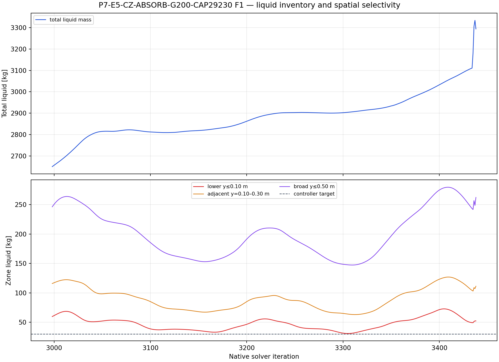
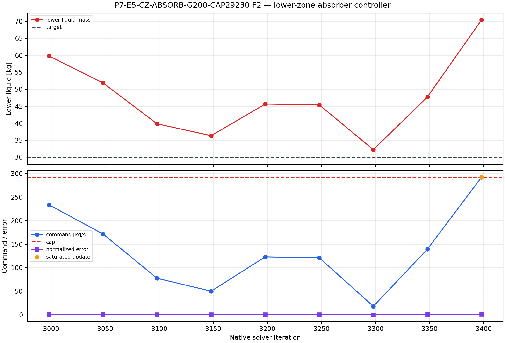
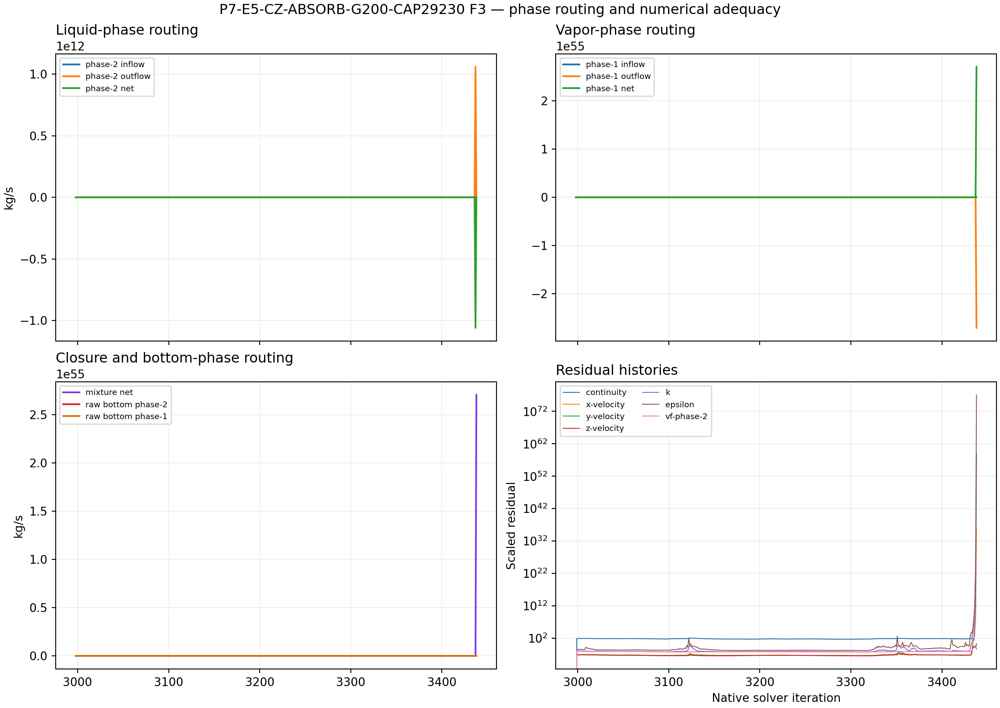

# P7-E5-CZ-ABSORB-G200-CAP29230 results

## Answer at a glance

**Status: BLOCKED_VERIFIED — solver divergence/floating-point failure during
the block ending at active iteration 450.**

This child used the exact same parent, mesh split, gain, feedback law, source
formulation, and 50-iteration controller cadence as the low-cap child. It
provided valid setup, source, and controller evidence through the active-400
readback, but it did not complete the declared 500-iteration horizon. The
Fluent solver then reported AMG divergence and a floating-point exception while
the block ending at active 450 was being solved. The histories contain samples
after the solution had lost numerical validity; those samples are retained as
failure evidence and are excluded from physical or controller-performance
interpretation.

The higher cap reached saturation at the active-400 controller update
(`292.30 kg/s`) before the solver failure. This is evidence of a numerical
stability boundary for this source/controller combination, not evidence that
the absorber successfully removed the accumulated liquid.

## Evidence package

| Item | Observed evidence | Assessment |
| --- | --- | --- |
| Parent and topology | Exact active-2,500 G100 case/data pair; lower zone `p7-e5-lower-y010` read back | PASS |
| Setup and smoke | Child start and smoke/checkpoint states were saved; source tree readback was explicit | PASS |
| Valid controller horizon | Controller readbacks through active `400`; fatal diagnostic during block ending at active `450`; requested `500` not reached | BLOCKED |
| History package | 18 report histories, 441 points each, native extent `2998–3438`; residual transcript available | Partial; late samples are post-divergence |
| Controller | 9 valid updates through active `400`; the active-400 command reached the `292.30 kg/s` cap | PASS through active 400 |
| Source accounting | Maximum source-audit error before failure `3.98×10⁻¹³ kg/s`; direct phase-1 source off | PASS through valid interval |
| Lower-zone response | Lower mass moved from `59.8333 kg` initially through a minimum near `31.05 kg`, then rebounded; the last pre-failure window was not target-holding | Not a valid stable-control result |
| Total liquid | Final recorded histories rose strongly, but their late portions overlap the solver failure and cannot be interpreted physically | Inconclusive; do not use post-failure slope |
| Numerical state | AMG divergence and floating-point exception; residuals/fluxes subsequently become nonphysical | FAILS terminal execution gate |

## Required figures

The figures are useful for locating the rebound and the onset of numerical
failure. They must not be read as evidence of a physical late-time liquid
trend after the solver diverged.

## Interpretation and claim limits

### Observed before divergence

- The local phase-2 absorber was configured in the lower cell zone only.
- The direct phase-1 mass source remained disabled at every recorded
  controller update.
- The controller command was below the cap through active 350 and reached the
  `292.30 kg/s` cap at active 400 as the lower inventory rebounded.
- The lower liquid inventory was not driven to the numerical target of
  `29.9167 kg` in the valid interval.

### Failure interpretation

Increasing the cap from `146.15` to `292.30 kg/s` did not produce a clean,
completed absorber screen. It allowed a larger command, but the coupled
phase/momentum source and carrier solution encountered a numerical failure
before the declared horizon. The failure does not prove that the abstraction
is mathematically impossible, but it does reject this unmodified cap setting
as a candidate for automatic continuation.

The intended no-outlet abstraction remains intact: the bottom boundary was not
changed into an outlet, and the zero bottom phase flux is not itself the
blocker. The blocker is solver stability under the evolving volumetric sink
and matched momentum source.

## Run and analysis records

- Setup contract: [setup.md](setup.md)
- Run paths and recovery state: [run-paths.yaml](run-paths.yaml)
- Terminal manifest: `PyAnsys/output/phase07_cz_absorb/P7-E5-CZ-ABSORB-G200-CAP29230-student-20260910T110936Z-manifest.json`
- Report histories: `PyAnsys/output/phase07_cz_absorb/P7-E5-CZ-ABSORB-G200-CAP29230-student-20260910T110936Z-reports.json`
- Residual transcript: `PyAnsys/output/phase07_cz_absorb/P7-E5-CZ-ABSORB-G200-CAP29230-student-20260910T110936Z-residuals-transcript.txt`
- Analysis summary: [analysis/20260910T110936Z.json](analysis/20260910T110936Z.json)
- Remote output root: `C:\Users\Shuhei Yokkaichi\Documents\FluentRuns\Phase07\CellZoneAbsorber\20260910T110936Z\P7-E5-CZ-ABSORB-G200-CAP29230`

## Decision

Classify this child as a **verified numerical blocker**. Do not resume it from
the divergent endpoint and do not interpret the post-failure report tail as a
liquid-removal result. Any future attempt would require a separately approved
stabilization change, such as a gentler controller/source ramp or an explicitly
reviewed momentum-coupling treatment; this family record does not authorize
that change automatically.
