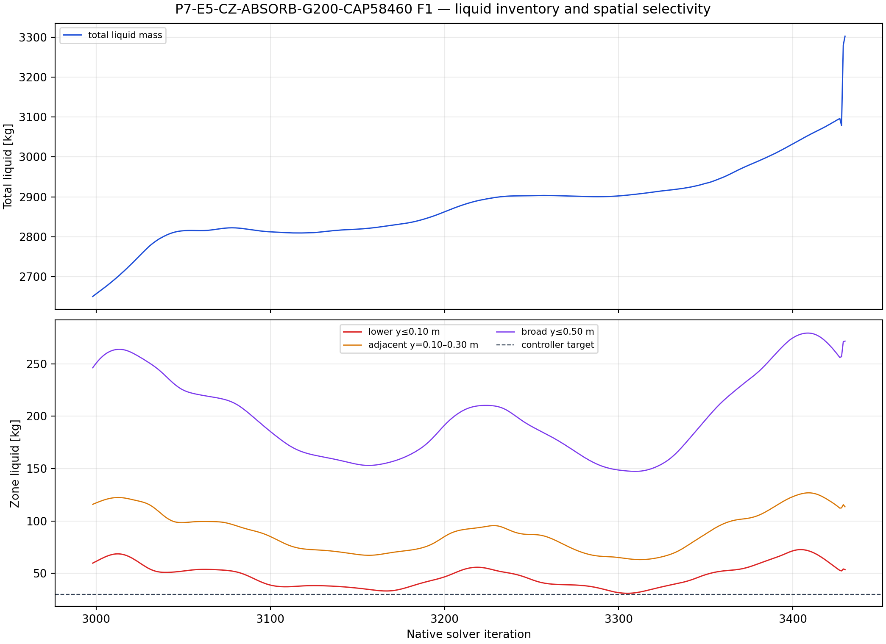
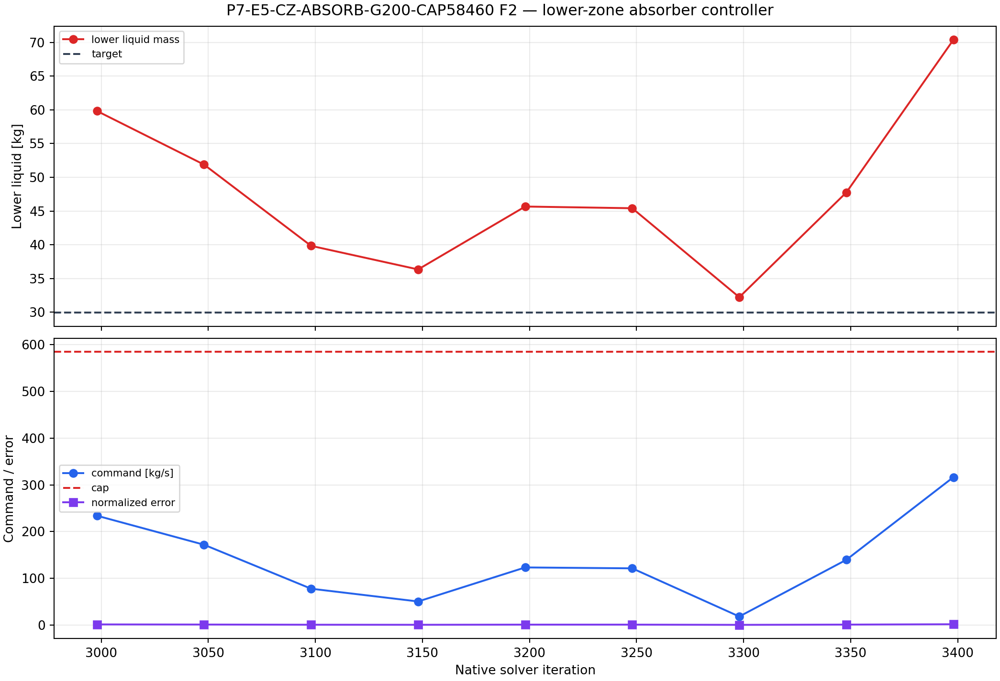
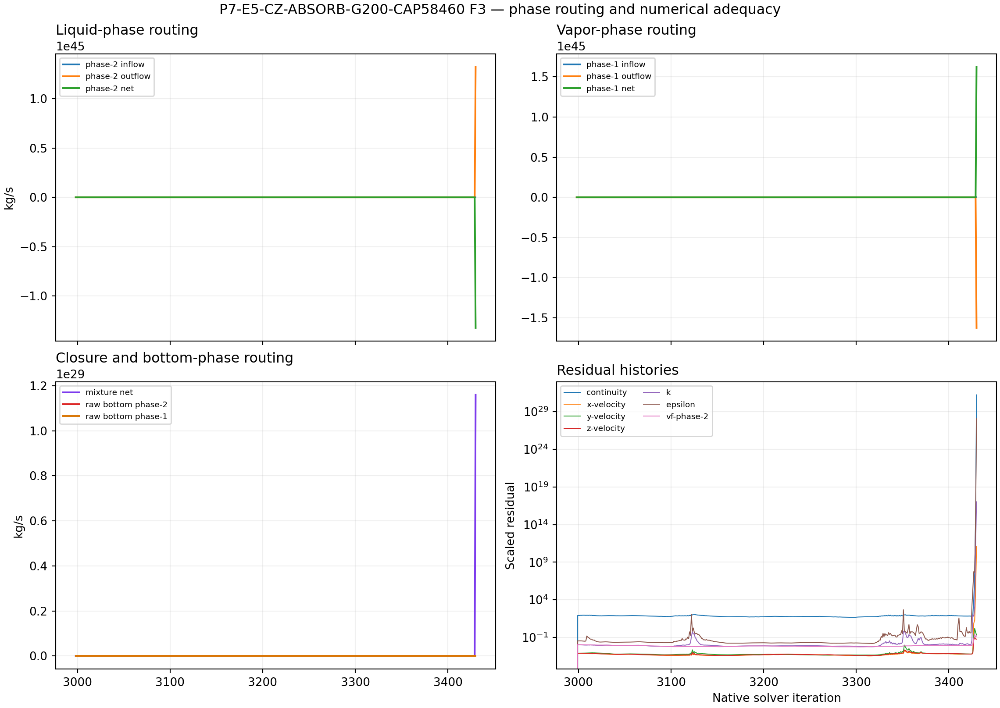

# P7-E5-CZ-ABSORB-G200-CAP58460 results

## Answer at a glance

**Status: BLOCKED_VERIFIED — solver divergence/floating-point failure during
the block ending at active iteration 450.**

The first high-cap launch was blocked before solving because a historical parent
report file was unavailable. That preflight artifact is retained for execution
provenance but is not a scientific child result. The corrected rerun then
recovered the live parent inventory directly and executed the actual high-cap
screen.

The corrected rerun used the same parent, topology, gain, feedback law, source
formulation, and 50-iteration cadence as the two matched children. It produced
valid setup, source, and controller evidence through the active-400 readback,
but the Fluent solver reported AMG divergence and a floating-point exception
while solving the block ending at active 450. It therefore did not reach the
declared 500-iteration horizon. Report samples after the loss of numerical
validity are retained as failure evidence only and are excluded from physical
interpretation.

At active 400 the controller command was `316.37 kg/s`, below the very large
`584.60 kg/s` cap. Thus, increasing the cap beyond `292.30 kg/s` did not even
reach the cap before the same late solver failure; it did not improve the early
lower-inventory response.

## Evidence package

| Item | Observed evidence | Assessment |
| --- | --- | --- |
| Parent and topology | Exact active-2,500 G100 case/data pair; lower zone `p7-e5-lower-y010` read back | PASS |
| First attempt | `20260910T112941Z` blocked before solving because the parent total-liquid history file was missing | Execution artifact only; excluded from comparison |
| Corrected rerun | `20260910T113103Z` recovered parent inventory and ran through valid active-400 controller evidence | PASS through valid interval |
| Valid controller horizon | Fatal diagnostic during block ending at active `450`; requested `500` not reached | BLOCKED |
| History package | 18 report histories, 433 points each, native extent `2998–3430`; residual transcript available | Partial; late samples are post-divergence |
| Controller | 9 valid updates through active `400`; active-400 command `316.37 kg/s`, below the `584.60 kg/s` cap | PASS through active 400 |
| Source accounting | Maximum source-audit error before failure `3.98×10⁻¹³ kg/s`; direct phase-1 source off | PASS through valid interval |
| Lower-zone response | Lower mass reached a transient minimum near `31.05 kg` but rebounded; no valid evidence of target holding | Not a valid stable-control result |
| Total liquid | The recorded late tail rises, but overlaps the solver failure and cannot be interpreted physically | Inconclusive; do not use post-failure slope |
| Numerical state | AMG divergence and floating-point exception; residuals/fluxes subsequently become nonphysical | FAILS terminal execution gate |

## Required figures

The figures show that the higher cap changes the command ceiling but does not
create a stable late-time trajectory. Their post-divergence tails are failure
diagnostics, not flow results.

## Interpretation and claim limits

### Observed before divergence

- The lower-zone phase-2 volumetric absorber and matched mixture-momentum
  source were configured as declared.
- The direct phase-1 mass source remained disabled at every recorded update.
- The command stayed below the high cap, reaching `316.37 kg/s` at active 400;
  therefore the `584.60 kg/s` limit was not the active restriction at the last
  valid controller readback.
- The lower inventory was not driven to the numerical target of `29.9167 kg`
  in the valid interval.

### Failure interpretation

This child does not support the idea that simply raising the absorber cap will
solve the liquid-removal problem. The high cap did not prevent the same late
solver failure seen for the medium cap, and its early controller trajectory was
effectively the same until the commands became larger. The evidence points to
the coupled controller/source/momentum response and carrier-flow stability as
the next issue to investigate, rather than to insufficient cap magnitude alone.

The intended no-outlet abstraction remains intact. The bottom boundary was not
changed into an outlet, and the zero bottom phase flux is not the blocker. The
blocker is numerical loss of validity under the evolving volumetric sink and
matched momentum source.

## Run and analysis records

- Setup contract: [setup.md](setup.md)
- Run paths and recovery state: [run-paths.yaml](run-paths.yaml)
- Excluded preflight manifest: `PyAnsys/output/phase07_cz_absorb/P7-E5-CZ-ABSORB-G200-CAP58460-student-20260910T112941Z-manifest.json`
- Scientific rerun manifest: `PyAnsys/output/phase07_cz_absorb/P7-E5-CZ-ABSORB-G200-CAP58460-student-20260910T113103Z-manifest.json`
- Report histories: `PyAnsys/output/phase07_cz_absorb/P7-E5-CZ-ABSORB-G200-CAP58460-student-20260910T113103Z-reports.json`
- Residual transcript: `PyAnsys/output/phase07_cz_absorb/P7-E5-CZ-ABSORB-G200-CAP58460-student-20260910T113103Z-residuals-transcript.txt`
- Analysis summary: [analysis/20260910T113103Z.json](analysis/20260910T113103Z.json)
- Remote output root: `C:\Users\Shuhei Yokkaichi\Documents\FluentRuns\Phase07\CellZoneAbsorber\20260910T113103Z\P7-E5-CZ-ABSORB-G200-CAP58460`

## Decision

Classify the corrected rerun as a **verified numerical blocker**. Do not resume
it from the divergent endpoint and do not interpret the post-failure report
tail as a liquid-removal result. Any future attempt would require a separately
approved stabilization change; a still larger cap is not justified by this
evidence alone.
