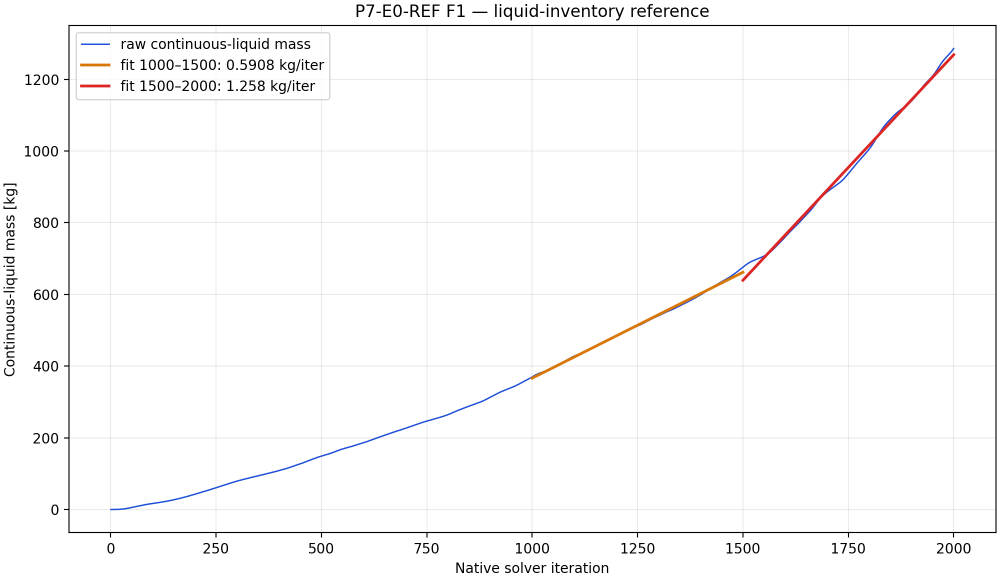
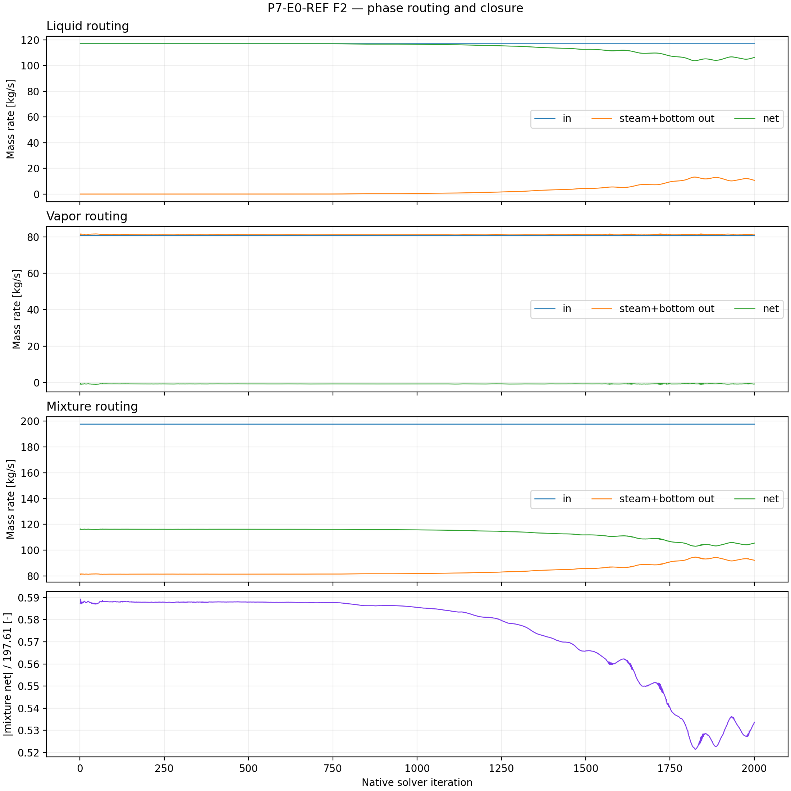
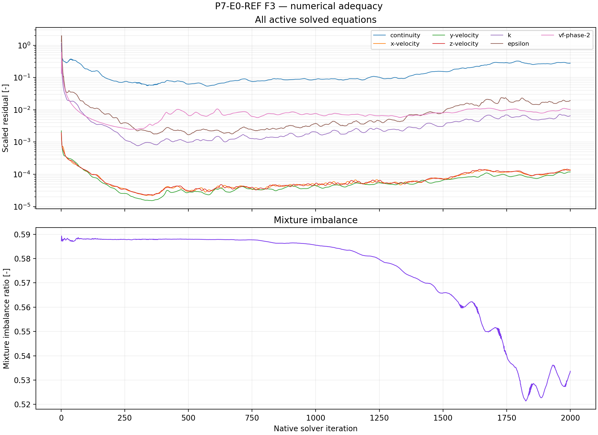

# E0 results — corrected 08b-derived wall-bottom reference

## Status

**E0 execution complete; phase-level discovery remains blocked pending the
remaining child capability gap and cross-case analysis.**

Three earlier E0 attempts were completed or terminated under the approved
contract. The latest attached rerun now satisfies the E0 execution contract:

1. `P7-E0-REF-server3-20260908T041031Z` reached 2,000 iterations with complete
   histories, but independent review found unauthorized setup drift: the exact
   parent had RNG differential-viscosity and swirl-dominated-flow options on,
   while this rebuilt case had both off.
2. `P7-E0-REF-server3-20260908T083413Z` repaired and save/reopen-proved both
   RNG options as on, but the solver diverged and stopped at native iteration
   1,724 with an epsilon AMG divergence and floating-point exception. It did
   not reach the required 2,000-iteration horizon.
3. `P7-E0-REF-server1-20260908T170000Z` used the shared exact-parent-derived
   initialized pair, preserved the parent settings, reached all 2,000 native
   iterations, emitted the required 14 report histories and seven residual
   histories, wrote checkpoints at 50/500/1,000/1,500/2,000, and passed final
   save/reopen readback. This is the current valid E0 execution reference for
   the fixed-mesh screen. It is not yet a physical or qualification result.

The first run is retained only as diagnostic evidence of the misconfigured
case, and the second remains a genuine numerical execution failure. The latest
run is valid for execution evidence, but G1 discovery evidence still requires
analysis of the completed child histories and resolution of the E5
region-specific source-binding capability lock. No numerical tuning, shortened
horizon, or unapproved bottom treatment was introduced.

## Attempt 1 — complete horizon, invalid setup

| Item | Result |
| --- | --- |
| Run ID | `P7-E0-REF-server3-20260908T041031Z` |
| Horizon | 2,000 native iterations |
| Histories | 14 reports × 2,000 points; 7 residuals × 2,000 points |
| Final pair | Reopened successfully |
| Blocking mismatch | Parent RNG `differential_viscosity_model=true`, `swirl_dominated_flow=true`; run readback had both `false` |
| Scientific use | Invalid for comparison; diagnostic only |

The diagnostic run showed accelerating liquid inventory (`0.6463` then
`1.1881 kg/iteration` over the two declared late windows) and worsening
residuals. Those values describe only the misconfigured case and are not the
Phase-07 reference.

Diagnostic figures are retained for auditability:

- [`F1 — invalid-run liquid inventory`](figures/P7-E0-REF-server3-20260908T041031Z/F1-liquid-inventory-reference.png)
- [`F2 — invalid-run phase routing`](figures/P7-E0-REF-server3-20260908T041031Z/F2-phase-routing-and-closure.png)
- [`F3 — invalid-run numerical adequacy`](figures/P7-E0-REF-server3-20260908T041031Z/F3-numerical-adequacy.png)

## Attempt 2 — corrected setup, terminal solver failure

| Item | Result |
| --- | --- |
| Run ID | `P7-E0-REF-server3-20260908T083413Z` |
| Server / Fluent | `server-3@10.104.145.176` / 2025 R2 |
| Parent / mesh identity | Exact SHA-256 identities from `setup.md`, verified |
| Prepared save/reopen | Passed |
| Parent RNG options | Differential viscosity `true`; swirl dominated flow `true`, passed immediate and post-reopen readback |
| Corrected outlet diameter | `0.875936 m`, passed readback |
| DPM isolation | Continuous-phase interaction off |
| Initialization | One parent-derived hybrid initialization |
| Smoke and checkpoints | Passed at 50; paired checkpoints saved at 500, 1,000, and 1,500 |
| Requested / actual horizon | 2,000 / 1,724 native iterations |
| Terminal failure | Epsilon AMG divergence followed by host/node floating-point exceptions |
| Partial histories | 14 reports × 1,724 points; 7 residuals × 1,724 points |
| Terminal status | `BLOCKED` |

The failure tail is unambiguous. At iteration 1,721 continuity was `3.3939e+01`
and epsilon `8.2063e+04`; by iteration 1,724 continuity was `5.0029e+31`, `k`
was `4.4660e+19`, and epsilon was `7.0963e+32`. Fluent then reported repeated
`Divergence detected in AMG solver: epsilon` messages and a floating-point
exception. The runner remained attached, saved the failed state for diagnosis,
detected only 1,724 native residual rows, and refused to report completion.

## Attempt 3 — current valid E0 execution reference

| Item | Result |
| --- | --- |
| Run ID | `P7-E0-REF-server1-20260908T170000Z` |
| Server / Fluent | `server-1@10.104.145.170` / 2025 R2 |
| Execution source | Shared exact-parent-derived initialized pair; dependency-only source recorded in `run-paths.yaml` |
| Parent RNG options | Differential viscosity `true`; swirl dominated flow `true`, passed final reopen readback |
| Initialization / smoke | Hybrid initialization and 50-iteration smoke passed |
| Checkpoints | Paired case/data at 500, 1,000, 1,500, and 2,000; smoke pair at 50 |
| Requested / actual horizon | 2,000 / 2,000 native iterations |
| Histories | 14 report histories × 2,000 points; 7 residual histories × 2,000 points |
| Final pair | Saved and reopened successfully with parent model, boundary, DPM, and mesh readback |
| Terminal status | `COMPLETE` for E0 execution |

The run shows substantial outlet reverse flow and turbulent-viscosity-limit
messages in the solver transcript. Those are recorded observations, not a
convergence or physical-validity claim; the numerical and physical evidence
must be assessed during the planned analysis step.

## Evidence locations

### Current valid E0 execution reference

- manifest: `PyAnsys/output/phase07_e0_ref/P7-E0-REF-server1-20260908T170000Z-manifest.json`
- transcript: `PyAnsys/output/phase07_e0_ref/P7-E0-REF-server1-20260908T170000Z-residuals-transcript.txt`
- residuals: `PyAnsys/output/phase07_e0_ref/P7-E0-REF-server1-20260908T170000Z-residuals.json`
- report histories: `PyAnsys/output/phase07_e0_ref/P7-E0-REF-server1-20260908T170000Z-report-histories.json`

### Prior authoritative corrected attempt

- manifest: `PyAnsys/output/phase07_e0_ref/P7-E0-REF-server3-20260908T083413Z-manifest.json`
- transcript: `PyAnsys/output/phase07_e0_ref/P7-E0-REF-server3-20260908T083413Z-residuals-transcript.txt`
- residuals: `PyAnsys/output/phase07_e0_ref/P7-E0-REF-server3-20260908T083413Z-residuals.json`
- partial report histories: `PyAnsys/output/phase07_e0_ref/P7-E0-REF-server3-20260908T083413Z-report-histories_20260908_205914.json`
- repaired parent snapshot: `PyAnsys/output/phase07_e0_ref/P7-E0-REF-repair-source-snapshot.json`

### Invalid diagnostic attempt

- manifest: `PyAnsys/output/phase07_e0_ref/P7-E0-REF-server3-20260908T041031Z-manifest.json`
- final reopen: `PyAnsys/output/phase07_e0_ref/P7-E0-REF-server3-20260908T041031Z-final-reopen.json`
- numerical summary: `PyAnsys/output/phase07_e0_ref/P7-E0-REF-server3-20260908T041031Z-analysis.json`

## Bounded conclusion and G1 action

E0 now has a valid 2,000-iteration execution reference. The first attempt
cannot be compared because it did not preserve the parent turbulence options;
the second corrected attempt is retained as a genuine numerical failure; and
the latest corrected attempt supplies the required complete execution
histories. This remains execution evidence, not evidence that a physical
separator would behave similarly.

The explicit human instruction authorized dependency-gated attempts of all 15
compiled E1--E5 child packets using exact E0-derived initialized/checkpoint
pairs, while preserving the no-tuning and evidence contracts. Those child
outcomes are recorded in the fixed-mesh treatment-screen result files. E1
P1120, all E2/E3/E4 packets, and their plot-led analyses are complete;
corrected E1 P1160/P1200 attempts block during smoke after proving their
requested pressure readbacks; all three E5 packets were blocked before solve
because Fluent 2025 R2 exposed no region-specific liquid-only source binding
for the frozen cell register. This authorization does not waive G1, authorize
qualification, or turn execution histories into physical conclusions. The
phase-level evidence remains blocked and no fourth point or continuation is
selected by this record.

## Plot-led analysis of the valid execution reference

### Answer at a glance

**Observed:** the exact-parent E0 execution packet is complete at 2,000 native
iterations, but the liquid inventory is still accelerating rather than
approaching a bounded reference. The liquid-mass slope increases from
`+0.590794 kg/iteration` over iterations 1,000--1,500 to
`+1.258487 kg/iteration` over iterations 1,500--2,000; the final reported
liquid mass is `1,285.972 kg`. **Inferred:** this is an inconclusive and
numerically worsening reference for treatment comparison, not a converged
baseline. **Evidence status:** execution complete; G1 discovery evidence
incomplete.

### Core visual evidence

*F1 message:* the inventory rises throughout the declared late windows and
the late slope is larger in the second window. *Limitation:* this plot is a
finite-horizon diagnostic and cannot establish long-term boundedness.

*F2 message:* phase-resolved inlet/outlet routing and the mixture closure are
reported for the required surfaces. *Limitation:* persistent routing imbalance
or reverse flow is evidence of an unresolved field, not a physical drainage
claim.

*F3 message:* residual histories and closure diagnostics remain part of the
valid execution evidence. *Limitation:* reaching 2,000 iterations is not the
same as residual convergence; the late residual behaviour and inventory drift
prevent a qualification interpretation.

### Numerical adequacy and interpretation

- `Observed`: 14 report histories and seven residual histories each contain
  2,000 native points; smoke, four checkpoints, final save, and reopen
  readback are complete.
- `Observed`: the final 500-iteration window has a liquid-volume slope of
  `+0.00142813 m^3/iteration`, consistent with the increasing liquid-mass
  trend.
- `Observed`: the transcript contains substantial outlet reverse-flow and
  turbulent-viscosity-limit messages; the completed solver horizon therefore
  does not certify a numerically settled field.
- `Inferred`: the no-treatment bottom-wall case is a useful contrastive
  drift reference, but it does not define a stationary baseline for a
  quantitative treatment ranking.
- `Competing explanation`: the drift may reflect the simplified closed-bottom
  inventory accumulation, unresolved multiphase outlet routing, or numerical
  instability; the present evidence does not identify one mechanism uniquely.
- `Claim boundary`: no steady-state, plant drainage, mesh-independence, or
  physical separator claim is supported by this run.

## Decision and checklist

The E0 execution checkbox is **PASS**; the planned analysis/core-figure
checkbox is **PASS**; the phase-level discovery-evidence gate remains
**BLOCKED** because the reference is not numerically adequate for a bounded
qualification claim and the E5 capability lock remains unresolved. Use this
reference only for the declared contrastive screen and retain all treatment
claims as finite-horizon observations.
