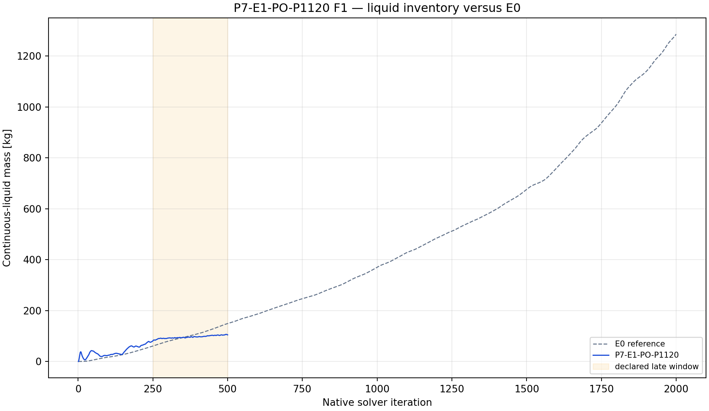
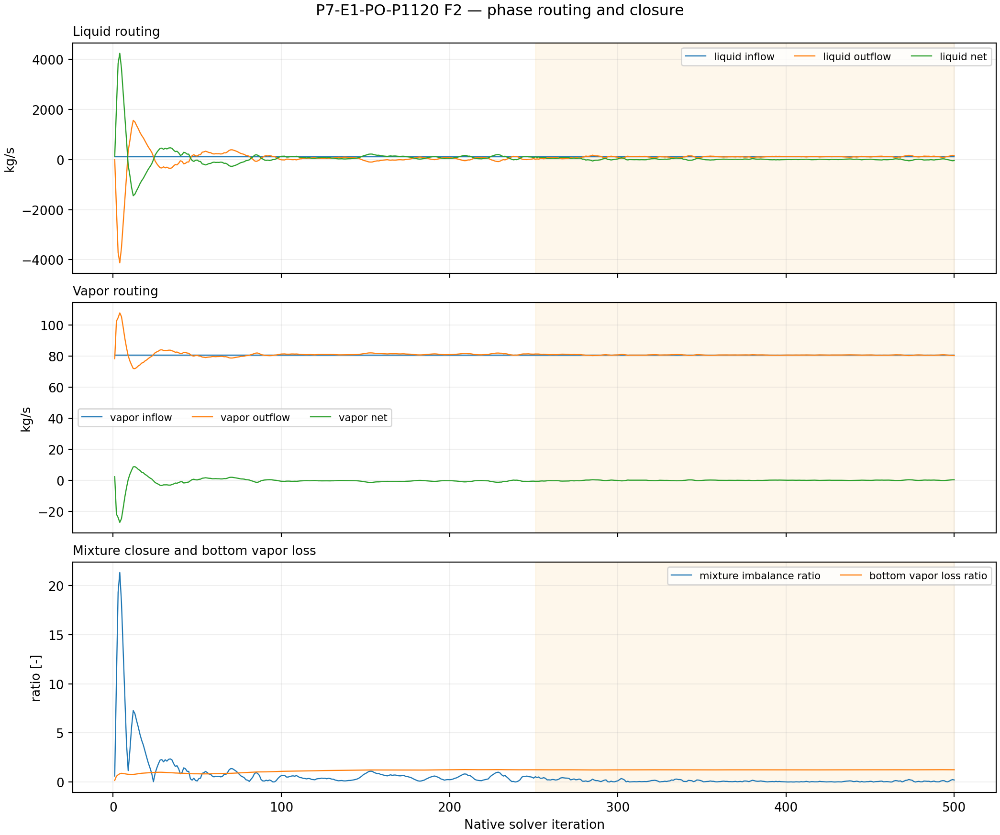
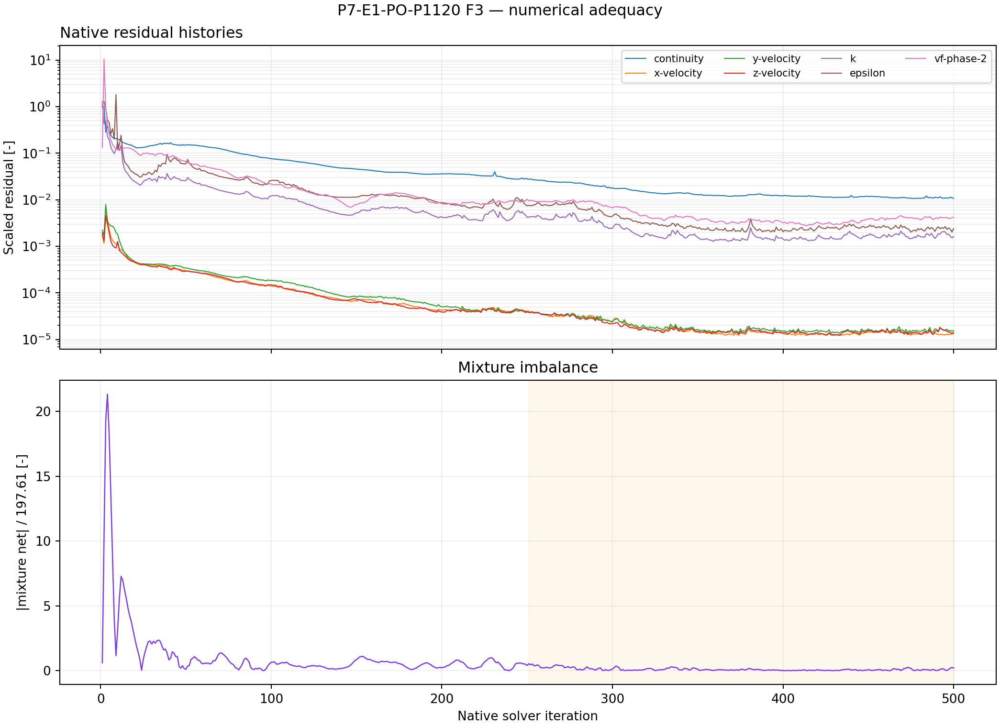

# P7-E1-PO-P1120 results

## Answer at a glance

**Observed:** the exact initialized E0 pair was changed only at `bottom`,
read back as a pressure outlet at `1,120,000 Pa`, save/reopen was successful,
and the 500-iteration screen contains 14 report histories and seven residual
histories with 500 native points each. The liquid mass reaches `104.489 kg`
and has a late-window slope of `+0.073679 kg/iteration` over iterations
251--500. The late mean mixture imbalance ratio is `0.104937`; the mean bottom
vapor-loss ratio is `1.23894` relative to the `80.69 kg/s` vapor inlet.

**Inferred:** the pressure-outlet screen reduces the finite-horizon inventory
relative to the E0 first-500-iteration reference, but it does so with large
vapor discharge and a still-positive inventory trend. This is a finite-horizon
diagnostic result, not a bounded or physically acceptable drainage result.

**Evidence status:** execution and planned plot-led analysis complete;
scientific promotion blocked by numerical/physical adequacy.

## Core visual evidence

*F1 message:* the treated inventory is below the matched E0 curve by the end
of the 500-iteration screen, but remains increasing. *Limitation:* endpoint
separation is not evidence of a persistent bounded state.

*F2 message:* the phase routing exposes substantial bottom vapor discharge and
non-negligible mixture imbalance. *Limitation:* the pressure outlet is not a
liquid-only treatment, so reduced inventory cannot be interpreted as resolved
liquid drainage.

*F3 message:* the native residual and imbalance histories are available for
the full screen. *Limitation:* 500 iterations establish survivability and
response direction only; they do not establish convergence.

## Numerical adequacy

- `Observed`: smoke at 50, checkpoint at 250, final at 500, paired case/data
  saves, and final save/reopen readback passed.
- `Observed`: all required reports and residual histories have 500 native
  samples; no history truncation was found.
- `Observed`: the late inventory slope is positive and the mean normalized
  bottom vapor loss is greater than one, indicating that the pressure-outlet
  treatment is vapor-dominated in this diagnostic.
- `Not established`: residual convergence, bounded inventory, phase-balanced
  drainage, or persistence beyond the 500-iteration screen.

## Interpretation

- `Observed`: P1120 lowers the final liquid inventory relative to matched E0
  over this short window.
- `Observed`: it also produces a large vapor-routing signal and a mixture
  imbalance that is not small.
- `Inferred`: the apparent inventory improvement is most plausibly coupled to
  passive pressure-outlet discharge, including vapor, rather than proof of a
  useful liquid-removal mechanism.
- `Competing explanation`: the high vapor loss may be a transient pressure
  adjustment or an unstable reverse-flow response; the screen is too short to
  distinguish these from a sustained boundary effect.
- `Claim boundary`: no plant drainage, steady separator, or G1 qualification
  claim is supported.

## Decision and checklist

| Phase Loop item | Status | Evidence |
| --- | --- | --- |
| Exact parent/mesh and boundary readback | PASS | manifest and final reopen |
| Save/reopen, smoke, checkpoint, final pair | PASS | manifest |
| Reports and residual histories | PASS | 14 reports + 7 residuals × 500 |
| Planned analysis and core figures | PASS | F1–F3 above; analysis JSON |
| Scientific acceptance/promotion | BLOCKED | positive drift and vapor-dominated routing |

**Queue state:** `COMPLETE_VERIFIED` as a completed, analyzed discovery
packet; **decision:** reject as a qualification candidate and do not promote
this boundary as a physical liquid-removal solution.

## Run and artifact details

- Manifest: `PyAnsys/output/phase07_treatment_screen/P7-E1-PO-P1120-server1-20260908T092500Z-manifest.json`
- Report recovery: `PyAnsys/output/phase07_treatment_screen/P7-E1-PO-P1120-server1-20260908T092500Z-report-histories.json`
- Analysis: `PyAnsys/output/phase07_treatment_screen/P7-E1-PO-P1120-server1-20260908T092500Z-analysis.json`
