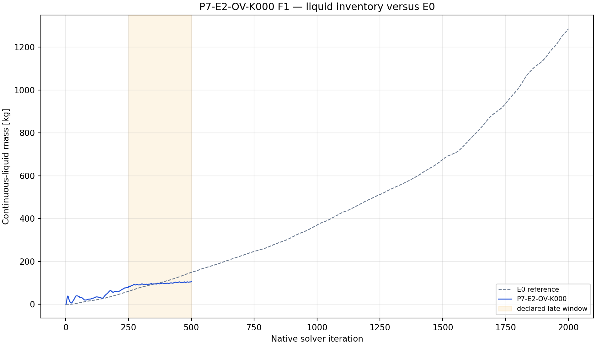
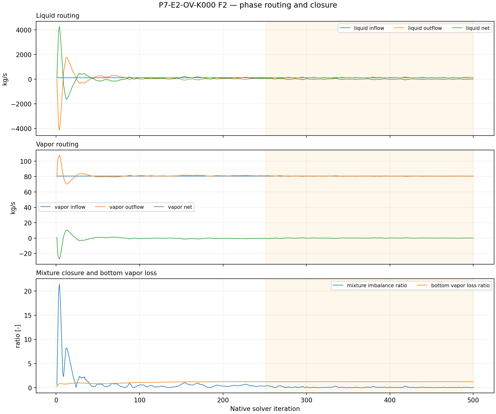
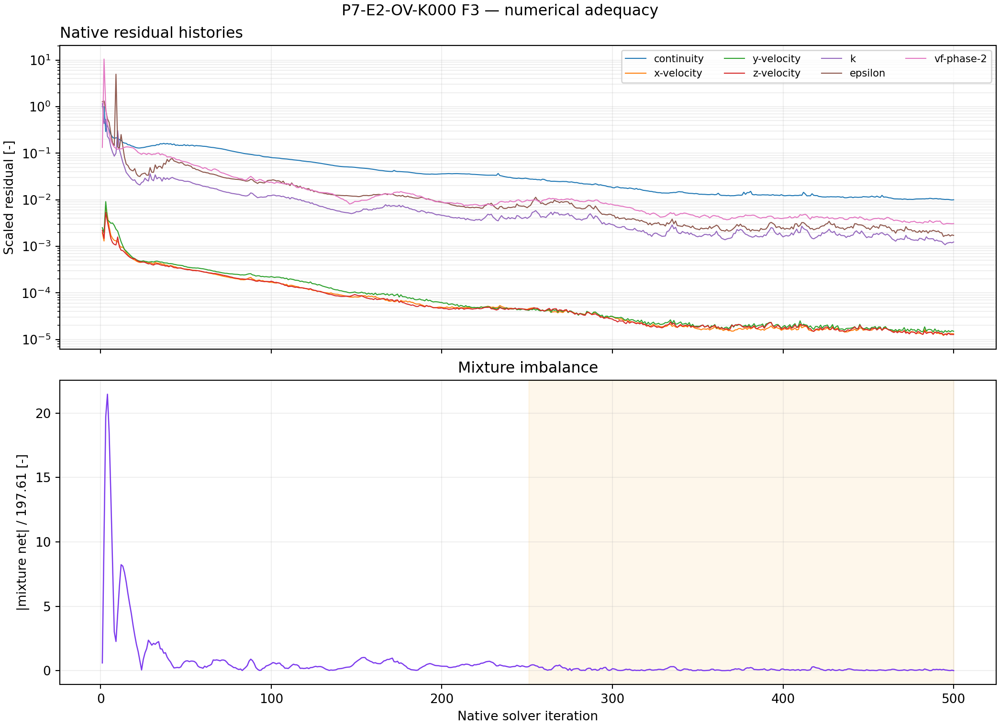

# P7-E2-OV-K000 results

## Answer at a glance

**Observed:** the exact initialized E0 pair was read back with bottom as an
outlet vent at normal-velocity loss coefficient K=0. Save/reopen, smoke,
checkpoint, and final artifacts passed; 14 report histories and seven
residual histories contain 500 native points each. The final liquid mass is
105.158 kg and the late-window slope is +0.067790 kg/iteration over iterations
251--500. The late mean mixture imbalance ratio is 0.092776; mean bottom
vapor-loss ratio is 1.24014.

**Inferred:** K=0 lowers the short-screen inventory relative to E0 but remains
drifting and is vapor-dominated at the treated outlet. It is not a bounded
liquid-removal result.

**Evidence status:** execution and planned plot-led analysis complete; no G1
promotion.

## Core visual evidence

*F1 message:* the treated inventory remains below the matched E0 reference at
the screen endpoint but rises throughout the window. *Limitation:* endpoint
comparison cannot establish persistence.

*F2 message:* routing and closure show a large bottom vapor signal. *Limitation:*
the result is not a liquid-only outlet test.

*F3 message:* the full 500-point native residual and imbalance histories are
available. *Limitation:* they demonstrate execution, not convergence.

## Numerical adequacy and interpretation

- Observed: 50-iteration smoke, 250-iteration checkpoint, 500-iteration
  final pair, and save/reopen readback passed.
- Observed: all required histories have 500 native samples.
- Observed: positive inventory slope, non-small imbalance, and vapor loss
  above the vapor-inlet normalization prevent a qualification claim.
- Inferred: K=0 behaves as an unrestricted outlet-vent diagnostic rather
  than a selective liquid-removal mechanism.
- Competing explanation: the outlet response may still be transient or
  affected by reverse flow; a longer run would be needed to separate these
  effects, but no continuation is authorized by this screen alone.
- Claim boundary: no physical drainage or plant-control conclusion.

## Decision and checklist

| Phase Loop item | Status | Evidence |
| --- | --- | --- |
| Setup/readback and paired artifacts | PASS | manifest |
| Reports and residual histories | PASS | 14 reports + 7 residuals x 500 |
| Planned analysis and core figures | PASS | F1–F3 above; analysis JSON |
| Scientific acceptance/promotion | BLOCKED | positive drift and vapor-dominated routing |

Queue state: COMPLETE_VERIFIED as an analyzed discovery packet; retain as a
contrastive diagnostic only.

## Run and artifact details

- Manifest: PyAnsys/output/phase07_treatment_screen/P7-E2-OV-K000-server3-20260908T092500Z-manifest.json
- Report recovery: PyAnsys/output/phase07_treatment_screen/P7-E2-OV-K000-server3-20260908T092500Z-report-histories.json
- Analysis: PyAnsys/output/phase07_treatment_screen/P7-E2-OV-K000-server3-20260908T092500Z-analysis.json

