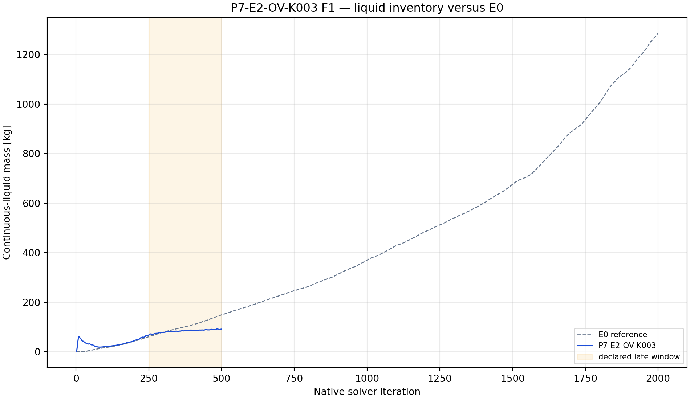
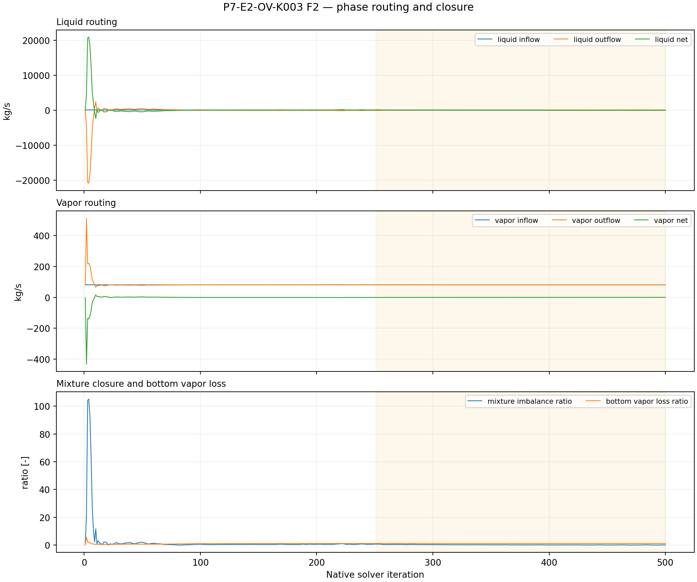
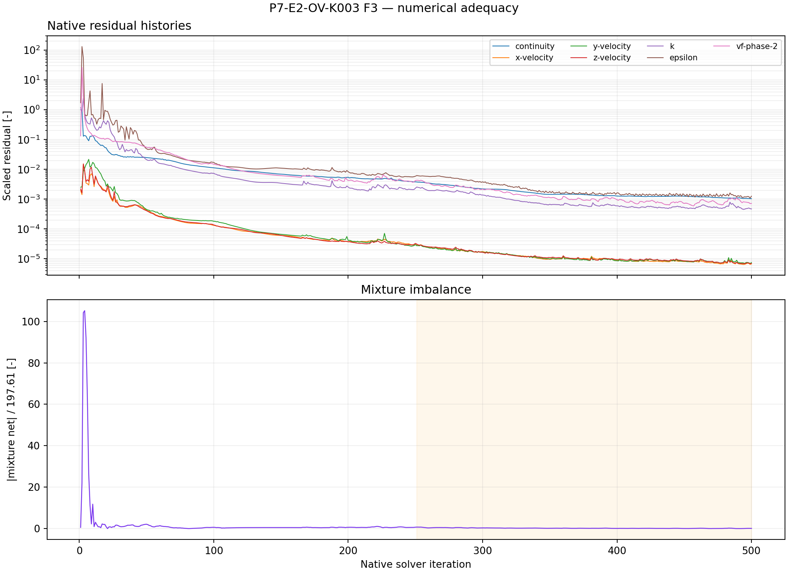

# P7-E2-OV-K003 results

## Answer at a glance

Observed: the exact initialized E0 pair was read back with bottom as an outlet
vent at normal-velocity loss coefficient K=3. Save/reopen, smoke, checkpoint,
and final artifacts passed; 14 report histories and seven residual histories
contain 500 native points each. The final liquid mass is 91.474 kg and the
late-window slope is +0.077331 kg/iteration. The late mean mixture imbalance
ratio is 0.209090; mean bottom vapor-loss ratio is 1.13810.

Inferred: increasing K to 3 lowers the endpoint inventory relative to K=0, but
the inventory still rises and the phase routing becomes less closed. The screen
is not a bounded liquid-removal result.

Evidence status: execution and planned plot-led analysis complete; no G1
promotion.

## Core visual evidence

*F1 message:* K003 ends below K000 and the matched E0 curve, but has a positive
late slope. *Limitation:* endpoint ordering is not a persistence test.

*F2 message:* outlet-vent phase routing exposes a large vapor discharge and
larger mixture imbalance than K000. *Limitation:* reduced inventory is not
selective liquid drainage.

*F3 message:* full screen histories are available for independent audit.
*Limitation:* 500 iterations do not establish convergence.

## Numerical adequacy and interpretation

- Observed: the declared 50/250/500 event sequence, paired artifacts, and
  final readback passed.
- Observed: all 14 reports and seven residuals have 500 native points.
- Observed: final inventory is lower than K000, but late slope is positive;
  imbalance and vapor-loss signals are not small.
- Inferred: resistance changes the finite-horizon response but does not yet
  reveal a stable useful transition.
- Competing explanation: the lower inventory could be a short-window
  pressure/transient effect rather than a sustained benefit.
- Claim boundary: no physical outlet-selection or qualification claim.

## Decision and checklist

| Phase Loop item | Status | Evidence |
| --- | --- | --- |
| Setup/readback and paired artifacts | PASS | manifest |
| Reports and residual histories | PASS | 14 reports + 7 residuals x 500 |
| Planned analysis and core figures | PASS | F1–F3 above; analysis JSON |
| Scientific acceptance/promotion | BLOCKED | positive drift, imbalance, vapor loss |

Queue state: COMPLETE_VERIFIED as an analyzed discovery packet. The conditional
E2 fourth-point logic remains eligible for review because K=7 is the upper
tested boundary and the response is unresolved, but it is not activated by
this record alone.

## Run and artifact details

- Manifest: PyAnsys/output/phase07_treatment_screen/P7-E2-OV-K003-server3-20260908T094500Z-manifest.json
- Report recovery: PyAnsys/output/phase07_treatment_screen/P7-E2-OV-K003-server3-20260908T094500Z-report-histories.json
- Analysis: PyAnsys/output/phase07_treatment_screen/P7-E2-OV-K003-server3-20260908T094500Z-analysis.json

