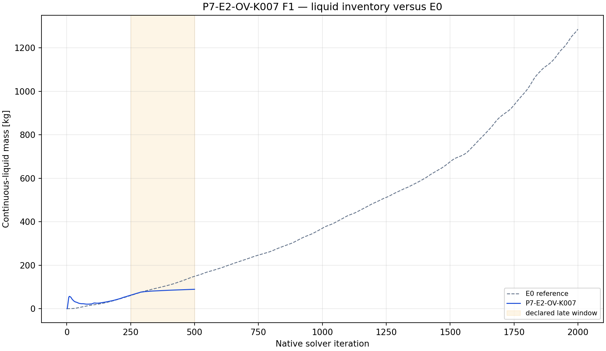
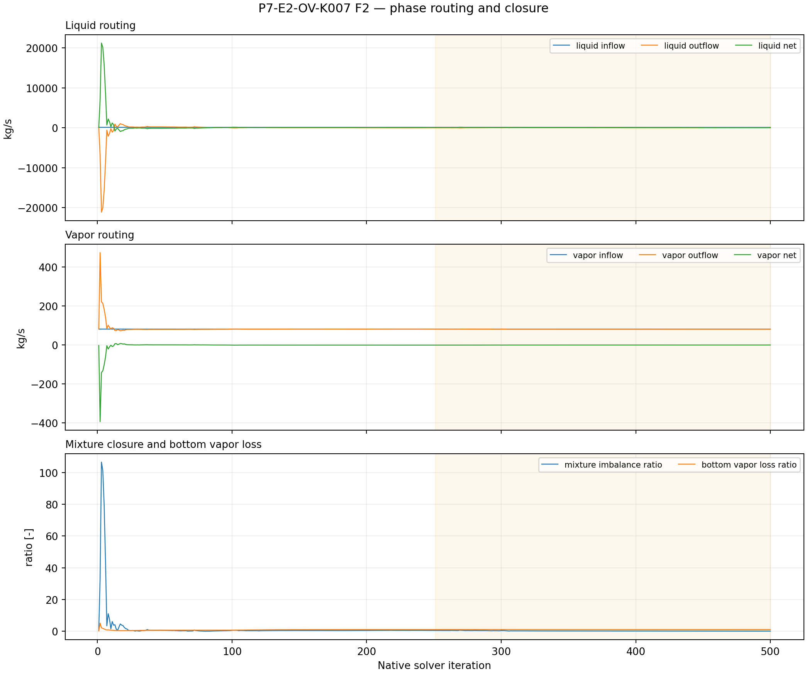
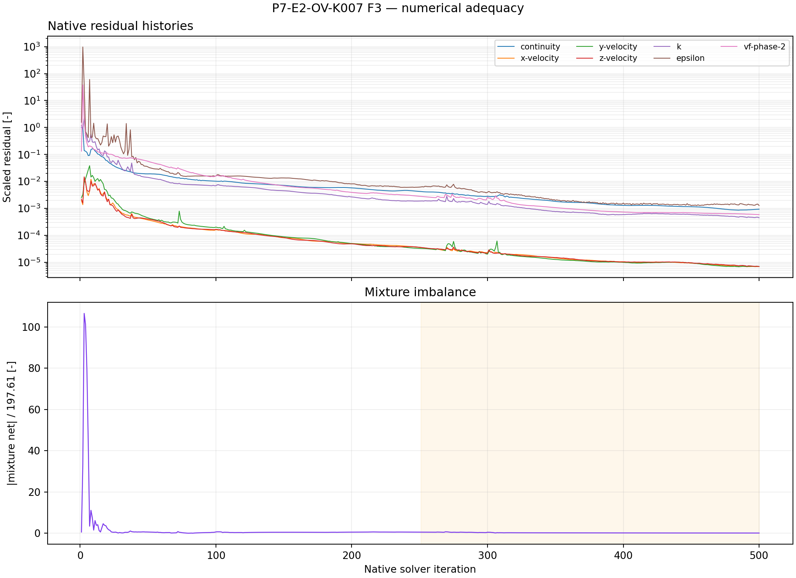

# P7-E2-OV-K007 results

## Answer at a glance

Observed: the exact initialized E0 pair was read back with bottom as an outlet
vent at normal-velocity loss coefficient K=7. Save/reopen, smoke, checkpoint,
and final artifacts passed; 14 report histories and seven residual histories
contain 500 native points each. The final liquid mass is 89.252 kg and the
late-window slope is +0.081729 kg/iteration. The late mean mixture imbalance
ratio is 0.216467; mean bottom vapor-loss ratio is 1.06809.

Inferred: K=7 gives the lowest E2 endpoint inventory, but it also has the
largest positive late slope and a non-small imbalance. It does not establish
a stable or physically selective treatment.

Evidence status: execution and planned plot-led analysis complete; no G1
promotion.

## Core visual evidence

*F1 message:* K007 has the lowest finite-horizon endpoint inventory of the E2
screen, while still increasing. *Limitation:* a lower endpoint is not a
bounded-state result.

*F2 message:* vapor loss remains substantial and mixture imbalance is larger
than the K000 result. *Limitation:* outlet-vent treatment has not isolated
liquid removal.

*F3 message:* full residual and routing evidence exists for the screen.
*Limitation:* no convergence claim follows from the 500-point histories.

## Numerical adequacy and interpretation

- Observed: setup/readback, save/reopen, smoke, checkpoint, final pair,
  reports, and residuals all passed.
- Observed: 500 native points are present for every required history.
- Observed: K007 gives the lowest endpoint inventory but the largest late
  slope within E2 and retains high vapor loss.
- Inferred: increasing resistance does not produce a clearly improving stable
  response over the tested range.
- Competing explanation: endpoint ordering may be dominated by transient
  initial-condition response and reverse-flow behavior.
- Claim boundary: no physical drainage or qualification claim.

## Decision and checklist

| Phase Loop item | Status | Evidence |
| --- | --- | --- |
| Setup/readback and paired artifacts | PASS | manifest |
| Reports and residual histories | PASS | 14 reports + 7 residuals x 500 |
| Planned analysis and core figures | PASS | F1–F3 above; analysis JSON |
| Scientific acceptance/promotion | BLOCKED | positive drift, imbalance, vapor loss |

Queue state: COMPLETE_VERIFIED as an analyzed discovery packet. The predeclared
E2 fourth-point branch should be considered only as a bounded follow-up to the
unresolved upper-edge response; no unbounded K tuning is authorized.

## Run and artifact details

- Manifest: PyAnsys/output/phase07_treatment_screen/P7-E2-OV-K007-server3-20260908T103000Z-manifest.json
- Report recovery: PyAnsys/output/phase07_treatment_screen/P7-E2-OV-K007-server3-20260908T103000Z-report-histories.json
- Analysis: PyAnsys/output/phase07_treatment_screen/P7-E2-OV-K007-server3-20260908T103000Z-analysis.json

